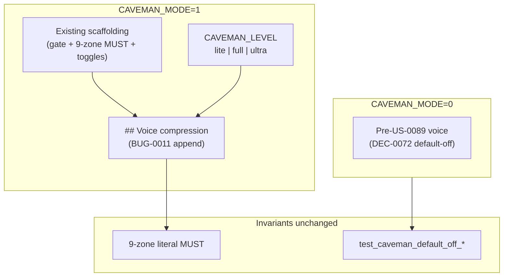

# Architecture archive pack (2026-09-17)

- Rollover trigger: `ARCH_HOT_MAX_LINES=3000, ARCH_HOT_MAX_STORY_SECTIONS=120`
- Source: `docs/engineering/architecture.md`
- Archived units (oldest first, contiguous prefix): 1
- Retained units in hot file: 21
- First archived heading: `# BUG-0011: Caveman voice-compression rules missing from caveman.mdc`
- Last archived heading: `# BUG-0011: Caveman voice-compression rules missing from caveman.mdc`
- Verification tuple (mandatory):
  - archived_body_lines=153
  - preamble_lines=1
  - retained_body_lines=2900

---

# BUG-0011: Caveman voice-compression rules missing from caveman.mdc

## Overview

**`BUG-0011`** completes **US-0089** response-side Caveman delivery by appending
actionable voice-compression directives to `.cursor/rules/caveman.mdc`. **US-0089** /
**DEC-0072** shipped scaffolding only (gates, 9-zone literal invariant, toggles) —
with **`CAVEMAN_MODE=1`** replies stayed verbose because no rule text instructed
drop-filler, fragment, or level semantics.

Binding decision: **`DEC-0077`** (composes on **`DEC-0072`** — forward-link, no rewrite).
Research anchor: **`R-0077`**. Open `decisions/DEC-0077.md` for normative voice-section
outline, SHA bump policy, contract markers, and runbook extension.

**`# US-0089`** §6 cross-link amended (voice rules delivered here; qualitative brevity
remains operator-verified).

## Voice delivery diagram



## Minimal architecture

### A. Voice section append (DEC-0077 §2)

Append to **`.cursor/rules/caveman.mdc`** + **`template/.cursor/rules/caveman.mdc`**
(byte-identical pair). **Preserve** all pre-voice scaffolding verbatim.

**Locked section heading**:

```text
## Voice compression (when CAVEMAN_MODE=1)
```

**Subsections** (order normative — see **`DEC-0077`** §2 table):

1. `### Precedence` — voice rules override conflicting user-rule prose style when
   `CAVEMAN_MODE=1` (reply voice only).
2. `### Intensity levels` — `lite` / `full` / `ultra` table; kit-native examples.
3. `### Drop rules` — filler/hedging/fragments.
4. `### Auto-Clarity` — security/destructive/ambiguous pause + resume.
5. `### Persistence` — active every response while mode on.
6. `### Ultra and literal regions` — **pointer stub** to existing 9-zone MUST (no duplicate list).

### B. Level semantics (DEC-0077 §3)

| Level | Semantics |
|-------|-----------|
| `lite` | Drop filler; grammatical sentences |
| `full` | Drop articles; fragments OK |
| `ultra` | Abbreviate prose words only; literals byte-exact |

### C. SHA dual-layer + contract markers (DEC-0077 §4–§5)

1. Bump `_CAVEMAN_RULE_BASELINE_SHA256` in `test_caveman_compress_input_rule_byte_identity`
   to post-voice digest (pre-voice: `E10EFC32C628E790E69E2393F381108FE0B1F16E0BCDCFFFC162EFF6F91E47DE`).
2. Add nine `test_caveman_voice_*` subtests (token-presence; see **`DEC-0077`** §5).
3. **Do not modify** `test_caveman_default_off_*` bodies or non-substitution pinned sentence.

### D. Runbook extension (DEC-0077 §7)

Under **`### Caveman mode (US-0089)`** (active + `template/`):

- **`#### Voice compression levels`** — compact 2-row before/after table + pointer to rule file.
- **`### Caveman input compression (US-0090)`** — **untouched**.

### E. Harness §30A (DEC-0077 §6)

| Surface | Requirement |
|---------|-------------|
| `tests/run-tests.ps1` + `.sh` | New **§30A** — `Voice compression rule markers (BUG-0011)` |
| Scope | `pytest -k caveman_voice` (or equivalent prefix filter) |

Existing caveman harness sections: **unchanged**.

### F. Template parity inventory (DEC-0077 §9)

**Positive (byte-identical after voice delivery)**:

1. `.cursor/rules/caveman.mdc` ↔ `template/.cursor/rules/caveman.mdc`
2. `docs/engineering/runbook.md` ↔ `template/docs/engineering/runbook.md` (Caveman subsection only)

**Active-only**: `# BUG-0011`, `test_caveman_voice_*`, §30A, `# US-0089` §6 cross-link.

**No new** `check_intake_template_parity.py` scope.

## Risks (architecture-resolved)

| ID | Mitigation |
|----|------------|
| R1 US-0090 SHA break | Intentional baseline bump (§C) |
| R2 Literal garbling | Unchanged 9-zone MUST + ultra stub (§A.6) |
| R3 User-rule conflict | `### Precedence` (§A.1) |
| R4 Ultra abbreviates reason codes | Forbidden; stub defers to 9-zone (§A.6) |
| R5 Runbook drift | Summary table only; rule normative (§D) |
| R6 Pinned test regression | `test_caveman_default_off_*` bodies frozen (§C.3) |

## AC traceability

| AC | Architecture anchor |
|----|---------------------|
| AC-1 Voice section in `caveman.mdc` | §A, §B + **DEC-0077** §2–§3 |
| AC-2 Template byte parity | §F |
| AC-3 User-rule precedence | §A.1 + **DEC-0077** §2 |
| AC-4 Ultra/literal deferral stub | §A.6 + **DEC-0077** §2 |
| AC-5 `test_caveman_voice_*` + SHA bump | §C + **DEC-0077** §4–§5 |
| AC-6 Runbook voice levels | §D + **DEC-0077** §7 |
| AC-7 Default-off invariants preserved | §C.3 + **DEC-0077** §4 |
| AC-8 Harness §30A + operator UAT | §E + **DEC-0077** §6 |

## Atomic task seeds (for `/sprint-plan`)

| # | Seed | AC | Surfaces |
|---|------|----|----------|
| 1 | Append voice section to `caveman.mdc` per **DEC-0077** §2 outline (active + template byte-identical) | AC-1, AC-2, AC-3, AC-4 | `.cursor/rules/` + `template/.cursor/rules/` |
| 2 | Extend runbook `#### Voice compression levels` (2-row table + rule pointer) | AC-6 | runbook active + `template/` |
| 3 | Add nine `test_caveman_voice_*` subtests in `auto_command_contract_test.py` | AC-5 | tests active-only |
| 4 | Bump `_CAVEMAN_RULE_BASELINE_SHA256` in `test_caveman_compress_input_rule_byte_identity` | AC-5 | tests active-only |
| 5 | Harness **§30A** in `run-tests.ps1` + `.sh` | AC-8 | tests active-only |
| 6 | Regression guard — `test_caveman_default_off_*` bodies unchanged | AC-7 | tests active-only |
| 7 | Sprint UAT operator voice spot-check (`CAVEMAN_MODE=1` visibly shorter prose; literals intact) | AC-8 | UAT docs |
| 8 | Architecture linkage assert (this section + **DEC-0077** + `# US-0089` §6 cross-link) | AC-1 | read-only check |

**Task count**: 8 seeds. `SPRINT_MAX_TASKS=12` — no auto-split expected.

## Related

- **`US-0089`** / **`DEC-0072`** — scaffolding (composes, not rewritten)
- **`US-0090`** / **`DEC-0073`** — input compression (orthogonal)
- **`US-0088`** — non-suppressible gate vocabulary
- **`US-0017`** — template drift guard (`caveman.mdc` parity)
- **`R-0077`** — research anchor

---

