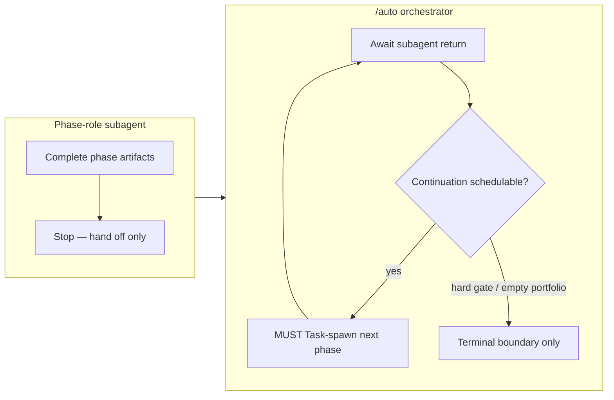

# Architecture archive pack (2026-09-17)

- Rollover trigger: `ARCH_HOT_MAX_LINES=3000, ARCH_HOT_MAX_STORY_SECTIONS=120`
- Source: `docs/engineering/architecture.md`
- Archived units (oldest first, contiguous prefix): 1
- Retained units in hot file: 21
- First archived heading: `# BUG-0012: Native-chain orchestrator compliance regression (post-US-0095)`
- Last archived heading: `# BUG-0012: Native-chain orchestrator compliance regression (post-US-0095)`
- Verification tuple (mandatory):
  - archived_body_lines=187
  - preamble_lines=1
  - retained_body_lines=2864

---

# BUG-0012: Native-chain orchestrator compliance regression (post-US-0095)

## Overview

**`BUG-0012`** closes a **contract-vs-runtime gap** after **US-0095** / **DEC-0080** / **S0084** (released **2026-06-07**). Static **`test_us0095_*`** contract tests pass, but operators enabling **`AUTO_FLOW_MODE=full_autonomy`** + **`AUTO_BACKLOG_DRAIN=1`** observe orchestrator stops after every story segment with mandatory re-**`/auto`** prose despite schedulable drain-advance continuation.

**Root cause** (**`R-0083`**): orchestrator **agent compliance gap** — no executable continuation hook; residual **US-0088** Option B / **US-0092** outer-driver re-invoke prose primes turn-boundary stop; drain-advance **step 7** spawn skipped; **`native_chain_active`** reflects gate eligibility only.

Binding decision: **`DEC-0081`** (amends **`DEC-0080`** enforcement layer only). Research anchor: **`R-0083`**. **Not** re-litigation of **US-0095** intent.

## Assumption challenge and alternatives

| Option | Summary | Verdict |
|--------|---------|---------|
| A | **Strengthen orchestrator command-spec compliance** — explicit MUST Task-spawn mandate, demote Option B, negative contract tests, continuation-truth breadcrumbs | **Preferred** — minimal diff; preserves **DEC-0080** contract |
| B | **New stdlib hook/script** enforcing orchestrator loop at runtime | **Rejected** — Cursor has no hook for in-chat agent behavior; same compliance problem |
| C | **Re-open US-0095** as feature story | **Rejected** — feature delivered; this is regression fix |
| D | **Outer driver as IDE primary** (revert **DEC-0080**) | **Rejected** — contradicts operator expectation and **US-0095** closure |

## Orchestrator compliance contract (AC-1, AC-2, AC-3)

### Actor distinction (spawn-only preserved)

**Phase-role commands** correctly say "stop and require next phase in fresh subagent" — orchestrator **must not** treat that as run terminal when next phase or drain target is schedulable (**BUG-0006** unchanged: orchestrator schedules, never executes phase deliverables).

### Orchestrator continuation mandate

After foreground subagent completion, when **any** of (a) next intersected phase exists, (b) drain policy selects another OPEN story/bug, (c) relaxable stop within retry budget — orchestrator **MUST**:

1. **Task-spawn** next phase-role subagent (**US-0069** preflight).
2. **Not** emit mandatory re-**`/auto`**, **`auto_outer_driver.py`**, or **`segment exhausted`** terminal prose.
3. Increment **`outer_cycle_index`**; check **`AUTO_LOOP_MAX_CYCLES`**.

**Required doc literals**: **`orchestrator MUST Task-spawn`**, **`post-subagent continuation`**, **`phase-role stop is not run terminal`**.

### Native-chain precedence over US-0088 Option B (AC-2)

Under **`AUTO_FLOW_MODE=full_autonomy`** + IDE + Task available:

| Surface | Amendment |
|---------|-----------|
| **`auto.md`** § Continuous multi-phase (US-0088 matrix) | Native chain **must** continue in-chat — not "stop segment; operator may advance" |
| **`auto.md`** § Steps item 5 | Option B outer-driver equivalence scoped to **`NATIVE_CHAIN_UNAVAILABLE`** / headless/CI only |
| **`auto-orchestration-reference.md`** full-autonomy matrix | Outer-driver re-invoke row = **fallback** — not IDE-primary |

**Required doc literal**: **`native chain supersedes Option B`**.

### Drain-advance step 7 enforcement (AC-3)

Between **DEC-0080** algorithm steps **6** and **7**:

- **Forbidden**: operator wait, hand-off-to-operator prose, **`stop_reason=completed (segment exhausted)`** when `backlog_drain_stories_remaining_budget > 0` and eligible OPEN item exists.
- **Required**: immediate Task-spawn of first phase of next segment.
- **Attestation**: `drain_advance_action=spawned` in `state.md` boundary on successful advance.

## Continuation-truth breadcrumbs (AC-4)

Amend **DEC-0080** §3 breadcrumb semantics:

| Field | Semantics |
|-------|-----------|
| **`native_chain_active`** | Gate eligibility (**`full_autonomy`** + IDE + Task) — unchanged |
| **`native_chain_continuing`** | Orchestrator scheduled spawn/advance **this** boundary |
| **`drain_advance_action`** | `spawned` \| `skipped` \| `not_applicable` — step 7 outcome |

**Invariant**: `native_chain_continuing=true` ⇒ no mandatory re-**`/auto`** prose; `stop_reason` ≠ `completed (segment exhausted)` when continuation pending.

## Forbidden-prose negative enforcement (AC-5, AC-6)

**Negative grep scope**: **`auto.md`** + **`auto-orchestration-reference.md`** normative blocks under **`full_autonomy`** / native-chain sections.

| Forbidden pattern | Notes |
|-------------------|-------|
| Mandatory `re-run /auto` between drain segments | Includes operator-facing end-of-run templates |
| `segment exhausted` as terminal when continuation pending | Invalid under **`full_autonomy`** |
| Mandatory `run the outer driver` in IDE-primary path | Outer driver = **optional** / **fallback** only |
| Unqualified `python scripts/auto_outer_driver.py` | Must have **optional** / **fallback** qualifier |

**Preserved**: seven **`test_us0095_*`** subtests remain green — additive **`test_bug0012_*`** layer only.

## Contract tests (AC-5)

**Run**: `pytest -k bug0012 tests/auto_command_contract_test.py`

| Test | AC | Key assertions |
|------|-----|----------------|
| `test_bug0012_forbidden_drain_stop_prose_negative_grep` | AC-5, AC-6 | Negative grep forbidden patterns in native-chain + full_autonomy blocks |
| `test_bug0012_orchestrator_post_subagent_spawn_mandate` | AC-1 | **`orchestrator MUST Task-spawn`** after subagent return when schedulable |
| `test_bug0012_drain_advance_step7_no_stop_between_6_and_7` | AC-3 | Step 6→7 immediate spawn — no operator stop between |
| `test_bug0012_native_chain_precedence_over_option_b` | AC-2 | Native chain primary supersedes US-0088 Option B under **`full_autonomy`** |

## `resume_brief` + reference alignment (AC-7)

**DEC-0069** pairing contract: orchestrator **MUST Task-spawn** next phase — **`/auto`** is orchestrator context label, not operator re-invocation instruction.

**Touch surfaces**: `handoffs/resume_brief.md` template pairing lines; reference drain-advance + continuation sections.

## Operator E2E recipe (AC-8)

Runbook § **BUG-0012 regression verify**:

1. Scratchpad: **`AUTO_FLOW_MODE=full_autonomy`**, **`AUTO_BACKLOG_DRAIN=1`**, **`AUTO_BACKLOG_MAX_STORIES≥2`**, **`AUTO_QUIET=1`**.
2. Backlog: **≥2 OPEN stories**.
3. Single **`/auto`** in Cursor IDE Agent panel.
4. Complete **story A** through **`refresh-context`**.
5. **Pass**: orchestrator drain-advances to **story B** first phase **without** operator re-**`/auto`** and **without** forbidden terminal prose.
6. Evidence: `state.md` shows `drain_advance_action=spawned`, `native_chain_continuing=true`; `resume_brief` top pointer advances `story_id`.

## Template parity (AC-8)

**Touch inventory** (6 surfaces): `auto.md` (+ template), reference excerpts (+ template), `resume_brief` pairing contract, contract tests, architecture `# BUG-0012`, runbook E2E subsection (+ template).

**Parity scope**: `--scope=bug-0012`.

## Non-goals

- Weakening **BUG-0006** spawn-only or **DEC-0078** hard gates.
- Removing outer driver (optional fallback preserved).
- Changing **US-0096** delivery modes.
- Modifying **DEC-0038** strict-proof tuple schema (additive breadcrumb fields only).

## Risks

| Risk | Mitigation |
|------|------------|
| **R1** Doc fix passes tests; runtime still stops | Operator E2E recipe + `native_chain_continuing` attestation |
| **R2** Over-broad edits relax hard gates | Explicit **DEC-0078** unchanged assertion in contract tests |
| **R3** Phase-role vs orchestrator conflation | Actor distinction diagram + mandate literals |
| **R4** **AUTO_QUIET=1** messaging ambiguity | Scheduling independent of quiet; forbidden wait prose |
| **R5** Cursor spawn depth | **`NATIVE_CHAIN_UNAVAILABLE`** unchanged |

## AC traceability

| AC | Architecture anchor |
|----|---------------------|
| AC-1 Orchestrator MUST Task-spawn mandate | § Orchestrator compliance contract |
| AC-2 Native chain precedence over Option B | § Native-chain precedence |
| AC-3 Drain-advance step 7 no-stop | § Drain-advance step 7 enforcement |
| AC-4 Continuation-truth breadcrumbs | § Continuation-truth breadcrumbs |
| AC-5 Four `test_bug0012_*` contract tests | § Contract tests |
| AC-6 Forbidden-prose negative grep | § Forbidden-prose negative enforcement |
| AC-7 `resume_brief` spawn wording | § `resume_brief` + reference alignment |
| AC-8 Runbook multi-segment E2E + parity | § Operator E2E recipe; § Template parity |

## Atomic task seeds (for `/sprint-plan`)

| # | Seed | AC | Surfaces |
|---|------|----|----------|
| 1 | Add orchestrator-only **MUST Task-spawn** continuation block to `auto.md` — actor distinction, post-subagent loop, forbidden turn-boundary stop | AC-1 | `.cursor/commands/auto.md` + template |
| 2 | Scope US-0088 matrix + Steps Option B to **`NATIVE_CHAIN_UNAVAILABLE`** / headless only; add **`native chain supersedes Option B`** literal | AC-2 | `auto.md`, reference active + template |
| 3 | Harden drain-advance algorithm — no operator stop between steps 6–7; `drain_advance_action` attestation docs | AC-3, AC-4 | reference, `auto.md`, `state.md` breadcrumb comments |
| 4 | Add `native_chain_continuing` + `drain_advance_action` to state boundary field docs and resume_brief pairing spawn wording | AC-4, AC-7 | reference, `resume_brief` template, `auto.md` |
| 5 | Implement four **`test_bug0012_*`** contract subtests + `pytest -k bug0012` green | AC-5 | `tests/auto_command_contract_test.py` |
| 6 | Negative grep forbidden drain-stop prose across full_autonomy normative blocks | AC-6 | contract tests (subtest 1), `auto.md`, reference |
| 7 | Runbook § **BUG-0012 regression verify** — multi-segment operator E2E recipe | AC-8 | `runbook.md` + template |
| 8 | Template parity `--scope=bug-0012`; preserve all **`test_us0095_*`** green; architecture + DEC linkage assert | AC-8 | template mirrors, parity script, read-only assert |

**Task count**: 8 seeds. `SPRINT_MAX_TASKS=12` — no auto-split expected.

## Decision linkage

- Decision: **`DEC-0081`**
- Amends: **`DEC-0080`**
- Research: **`R-0083`**
- Composed: **`DEC-0078`**, **`BUG-0006`**, **`DEC-0069`**, **`DEC-0038`**, **`US-0095`**
- Related: **`US-0088`**, **`US-0092`**, **`US-0044`**, **`R-0081`**

