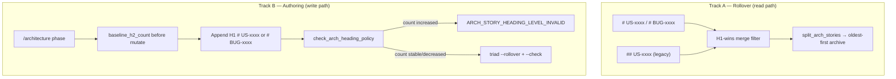

# Architecture archive pack (2026-09-17)

- Rollover trigger: `ARCH_HOT_MAX_LINES=3000, ARCH_HOT_MAX_STORY_SECTIONS=120`
- Source: `docs/engineering/architecture.md`
- Archived units (oldest first, contiguous prefix): 1
- Retained units in hot file: 21
- First archived heading: `# BUG-0010: Dual-level architecture story headings and diff-gated H1 enforcement`
- Last archived heading: `# BUG-0010: Dual-level architecture story headings and diff-gated H1 enforcement`
- Verification tuple (mandatory):
  - archived_body_lines=150
  - preamble_lines=1
  - retained_body_lines=2924

---

# BUG-0010: Dual-level architecture story headings and diff-gated H1 enforcement

## Overview

**`BUG-0010`** closes a triad archiver defect where `scripts/enforce-triad-hot-surface.py`
only recognizes H1 `# US-xxxx` story boundaries. Repos with H2 `## US-xxxx` sections hit
`STATE_ARCHIVE_BOUNDARY_AMBIGUOUS` when `architecture.md` exceeds `ARCH_HOT_MAX_LINES`
because `split_arch_stories` finds zero archivable chunks.

Binding decision: **`DEC-0076`**. Research anchor: **`R-0076`**. Open
`decisions/DEC-0076.md` for normative dual-level regex, H1-wins precedence, diff-gated
forward enforcement, and harness **§29A** contract.

## Dual-track fix diagram



## Minimal architecture

### A. Dual-level regex (DEC-0076 §1)

Replace monolithic `STORY_HEADING` with:

```text
STORY_HEADING_H1 = ^# (?:US|BUG)-\d{4}\s*[:\u2014\-].+$
STORY_HEADING_H2 = ^## US-\d{4}\s*[:\u2014\-].+$
```

### B. H1-wins merge algorithm (DEC-0076 §2)

1. Collect `(idx, story_id, level)` for all H1/H2 story-heading matches.
2. Drop H2 candidates whose `story_id` has any H1 in file.
3. Sort by `idx`; slice blocks between boundaries (unchanged rollover loop).

Kit-repo regression anchor: **26** H1 + **5** H2 (`US-0067`..`0070`, `US-0083` gate).

### C. Diff-gated forward enforcement (DEC-0076 §3–§4)

In-place extension of `enforce-triad-hot-surface.py`:

- `count_h2_story_headings(text)` — count `STORY_HEADING_H2` matches.
- `check_arch_heading_policy(after, baseline_h2_count)` — fail when count **increases**.
- `/architecture` step 9: capture baseline **before** append; run policy check **after** rollover.

**Reason codes**: `ARCH_STORY_HEADING_LEVEL_INVALID` (new); `STATE_ARCHIVE_BOUNDARY_AMBIGUOUS`
and `ARTIFACT_HOT_SURFACE_OVERSIZE` unchanged.

### D. Command contract (DEC-0076 §3, §6)

`.cursor/commands/architecture.md` (+ `template/`):

- Mandate H1 `# US-xxxx` for story sections; `# BUG-xxxx` for bug sections.
- Reference `ARCH_STORY_HEADING_LEVEL_INVALID` as non-suppressible stop token.
- Document baseline capture + heading policy check in triad gate step 9.

### E. Regression matrix + harness §29A (DEC-0076 §5)

| Surface | Requirement |
|---------|-------------|
| `enforce-triad-hot-surface.py --self-test` | Extend with `##`-only, mixed, idempotent, enforcement-delta, inner-`##` classes |
| `tests/auto_command_contract_test.py` | Add `test_bug0010_*` prefix subtests |
| `tests/run-tests.ps1` + `.sh` | New section **§29A** (`pytest -k bug0010` or equivalent) |
| `tests/fixtures/triad_arch_headings/` | Optional minimal fixtures (sprint may add) |

Existing triad harness block: **unchanged** (additive §29A only).

### F. Template parity inventory (DEC-0076 §6)

**Positive (active + `template/` byte-identical)**:

1. `scripts/enforce-triad-hot-surface.py`
2. `.cursor/commands/architecture.md` (H1 mandate + policy check text)
3. `docs/engineering/runbook.md` (triad subsection extension)

**Active-only**: `# BUG-0010`, test extensions, §29A harness wiring.

**No new** `check_intake_template_parity.py` scope.

### G. Operator docs (DEC-0076 §7)

Runbook triad subsection: legacy `## US-` rollover note + optional `##`→`#` normalization
guidance (verbatim in DEC-0076 §7).

## Risks (architecture-resolved)

| ID | Mitigation |
|----|------------|
| R1 Double-count H1+H2 | H1-wins filter (§B) |
| R2 Split on inner `##` | `## US-\d{4}` regex only (§A) |
| R3 Block legitimate subheadings | Diff-gated policy (§C) |
| R4 Template script drift | Byte-identical active + `template/` (§F) |
| R5 DEC-0054 §2 drift | Doc-only amendment (DEC-0076 §8) |

## AC traceability

| AC | Architecture anchor |
|----|---------------------|
| AC-1 `## US-` backward-compat rollover | §A, §B, §E |
| AC-2 H1 `# US-` non-regression | §A, §E |
| AC-3 Mixed-file H1-wins precedence | §B, §E |
| AC-4 Diff-gated enforcement | §C |
| AC-5 Command H1 mandate + parity | §D, §F |
| AC-6 Self-test + contract tests + §29A | §E |
| AC-7 `# BUG-` H1 rollover + script parity | §A, §F |
| AC-8 Operator runbook remediation | §G |

## Atomic task seeds (for `/sprint-plan`)

| # | Seed | AC | Surfaces |
|---|------|----|----------|
| 1 | Implement `STORY_HEADING_H1`/`H2` + H1-wins `split_arch_stories` merge | AC-1, AC-2, AC-3, AC-7 | `scripts/enforce-triad-hot-surface.py` + `template/scripts/` |
| 2 | Add `count_h2_story_headings` + `check_arch_heading_policy` + CLI hook | AC-4 | same script (active + `template/`) |
| 3 | Extend `--self-test` with dual-level fixture classes | AC-1, AC-2, AC-3, AC-6 | same script |
| 4 | Update `.cursor/commands/architecture.md` H1 mandate + policy step | AC-4, AC-5 | `.cursor/commands/` + `template/.cursor/commands/` |
| 5 | Contract tests `test_bug0010_*` in `auto_command_contract_test.py` | AC-5, AC-6 | tests active-only |
| 6 | Harness **§29A** in run-tests PS1/SH | AC-6 | tests active-only |
| 7 | Optional `tests/fixtures/triad_arch_headings/` minimal fixtures | AC-1, AC-3 | tests active-only |
| 8 | Runbook triad subsection — legacy `## US-` + remediation blurb | AC-8 | runbook active + `template/` |
| 9 | Architecture linkage assert (this section + DEC-0076 refs) | AC-5 | read-only check |

**Task count**: 9 seeds. `SPRINT_MAX_TASKS=12` — no auto-split expected.

## Related

- **`US-0072`** / **`DEC-0054`** — triad hot-surface compaction
- **`DEC-0043`** — artifact ownership (history-preserving appends)
- **`US-0017`** — template drift guard (script mirror)
- **`US-0061`** — cross-phase ownership
- **`R-0076`** — research anchor

