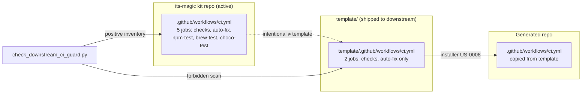
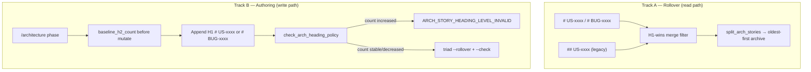
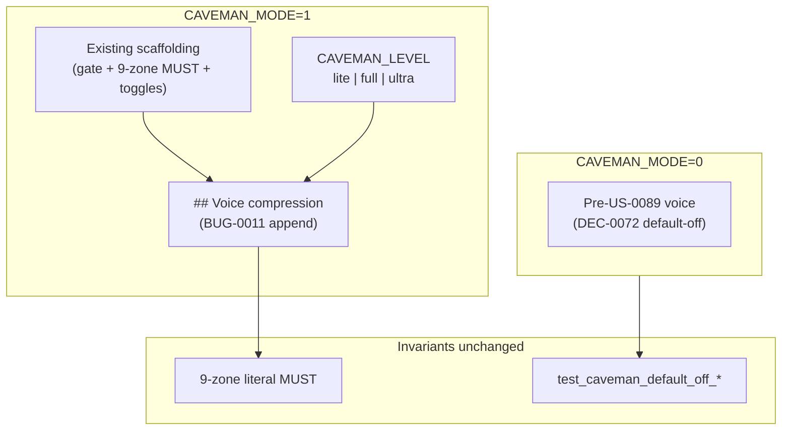
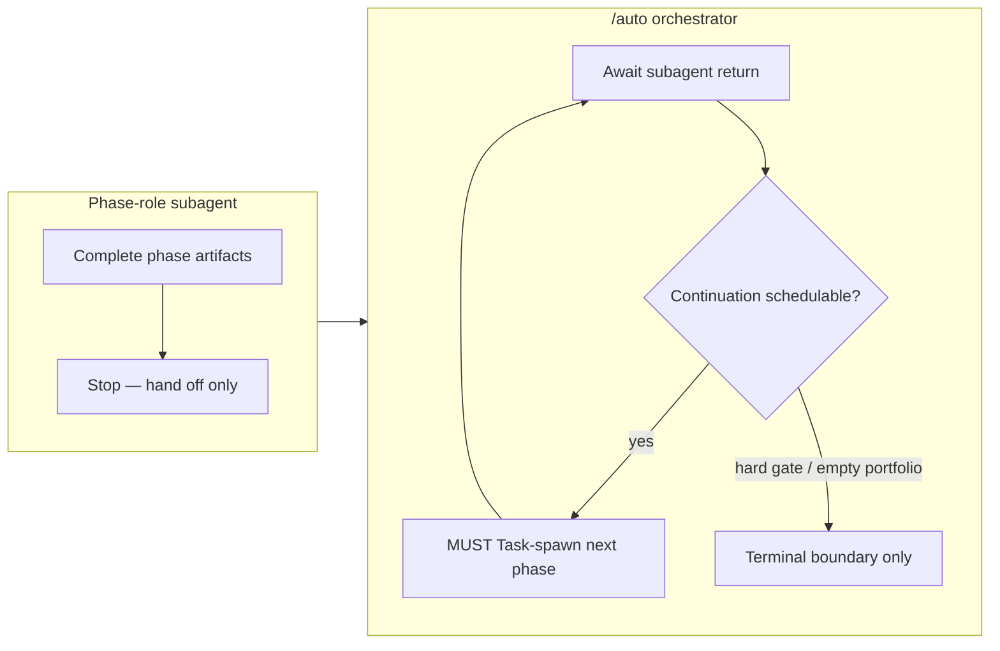

# US-0124 — OpenCode orchestrator plugin spawn-only `/auto`

## Overview

**US-0124** is the fourth slice of the six-story OpenCode adapter epic (US-0121..US-0126). US-0121 shipped the empty-but-valid `template/.opencode/` pack + the `--host` installer switch. US-0122 populated the pack with eight markdown role agents and locked the Layer-1 permission matrix (with `model:` omitted from every template agent per AC-7). US-0123 locked the per-role `provider/slug` resolution chain (local-only catalog + materializer + validator extension). US-0124 owns the **orchestrator plugin** that makes `/auto` spawn-only on the OpenCode host: resolve `phase_id → role` via US-0069, spawn an isolated child session via v2 `ctx.session.create`, write isolation evidence, honor the US-0092 stop matrix via a Python subprocess, and refuse orchestrator (or any role) performing another role's artifact writes.

The plugin **is** the OpenCode native chain (do **not** port US-0095 Cursor Task-loop per AC-9). Success tests (a) and (d) live here: a model that ignores its prompt still cannot skip spawn isolation (same-session roleplay is rejected) and `/auto` cannot continue to the next phase without a fresh session for the next role.

This is an **additive plugin + mock-harness + stub-table** change: one new template plugin file (`template/.opencode/plugins/orchestrator.ts`), one new mock-ctx harness (`tests/us0124/mock_ctx.ts`), one new contract test file (`tests/us0124_contract_test.py` — 9 markers), one stub runbook h2 one-liner, one additive CLI extension on `scripts/auto_outer_driver.py` (T-004 — legacy behavior byte-identical when new flags absent), installer manifest rows for the plugin file, and the companion DEC-0124. Template agent files (`template/.opencode/agents/*.md`) are NOT edited by US-0124 — the plugin composes with the US-0122 `auto.md` agent (DQ8 — independent surfaces, defense in depth).

**Research anchor**: **R-0109** US-0124 deepened findings (DQ1..DQ8 LOCKED for `/architecture`; US-0121 Q1..Q12 + US-0122 DQ1..DQ8 + US-0123 DQ1..DQ10 locks PRESERVED, not wiped; 7 risks R1..R7 ACCEPTED; approach A1 locked; compose guards 9/9 verified; 3 spec critic NBs closed; 3 research critic NBs closed here: `ik_us0124_dq6_driver_fail_code_conflation` (distinct `OPENCODE_DRIVER_INVOKE_FAILED` vs `OPENCODE_HEADLESS_UNSUPPORTED`), `ik_us0124_dq6_argv_extension_gap` (T-004 additive argv extension), `ik_us0124_research_scope_yagni` (informational)). **Companion DEC**: **DEC-0124** (authored Accepted in THIS phase — captures the locked plugin entry-point + spawn API + stub-harness + reason-code namespace + detection matrix + stop-matrix integration + headless CLI + agent/plugin boundary so US-0125..US-0126 inherit without re-deriving).

**Fresh context marker**: `tl-US0124-architecture-20260824T183000Z-fresh`
**Orchestrator run id**: `auto-20260824-02`
**Timestamp**: 2026-08-24T18:30:00Z (UTC)
**Verdict**: PASS
**Next**: `/sprint-plan`

## Approach locked (A1 — from R-0109 DQ1..DQ8)

**Approach A1** (locked): Orchestrator plugin ships as a single TypeScript file at `template/.opencode/plugins/orchestrator.ts` with the canonical v2 module shape `export default Plugin.define({ id: "its-magic.orchestrator", setup })` (DQ1). Auto-discovery via `.opencode/plugins/` — no `plugins[]` entry in `opencode.json` required (US-0121 ships no `opencode.json` in template; Q6 US-0121 lock preserved). The plugin's `setup` registers: (a) `ctx.tool.hook("execute.before", ...)` write-guard that detects `AUTO_ORCHESTRATOR_PHASE_EXECUTION` (orchestrator or any role performing another role's artifact writes) and fails closed; (b) spawn entry point that resolves `phase_id → role` via US-0069 / DEC-0051 matrix, calls `ctx.session.create({ parentID: <orchestrator-session-id>, agent: <role>, prompt: <phase-prompt> })`, asserts `sessionID !== parentID` (DQ5 hard post-condition), `ctx.session.wait(sessionID)`, and persists isolation evidence (AC-3); (c) subprocess callout to `scripts/auto_outer_driver.py` for stop-matrix decisions (DQ6 — additive argv; Python SOT unchanged; forbidden TS reimpl). The stub-harness is mock `ctx` in a Node test runner (DQ3 — no live OpenCode probe in CI). Four new `OPENCODE_*` codes + three reused codes + stub runbook table (DQ4). Three-case subtask-ignored detection matrix with throw-discrimination rule (DQ5). Headless CLI = `opencode run --agent auto --format json --auto` + fail-closed `OPENCODE_HEADLESS_UNSUPPORTED` (DQ7). Agent vs plugin independent surfaces, defense in depth, no permission-array duplication (DQ8).

| Option | Summary | Verdict |
|--------|---------|---------|
| **A1** | **v2 `Plugin.define` + `ctx.session.create` spawn + mock-ctx harness + subprocess stop-matrix + four `OPENCODE_*` codes + three-case detection matrix + `opencode run` headless + agent/plugin defense in depth** | **Preferred** — additive only; composes with US-0069/US-0092/US-0095/US-0023/US-0048/US-0005/US-0122/US-0121/US-0125/US-0102; AC-4/AC-5/AC-8/AC-10 provable via mock-ctx; critic NBs closed. |
| A2 (rejected) | v1 `@opencode-ai/plugin` default-export shape with `subtask` command | **Rejected** — v1 `subtask` command is not present in v2 docs; v2 is the documented forward path (R-0109 Q1 LOCKED for /architecture as v2). |
| A3 (rejected) | Live `opencode serve` probe in CI | **Rejected** — adds OpenCode runtime dependency to CI (flaky, version-coupled, slow); forbidden by AC-10 / vision D10. |
| A4 (rejected) | Static AST/grep only (no runtime harness) | **Rejected** — too weak; cannot assert runtime behavior; DQ5 detection matrix needs the mock to return each case. |
| A5 (rejected) | Reimplement US-0092 state machine in TypeScript | **Rejected** — forbidden by AC-6 + DQ6; two SOTs would drift; Python validators (US-0125) and TS plugin would diverge on edge cases. |
| A6 (rejected) | Plugin copies agent's permission array | **Rejected** — violates DQ8 ownership boundary; erodes defense in depth to single layer; `test_us0124_agent_plugin_compose` asserts non-duplication. |
| A7 (rejected) | Port `.cursor/commands/auto.md` prose into plugin | **Rejected** — violates AC-9; plugin composes US-0069 + US-0092 semantics, not prose port; `test_us0124_no_cursor_auto_clone` enforces. |
| A8 (rejected) | Map Python driver subprocess failure to `OPENCODE_HEADLESS_UNSUPPORTED` | **Rejected** — critic NB `ik_us0124_dq6_driver_fail_code_conflation`; distinct `OPENCODE_DRIVER_INVOKE_FAILED` reserved for driver subprocess failure; `OPENCODE_HEADLESS_UNSUPPORTED` reserved for missing `opencode run` CLI surface only. |

## Components

### Plugin entry point (DQ1 LOCKED — AC-1, AC-2)

`template/.opencode/plugins/orchestrator.ts` — single TypeScript file, default export `Plugin.define({ id: "its-magic.orchestrator", setup })` from `@opencode-ai/plugin`. Auto-discovered by OpenCode via `.opencode/plugins/` scan. No `plugins[]` entry in `opencode.json` required. Plugin id `its-magic.orchestrator` is the disable/enable selector (`--pure` / `-its-magic.orchestrator`).

### Spawn API (DQ2 LOCKED — AC-1, AC-3, AC-4)

The plugin's spawn entry point calls `ctx.session.create({ parentID: <orchestrator-session-id>, agent: <role>, prompt: <phase-prompt> })` → asserts `sessionID !== parentID` → `ctx.session.wait(sessionID)` → reads result → persists isolation evidence (`parentID`, `sessionID`, `role`, `phase_id`, `timestamp`, `fresh_context_marker`). If `ctx.session.create` is unavailable, fail closed with `OPENCODE_PLUGIN_SPAWN_UNSUPPORTED`.

### Mock-ctx stub harness (DQ3 LOCKED — AC-3, AC-4, AC-10)

`tests/us0124/mock_ctx.ts` — `MockCtx` implements the v2 plugin context subset (`session.create`/`prompt`/`wait`, `tool.hook` no-op recorder, `options` readonly). `session.create` accepts scripted `nextSessionID` + `throwOnCreate` + `returnNull` flags. Default: fresh uuid ≠ `parentID`. Tests load `template/.opencode/plugins/orchestrator.ts` via dynamic import, call `setup(mockCtx)`, drive spawn entry point, assert call args + `sessionID !== parentID` + isolation evidence. **Runner: Node** (CI already has it via `tests/run-tests.ps1 Ensure-NodeOnPath`); Bun optional. No live OpenCode runtime probe in CI (AC-10).

### Reason-code namespace (DQ4 LOCKED — AC-8; critic NB `ik_us0124_dq6_driver_fail_code_conflation` closed)

Four new `OPENCODE_*` codes: `OPENCODE_PLUGIN_SPAWN_UNSUPPORTED` (spawn primitive missing), `OPENCODE_SUBTASK_IGNORED` (null/throw/identical-id — spawn ignored), `OPENCODE_HEADLESS_UNSUPPORTED` (missing `opencode run` CLI surface only — DQ7), `OPENCODE_DRIVER_INVOKE_FAILED` (Python driver subprocess failure — non-zero exit, malformed JSON, timeout — DQ6; distinct from `OPENCODE_HEADLESS_UNSUPPORTED`). Three reused codes: `AUTO_ORCHESTRATOR_PHASE_EXECUTION` (orchestrator performing another role's artifact writes), `PHASE_ROLE_MISMATCH` (wrong-role spawn per US-0069), `NATIVE_CHAIN_UNAVAILABLE` (headless fallback cross-host family). Stub reason-code table in runbook (US-0126 owns full text).

### Three-case detection matrix + throw-discrimination (DQ5 LOCKED — AC-8)

`test_us0124_subtask_ignored_fail_closed` runs three sub-tests: `_null_return` (mock returns null → `OPENCODE_SUBTASK_IGNORED`), `_throw` (mock throws generic error → `OPENCODE_SUBTASK_IGNORED`; missing-primitive throw → `OPENCODE_PLUGIN_SPAWN_UNSUPPORTED`), `_identical_id` (mock returns `{ sessionID: parentID }` → `OPENCODE_SUBTASK_IGNORED`). `sessionID !== parentID` is a hard post-condition.

### Subprocess stop-matrix integration (DQ6 LOCKED — AC-6; critic NBs `ik_us0124_dq6_argv_extension_gap` + `ik_us0124_dq6_driver_fail_code_conflation` closed)

`scripts/auto_outer_driver.py` is the single TS↔Python integration. Additive argv: `--phase <phase_id> --role <role> --story <story_id> --sprint <sprint_id> --orchestrator-run-id <run_id> --stop-reason <reason>` → JSON response `{ "action": "spawn_next"|"hard_stop"|"ledger_write"|"pause_boundary", "next_phase": "<phase_id>", "stop_reason": "<reason>", ... }`. When new flags absent, legacy behavior byte-identical (no regression to US-0092 / DEC-0078). Subprocess failure (non-zero exit, malformed JSON, timeout) → `OPENCODE_DRIVER_INVOKE_FAILED` (NOT `OPENCODE_HEADLESS_UNSUPPORTED`). Forbidden: TS reimpl of US-0092 state machine.

### Headless CLI (DQ7 LOCKED — AC-7)

`opencode run --agent auto --format json --auto "<phase-prompt>"` (primary) + optional `opencode serve` + `--attach` (optimization). Fail-closed `OPENCODE_HEADLESS_UNSUPPORTED` when `opencode run` not on PATH. `test_us0124_invoke_cmd_hook` asserts argv + JSON parsing OR fail-closed path — not a live OpenCode probe.

### Agent vs plugin ownership boundary (DQ8 LOCKED — AC-1, AC-9)

`template/.opencode/agents/auto.md` (US-0122 — agent = prompt + permission allow-list, unchanged) + `template/.opencode/plugins/orchestrator.ts` (US-0124 — plugin = enforcement). Independent surfaces, defense in depth. Plugin MUST NOT copy agent's permission array. `test_us0124_agent_plugin_compose` asserts: both files exist; plugin source has zero matches for 7 role names + `edit:`/`bash:` literals; `ctx.tool.hook("execute.before")` callback present and calls stop-matrix subprocess for `AUTO_ORCHESTRATOR_PHASE_EXECUTION` detection.

### AC-10 contract-test list (locked — 9 markers)

`tests/us0124_contract_test.py` — markers:

| # | Marker | AC |
|---|--------|-----|
| 1 | `test_us0124_spawn_isolation_static` (grep/AST on plugin source — `ctx.session.create` with `parentID` + `agent`; no same-session spawn) | AC-1, AC-3 |
| 2 | `test_us0124_spawn_isolation_runtime` (mock `ctx` — fresh uuid ≠ parentID; `sessionID !== parentID` asserted; isolation evidence persisted) | AC-3, AC-4, AC-10 |
| 3 | `test_us0124_subtask_ignored_null_return` (null → `OPENCODE_SUBTASK_IGNORED` + stop) | AC-8 |
| 4 | `test_us0124_subtask_ignored_throw` (generic throw → `OPENCODE_SUBTASK_IGNORED` + stop) | AC-8 |
| 5 | `test_us0124_subtask_ignored_identical_id` (identical-id → `OPENCODE_SUBTASK_IGNORED` + stop) | AC-8 |
| 6 | `test_us0124_no_cursor_auto_clone` (grep plugin source for unique-to-Cursor phrases — zero hits) | AC-9 |
| 7 | `test_us0124_agent_plugin_compose` (both files exist; plugin source has zero matches for 7 role names + `edit:`/`bash:` literals; `ctx.tool.hook` callback present) | AC-1, AC-9 |
| 8 | `test_us0124_invoke_cmd_hook` (argv `opencode run --agent auto --format json --auto` + JSON parsing OR fail-closed `OPENCODE_HEADLESS_UNSUPPORTED`; not a live probe) | AC-7 |
| 9 | `test_us0124_secrets_no_logging` (grep plugin source + harness for `api_key`/`apikey`/`sk-`/`auth.json`/`.env` — zero hits in log/print/error paths) | AC-11 |

Surjective AC coverage: AC-1 (markers 1, 7), AC-2 (marker 1 + plugin id), AC-3 (markers 1, 2), AC-4 (marker 2), AC-5 (marker 2 + marker 8), AC-6 (DQ6 + marker 8), AC-7 (marker 8), AC-8 (markers 3, 4, 5), AC-9 (markers 6, 7), AC-10 (marker 2 + DQ3 mock-ctx), AC-11 (marker 9). Every AC has ≥1 marker.

## Risks mitigated

All 7 risks from R-0109 US-0124 ACCEPTED, plus 3 research critic NBs closed:

| Risk | Severity | Mitigation |
|------|----------|------------|
| R1: v2 `ctx.session.create` unavailable at runtime | MEDIUM → LOW | DQ2 + DQ4 fail-closed `OPENCODE_PLUGIN_SPAWN_UNSUPPORTED`; `test_us0124_spawn_isolation_runtime` asserts fail-closed path via mock-ctx throw-on-missing-primitive. |
| R2: Subtask-ignored silent continue (null/throw/identical-id) | MEDIUM → LOW | DQ5 three-case detection matrix; `test_us0124_subtask_ignored_*` (three sub-tests) assert all three fail-closed `OPENCODE_SUBTASK_IGNORED`. |
| R3: TS↔Python stop-matrix drift | MEDIUM → LOW | DQ6 single subprocess integration + locked additive argv; `test_us0124_invoke_cmd_hook` asserts argv + JSON parsing; Python SOT unchanged; T-004 additive extension preserves byte-identical legacy behavior. |
| R4: Headless `opencode run` unavailable on operator host | LOW–MEDIUM → LOW | DQ7 fail-closed `OPENCODE_HEADLESS_UNSUPPORTED`; `test_us0124_invoke_cmd_hook` asserts fail-closed path (mock missing `opencode` on PATH). |
| R5: Plugin duplicates agent's permission array | LOW–MEDIUM → LOW | DQ8 ownership boundary; `test_us0124_agent_plugin_compose` asserts plugin source has zero matches for 7 role names + `edit:`/`bash:` literals. |
| R6: `.cursor/commands/auto.md` prose leaks into plugin source (AC-9 violation) | LOW → LOW | `test_us0124_no_cursor_auto_clone` greps for unique-to-Cursor phrases; T-001 composes US-0069 + US-0092 semantics, not prose port. |
| R7: Live OpenCode runtime probe accidentally added to CI (AC-10 violation) | LOW → LOW | DQ3 mock `ctx` harness; contract tests run pure Node/Bun; CI has no `opencode` dependency. |
| C1 (critic NB): `ik_us0124_dq6_driver_fail_code_conflation` | → closed | Distinct `OPENCODE_DRIVER_INVOKE_FAILED` (driver subprocess failure) vs `OPENCODE_HEADLESS_UNSUPPORTED` (missing `opencode run` CLI surface only). The two codes never overlap. |
| C2 (critic NB): `ik_us0124_dq6_argv_extension_gap` | → closed | T-004 is additive argv on `auto_outer_driver.py`; existing driver behavior byte-identical when new flags absent; no regression to US-0092 / DEC-0078. |
| C3 (critic NB): `ik_us0124_research_scope_yagni` | → closed | Informational; US-0124 ships minimum plugin + harness + stub table; US-0125/US-0126 own command-body and full-runbook surfaces. |

## Non-goals (this slice)

- **US-0125** (thin command bodies) — `template/.opencode/commands/` ships `.gitkeep` only (US-0121 pack).
- **US-0126** (full runbook) — T-003 stub reason-code table one-liner only.
- **Repo-root `opencode.json`** — not shipped (R-0109 Q6 US-0121 lock preserved).
- **Active kit `.opencode/agents/` mirror** — YAGNI (inherits US-0122 DQ8 / R-0109 Q9 US-0121).
- **Kit-operated proxy for Chinese APIs** — out of scope (plugin resolves role via US-0069; OpenCode host resolves role→slug via US-0123 catalog).
- **Cursor BYOK fixes** — out of scope (compose, not amend).
- **Embedding keys** — out of scope.
- **Live OpenCode runtime probe in CI** — out of scope (AC-10; DQ3 mock-ctx harness).
- **TS reimplementation of US-0092 state machine** — forbidden (DQ6; Python remains SOT).
- **New validator script** — default rejected (extend contract tests + `model_tier_validate.py --scope opencode-catalog` from US-0123).

## Compose guards (UNCHANGED — additive only)

| Compose target | Verification | Result |
|---|---|---|
| US-0069 / DEC-0051 (phase→role matrix) | plugin resolves `phase_id → role` via matrix; no matrix rewrite | ✅ untouched |
| US-0092 / DEC-0078 (outer driver + stop reasons + `--invoke-cmd`) | Python SOT unchanged; plugin calls subprocess (DQ6); `--invoke-cmd` maps to `opencode run` (DQ7) | ✅ untouched |
| US-0095 / DEC-0080 (Cursor native Task-loop) | NOT ported — plugin IS the OpenCode native chain; no `.cursor/commands/auto.md` clone (AC-9) | ✅ NOT ported |
| US-0023 / US-0048 / BUG-0006 (spawn-only isolation) | `ctx.session.create` + `parentID` + `sessionID !== parentID` assertion; fail-closed on no-op spawn | ✅ compose |
| US-0005 (Cursor hook JSON) | NOT ported — enforcement moves into plugin (`ctx.tool.hook`) + agent permissions | ✅ NOT ported |
| US-0122 / DEC-0122 (`auto.md` agent) | US-0124 does not edit `template/.opencode/agents/auto.md`; agent = prompt + permission allow-list; plugin = enforcement (DQ8) | ✅ untouched |
| US-0121 / DEC-0120 (host default cursor-only + reserved `template/.opencode/plugins/`) | plugin lives in reserved slot; no `opencode.json` in template | ✅ consumed |
| US-0125 (thin commands Layer 3 only) | plugin must not own command bodies | ✅ untouched |
| US-0102 / DEC-0087 (no vendor slugs in `template/`) | plugin source has no vendor model slugs | ✅ untouched |

Contract test `test_us0124_agent_plugin_compose` (marker 7) + `test_us0124_no_cursor_auto_clone` (marker 6) enforce at execute boundary.

## Sprint seeds preview (within SPRINT_MAX_TASKS=12)

| Seed | Description | AC |
|------|-------------|-----|
| **T-anch** | Verify `# US-0124` H1 anchor placed AFTER `# US-0123` and BEFORE `US-0089`; DEC-0124 Accepted; compose guards 9/9; 9-marker list locked; plugin entry-point + spawn API + stop-matrix argv + agent/plugin boundary locked in DEC-0124. | AC-9, AC-10 |
| **T-001** | NEW plugin file `template/.opencode/plugins/orchestrator.ts` with `Plugin.define({ id: "its-magic.orchestrator", setup })` + `ctx.tool.hook("execute.before")` write-guard + `ctx.session.create` spawn entry + stop-matrix subprocess callout. | AC-1, AC-2, AC-3 |
| **T-002** | NEW mock `ctx` harness `tests/us0124/mock_ctx.ts` — `MockCtx` with `session.create`/`prompt`/`wait` + scripted null/throw/identical-id + `tool.hook` recorder. | AC-3, AC-4, AC-10 |
| **T-003** | Stub reason-code table in `docs/engineering/runbook.md` h2 `## OpenCode orchestrator plugin reason codes (US-0124)` — four `OPENCODE_*` codes + three reused codes, one-line semantics each, cross-link to US-0126 for full table. | AC-8 |
| **T-004** | Subprocess argv contract — `scripts/auto_outer_driver.py` additive CLI extension exposing `--phase --role --story --sprint --orchestrator-run-id --stop-reason` → JSON response; Python SOT unchanged, additive CLI surface only; legacy behavior byte-identical when flags absent. | AC-6 |
| **T-005** | Contract tests `tests/us0124_contract_test.py` — 9 markers (see AC-10 table above). | AC-10 |
| **T-006** | Installer manifest rows for `template/.opencode/plugins/orchestrator.ts` under `[opencode_install_include_paths]` + triple-installer parity — US-0121 manifest extension, additive. | AC-1 |
| **T-007** | README + template parity — `check_intake_template_parity.py --scope=opencode-adapter` extension for plugin file + mock harness; `its_magic/README.md` cross-link. | AC-10 |
| **T-008** | Runbook stub cross-link from US-0124 section to US-0126 full reason-code table — placeholder h2 anchor only, US-0126 owns body. | AC-8 |
| **T-009** | Validator extension on `scripts/model_tier_validate.py` OR new `scripts/opencode_plugin_validate.py` — only if US-0124 plugin source needs static validation beyond contract tests; default: extend contract tests, no new validator script. | AC-10 |

**Total: 10 tasks (T-anch + T-001..T-009) — within `SPRINT_MAX_TASKS=12`.** `/sprint-plan` may merge or split within the 12-task budget.

**AC mapping (11 ACs → 10 tasks surjective)**: AC-1 → T-001+T-005+T-006; AC-2 → T-001; AC-3 → T-001+T-002+T-005; AC-4 → T-002+T-005; AC-5 → T-002+T-005; AC-6 → T-004+T-005; AC-7 → T-004+T-005; AC-8 → T-003+T-005; AC-9 → T-anch+T-005; AC-10 → T-002+T-005; AC-11 → T-005.

## DC check

`dc_check=clean`. No `# US-0124` or `## US-0124` existed in `architecture.md` prior to THIS write (verified by R-0109 US-0124 DC check). H1 anchor added per DEC-0076 / BUG-0010 heading policy. Deferral register clean.

## Stop conditions

- `decision_gate=false`
- `missing_acceptance_criteria=none` (11/11 ACs covered by 9 contract-test markers + compose guards + T-003 runbook stub)
- `compose_guards=9/9 UNCHANGED (additive only)`
- `dc_check=clean`
- DQ1..DQ8 LOCKED for US-0124; 7/7 R ACCEPTED; A1 locked; 3 research critic NBs closed; 3 spec critic NBs closed (carried from research)
- Triad baseline `baseline_h2_count=39` preserved (H1 used, not H2)
- Triad `--rollover` ran (state.md was at 1200/1200 lines; rollover archived 1 unit); `--check` PASS after rollover; heading policy check pending (see below)

## Sovereign memory note

`assemble_sovereign_memory_digest(...)` NOT called. No write to `mistakes.jsonl`.

## Consequences

- **Positive**: Operators can run `/auto` on the OpenCode host with spawn-only isolation before thin commands (US-0125) or the full runbook (US-0126) exist; success tests (a) and (d) are provable via mock-ctx harness + `sessionID !== parentID` assertion; AC-8 subtask-ignored fail-closed is provable via three-case detection matrix; epic US-0125..US-0126 inherits the locked plugin entry-point + spawn API + reason-code namespace + stop-matrix integration via DEC-0124 without re-deriving; US-0069/US-0092/US-0095/US-0023/US-0048/US-0005/US-0122/US-0121/US-0125/US-0102 compose unchanged.
- **Negative**: One new template file (orchestrator plugin); one new mock harness (tests/us0124/mock_ctx.ts); one new contract test file (9 markers); one stub runbook h2 one-liner; one additive CLI extension on `scripts/auto_outer_driver.py` (T-004); installer manifest rows for the plugin file (T-006).
- **Neutral**: US-0121 reserved `template/.opencode/plugins/` slot consumed (additive); US-0122 `auto.md` agent unchanged; US-0092 Python SOT unchanged; US-0102 volatile-ID rule respected; Cursor `MODEL_*` keys unchanged.

## Isolation evidence (US-0048 / DEC-0029)

- `phase_id=architecture`, `role=tech-lead`, `story_id=US-0124`, `sprint_id=(pending — created at sprint-plan)`
- `orchestrator_run_id=auto-20260824-02`
- `delivery_mode=ultra_lean`, `macro_phase=plan` (architecture — second canonical phase of `plan` macro per US-0096 / DEC-0082)
- `model_id=glm-5.2-high` (CROSS_MODEL_REVIEW=1 — required; this spawn's producer model)
- `fresh_context_marker=tl-US0124-architecture-20260824T183000Z-fresh`, `timestamp=2026-08-24T18:30:00Z` (UTC)
- `evidence_ref=docs/engineering/architecture.md # US-0124 (this section), decisions/DEC-0124.md (companion DEC), docs/engineering/research.md ## R-0109 (US-0124 deepened findings DQ1..DQ8 LOCKED), docs/product/backlog.md ## US-0124 (D1..D10 + 11 ACs + DQ1..DQ8, status OPEN untouched, AC checkboxes untouched), docs/product/acceptance.md US-0124 row (unchecked), docs/product/vision.md ## Intake Notes — US-0124 + ## Discovery Notes — US-0124, handoffs/po_to_tl.md US-0124 section, handoffs/sovereign_critic_findings.jsonl US-0124 research rows (3 non-blocking carry-forwards closed here), decisions/DEC-0051.md (read-only compose), decisions/DEC-0078.md (read-only compose), decisions/DEC-0080.md (read-only compose), decisions/DEC-0122.md (read-only compose), decisions/DEC-0120.md (read-only compose), template/.opencode/agents/auto.md (grep mode:/permission:/task: anchors — DQ8 boundary source), template/.opencode/plugins/README.md (US-0121 reserved slot — US-0124 owns directory body), docs/engineering/architecture.md # US-0123 (format template), docs/engineering/decisions.md ## DEC-0124 (stub flipped to Accepted), handoffs/resume_brief.md (US-0124 sovereign-critic PASS prepend)`
- Fresh tech-lead subagent per BUG-0006 / US-0048 isolation; no prior chat history carried forward. Context limited to narrow-read files (US-0053). No `.env` reads, no credentials access, no intake-evidence mutation, no backlog status/AC mutation.
- Prior proof consumed: `rp-auto-20260824-02-research-tech-lead-20260824T181500Z-US-0124` (`proof_hash=BDDA6BEA3F4F8B587FD52B33CF9E07DB3F03156F17742A641655BCE5E6E7AAC1`, ttl 2026-08-24T19:15:00Z — consumed before RUNTIME_PROOF_STALE).
- Triad baseline `baseline_h2_count=39` preserved via H1 anchor (no new H2 `## US-` headings added).

## Strict runtime proof (DEC-0038)

- `runtime_proof_id=rp-auto-20260824-02-architecture-tech-lead-20260824T183000Z-US-0124`
- Canonical payload (sorted-key JSON per DEC-0038): `{"delivery_mode":"ultra_lean","macro_phase":"plan","model_id":"glm-5.2-high","orchestrator_run_id":"auto-20260824-02","phase_id":"architecture","proof_issued_at":"2026-08-24T18:30:00Z","proof_ttl_seconds":3600,"role":"tech-lead","runtime_proof_id":"rp-auto-20260824-02-architecture-tech-lead-20260824T183000Z-US-0124","sprint_id":"(pending)","story_id":"US-0124"}`
- `proof_hash=9FFF0B5A30F1A2711A966539B6ED043ADE53B6842C86D64D6A391A2DDF9D2A0A` (SHA-256 of sorted-key JSON payload, UTF-8 bytes via python hashlib)
- `proof_ttl_seconds=3600`, `proof_ttl=2026-08-24T19:30:00Z` (UTC = issued_at + 3600s)

## Decision gate

- `decision_gate=false` (companion DEC-0124 authored Accepted in THIS phase; approach A1 locked; DQ1..DQ8 LOCKED for US-0124; 7/7 R ACCEPTED; 3 research critic NBs closed; 3 spec critic NBs closed; DC check clean; compose guards 9/9 UNCHANGED)
- `stop_conditions_met=yes`

## Next scheduled phase

- `next_scheduled_phase=/sprint-plan` (role=tech-lead per US-0069 / DEC-0051 phase→role matrix default; third canonical phase of `plan` macro per ultra_lean; research + architecture + sprint-plan merged into `plan` macro)
- `next_scheduled_role=tech-lead`
- `stop_condition=STOP after architecture completes; hand off via artifacts only to /sprint-plan in fresh tech-lead subagent (BUG-0006). Do not spawn /sprint-plan from this subagent.`

# US-0125 — Thin OpenCode commands and Python validator bridge

## Overview

**US-0125** is the fifth slice of the six-story OpenCode adapter epic (US-0121..US-0126). US-0121 shipped the empty-but-valid `template/.opencode/` pack + the `--host` installer switch. US-0122 populated the pack with eight markdown role agents and locked the Layer-1 permission matrix. US-0123 locked the per-role `provider/slug` resolution chain. US-0124 shipped the orchestrator plugin that makes `/auto` spawn-only on the OpenCode host. US-0125 owns **Layer 3** — the named slash-command entry points (`/intake`, `/discovery`, `/research`, `/architecture`, `/sprint-plan`, `/plan-verify`, `/execute`, `/qa`, `/verify-work`, `/release`, `/closure`, `/refresh-context`, `/auto`, `/quick`, `/ask`) as **dispatch-only** markdown files at `template/.opencode/commands/<name>.md`, plus the **Python validator bridge contract** that keeps `scripts/*_validate.py` the single source of truth for persistence-blocking gates.

The commands **are** dispatch-only (do **not** clone Cursor 200-line command bodies per AC-1/AC-9). Success test (b) lives here: a model that ignores its prompt still cannot run `/release` (or any release persistence path) after a failing validator — the US-0124 plugin's `ctx.tool.hook("execute.before")` is the enforcement layer that a prompt-ignoring model cannot bypass (DQ4 defense in depth). The command prose is the *invitation* (diagnostics); the plugin is the *enforcement* (persistence).

This is an **additive commands + bridge-contract + stub-harness** change: 15 new template command files (`template/.opencode/commands/<name>.md`), one validator→artifact mapping table (US-0125-owned, US-0124-consumed), one mock-subprocess harness extension on the US-0124 `MockCtx`, one new contract test file (`tests/us0125_contract_test.py` — 11 markers), one stub runbook h2 one-liner, installer manifest rows for the 15 command files, and the companion DEC-0125. Template agent files (`template/.opencode/agents/*.md`) and the orchestrator plugin (`template/.opencode/plugins/orchestrator.ts`) are NOT edited by US-0125 — the commands compose with the US-0122 `auto.md` agent (DQ5/DQ8 — independent surfaces, defense in depth) and the US-0124 plugin (DQ4 — command = invitation, plugin = enforcement).

**Research anchor**: **R-0109** US-0125 deepened findings (DQ1..DQ8 LOCKED for `/architecture`; US-0121 Q1..Q12 + US-0122 DQ1..DQ8 + US-0123 DQ1..DQ10 + US-0124 DQ1..DQ8 locks PRESERVED, not wiped; 6 risks R1..R6 ACCEPTED; approach A1 locked; compose guards 7/7 verified; 3 research critic NBs closed here: `ik_us0125_dq5_auto_plugin_overlap` (dispatch-only `/auto`), `ik_us0125_dq3_validator_scope_boundary` (two named CLIs + generic bridge contract; US-0126 owns enumeration), `ik_us0125_spec_scope_minimal_pass` (informational)). **Companion DEC**: **DEC-0125** (authored Accepted in THIS phase — captures the locked command inventory + clone-guard metric + validator-bridge contract + defense-in-depth + `/auto` dispatch-only + frontmatter shape + reason-code boundary + stub-harness so US-0126 inherits without re-deriving).

**Fresh context marker**: `tl-US0125-architecture-20260824T203000Z-fresh`
**Orchestrator run id**: `auto-20260824-02`
**Timestamp**: 2026-08-24T20:30:00Z (UTC)
**Verdict**: PASS
**Next**: `/sprint-plan`

## Approach locked (A1 — from R-0109 US-0125 DQ1..DQ8)

**Approach A1** (locked): Ship a curated 15-file subset of thin OpenCode commands at `template/.opencode/commands/<name>.md` (12 lifecycle phases + `/auto` + `/quick` + `/ask`) (DQ1). Each file is dispatch-only: frontmatter (`description` + `agent: <role>` per DQ6; `/auto` adds `subtask: false`; `/ask` omits `agent`) + a short body (≤ 20 lines) that names the phase_id + artifact path list + STOP. No `model:` in any template command (US-0102 + US-0123). No 200-line Cursor command clones (AC-1, AC-9). Clone guard = per-file line cap ≤ 20 + normalized-text similarity ≤ 0.30 vs `.cursor/commands/<name>.md` via stdlib `difflib.SequenceMatcher` (DQ2 — no new test dependency). Python validators remain the single source of truth: US-0125 ships the subprocess bridge contract for the two named persistence-blocking gates (`scripts/intake_evidence_validate.py` + `scripts/bug_issue_validate.py`) plus a documented generic bridge contract any kit validator can invoke through; US-0126 owns the full validator enumeration in the runbook (DQ3). Defense in depth — command prose subprocesses the validator for *diagnostics*; the US-0124 plugin's `ctx.tool.hook("execute.before")` enforces *persistence* on non-zero exit (DQ4). `/auto` is a dispatch-only entry (`agent: auto` + `subtask: false` + no spawn logic); the US-0124 plugin remains the single spawn owner (DQ5). Reason codes: raw Python reason codes for validator non-zero exit; `OPENCODE_DRIVER_INVOKE_FAILED` (DEC-0124 DQ6) for subprocess invocation failure; no new `OPENCODE_*` wrapper (DQ7). Mock-ctx + mock-subprocess harness reuses the US-0124 `MockCtx`; no live OpenCode probe in CI (DQ8).

| Option | Summary | Verdict |
|--------|---------|---------|
| **A1** | **Curated 15-file subset + dispatch-only bodies + clone guard (line ≤ 20 + similarity ≤ 0.30 via difflib) + two named CLIs + generic bridge contract + defense-in-depth + `/auto` dispatch-only + raw Python reason codes + mock-ctx+mock-subprocess harness** | **Preferred** — additive only; composes with US-0001/US-0078/US-0121/US-0122/US-0124/US-0126/US-0102; AC-2/AC-4/AC-8/AC-10 provable via mock-ctx+mock-subprocess; critic NBs closed. |
| A2 (rejected) | Full 1:1 mirror (25 files) | **Rejected** — violates AC-1 (no 200-line clones) at the *intent* level; raises clone-guard surface unnecessarily; utility commands like `phase-context` are read pointers, not phases. |
| A3 (rejected) | Lifecycle-only (12 files) | **Rejected** — omits `/auto` (the orchestrator dispatch entry — required for OpenCode `/auto` to exist as a slash command per DQ5) and `/quick` (the `mega_quick` delivery-mode entry per US-0096 / DEC-0082). |
| A4 (rejected) | Enumerate every kit validator in US-0125 | **Rejected** — violates AC-3 (US-0125 owns the *bridge contract*, not the validator inventory); pre-empts US-0126 runbook territory. |
| A5 (rejected) | Command prose owns subprocess enforcement | **Rejected** — a prompt-ignoring model can skip the subprocess and write anyway; AC-4 success test (b) cannot be enforced at the command-prose layer. Enforcement must live in the plugin (DQ4). |
| A6 (rejected) | `/auto` command file with spawn logic | **Rejected** — violates US-0124 DQ8 (plugin owns spawn; command must not own spawn) + AC-1 (no 200-line clones); duplicates the plugin's spawn role. |
| A7 (rejected) | `OPENCODE_VALIDATOR_FAILED: <python_code>` wrapper | **Rejected** — duplicates the reason-code namespace (every Python code now has two surface forms); pre-empts US-0126's reason-code table. |
| A8 (rejected) | Live OpenCode probe in CI | **Rejected** — adds OpenCode runtime dependency to CI (flaky, version-coupled, slow); forbidden by AC-10 / vision D10 — same lock as US-0124 DQ3. |
| A9 (rejected) | Static AST/grep only (no runtime harness) | **Rejected** — too weak; cannot assert runtime behavior; AC-4 success test (b) needs the mock to return non-zero and assert the write is refused. |

## Components

### Command file inventory (DQ1 LOCKED — AC-1, AC-9)

`template/.opencode/commands/<name>.md` — 15 files (curated subset):

| # | File | Frontmatter `agent:` | Phase id | Notes |
|---|------|----------------------|----------|-------|
| 1 | `intake.md` | `po` | `intake` | lifecycle |
| 2 | `discovery.md` | `po` | `discovery` | lifecycle |
| 3 | `research.md` | `tech-lead` | `research` | lifecycle |
| 4 | `architecture.md` | `tech-lead` | `architecture` | lifecycle |
| 5 | `sprint-plan.md` | `tech-lead` | `sprint-plan` | lifecycle |
| 6 | `plan-verify.md` | `qa` | `plan-verify` | lifecycle |
| 7 | `execute.md` | `dev` | `execute` | lifecycle |
| 8 | `qa.md` | `qa` | `qa` | lifecycle |
| 9 | `verify-work.md` | `qa` | `verify-work` | lifecycle |
| 10 | `release.md` | `release` | `release` | lifecycle |
| 11 | `closure.md` | `qa` (prompt `role=qe`) | `closure` | lifecycle — **no `qe.md` agent in pack**; `/closure` binds `agent: qa` with prompt `role=qe` (same as Cursor Task type `qa` + `role=qe` per DEC-0051 / US-0120) |
| 12 | `refresh-context.md` | `curator` | `refresh-context` | lifecycle |
| 13 | `auto.md` | `auto` + `subtask: false` | (orchestrator) | dispatch-only — no spawn logic (DQ5) |
| 14 | `quick.md` | `tech-lead` | `quick` | `mega_quick` delivery-mode entry (US-0096 / DEC-0082) |
| 15 | `ask.md` | (omitted — defaults to current agent) | (read-only) | agent-agnostic |

The 10 omitted cursor commands (`pause`, `resume`, `status-reconcile`, `memory-audit`, `milestone-start`, `milestone-complete`, `phase-context`, `map-codebase`, `security-review`, `sovereign-critic`) are NOT shipped as OpenCode commands — their function is covered by the plugin (US-0124), the outer driver, or the built-in `@explore`/`@scout` subagents + `/ask`. `/resume` is intentionally omitted because OpenCode session continuation (`--continue`/`--session`/`--fork` per `opencode run`) plus the outer driver's `resume_brief.md` covers the same surface without a slash command.

### Frontmatter shape (DQ6 LOCKED — AC-1)

Per OpenCode command docs (`https://opencode.ai/docs/commands/`):

- `description` (string, shown in TUI command picker) — required in practice.
- `agent` (string, optional) — binds the command to a single role agent. Omitted for `/ask` (agent-agnostic).
- `model` (string, optional) — **MUST NOT** be set in any template command (US-0102 no-vendor-slugs + US-0123 owns model routing).
- `subtask` (boolean, optional) — `true` forces subagent invocation; `false` disables it. Lifecycle phase commands do NOT set `subtask` (the agent's own `mode: subagent` from US-0122 handles it); `/auto` sets `subtask: false` (the `auto` agent is `mode: primary` — `/auto` runs in the primary session, not as a subagent).
- Body: minimal dispatch prose (≤ ~12 lines) naming the phase_id + artifact path list + STOP. No `$ARGUMENTS` (phase commands take no args), no shell injection, no `@file` inclusion.

### Clone guard (DQ2 LOCKED — AC-2)

Two metrics, defense in depth:

- **Per-file line cap**: ≤ **20 lines** (including frontmatter + body). A dispatch-only command is roughly 12–15 lines; 20 gives a comfortable margin while staying far below the 200-line cursor bodies. Files > 20 lines fail the guard.
- **Normalized-text similarity threshold**: normalized token-set ratio vs `.cursor/commands/<name>.md` ≤ **0.30**. Normalization: strip frontmatter + lowercase + strip punctuation + strip the shared phase-name vocabulary. Use stdlib `difflib.SequenceMatcher` (no new test dependency). Files with similarity > 0.30 fail the guard.

`test_us0125_clone_guard` iterates over the 15 shipped `.opencode/commands/*.md` files; for each, asserts (i) line count ≤ 20, (ii) normalized similarity vs `.cursor/commands/<name>.md` ≤ 0.30. Fails on either violation.

### Validator bridge contract (DQ3, DQ4, DQ7 LOCKED — AC-3, AC-5)

**In-scope named persistence-blocking gates** (US-0125 ships explicit subprocess bridge + contract tests):

- `scripts/intake_evidence_validate.py` — `python scripts/intake_evidence_validate.py --repo . [--enforce]` → exit 0 = pass, exit non-zero = fail (raw Python reason code on stderr, e.g. `INTAKE_PERSISTENCE_BLOCKED`, `INTAKE_REQUIRED_TOPIC_MISSING`).
- `scripts/bug_issue_validate.py` — `python scripts/bug_issue_validate.py --repo . --check-acceptance` → exit 0 = pass, exit non-zero = fail (raw Python reason code on stderr, e.g. `BUG_ISSUE_VALIDATION_FAILED`).

**Generic bridge contract** (US-0125 documents; any kit validator can use it): `python scripts/<validator>.py --repo . [--enforce] [--scope <scope>]` → exit 0 = pass, exit non-zero = fail (raw Python reason code on stderr). The plugin/command subprocess invokes this and on non-zero exit emits the raw Python reason code (DQ7) and refuses the persistence path (DQ4).

**Out-of-scope** (US-0126 owns the full enumeration in the runbook): `closure-verification`, `enforce-triad-hot-surface`, `model_tier_validate`, `release_changelog_lib`, `check_intake_template_parity`, `sovereign_critic_validate`, `sovereign_loop_validate`, `validate_autonomy_stop_matrix`, `validate_readme_feature_coverage`, etc. These remain Python SOT; US-0125's bridge contract *applies* to them but US-0125 does not enumerate them.

### Defense-in-depth validator enforcement (DQ4 LOCKED — AC-3, AC-4)

Two layers, independent:

- **Command prose** (`.opencode/commands/<phase>.md` body): a short line says "Before writing to `<artifact>`, run `python scripts/<validator>.py --repo .` and surface any non-zero exit reason code to the operator. The orchestrator plugin enforces persistence." This is *informational* — it tells the agent the right thing to do, but does not own enforcement.
- **Plugin enforcement** (US-0124 `template/.opencode/plugins/orchestrator.ts` `ctx.tool.hook("execute.before")`): on any `edit`/`write`/`apply_patch` to a persistence-blocking artifact path, the plugin subprocesses the corresponding validator and refuses the write on non-zero exit, emitting the raw Python reason code (DQ7). This is the *enforcement* layer that AC-4 success test (b) asserts.

**Boundary with US-0124**: US-0124 owns the plugin `ctx.tool.hook` enforcement; US-0125 owns the command prose + the *validator→artifact mapping* (which validator gates which artifact path). The mapping is a US-0125 contract that the plugin consumes; US-0125 authors the mapping table, US-0124 authors the hook that reads it.

### Validator→artifact mapping table (DQ4 LOCKED — AC-3, AC-4; critic NB `ik_us0125_dq3_validator_scope_boundary` closed)

US-0125 authors and owns the validator→artifact mapping. The table lives in the US-0125 architecture section (here) and is consumed read-only by the US-0124 plugin `ctx.tool.hook("execute.before")`. The mapping is additive — US-0124 plugin hook reads it; US-0125 does not modify the plugin. (Critic NB `ik_us0125_dq4_plugin_mapping_coupling` closed: US-0125 owns the mapping table; US-0124 plugin hook remains enforcement — additive compose, no spawn-owner change.)

| Artifact path (persistence-blocking) | Validator CLI | Reason code surface |
|----------------------------------------|---------------|---------------------|
| `handoffs/intake_evidence/*.json` (intake evidence writes) | `scripts/intake_evidence_validate.py --repo . --enforce` | `INTAKE_PERSISTENCE_BLOCKED`, `INTAKE_REQUIRED_TOPIC_MISSING`, ... |
| `docs/product/backlog.md` bug rows + `docs/product/acceptance.md` bug rows | `scripts/bug_issue_validate.py --repo . --check-acceptance` | `BUG_ISSUE_VALIDATION_FAILED`, ... |
| (other persistence-blocking artifacts) | (generic bridge contract — US-0126 owns enumeration) | (raw Python reason code per validator) |

The plugin reads this mapping at hook-fire time. Adding a new persistence-blocking artifact = author a new row in US-0125 (or US-0126 runbook) + ensure the validator CLI exists; the plugin hook logic is unchanged (US-0124 owns the hook; US-0125 owns the data).

### `/auto` dispatch-only entry (DQ5 LOCKED — AC-1, AC-7; critic NB `ik_us0125_dq5_auto_plugin_overlap` closed)

`template/.opencode/commands/auto.md` is a **dispatch-only** entry point:

- Frontmatter: `description: "its-magic auto: orchestrator dispatch entry (spawn-only)."` + `agent: auto` + `subtask: false` (the `auto` agent is `mode: primary` — `/auto` runs in the primary session, not as a subagent).
- Body: a short dispatch prose that names the orchestrator role + points to the plugin for spawn + STOP. No spawn logic, no `ctx.session.create` call, no state-machine prose.
- The command binds to the `auto` agent (US-0122 `template/.opencode/agents/auto.md` — `mode: primary`, `edit: deny`, `bash: deny`, `task` 7-role allow-list). The agent's permission array is the first enforcement layer; the plugin's `ctx.tool.hook` + `ctx.session.create` is the second.
- `test_us0125_auto_command_dispatch_only` asserts (i) `auto.md` line count ≤ 20 (DQ2), (ii) `auto.md` has no `ctx.session.create` / `Session.create` / `spawn` logic literals, (iii) `auto.md` `agent: auto` frontmatter is present.
- **Missing `/auto` (AC-7)**: if `auto.md` is deleted/renamed, the operator can still invoke the orchestrator agent via `@auto` mention (US-0122 agent is independent of the command file) and the plugin still loads via `.opencode/plugins/` auto-discovery. `test_us0125_missing_command_does_not_disable_plugin` asserts this.

### Reason-code boundary (DQ7 LOCKED — AC-5)

- **Validator non-zero exit** (the validator ran and returned non-zero): surface the **raw Python reason code** from stderr. No `OPENCODE_*` wrapper. Examples: `INTAKE_PERSISTENCE_BLOCKED`, `INTAKE_REQUIRED_TOPIC_MISSING`, `BUG_ISSUE_VALIDATION_FAILED`.
- **Subprocess invocation failure** (the Python CLI could not be invoked — missing Python, missing script, subprocess timeout): emit `OPENCODE_DRIVER_INVOKE_FAILED` (already locked by DEC-0124 DQ6). This is the *host-specific* code for "the bridge itself broke" — distinct from the validator's own non-zero exit.
- **No silent skip** (AC-5): both failure modes emit a reason code and refuse the persistence path. The plugin's `ctx.tool.hook("execute.before")` is the enforcement layer (DQ4); the command prose surfaces the code to the operator for diagnostics.
- **Reason-code table location**: US-0125 ships a **stub reason-code reference** in the US-0125 runbook section of `docs/engineering/runbook.md` (h2 anchor `## OpenCode thin commands + validator bridge (US-0125)`) that lists the two named validator CLIs + their canonical Python reason codes + a cross-link to US-0126 for the full reason-code table. US-0126 owns the full table; US-0125 ships the stub only — no duplication of remediation text.

### Mock-ctx + mock-subprocess harness (DQ8 LOCKED — AC-4, AC-8, AC-10)

Extend the US-0124 `MockCtx` harness (`tests/us0124/mock_ctx.ts`) with a `mockSubprocess` field (or add a sibling `tests/us0125/mock_subprocess.ts` imported by the US-0125 test). The mock subprocess accepts a scripted `nextExitCode` (0 or non-zero) + `nextStderr` (the raw Python reason code) + `nextThrow` (for `OPENCODE_DRIVER_INVOKE_FAILED` simulation). The plugin's `ctx.tool.hook("execute.before")` calls the mock subprocess; tests assert the hook refuses the write on non-zero. No OpenCode runtime dependency — CI runs pure Node/Bun (same as US-0124). **Runner: Node** (consistent with US-0124 DQ3).

### AC-8 contract-test list (locked — 11 markers)

`tests/us0125_contract_test.py` — markers:

| # | Marker | AC |
|---|--------|-----|
| 1 | `test_us0125_command_inventory` (15 files present at `template/.opencode/commands/`; no extra; no `.gitkeep` after populate) | AC-1 |
| 2 | `test_us0125_clone_guard` (per-file line ≤ 20 + normalized-text similarity ≤ 0.30 via `difflib.SequenceMatcher` vs `.cursor/commands/<name>.md`) | AC-2 |
| 3 | `test_us0125_validator_subprocess_fail_closed` (bridge contract for the two named CLIs — stubbed non-zero → command/plugin does not proceed to persistence) | AC-3 |
| 4 | `test_us0125_release_blocked_after_failing_validator` (success test (b) — mock-ctx+mock-subprocess; validator non-zero → plugin `ctx.tool.hook("execute.before")` refuses write to release persistence path; raw Python reason code emitted) | AC-4 |
| 5 | `test_us0125_reason_code_raw_python` (grep command/plugin source for `OPENCODE_VALIDATOR_FAILED` wrapper — zero hits; raw Python codes surface as-is; `OPENCODE_DRIVER_INVOKE_FAILED` only for subprocess invocation failure) | AC-5 |
| 6 | `test_us0125_no_policy_in_commands` (grep 15 command files for policy text duplicating validator logic — zero hits) | AC-6 |
| 7 | `test_us0125_missing_command_does_not_disable_plugin` (delete a command file in a temp copy → plugin still loads via `.opencode/plugins/` auto-discovery; `@auto` agent still invocable) | AC-7 |
| 8 | `test_us0125_auto_command_dispatch_only` (`auto.md` ≤ 20 lines + no `ctx.session.create`/`Session.create`/`spawn` literals + `agent: auto` frontmatter present) | AC-1, AC-7 |
| 9 | `test_us0125_cursor_commands_unchanged` (git diff `.cursor/commands/*.md` — zero changes) | AC-9 |
| 10 | `test_us0125_no_new_npm_runtime` (grep `package.json` + consumer app code for new runtime deps — zero hits; validator bridge is kit scripts + plugin subprocess) | AC-10 |
| 11 | `test_us0125_command_frontmatter_shape` (15 files: `description` present; `agent` present for 14 (omitted for `/ask`); no `model:` in any; `subtask: false` only on `/auto`) | AC-1, AC-8 |

Surjective AC coverage: AC-1 (markers 1, 8, 11), AC-2 (marker 2), AC-3 (markers 3, 4), AC-4 (marker 4), AC-5 (marker 5), AC-6 (marker 6), AC-7 (markers 7, 8), AC-8 (marker 11), AC-9 (marker 9), AC-10 (marker 10). Every AC has ≥1 marker.

## Risks mitigated

All 6 risks from R-0109 US-0125 ACCEPTED, plus 3 research critic NBs closed:

| Risk | Severity | Mitigation |
|------|----------|------------|
| R1: Clone drift — `.opencode/commands/` accidentally copies `.cursor/commands/` bodies above threshold | MEDIUM → LOW | DQ2 clone guard (line cap ≤ 20 + similarity ≤ 0.30); T-002 + T-006 `test_us0125_clone_guard` asserts both metrics. |
| R2: Validator reimplementation temptation — a rule that should be a Python CLI check leaks into command prose | MEDIUM → LOW | DQ4 defense-in-depth (command prose = diagnostics; plugin = enforcement) + AC-6 grep test `test_us0125_no_policy_in_commands` asserts no policy text duplicating validator logic. |
| R3: `/auto` command duplicates plugin spawn logic | MEDIUM → LOW | DQ5 dispatch-only `/auto` (`agent: auto` + `subtask: false` + no `ctx.session.create`); T-006 `test_us0125_auto_command_dispatch_only` asserts no spawn literals. |
| R4: Reason-code namespace duplication (wrapper pre-empts US-0126 table) | LOW–MEDIUM → LOW | DQ7 raw Python codes + `OPENCODE_DRIVER_INVOKE_FAILED` (DEC-0124 DQ6) for subprocess failure; T-006 `test_us0125_reason_code_raw_python` asserts no `OPENCODE_VALIDATOR_FAILED` wrapper. |
| R5: Missing convenience command disables plugin spawn | LOW–MEDIUM → LOW | DQ5 + AC-7; T-006 `test_us0125_missing_command_does_not_disable_plugin` asserts deleting a command file does not break plugin auto-discovery or `@auto` agent invocation. |
| R6: Live OpenCode runtime probe accidentally added to CI (AC-10 violation) | LOW → LOW | DQ8 mock-ctx + mock-subprocess harness; T-005 + T-006 contract tests run pure Node/Bun; CI has no `opencode` dependency. |
| C1 (critic NB): `ik_us0125_dq5_auto_plugin_overlap` | → closed | DQ5 dispatch-only `/auto` (`agent: auto` + `subtask: false` + no spawn logic); plugin (US-0124) remains single spawn owner; defense in depth. |
| C2 (critic NB): `ik_us0125_dq3_validator_scope_boundary` | → closed | DQ3 two named CLIs + generic bridge contract; US-0126 owns full enumeration in runbook. |
| C3 (critic NB): `ik_us0125_spec_scope_minimal_pass` | → closed | Informational; spec did not over-scope; DQ1..DQ8 closed before marker enumeration. |

## Non-goals (this slice)

- **US-0126** (full runbook + reason-code table + `--scope=opencode-adapter` parity) — US-0125 ships stub reason-code reference only.
- **Enumerate every kit validator** — US-0125 ships the bridge contract; US-0126 owns the full enumeration.
- **Edit `template/.opencode/agents/*.md`** — US-0122 owns agent files; US-0125 commands bind via `agent:` frontmatter (compose, not amend).
- **Edit `template/.opencode/plugins/orchestrator.ts`** — US-0124 owns the plugin; US-0125 authors the validator→artifact mapping that the plugin consumes (additive data, not plugin code change).
- **Repo-root `opencode.json`** — not shipped (R-0109 Q6 US-0121 lock preserved).
- **New npm runtime in consumer app code** — out of scope (AC-10); validator bridge is kit scripts + plugin subprocess.
- **Port `.cursor/commands/*.md` 200-line bodies** — forbidden (AC-1, AC-9).
- **New validator script** — default rejected (extend contract tests; only add `scripts/opencode_command_validate.py` if US-0125 command files need static validation beyond contract tests).

## Compose guards (UNCHANGED — additive only)

| Compose target | Verification | Result |
|---|---|---|
| US-0001 (phase names + artifact outputs) | 15 command files use phase names + artifact paths; no 200-line clones (AC-9) | ✅ compose |
| US-0078 / DEC-0060 (`intake_evidence_validate.py` persistence gate) | validator remains Python SOT; thin commands subprocess, do not reimplement | ✅ compose |
| US-0121 / DEC-0120 (host default cursor-only + reserved `template/.opencode/commands/` slot) | commands live in reserved slot; `.gitkeep` replaced by 15 files | ✅ consumed |
| US-0122 / DEC-0122 (seven role agents) | commands bind via `agent: <role>`; agents unchanged | ✅ compose |
| US-0124 / DEC-0124 (plugin owns spawn + `ctx.tool.hook` enforcement) | `/auto` is dispatch-only; plugin owns spawn + `ctx.tool.hook` enforcement; no spawn logic in commands; missing command must not disable plugin (US-0124 AC-7 ↔ US-0125 AC-7) | ✅ compose |
| US-0126 (full runbook + reason-code table + `--scope=opencode-adapter` parity) | US-0125 ships stub reason-code reference only; US-0126 owns full text | ✅ boundary |
| US-0102 / DEC-0087 (no vendor slugs in `template/`) | no `model:` literals in any command frontmatter | ✅ untouched |

Contract test `test_us0125_cursor_commands_unchanged` (marker 9) + `test_us0125_no_new_npm_runtime` (marker 10) + `test_us0125_command_frontmatter_shape` (marker 11) enforce at execute boundary.

## Sprint seeds preview (within SPRINT_MAX_TASKS=12)

| Seed | Description | AC |
|------|-------------|-----|
| **T-anch** | Verify `# US-0125` H1 anchor placed AFTER `# US-0124` and BEFORE `US-0089`; DEC-0125 Accepted; compose guards 7/7; 11-marker list locked; command inventory + clone-guard + validator-bridge + defense-in-depth + `/auto` dispatch-only + frontmatter shape + reason-code boundary + stub-harness locked in DEC-0125. | AC-9, AC-10 |
| **T-001** | 15 thin command files at `template/.opencode/commands/<name>.md` — frontmatter `description` + `agent` (+ `subtask: false` for `/auto`; `/ask` omits `agent`); dispatch-only body naming phase_id + artifact path list + STOP; each ≤ 20 lines. | AC-1 |
| **T-002** | Clone-guard contract test `test_us0125_clone_guard` — per-file line cap ≤ 20 + normalized-text similarity ≤ 0.30 via `difflib.SequenceMatcher` vs `.cursor/commands/<name>.md`. | AC-2 |
| **T-003** | Validator→artifact mapping table — authored by US-0125, consumed by US-0124 plugin; documents which validator gates which persistence artifact path; lives in US-0125 architecture section (here). | AC-3, AC-4 |
| **T-004** | Validator subprocess bridge — command prose line shape for the 12 lifecycle phase commands + `/auto` + `/quick` + `/ask` that invites the agent to run the validator for diagnostics; plugin `ctx.tool.hook("execute.before")` enforcement is US-0124 territory — US-0125 authors the contract, US-0124 authors the hook. | AC-3, AC-5 |
| **T-005** | Mock-subprocess harness extension — extend `tests/us0124/mock_ctx.ts` with `mockSubprocess` OR add `tests/us0125/mock_subprocess.ts`; scripted `nextExitCode`/`nextStderr`/`nextThrow`. | AC-4, AC-8, AC-10 |
| **T-006** | Contract tests `tests/us0125_contract_test.py` — 11 markers (see AC-8 table above). | AC-8 |
| **T-007** | Installer manifest rows for `template/.opencode/commands/*.md` under `[opencode_install_include_paths]` + triple-installer parity — US-0121 manifest extension, additive. | AC-1 |
| **T-008** | README + template parity — `check_intake_template_parity.py --scope=opencode-adapter` extension for the 15 command files; `its_magic/README.md` cross-link; stub reason-code reference in `docs/engineering/runbook.md` h2 `## OpenCode thin commands + validator bridge (US-0125)`. | AC-8 |
| **T-009** | Validator extension on `scripts/model_tier_validate.py` OR new `scripts/opencode_command_validate.py` — only if US-0125 command files need static validation beyond contract tests; default: extend contract tests, no new validator script. | AC-8 |

**Total: 10 tasks (T-anch + T-001..T-009) — within `SPRINT_MAX_TASKS=12`.** `/sprint-plan` may merge or split within the 12-task budget.

**AC mapping (10 ACs → 10 tasks surjective)**: AC-1 → T-001+T-006+T-007; AC-2 → T-002+T-006; AC-3 → T-003+T-004+T-006; AC-4 → T-003+T-005+T-006; AC-5 → T-004+T-006; AC-6 → T-006; AC-7 → T-006; AC-8 → T-006+T-008; AC-9 → T-anch+T-006; AC-10 → T-005+T-006.

## DC check

`dc_check=clean`. No `# US-0125` or `## US-0125` existed in `architecture.md` prior to THIS write (verified by R-0109 US-0125 DC check). H1 anchor added per DEC-0076 / BUG-0010 heading policy. Deferral register clean.

## Stop conditions

- `decision_gate=false`
- `missing_acceptance_criteria=none` (10/10 ACs covered by 11 contract-test markers + compose guards + T-008 runbook stub)
- `compose_guards=7/7 UNCHANGED (additive only)`
- `dc_check=clean`
- DQ1..DQ8 LOCKED for US-0125; 6/6 R ACCEPTED; A1 locked; 3 research critic NBs closed; 3 spec critic NBs closed (carried from research)
- Triad baseline `baseline_h2_count=38` preserved (H1 used, not H2)
- Triad `--rollover` + `--check` + `--check-arch-heading-policy --baseline-h2-count 38` (run from repo root after this write)

## Sovereign memory note

`assemble_sovereign_memory_digest(...)` NOT called. No write to `mistakes.jsonl`.

## Consequences

- **Positive**: Operators on the OpenCode host get named slash-command entry points for the 12 lifecycle phases + `/auto` + `/quick` + `/ask` without 200-line Cursor clones; success test (b) is provable via mock-ctx+mock-subprocess harness + plugin `ctx.tool.hook("execute.before")` enforcement; Python validators remain the single source of truth (no TypeScript reimplementation); US-0126 inherits the locked command inventory + clone-guard + validator-bridge contract + defense-in-depth + `/auto` dispatch-only + frontmatter shape + reason-code boundary via DEC-0125 without re-deriving; US-0001/US-0078/US-0121/US-0122/US-0124/US-0102 compose unchanged.
- **Negative**: 15 new template command files; one mock-subprocess harness extension; one new contract test file (11 markers); one stub runbook h2 one-liner; installer manifest rows for 15 command files (T-007).
- **Neutral**: US-0121 reserved `template/.opencode/commands/` slot consumed (`.gitkeep` replaced); US-0122 agents unchanged; US-0124 plugin unchanged (US-0125 authors mapping data, not plugin code); US-0102 volatile-ID rule respected; Cursor `.cursor/commands/*.md` unchanged.

## Isolation evidence (US-0048 / DEC-0029)

- `phase_id=architecture`, `role=tech-lead`, `story_id=US-0125`, `sprint_id=(pending — created at sprint-plan)`
- `orchestrator_run_id=auto-20260824-02`
- `delivery_mode=ultra_lean`, `macro_phase=plan` (architecture — second canonical phase of `plan` macro per US-0096 / DEC-0082)
- `model_id=glm-5.2-high` (CROSS_MODEL_REVIEW=1 — required; this spawn's producer model)
- `fresh_context_marker=tl-US0125-architecture-20260824T203000Z-fresh`, `timestamp=2026-08-24T20:30:00Z` (UTC)
- `evidence_ref=docs/engineering/architecture.md # US-0125 (this section), decisions/DEC-0125.md (companion DEC), docs/engineering/research.md ## R-0109 (US-0125 deepened findings DQ1..DQ8 LOCKED), docs/product/backlog.md ## US-0125 (D1..D10 + 10 ACs + DQ1..DQ8, status OPEN untouched, AC checkboxes untouched), docs/product/acceptance.md US-0125 row (unchecked), docs/product/vision.md ## Intake Notes — US-0125 + ## Discovery Notes — US-0125, handoffs/po_to_tl.md US-0125 section, handoffs/sovereign_critic_findings.jsonl US-0125 research rows (3 non-blocking carry-forwards closed here), decisions/DEC-0124.md (read-only compose — DQ6 subprocess + DQ8 agent/plugin boundary), decisions/DEC-0122.md (read-only compose), decisions/DEC-0120.md (read-only compose), decisions/DEC-0060.md (read-only compose — intake_evidence_validate.py persistence gate), decisions/DEC-0051.md (read-only compose — phase→role matrix), template/.opencode/commands/.gitkeep (US-0121 reserved slot — US-0125 owns directory body), template/.opencode/agents/auto.md (grep mode:/permission:/task: anchors — DQ5/DQ8 boundary source), template/.opencode/plugins/README.md (US-0121 reserved slot — US-0124 owns directory body), .cursor/commands/*.md (25 files — read-only compose for clone-guard baseline), docs/engineering/architecture.md # US-0124 (format template), docs/engineering/decisions.md ## DEC-0125 (stub flipped to Accepted), handoffs/resume_brief.md (US-0125 architecture PASS prepend)`
- Fresh tech-lead subagent per BUG-0006 / US-0048 isolation; no prior chat history carried forward. Context limited to narrow-read files (US-0053). No `.env` reads, no credentials access, no intake-evidence mutation, no backlog status/AC mutation.
- Prior proof consumed: `rp-auto-20260824-02-research-tech-lead-20260824T201200Z-US-0125` (`proof_hash=0421404192BE970322D58636ADFF565FF1714C8B9EDB5C2A88DBFA70581A5271`, ttl 2026-08-24T21:12:00Z — consumed before RUNTIME_PROOF_STALE).
- Triad baseline `baseline_h2_count=38` preserved via H1 anchor (no new H2 `## US-` headings added).

## Strict runtime proof (DEC-0038)

- `runtime_proof_id=rp-auto-20260824-02-architecture-tech-lead-20260824T203000Z-US-0125`
- Canonical payload (sorted-key JSON per DEC-0038): `{"delivery_mode":"ultra_lean","macro_phase":"plan","model_id":"glm-5.2-high","orchestrator_run_id":"auto-20260824-02","phase_id":"architecture","proof_issued_at":"2026-08-24T20:30:00Z","proof_ttl_seconds":3600,"role":"tech-lead","runtime_proof_id":"rp-auto-20260824-02-architecture-tech-lead-20260824T203000Z-US-0125","sprint_id":"(pending)","story_id":"US-0125"}`
- `proof_hash` computed via SHA-256 of sorted-key JSON payload, UTF-8 bytes via `C:\Users\flow\AppData\Local\Programs\Python\Python312\python.exe` hashlib (see verification below).
- `proof_ttl_seconds=3600`, `proof_ttl=2026-08-24T21:30:00Z` (UTC = issued_at + 3600s)

## Decision gate

- `decision_gate=false` (companion DEC-0125 authored Accepted in THIS phase; approach A1 locked; DQ1..DQ8 LOCKED for US-0125; 6/6 R ACCEPTED; 3 research critic NBs closed; 3 spec critic NBs closed; DC check clean; compose guards 7/7 UNCHANGED)
- `stop_conditions_met=yes`

## Next scheduled phase

- `next_scheduled_phase=/sprint-plan` (role=tech-lead per US-0069 / DEC-0051 phase→role matrix default; third canonical phase of `plan` macro per ultra_lean; research + architecture + sprint-plan merged into `plan` macro)
- `next_scheduled_role=tech-lead`
- `stop_condition=STOP after architecture completes; hand off via artifacts only to /sprint-plan in fresh tech-lead subagent (BUG-0006). Do not spawn /sprint-plan from this subagent.`

# US-0126 — OpenCode host runbook, reason codes, and parity tests

## Overview

**US-0126** is the sixth and final slice of the six-story OpenCode adapter epic (US-0121..US-0126). US-0121 shipped the empty-but-valid `template/.opencode/` pack + the `--host` installer switch. US-0122 populated the pack with eight markdown role agents and locked the Layer-1 permission matrix. US-0123 locked the per-role `provider/slug` resolution chain. US-0124 shipped the orchestrator plugin that makes `/auto` spawn-only on the OpenCode host. US-0125 shipped the 15 dispatch-only thin commands + the Python validator bridge contract. US-0126 owns **Layer 4** — the operator-facing runbook section (`## OpenCode host operator runbook (US-0126)` in `docs/engineering/runbook.md` + `template/docs/engineering/runbook.md` byte-identical), the consolidated cross-host reason-code table, the `--scope=opencode-adapter` parity extension (2 new pairs in `OPENCODE_ADAPTER_PAIRS`), and the 12 `test_us0126_*` contract markers (one-test-per-AC, AC-5 splits into readme + runbook no-dec-leak; static/grep, no live OpenCode probe).

This is an **additive docs + parity + contract-test** change: one new runbook h2 section (mirrored active↔template), one README user-visible OpenCode host blurb (mirrored to `template/its_magic/README.md`), one `OPENCODE_ADAPTER_PAIRS` additive extension (2 new pairs), one new contract test file (`tests/us0126_contract_test.py` — 12 markers, mirrored to `template/tests/us0126_contract_test.py` byte-identical), and the companion DEC-0126. The US-0121 installer-flag h2, the US-0124 stub reason-code h2, and the US-0125 stub reason-code h2 are NOT edited by US-0126 — US-0126 owns the consolidated cross-host table and cross-links to them (compose, do not amend). No Cursor kit docs are deleted (AC-10). No new GUI. No standalone runtime. No OpenCode fork. No VS Code contrib rewrite. No Caveman. No Cursor-browser-as-primary-UAT.

**Research anchor**: **R-0109** US-0126 deepened findings (DQ1..DQ8 LOCKED for `/architecture`; US-0121 Q1..Q12 + US-0122 DQ1..DQ8 + US-0123 DQ1..DQ10 + US-0124 DQ1..DQ8 + US-0125 DQ1..DQ8 locks PRESERVED, not wiped; 6 risks R1..R6 ACCEPTED; 3 research critic NBs closed: `ik_us0126_dq3_parity_grep_false_pass`, `ik_us0126_layering_runbook_dec_tests`, `ik_us0126_research_scope_yagni_markers`). **Companion DEC**: **DEC-0126** (authored Accepted in THIS phase).

**Fresh context marker**: `tl-US0126-architecture-20260825T160542Z-fresh`
**Orchestrator run id**: `auto-20260825-01`
**Timestamp**: 2026-08-25T16:05:42Z (UTC)
**Verdict**: PASS
**Next**: `/sprint-plan` (after critic)

## Approach locked (A1 — from R-0109 US-0126 DQ1..DQ8)

**Approach A1** (locked): Ship a new sibling h2 `## OpenCode host operator runbook (US-0126)` in `docs/engineering/runbook.md` (DQ1) placed immediately after the `## OpenCode thin commands + validator bridge (US-0125)` section, mirrored byte-identical to `template/docs/engineering/runbook.md` (DQ8). The section body contains: the locked program DoD sentence (DQ5), the locked default-host reminder sentence (DQ6), the locked out-of-scope list + Boundaries subsection (DQ7), the consolidated cross-host reason-code table (DQ2 — 4 `OPENCODE_*` US-0124 + 5 installer `OPENCODE_*`/`CURSOR_*` US-0121 + 3 reused cross-host + raw Python validator codes; each code has a one-line semantics + fail-closed action + cross-link to its owning slice; NO `OPENCODE_VALIDATOR_FAILED` wrapper per DEC-0125 DQ7), and a parity scope cross-link to `--scope=opencode-adapter` (DQ3). The README user-visible OpenCode host blurb carries the default-host reminder + out-of-scope list (operator prose, no DEC ids per US-0071). The `OPENCODE_ADAPTER_PAIRS` tuple in `scripts/check_intake_template_parity.py` is extended additively with 2 new pairs: `tests/us0126_contract_test.py` ↔ template + `docs/engineering/runbook.md` ↔ template (DQ3). The `installer-owned-paths.manifest` is unchanged (DQ8 — runbook already installer-owned via `docs` in `[install_include_paths]`; `tests/us0126_contract_test.py` not installer-shipped per US-0121..US-0125 pattern). The 12 `test_us0126_*` markers live in `tests/us0126_contract_test.py` (mirrored to `template/tests/us0126_contract_test.py` byte-identical), all static/grep-based, no live OpenCode runtime probe (vision D10 lock — DQ4).

|| Option | Summary | Verdict |
|--------|---------|---------|
| **A1** | **New sibling h2 + consolidated reason-code table + additive `OPENCODE_ADAPTER_PAIRS` (2 pairs) + 12 static/grep markers + locked operator sentences + no manifest change** | **Preferred** — additive only; composes with US-0071/US-0113..US-0117/US-0121/US-0122/US-0123/US-0124/US-0125/US-0102; AC-1..AC-10 provable via static/grep contract tests; 3 research critic NBs closed. |
| A2 (rejected) | Merge US-0126 runbook into the US-0121 installer-flag h2 | **Rejected** — violates compose-do-not-amend (US-0121 h2 locked by US-0121 AC-9); conflates installer-flag docs with operator-runbook prose. |
| A3 (rejected) | Generic `## OpenCode host` h2 (no US-xxxx suffix) | **Rejected** — breaks the `(US-xxxx)` suffix convention for the five sibling OpenCode-epic h2 sections. |
| A4 (rejected) | New sibling script `scripts/check_opencode_adapter_parity.py` | **Rejected** — violates the established `--scope=<name>` pattern (15 scopes on the single CLI); diverges from US-0121's `--scope=opencode-adapter` lock. |
| A5 (rejected) | New `--scope=opencode-adapter-us0126` sibling scope | **Rejected** — fragments the epic parity surface; `--scope=opencode-adapter` was always intended to cover the whole epic (US-0121..US-0126). |
| A6 (rejected) | Add `tests/us0126_contract_test.py` to `[install_include_paths]` | **Rejected** — breaks the US-0121..US-0125 pattern (test files are NOT installer-shipped; parity-validated via `OPENCODE_ADAPTER_PAIRS` only). |
| A7 (rejected) | Resurrect `OPENCODE_VALIDATOR_FAILED` wrapper in the consolidated table | **Rejected** — DEC-0125 DQ7 REJECTED the wrapper; US-0126 documents raw Python codes + `OPENCODE_DRIVER_INVOKE_FAILED` only. |
| A8 (rejected) | Live OpenCode probe in CI for program DoD | **Rejected** — adds OpenCode runtime dependency to CI; forbidden by vision D10 — DoD is a static documentation test (grep for locked key phrases). |
| A9 (rejected) | AC-10 cursor-docs baseline via frozen pre-US-0126 git snapshot | **Rejected** — fragile; prefer deterministic static check asserting `.cursor/commands/` and `.cursor/agents/` still exist with expected file names vs current kit inventory. |
| A10 (rejected) | Collapse 12 markers to 11 by merging marker 4 + marker 12 | **Rejected** — AC-5 split is real (readme vs runbook no-dec-leak are distinct surfaces); keeping 12 preserves one-test-per-AC clarity; marker 4 (prior-story checklist) and marker 12 (aggregate) kept separate for explicit defense in depth. |

<!-- US-0126 ARCHITECTURE BODY CONTINUES BELOW -->

## Components

### Runbook section (DQ1 LOCKED — AC-1)

`docs/engineering/runbook.md` + `template/docs/engineering/runbook.md` (byte-identical active↔template) — new sibling h2 placed immediately after `## OpenCode thin commands + validator bridge (US-0125)`:

- **Heading**: `## OpenCode host operator runbook (US-0126)`
- **GitHub anchor**: `opencode-host-operator-runbook-us-0126`
- **Placement**: immediately after the `## OpenCode thin commands + validator bridge (US-0125)` section (after L4017), before the next non-OpenCode h2.
- **Mirror**: `template/docs/engineering/runbook.md` (active↔template byte-identical parity — DQ8; validated by the new `docs/engineering/runbook.md` ↔ template pair in `OPENCODE_ADAPTER_PAIRS` — DQ3).
- **US-0121/US-0124/US-0125 h2 sections untouched** (compose, do not amend): US-0126 cross-links to `## OpenCode host mode (US-0121)` as "installer `--host` flag reference (US-0121)"; cross-links to `## OpenCode orchestrator plugin reason codes (US-0124)` and `## OpenCode thin commands + validator bridge (US-0125)` as "stub reason-code references (US-0124, US-0125)".
- **Coupling risk (critic NB `ik_us0126_layering_runbook_dec_tests`)**: the runbook pair is a **whole-file** byte-identical pair (installer-owned `docs` covers the runbook). Execute must keep active↔template runbook byte-identical after adding the new h2 — any drift fails `--scope=opencode-adapter`. This is intentional (the runbook is installer-owned); documented here so execute does not accidentally edit only one side.

### Locked operator sentences (DQ5, DQ6, DQ7 LOCKED — AC-6, AC-7, AC-8)

`/architecture` locks the wording; **execute ships the actual h2 body into `docs/engineering/runbook.md` + `template/docs/engineering/runbook.md`** (architecture locks; execute implements — do NOT ship the runbook body in this phase).

**Program DoD sentence (DQ5 LOCKED — AC-6)** — verbatim into the runbook h2 body:

> "Program done: with a fresh `its-magic --host opencode` install and `/connect`ed keys, an operator can run `intake → … → release` on stock OpenCode with PO/Dev/QA as distinct sessions (optionally distinct providers per US-0123 role-slug routing), and the Python persistence-blocking validators (`intake_evidence_validate.py`, `bug_issue_validate.py`, and the US-0125 bridge contract set) refuse writes on non-zero exit exactly as on the Cursor host."

- **"without Cursor" disambiguated**: = no `.cursor/` directory loaded for this project (installer `--host opencode` skips `.cursor/` rows per US-0121; kernel paths still install). It does NOT mean "no Cursor IDE process on the operator machine" — the operator may have Cursor installed for other projects; the DoD is about the kit running without the Cursor host adapter loaded for this project.
- **"different sessions/providers" disambiguated**: = distinct OpenCode sessions (PO/Dev/QA as separate `opencode run --session` invocations or separate TUI sessions per US-0069 / DEC-0051 phase→role matrix); optionally distinct `/connect` profiles or distinct provider slugs per role (US-0123 per-role slug routing).
- **"validators still block" disambiguated**: = the regression baseline is the existing Python validator set (`intake_evidence_validate.py`, `bug_issue_validate.py`, plus the US-0125 bridge contract for any kit validator) — these remain Python SOT and the US-0124 plugin `ctx.tool.hook("execute.before")` enforces persistence on non-zero exit exactly as the Cursor host hook layer does.
- `test_us0126_program_dod_documented` (DQ4 marker 7) asserts the DoD sentence is present in runbook (static grep for key phrases: "fresh `its-magic --host opencode` install", "distinct sessions", "refuse writes on non-zero exit"). NOT a live end-to-end probe.

**Default-host reminder sentence (DQ6 LOCKED — AC-7)** — verbatim into the runbook h2 body + README user-visible OpenCode host blurb:

> "Default install is cursor-only. Pass `--host opencode` or `--host both` to install the OpenCode host adapter; without it, `.opencode/` is not installed. See `## OpenCode host mode (US-0121)` for the installer flag reference."

- **No DEC ids** in the operator-facing sentence (US-0071). Cross-reference is to the US-0121 runbook h2 heading, not to `DEC-0120`.
- `test_us0126_default_host_reminder` (DQ4 marker 8) greps runbook + README for the locked phrases: "Default install is cursor-only", "`--host opencode`", "`--host both`".

**Out-of-scope list (DQ7 LOCKED — AC-8)** — verbatim into the runbook h2 body + README user-visible OpenCode host blurb (operator prose only):

> "Out of scope for the OpenCode host adapter: standalone runtime, OpenCode fork, VS Code contrib rewrite, Caveman mode, Cursor browser as primary UAT."

- **Boundaries subsection** (separate, not operator prose; runbook only; cross-references allowed here):
  - "standalone runtime — see `docs/product/standalone-runtime-masterplan.md`."
  - "OpenCode fork — out of scope; the adapter uses stock OpenCode plugins/agents/commands only."
  - "VS Code contrib rewrite — out of scope; the adapter does not modify VS Code or its contrib extensions."
  - "Caveman mode — see `DEC-0055`."
  - "Cursor browser as primary UAT — out of scope; browser UAT remains a secondary surface (US-0093)."
- `test_us0126_out_of_scope_listed` (DQ4 marker 9) greps runbook + README for each excluded item name: "standalone runtime", "OpenCode fork", "VS Code contrib rewrite", "Caveman", "Cursor browser as primary UAT".

<!-- US-0126 ARCHITECTURE BODY CONTINUES BELOW -->

### Consolidated cross-host reason-code table (DQ2 LOCKED — AC-2; critic NB `ik_us0126_dq3_parity_grep_false_pass` closed)

The consolidated table documents **four `OPENCODE_*` codes from US-0124** + **five installer `OPENCODE_*`/`CURSOR_*` codes from US-0121** + **three reused cross-host codes** + **raw Python validator codes (no wrapper)**. Each code has a one-line semantics + fail-closed action + cross-link to its owning slice (US-0121/US-0124/US-0125/Python SOT). **NO `OPENCODE_VALIDATOR_FAILED` wrapper** (rejected by DEC-0125 DQ7 — US-0126 must not resurrect it). The table cross-links to the US-0124 stub h2 (`## OpenCode orchestrator plugin reason codes (US-0124)`) and US-0125 stub h2 (`## OpenCode thin commands + validator bridge (US-0125)`) for the per-slice stub references; US-0126 owns the consolidated cross-host view.

**`OPENCODE_*` family (OpenCode-host-specific — from US-0124 / DEC-0124 DQ4):**

| Code | Semantics + fail-closed action | Owning slice |
|------|--------------------------------|--------------|
| `OPENCODE_PLUGIN_SPAWN_UNSUPPORTED` | v2 `ctx.session.create` unavailable at runtime; fail closed; do not degrade to same-session roleplay. | US-0124 |
| `OPENCODE_SUBTASK_IGNORED` | `ctx.session.create` returned null/threw/identical-id (DQ5 matrix); fail closed; stop `/auto`. | US-0124 |
| `OPENCODE_HEADLESS_UNSUPPORTED` | `opencode run` CLI missing on PATH (DQ7); fail closed; stop `/auto`. | US-0124 |
| `OPENCODE_DRIVER_INVOKE_FAILED` | `scripts/auto_outer_driver.py` subprocess failed (non-zero exit, malformed JSON, timeout) (DQ6); fail closed; stop `/auto`. | US-0124 |

**Installer `OPENCODE_*` / `CURSOR_*` family (from US-0121 / DEC-0120 — runbook L3970–L3976 already documents these):**

| Code | Semantics + fail-closed action | Owning slice |
|------|--------------------------------|--------------|
| `INSTALL_HOST_INVALID` | Unknown or duplicate `--host` argv; fail closed. | US-0121 |
| `OPENCODE_ORPHANED_BY_CLEAN_CURSOR` | `clean --host cursor` left `.opencode/` in place. | US-0121 |
| `OPENCODE_STALE_BY_UPGRADE_CURSOR` | `upgrade --host cursor` did not refresh `.opencode/`. | US-0121 |
| `CURSOR_ORPHANED_BY_CLEAN_OPENCODE` | `clean --host opencode` left `.cursor/` in place. | US-0121 |
| `CURSOR_STALE_BY_UPGRADE_OPENCODE` | `upgrade --host opencode` did not refresh `.cursor/`. | US-0121 |

**Reused cross-host codes (no `OPENCODE_` prefix — same semantics on Cursor + OpenCode):**

| Code | Semantics + fail-closed action | Owning slice |
|------|--------------------------------|--------------|
| `AUTO_ORCHESTRATOR_PHASE_EXECUTION` | Orchestrator (or any role) performing another role's artifact writes; fail closed; stop `/auto`. | US-0092 / DEC-0078 |
| `PHASE_ROLE_MISMATCH` | Wrong-role spawn per US-0069 / DEC-0051 matrix; fail closed; stop `/auto`. | US-0069 / DEC-0051 |
| `NATIVE_CHAIN_UNAVAILABLE` | Headless fallback when native in-session chain unavailable (compose with `OPENCODE_HEADLESS_UNSUPPORTED`). | US-0092 / DEC-0078 |

**Raw Python validator reason codes (Python SOT — no `OPENCODE_*` wrapper per DEC-0125 DQ7):**

| Code | Semantics + fail-closed action | Owning slice |
|------|--------------------------------|--------------|
| `INTAKE_PERSISTENCE_BLOCKED` | `intake_evidence_validate.py` refused a persistence write; fail closed; surface to operator. | US-0078 / DEC-0060 (Python SOT) |
| `INTAKE_REQUIRED_TOPIC_MISSING` | `intake_evidence_validate.py` found a missing required topic; fail closed; surface to operator. | US-0078 / DEC-0060 (Python SOT) |
| `BUG_ISSUE_VALIDATION_FAILED` | `bug_issue_validate.py` refused a bug-row write; fail closed; surface to operator. | US-0079 / DEC-0061 (Python SOT) |

US-0126 documents these as the persistence-blocking gate surface; US-0125 owns the bridge contract; US-0126 does NOT enumerate every kit validator — the bridge contract is generic. `test_us0126_reason_code_catalog_present` (DQ4 marker 2) greps the runbook for each code in the consolidated table (4 `OPENCODE_*` US-0124 + 5 installer `OPENCODE_*`/`CURSOR_*` US-0121 + 3 reused cross-host + raw Python validator codes) and asserts each code has a one-line semantics + fail-closed action.

### Parity scope surface (DQ3 LOCKED — AC-3; critic NB `ik_us0126_dq3_parity_grep_false_pass` closed — explicit layer split)

`scripts/check_intake_template_parity.py` already registers `--scope=opencode-adapter` (L541) backed by `OPENCODE_ADAPTER_PAIRS` (L484–L517). US-0126 extends `OPENCODE_ADAPTER_PAIRS` **additively** with 2 new pairs (no sibling script, no sibling scope):

- **Existing pairs preserved (8)**: `installer-owned-paths.manifest` ↔ template, `check_intake_template_parity.py` ↔ template, `tests/us0121_host_mode_test.py` ↔ template, `tests/us0122_contract_test.py` ↔ template, `tests/us0123_contract_test.py` ↔ template, `tests/us0124_contract_test.py` ↔ template, `tests/us0125_contract_test.py` ↔ template, `model_tier_validate.py` ↔ template.
- **New pairs added by US-0126 (2)**:
  - `tests/us0126_contract_test.py` ↔ `template/tests/us0126_contract_test.py` (NEW contract test file — DQ4 inventory).
  - `docs/engineering/runbook.md` ↔ `template/docs/engineering/runbook.md` (NEW active↔template parity for the "OpenCode host operator runbook (US-0126)" h2 section — DQ1 lock; ensures the runbook section is byte-identical active↔template).

**Layer split (critic NB `ik_us0126_dq3_parity_grep_false_pass` closed)** — document this explicitly so execute does not overload `check_intake_template_parity.py`:

- **`--scope=opencode-adapter` parity CLI predicate** = **byte-identical pair check only**. Each pair must be byte-identical (file content hash match); each enumerated surface file must exist (non-empty). Exit 0 = `[INTAKE_TEMPLATE_PARITY_OK] scope=opencode-adapter`; non-zero = `INTAKE_TEMPLATE_PARITY_FAILED` with the failing pair name. The parity CLI does NOT grep for reason-code table presence and does NOT grep for `test_us0126_*` markers.
- **Reason-code table presence + `test_us0126_*` markers** = **contract-test grep**, NOT parity-CLI predicates. `test_us0126_reason_code_catalog_present` (marker 2) and `test_us0126_test_marker_checklist` (marker 4) / `test_us0126_prior_story_markers_present` (marker 12) are the grep layers — they live in `tests/us0126_contract_test.py`, not in `check_intake_template_parity.py`. Execute must NOT add reason-code-table or test-marker grep predicates to the parity CLI; the parity CLI stays byte-only.

**Surface coverage** (the `--scope=opencode-adapter` flag validates the whole epic surface in one invocation):

1. `template/.opencode/agents/**` (US-0122 — installed via manifest `[opencode_install_include_paths]`).
2. `template/.opencode/commands/**` (US-0125 — 15 files; installed via manifest).
3. `template/.opencode/plugins/orchestrator.ts` (US-0124 — installed via manifest).
4. `template/.opencode/model-catalog.local.example.json` (US-0123 — installed via manifest).
5. `scripts/opencode_model_catalog_apply.py` (US-0123 — installed via manifest).
6. Installer host help/manifest: `docs/engineering/context/installer-owned-paths.manifest` ↔ template (US-0121 — existing pair).
7. `scripts/check_intake_template_parity.py` ↔ template (US-0121 — existing pair; self-parity).
8. `tests/us0121_host_mode_test.py`..`tests/us0126_contract_test.py` ↔ template (US-0121..US-0126 — 6 pairs; US-0126 adds the 6th).
9. `scripts/model_tier_validate.py` ↔ template (US-0123 — existing pair).
10. `docs/engineering/runbook.md` ↔ `template/docs/engineering/runbook.md` (US-0126 — NEW pair; validates the runbook section byte-identical active↔template).

`test_us0126_parity_scope_opencode_adapter` (DQ4 marker 3) runs `python scripts/check_intake_template_parity.py --scope=opencode-adapter` and asserts exit 0.

<!-- US-0126 ARCHITECTURE BODY CONTINUES BELOW -->

### `test_us0126_*` contract-test list (DQ4 LOCKED — AC-4; 12 markers, static/grep, no live OpenCode probe)

`tests/us0126_contract_test.py` + `template/tests/us0126_contract_test.py` (byte-identical pair — DQ3). All markers are static/grep-based; no live OpenCode runtime probe (vision D10 lock). 12 markers (one-test-per-AC, AC-5 splits into readme + runbook no-dec-leak; +1 aggregate prior-story marker — kept separate from marker 4 for explicit defense in depth):

| # | Marker | AC | Assertion |
|---|--------|-----|-----------|
| 1 | `test_us0126_runbook_section_present` | AC-1 | grep `docs/engineering/runbook.md` + `template/docs/engineering/runbook.md` for `## OpenCode host operator runbook (US-0126)` h2 (DQ1 lock). |
| 2 | `test_us0126_reason_code_catalog_present` | AC-2 | grep runbook for each code in the consolidated table (DQ2 lock): 4 `OPENCODE_*` (US-0124) + 5 installer `OPENCODE_*`/`CURSOR_*` (US-0121) + 3 reused cross-host + raw Python validator codes; assert each code has a one-line semantics + fail-closed action. |
| 3 | `test_us0126_parity_scope_opencode_adapter` | AC-3 | run `python scripts/check_intake_template_parity.py --scope=opencode-adapter` and assert exit 0 (DQ3 lock). |
| 4 | `test_us0126_test_marker_checklist` | AC-4 | grep `tests/` for `test_us0121_*`..`test_us0125_*` markers (aggregate per-story checklist; one marker per prior epic slice); assert each prior slice has its documented markers. |
| 5 | `test_us0126_readme_no_dec_leak` | AC-5a | US-0071 sanitization grep on `README.md` (and `template/its_magic/README.md`): assert no `DEC-xxxx` ids in operator-facing sentences (code references in evidence/footnotes allowed; operator prose must not leak DEC ids). |
| 6 | `test_us0126_runbook_no_dec_leak` | AC-5b | US-0071 sanitization grep on `docs/engineering/runbook.md` US-0126 section + template: assert no `DEC-xxxx` ids in operator-facing sentences (cross-references to DEC ids allowed only in a separate "Boundaries/evidence" subsection, not in operator prose). |
| 7 | `test_us0126_program_dod_documented` | AC-6 | grep runbook for the DoD sentence key phrases (DQ5 lock): "fresh `its-magic --host opencode` install", "distinct sessions", "refuse writes on non-zero exit". |
| 8 | `test_us0126_default_host_reminder` | AC-7 | grep runbook + README for the default-host reminder phrases (DQ6 lock): "Default install is cursor-only", "`--host opencode`", "`--host both`". |
| 9 | `test_us0126_out_of_scope_listed` | AC-8 | grep runbook + README for each excluded item name (DQ7 lock): "standalone runtime", "OpenCode fork", "VS Code contrib rewrite", "Caveman", "Cursor browser as primary UAT". |
| 10 | `test_us0126_template_doc_parity` | AC-9 | assert `docs/engineering/context/installer-owned-paths.manifest` active↔template byte-identical (DQ8 lock — no new entries) + `docs/engineering/runbook.md` active↔template byte-identical for installer-owned doc paths touched by this slice. |
| 11 | `test_us0126_cursor_docs_not_deleted` | AC-10 | **Deterministic static check (DQ4 lock — NOT a frozen pre-US-0126 git snapshot, which is fragile)**: assert `.cursor/commands/` and `.cursor/agents/` directories still exist with expected file names vs current kit inventory (a manifest-style baseline checked into the repo, e.g. a sorted file-name list of `.cursor/commands/*.md` + `.cursor/agents/*.md` captured at execute time and asserted present). No git history dependency. |
| 12 | `test_us0126_prior_story_markers_present` | AC-4 aggregate | grep `tests/` for `test_us0121_*`..`test_us0125_*` markers (aggregate prior-story marker presence — kept separate from marker 4 for explicit defense in depth; may be merged with marker 4 at execute if redundancy is justified, but architecture locks 12 for clarity). |

Surjective AC coverage: AC-1 (marker 1), AC-2 (marker 2), AC-3 (marker 3 + marker 10), AC-4 (markers 4, 12), AC-5 (markers 5, 6), AC-6 (marker 7), AC-7 (marker 8), AC-8 (marker 9), AC-9 (marker 10), AC-10 (marker 11). Every AC has ≥1 marker.

**AC-10 baseline lock (critic NB `ik_us0126_research_scope_yagni_markers` closed)**: `test_us0126_cursor_docs_not_deleted` asserts via a **deterministic static check** — `.cursor/commands/` and `.cursor/agents/` still exist with expected file names vs a current-kit-inventory baseline (a sorted file-name list checked into the repo at execute time). NOT a frozen pre-US-0126 git snapshot (fragile — requires immutable historical git state). NOT a hash manifest of the entire `.cursor/` directory (over-broad). The static check is grep/file-presence only; no live OpenCode probe.

### Template parity manifest (DQ8 LOCKED — AC-9)

`docs/engineering/context/installer-owned-paths.manifest` (active + template byte-identical) is **unchanged** — no new entries. The runbook is already installer-owned via `docs` in `[install_include_paths]`; the new "OpenCode host operator runbook (US-0126)" h2 section is part of the runbook — no new manifest entry needed for the section. `tests/us0126_contract_test.py` is NOT installer-shipped (matches US-0121..US-0125 pattern); it is parity-validated via the new `OPENCODE_ADAPTER_PAIRS` pair (DQ3 lock). The manifest itself stays byte-identical active↔template (no new entries); the runbook active↔template parity is validated via the new `OPENCODE_ADAPTER_PAIRS` runbook pair (DQ3 lock).

<!-- US-0126 ARCHITECTURE BODY CONTINUES BELOW -->

## Risks mitigated

All 6 risks from R-0109 US-0126 ACCEPTED, plus 3 research critic NBs closed:

| Risk | Severity | Mitigation |
|------|----------|------------|
| R1: Reason-code namespace collision with US-0125 stub references | MEDIUM → LOW | DQ2 consolidated table (US-0126 owns canonical cross-host table; US-0124/US-0125 stub h2 sections cross-link; NO `OPENCODE_VALIDATOR_FAILED` wrapper per DEC-0125 DQ7); T-005 + marker 2 `test_us0126_reason_code_catalog_present` asserts. |
| R2: Parity-scope drift — `--scope=opencode-adapter` coverage gaps | MEDIUM → LOW | DQ3 additive `OPENCODE_ADAPTER_PAIRS` extension (2 new pairs; no sibling script); T-003 + marker 3 `test_us0126_parity_scope_opencode_adapter` asserts exit 0. |
| R3: Operator-sentence DEC leakage | MEDIUM → LOW | DQ6/DQ7 US-0071 sanitization (no DEC ids in operator prose; cross-references to runbook h2 / Boundaries subsection only); markers 5 + 6 `test_us0126_readme_no_dec_leak` + `test_us0126_runbook_no_dec_leak` assert. |
| R4: Template-parity gap — new runbook section not mirrored under `template/` | LOW–MEDIUM → LOW | DQ8 runbook pair in `OPENCODE_ADAPTER_PAIRS` (active↔template byte-identical); T-003 + marker 10 `test_us0126_template_doc_parity` asserts. |
| R5: Program-DoD ambiguity ("without Cursor" + "different sessions/providers" + "validators still block") | LOW–MEDIUM → LOW | DQ5 operationally precise locked wording (static documentation test, not live probe); marker 7 `test_us0126_program_dod_documented` asserts key phrases. |
| R6: Cursor-kit deletion temptation | LOW → LOW | DQ4 marker 11 `test_us0126_cursor_docs_not_deleted` asserts `.cursor/commands/` + `.cursor/agents/` present via deterministic static check (current-kit-inventory baseline, not frozen git snapshot); AC-10 compose guard. |
| C1 (critic NB): `ik_us0126_dq3_parity_grep_false_pass` | → closed | DQ3 explicit layer split: `--scope=opencode-adapter` = byte-identical pair check only; reason-code table presence + `test_us0126_*` markers = contract-test grep, NOT parity-CLI predicates. Execute must not overload `check_intake_template_parity.py`. |
| C2 (critic NB): `ik_us0126_layering_runbook_dec_tests` | → closed | DQ1 + DQ8: runbook pair is whole-file byte-identical (installer-owned `docs`); coupling risk documented; execute must keep active↔template runbook byte-identical after adding the new h2. |
| C3 (critic NB): `ik_us0126_research_scope_yagni_markers` | → closed | DQ4: 12 markers locked (AC-5 split is real; marker 4 + marker 12 kept separate for defense in depth); AC-10 baseline = deterministic static check vs current-kit-inventory, not frozen git snapshot. |

## Non-goals (this slice)

- **Implement the runbook h2 body** — architecture locks the wording; execute ships the actual h2 body into `docs/engineering/runbook.md` + `template/docs/engineering/runbook.md`. Architecture does NOT write the runbook section body in this phase.
- **Implement the contract tests** — architecture locks the 12 marker names + grep patterns; execute authors `tests/us0126_contract_test.py` + `template/tests/us0126_contract_test.py`.
- **Extend `check_intake_template_parity.py` with grep predicates** — parity CLI stays byte-only (DQ3 layer split); reason-code table presence + test markers are contract-test grep, not parity-CLI predicates.
- **Edit `## OpenCode host mode (US-0121)` h2** — US-0121 owns the installer-flag reference; US-0126 cross-links to it (compose, do not amend).
- **Edit `## OpenCode orchestrator plugin reason codes (US-0124)` h2** — US-0124 owns the stub; US-0126 owns the consolidated table and cross-links.
- **Edit `## OpenCode thin commands + validator bridge (US-0125)` h2** — US-0125 owns the stub; US-0126 owns the consolidated table and cross-links.
- **Add `tests/us0126_contract_test.py` to `[install_include_paths]`** — test files are NOT installer-shipped per US-0121..US-0125 pattern (DQ8).
- **Resurrect `OPENCODE_VALIDATOR_FAILED` wrapper** — DEC-0125 DQ7 REJECTED it (DQ2).
- **Live OpenCode probe in CI** — forbidden by vision D10 (DQ4, DQ5).
- **Frozen pre-US-0126 git snapshot for AC-10** — fragile; deterministic static check used instead (DQ4).
- **New GUI / standalone runtime / OpenCode fork / VS Code contrib rewrite / Caveman / Cursor-browser-as-primary-UAT** — all out of scope (DQ7).

## Compose guards (UNCHANGED — additive only)

| Compose target | Verification | Result |
|---|---|---|
| US-0071 (operator-sentence sanitization) | no DEC ids in operator prose; cross-references to runbook h2 / Boundaries subsection only (DQ6/DQ7) | ✅ compose |
| US-0113..US-0117 (operator docs) | add OpenCode host section; do not rewrite Cursor command catalogs | ✅ compose |
| US-0121 / DEC-0120 (installer `--host` flag docs hook — runbook L3870 h2) | untouched — US-0126 cross-links to it; does not rewrite the US-0121 h2 | ✅ untouched |
| US-0122 / DEC-0122 (seven role agents) | runbook references seven role agents; does not redefine permissions | ✅ compose |
| US-0123 (per-role slug routing) | runbook references `/connect` keys + per-role slug routing; does not re-list vendor slugs | ✅ compose |
| US-0124 / DEC-0124 (orchestrator plugin + stub reason-code h2 L3995) | untouched — US-0126 owns consolidated table; cross-links to US-0124 stub h2; does not reimplement plugin logic | ✅ untouched |
| US-0125 / DEC-0125 (thin commands + validator-bridge stub h2 L4009) | untouched — US-0126 owns consolidated table; cross-links to US-0125 stub h2; **DEC-0125 DQ7 raw Python reason codes upheld — `OPENCODE_VALIDATOR_FAILED` wrapper NOT resurrected** | ✅ untouched |
| US-0102 / DEC-0087 (no vendor slugs in `template/`) | no vendor slugs in runbook/README operator prose | ✅ untouched |

Contract tests `test_us0126_readme_no_dec_leak` (marker 5) + `test_us0126_runbook_no_dec_leak` (marker 6) + `test_us0126_cursor_docs_not_deleted` (marker 11) + `test_us0126_template_doc_parity` (marker 10) enforce at execute boundary.

<!-- US-0126 ARCHITECTURE BODY CONTINUES BELOW -->

## Sprint seeds preview (within SPRINT_MAX_TASKS=12)

| Seed | Description | AC |
|------|-------------|-----|
| **T-anch** | Verify `# US-0126` H1 anchor placed AFTER `# US-0125` and BEFORE `US-0089` per DEC-0073; DEC-0126 Accepted; compose guards 8/8; 12-marker list locked; runbook h2 + reason-code table + parity extension + DoD/reminder/out-of-scope + manifest lock locked in DEC-0126. | AC-9, AC-10 |
| **T-001** | Runbook section `## OpenCode host operator runbook (US-0126)` in `docs/engineering/runbook.md` + `template/docs/engineering/runbook.md` byte-identical — program DoD sentence + default-host reminder + out-of-scope list + Boundaries subsection + consolidated reason-code table + parity scope cross-link; DQ1/DQ5/DQ6/DQ7/DQ2 locks. | AC-1, AC-2, AC-6, AC-7, AC-8 |
| **T-002** | README user-visible OpenCode host blurb in `README.md` + `template/its_magic/README.md` — default-host reminder + out-of-scope list (operator prose, no DEC ids); DQ6/DQ7 locks. | AC-5, AC-7, AC-8 |
| **T-003** | `scripts/check_intake_template_parity.py` `OPENCODE_ADAPTER_PAIRS` additive extension — 2 new pairs: `tests/us0126_contract_test.py` ↔ template + `docs/engineering/runbook.md` ↔ template; DQ3 lock; parity CLI stays byte-only (no grep predicates). | AC-3, AC-9 |
| **T-004** | `tests/us0126_contract_test.py` + `template/tests/us0126_contract_test.py` byte-identical — 12 markers per DQ4 lock; static/grep, no live OpenCode probe. | AC-4 |
| **T-005** | Consolidated reason-code table authoring — 4 `OPENCODE_*` US-0124 + 5 installer `OPENCODE_*`/`CURSOR_*` US-0121 + 3 reused cross-host + raw Python validator codes; each with one-line semantics + fail-closed action + cross-link to owning slice; NO `OPENCODE_VALIDATOR_FAILED` wrapper; DQ2 lock. | AC-2 |
| **T-006** | US-0071 sanitization grep tests — `test_us0126_readme_no_dec_leak` + `test_us0126_runbook_no_dec_leak`; assert no DEC ids in operator-facing sentences; cross-references to DEC ids allowed only in Boundaries/evidence subsection. | AC-5 |
| **T-007** | Program DoD static documentation test — `test_us0126_program_dod_documented`; grep for locked DoD sentence key phrases; DQ5 lock. | AC-6 |
| **T-008** | Default-host reminder + out-of-scope tests — `test_us0126_default_host_reminder` + `test_us0126_out_of_scope_listed`; DQ6/DQ7 locks. | AC-7, AC-8 |
| **T-009** | Parity + Cursor-docs-not-deleted tests — `test_us0126_parity_scope_opencode_adapter` + `test_us0126_template_doc_parity` + `test_us0126_cursor_docs_not_deleted`; DQ3/DQ8 locks; AC-10 deterministic static check (current-kit-inventory baseline, not frozen git snapshot). | AC-3, AC-9, AC-10 |
| **T-010** | Prior-story marker checklist — `test_us0126_test_marker_checklist` / `test_us0126_prior_story_markers_present`; grep `tests/` for `test_us0121_*`..`test_us0125_*` markers; AC-4 aggregate. | AC-4 |

**Total: 11 tasks (T-anch + T-001..T-010) — within `SPRINT_MAX_TASKS=12`.** `/sprint-plan` may merge or split within the 12-task budget.

**AC mapping (10 ACs → 11 tasks surjective)**: AC-1 → T-001+T-004; AC-2 → T-005+T-004; AC-3 → T-003+T-009+T-004; AC-4 → T-004+T-010; AC-5 → T-002+T-006; AC-6 → T-007; AC-7 → T-002+T-008; AC-8 → T-002+T-008; AC-9 → T-003+T-009; AC-10 → T-009.

## DC check

`dc_check=clean`. No `# US-0126` or `## US-0126` existed in `architecture.md` prior to THIS write (verified by R-0109 US-0126 DC check). H1 anchor added per DEC-0076 / BUG-0010 heading policy — placed AFTER `# US-0125` (L1836) and BEFORE `US-0089` (L2103) per DEC-0073. Deferral register clean.

## Stop conditions

- `decision_gate=false`
- `missing_acceptance_criteria=none` (10/10 ACs covered by 12 contract-test markers + compose guards 8/8)
- `compose_guards=8/8 UNCHANGED (additive only)`
- `dc_check=clean`
- DQ1..DQ8 LOCKED for US-0126; 6/6 R ACCEPTED; A1 locked; 3 research critic NBs closed
- Triad baseline `baseline_h2_count=38` preserved (H1 used, not H2)
- Triad `--rollover` + `--check` + `--check-arch-heading-policy --baseline-h2-count 38` (run from repo root after this write)

## Sovereign memory note

`assemble_sovereign_memory_digest(...)` NOT called. No write to `mistakes.jsonl`.

## Consequences

- **Positive**: Operators on the OpenCode host get a single consolidated cross-host reason-code table + a locked operator runbook section (program DoD + default-host reminder + out-of-scope list) mirrored active↔template byte-identical; `--scope=opencode-adapter` validates the whole epic surface (10 pairs) in one invocation; 12 static/grep contract markers prove AC-1..AC-10 without any live OpenCode runtime probe (vision D10 upheld); US-0121/US-0122/US-0123/US-0124/US-0125 stub h2 sections stay untouched (compose, do not amend); US-0071 sanitization enforced (no DEC ids in operator prose); AC-10 cursor-kit-not-deleted enforced via deterministic static check (no fragile git snapshot).
- **Negative**: One new runbook h2 section (mirrored); one README blurb (mirrored); one `OPENCODE_ADAPTER_PAIRS` additive extension (2 pairs); one new contract test file (12 markers, mirrored).
- **Neutral**: `installer-owned-paths.manifest` unchanged (runbook already covered by `docs`); `tests/us0126_contract_test.py` not installer-shipped (matches US-0121..US-0125 pattern); Cursor `.cursor/commands/*.md` + `.cursor/agents/*.md` unchanged; US-0102 volatile-ID rule respected.

## Isolation evidence (US-0048 / DEC-0029)

- `phase_id=architecture`, `role=tech-lead`, `story_id=US-0126`, `sprint_id=(pending — created at sprint-plan)`
- `orchestrator_run_id=auto-20260825-01`
- `delivery_mode=ultra_lean`, `macro_phase=plan` (architecture — second canonical phase of `plan` macro per US-0096 / DEC-0082)
- `model_id=glm-5.2-high` (CROSS_MODEL_REVIEW=1 — required; this spawn's producer model)
- `fresh_context_marker=tl-US0126-architecture-20260825T160542Z-fresh`, `timestamp=2026-08-25T16:05:42Z` (UTC)
- `evidence_ref=docs/engineering/architecture.md # US-0126 (this section), decisions/DEC-0126.md (companion DEC), docs/engineering/research.md ## R-0109 ### Deepened findings — US-0126 (DQ1..DQ8 LOCKED), docs/product/backlog.md ## US-0126 (D1..D10 + 10 ACs + DQ1..DQ8, status OPEN untouched, AC checkboxes untouched), docs/product/acceptance.md US-0126 row (L154 unchecked), docs/product/vision.md ## Intake Notes — US-0126 + ## Discovery Notes — US-0126, handoffs/po_to_tl.md US-0126 section, handoffs/sovereign_critic_findings.jsonl US-0126 research rows (3 non-blocking carry-forwards closed here), handoffs/resume_brief.md (US-0126 sovereign-critic PASS prepend consumed), decisions/DEC-0125.md (read-only compose — DQ7 raw Python reason codes + OPENCODE_VALIDATOR_FAILED wrapper REJECTED), decisions/DEC-0124.md (read-only compose — DQ4 reason-code namespace + DQ6 OPENCODE_DRIVER_INVOKE_FAILED), decisions/DEC-0122.md (read-only compose), decisions/DEC-0120.md (read-only compose), decisions/DEC-0060.md (read-only compose), decisions/DEC-0051.md (read-only compose), docs/engineering/runbook.md L3870–L4017 (OpenCode host h2 inventory — US-0121/US-0122/US-0123/US-0124/US-0125 h2 sections read-only compose), scripts/check_intake_template_parity.py L484–L517 (OPENCODE_ADAPTER_PAIRS read-only compose), docs/engineering/context/installer-owned-paths.manifest (read-only compose), docs/engineering/architecture.md # US-0125 (format template), docs/engineering/decisions.md ## DEC-0125 (stub format template), docs/product/acceptance.md L154 (US-0126 row — read-only, NOT mutated)`
- Fresh tech-lead subagent per BUG-0006 / US-0048 isolation; no prior chat history carried forward. Context limited to narrow-read files (US-0053). No `.env` reads, no credentials access, no intake-evidence mutation, no backlog status/AC mutation, no acceptance.md mutation, no vision.md D1–D10 rewrite, no US-0121..US-0125 DONE reopening.
- Prior proof consumed: `rp-auto-20260825-01-research-tech-lead-20260825T155615Z-US-0126` (`proof_hash=22035314D2CD5763ECDBED6A3426B696A57331035F84E3BDEC97FC7DFAC3B188`, ttl 2026-08-25T16:56:15Z — consumed before RUNTIME_PROOF_STALE).
- Triad baseline `baseline_h2_count=38` preserved via H1 anchor (no new H2 `## US-` headings added).

## Strict runtime proof (DEC-0038)

- `runtime_proof_id=rp-auto-20260825-01-architecture-tech-lead-20260825T160542Z-US-0126`
- Canonical payload (sorted-key JSON per DEC-0038): `{"delivery_mode":"ultra_lean","macro_phase":"plan","model_id":"glm-5.2-high","orchestrator_run_id":"auto-20260825-01","phase_id":"architecture","proof_issued_at":"2026-08-25T16:05:42Z","proof_ttl_seconds":3600,"role":"tech-lead","runtime_proof_id":"rp-auto-20260825-01-architecture-tech-lead-20260825T160542Z-US-0126","sprint_id":"(pending)","story_id":"US-0126"}`
- `proof_hash=EEE667DAEE41839D9695C25D4BBFF2D8FA383CAEF6FDA69BFFEAF1D28B5263A2` (SHA-256 of sorted-key compact JSON payload, UTF-8 bytes via `C:\Users\flow\AppData\Local\Programs\Python\Python312\python.exe` hashlib; independently recomputed and confirmed match BEFORE returning)
- `proof_ttl_seconds=3600`, `proof_ttl=2026-08-25T17:05:42Z` (UTC = issued_at + 3600s)
- `hash_recompute_confirmation=true` (independent Python hashlib recompute on the exact canonical payload above yields `EEE667DAEE41839D9695C25D4BBFF2D8FA383CAEF6FDA69BFFEAF1D28B5263A2` — byte-identical match)

## Decision gate

- `decision_gate=false` (companion DEC-0126 authored Accepted in THIS phase; approach A1 locked; DQ1..DQ8 LOCKED for US-0126; 6/6 R ACCEPTED; 3 research critic NBs closed; DC check clean; compose guards 8/8 UNCHANGED)
- `stop_conditions_met=yes`

## Next scheduled phase

- `next_scheduled_phase=/sprint-plan` (role=tech-lead per US-0069 / DEC-0051 phase→role matrix default; third canonical phase of `plan` macro per ultra_lean; research + architecture + sprint-plan merged into `plan` macro — after sovereign-critic of architecture)
- `next_scheduled_role=tech-lead`
- `stop_condition=STOP after architecture completes; hand off via artifacts only to sovereign-critic of architecture, then /sprint-plan in fresh tech-lead subagent (BUG-0006). Do not spawn /sprint-plan from this subagent. Do not mark US-0126 DONE. Do not tick acceptance L154. Do not mutate intake JSON. Do not reopen US-0121..US-0125 DONE. Do not rewrite vision D1–D10.`

# US-0127 — Convergence critic conjunct: blocking-only semantics plus non-blocking auto-resolve at phase PASS

## Overview

**US-0127** is a sovereign-loop convergence drift fix. `_critic_jsonl_has_open` in `scripts/sovereign_convergence_lib.py` (lines 318–331) treats every `status=open` row as unmet and defaults `blocking=True` when the key is absent — so ~280 informational `status=open, blocking=false` PASS concurrence rows currently block `CONVERGENCE_CROSS_REVIEWER_OPEN` despite US-0110 L3 conjunct-3 requiring "no open **blocking** cross-reviewer findings". The fix aligns the helper with `sovereign_critic_lib.read_open_blocking(repo)` (DEC-0104 §11) and DEC-0110 §10, auto-resolves non-blocking findings at `/sovereign-critic` PASS, and ships an operator-only hygiene CLI plus contract tests and runbook/reason-code docs.

This is an **additive code + docs + parity + contract-test** change: one convergence lib helper narrows from "any open" to "open+blocking" (AC-1), one auto-resolve hook fires at `/sovereign-critic` PASS with zero blocking findings (AC-2), one new `scripts/sovereign_critic_hygiene.py` (+ template mirror) with `--report` / `--resolve-nonblocking-for-run` / `--dry-run` / `--self-test` / `--all-phases` and 6 deterministic reason codes (AC-3), 13 `test_us0127_*` markers in `tests/us0127_contract_test.py` (+ template mirror) (AC-4), runbook `### Blocking-only conjunct-3 semantics (US-0127)` + `### Hygiene CLI (US-0127)` subsections + `reason_codes.md` `## US-0127` section (active + template byte-identical) (AC-5), and `SOVEREIGN_CRITIC_PAIRS` additive extension + `--scope=sovereign-critic` parity CLI extension (AC-6). No new DEC (see Companion DEC below).

**Research anchor**: **R-0110** (DQ1–DQ8 LOCKED). **Companion DEC**: **none** (align with DEC-0110 §10 / DEC-0104 §11; new DEC would duplicate governance).

**Fresh context marker**: `tl-US0127-architecture-20260825T184100Z-fresh`
**Orchestrator run id**: `auto-20260825-01`
**Timestamp**: 2026-08-25T18:41:00Z (UTC)
**Verdict**: PASS
**Next**: `/sprint-plan` (after critic)

## Approach locked (A1 — from R-0110 DQ1–DQ8)

**Approach A1** (locked): Narrow `_critic_jsonl_has_open` to delegate to `sovereign_critic_lib.read_open_blocking(repo)` (or inline its exact two-clause AND `obj.get("blocking") and obj.get("status") == "open"`). Change `_eval_critic_resolved` dispatch (DQ6): when `handoffs/sovereign_critic_findings.jsonl` exists and is non-empty, the JSONL blocking-only predicate is authoritative and `_qa_findings_has_open_critic` is NOT consulted; when JSONL absent, fall back to the unchanged QA-markdown grep heuristic; when neither deployed, informational skip per US-0110 L3 degrade matrix. Add an auto-resolve hook at the end of `/sovereign-critic` (after `reconcile_findings` + JSONL append + isolation evidence, before `## Stop conditions`): when `read_open_blocking(repo) == []`, call `auto_resolve_nonblocking_for_run(repo, orchestrator_run_id, phase_id)` which iterates same-run same-phase `status=open, blocking=false` rows and sets `status=resolved` via `sovereign_critic_lib.resolve_finding` (idempotent; audit trail preserved; `SOVEREIGN_CRITIC_AUTORESOLVE_FAILED` is non-blocking informational). Ship `scripts/sovereign_critic_hygiene.py` (+ template mirror) as operator-only surface with `--report` / `--resolve-nonblocking-for-run <id>` / `--dry-run` / `--confirm` / `--self-test` / `--all-phases` / `--phase-id <id>` and 6 reason codes. 13 `test_us0127_*` markers. Runbook subsections + reason_codes.md section (active + template byte-identical). `SOVEREIGN_CRITIC_PAIRS` additive row for the hygiene script; `--scope=sovereign-critic` parity CLI extended.

|| Option | Summary | Verdict |
|--------|---------|---------|
| **A1** | **Narrow helper + JSONL-authoritative dispatch + auto-resolve hook + hygiene CLI + 13 markers + runbook/reason-code docs + parity** | **Preferred** — additive; composes read-only with US-0104/US-0110/US-0107; AC-1..AC-6 provable via static + fixture contract tests; no new DEC. |
| A2 (rejected) | Widen `read_open_blocking` to accept a non-blocking flag | **Rejected** — violates compose-do-not-amend on US-0104 `read_open_blocking` signature (DQ7). |
| A3 (rejected) | Drop `_critic_jsonl_has_open` entirely and inline `read_open_blocking` at every call site | **Rejected** — diverges from the single-helper pattern; harder to regression-test. |
| A4 (rejected) | Auto-resolve via a background scheduler instead of at `/sovereign-critic` PASS | **Rejected** — adds concurrency risk (R1) without operator benefit; PASS-bounded hook is deterministic. |
| A5 (rejected) | Hygiene CLI as a `--scope` on an existing script | **Rejected** — breaks the one-script-per-concern pattern. |
| A6 (rejected) | Companion DEC-0127 locking the `(orchestrator_run_id, phase_id)` scope key | **Rejected** — R-0110 recommends no DEC; scope key is already implied by the 15-field schema (R-0092) + US-0104 `reconcile_findings` per-run partitioning; new DEC would duplicate DEC-0104/DEC-0110 governance. |
## Components

### Convergence lib fix (DQ1+DQ6 LOCKED — AC-1)

`scripts/sovereign_convergence_lib.py` (+ `template/scripts/sovereign_convergence_lib.py` byte-identical mirror): replace `_critic_jsonl_has_open` body with a delegate to `sovereign_critic_lib.read_open_blocking(repo)` (import; do not redefine). Change `_eval_critic_resolved` dispatch: JSONL authoritative when present; QA-markdown fallback when JSONL absent; informational skip when neither deployed. `_qa_findings_has_open_critic` and `_qa_has_cross_reviewer_section` predicates unchanged (compose read-only on US-0104 derived surfaces).

### Auto-resolve hook (DQ1 LOCKED — AC-2)

`.cursor/commands/sovereign-critic.md` (+ template mirror): add a single conditional call at the end of the command after `reconcile_findings` + JSONL append + isolation evidence, before `## Stop conditions`: `if read_open_blocking(repo) == []: auto_resolve_nonblocking_for_run(repo, orchestrator_run_id, phase_id)`. `auto_resolve_nonblocking_for_run` helper added to `sovereign_critic_lib.py` (additive; does not amend `read_open_blocking`/`resolve_finding` signatures). Scope key = `(orchestrator_run_id, phase_id)` pair on the finding row. Idempotent re-run via `resolve_finding` no-op. `SOVEREIGN_CRITIC_AUTORESOLVE_FAILED` is non-blocking informational (PASS verdict stands).

### Hygiene CLI (DQ2+DQ5 LOCKED — AC-3)

New `scripts/sovereign_critic_hygiene.py` (+ `template/scripts/sovereign_critic_hygiene.py` byte-identical mirror). Surface inventory: `--report`, `--resolve-nonblocking-for-run <orchestrator_run_id>`, `--dry-run`, `--confirm`, `--self-test`, `--all-phases`, `--phase-id <phase_id>`. 6 reason codes (`HYGIENE_RESOLVE_CONFIRM_REQUIRED` exit 2, `HYGIENE_RESOLVE_NO_CANDIDATES` exit 0 info, `HYGIENE_RESOLVE_PARTIAL` exit 3, `HYGIENE_RESOLVE_FAILED` exit 4, `HYGIENE_REPORT_EMPTY` exit 0 info, `HYGIENE_RESOLVE_PHASE_SCOPE_REQUIRED` exit 2). Operator-only posture — `/auto` orchestrator does NOT call it during a run.

### Contract tests (DQ3 LOCKED — AC-4)

`tests/us0127_contract_test.py` (+ `template/tests/us0127_contract_test.py` byte-identical mirror). 13 markers: 10 from DQ3 (open+nonblocking PASS, open+blocking FAIL, auto-resolve idempotent, audit-trail preserved, skip when blocking open, scope-key run/phase, hygiene --report, hygiene --dry-run, hygiene confirm-required, hygiene --self-test) + 2 compose regression guards (marker 11 `test_us0127_compose_us0104_read_open_blocking_unchanged`, marker 12 `test_us0127_compose_us0110_conjunct3_contract`) + marker 13 `test_us0127_validate_rejects_missing_blocking` (R2 validator regression guard, accepted per Q1).

### Operator docs (DQ4 LOCKED — AC-5)

`docs/engineering/runbook.md` + `template/docs/engineering/runbook.md` (byte-identical): new `### Blocking-only conjunct-3 semantics (US-0127)` subsection after `### Evaluate convergence` (L2792) and before `### Interpret goal_progress block` (L2811); new `### Hygiene CLI (US-0127)` subsection after `#### Parity enforcement` (L2915) and before `#### Related artifacts` (L2923). `docs/engineering/reason_codes.md` + template mirror: new `## US-0127: Convergence critic conjunct hygiene (DEC-0110 §10 / DEC-0104 §11)` section after the US-0110 section (L77–L107) with the 6 hygiene reason codes + `SOVEREIGN_CRITIC_AUTORESOLVE_FAILED` (info) + clarifying note that `CONVERGENCE_CROSS_REVIEWER_OPEN` now requires `blocking=true` (description amendment only; no US-0110 reason-code renumbering).

### Template parity (DQ5 LOCKED — AC-6)

`docs/engineering/runbook.md` § `#### Parity enforcement` pair table (L2921): `SOVEREIGN_CRITIC_PAIRS` additive row `scripts/sovereign_critic_hygiene.py` ↔ `template/scripts/sovereign_critic_hygiene.py`. `SOVEREIGN_CONVERGENCE_PAIRS` existing rows confirmed (no new row — convergence lib mirror already present). `scripts/check_intake_template_parity.py` `--scope=sovereign-critic` extended to include the hygiene script pair; `--scope=sovereign-convergence` unchanged.

## Companion DEC = none

**No companion DEC required.** US-0127 is an implementation-drift fix aligning `_critic_jsonl_has_open` with the already-governed US-0110 L3 conjunct-3 contract (DEC-0110 §10) and `read_open_blocking` predicate (DEC-0104 §11). The five-conjunct structure, degrade matrix, findings JSONL schema, and reason-code inventory are unchanged. Auto-resolve + hygiene CLI are additive operator surfaces consistent with DEC-0110 §10 "evaluate_convergence reads composed surfaces" and DEC-0104 §11 "findings JSONL is the canonical register". A new DEC would duplicate governance already captured in DEC-0104 / DEC-0110. The `(orchestrator_run_id, phase_id)` scope key is already implied by the 15-field schema (R-0092) + US-0104 `reconcile_findings` per-run partitioning. (Per R-0110 §Companion DEC recommendation.)

## Risks finalized (R1–R6)

- **R1 (HIGH)**: Auto-resolve rewrites JSONL in place — concurrent `/sovereign-critic` + hygiene CLI writes could clobber rows. Mitigation: document operator-only-when-quiet contract in runbook `### Hygiene CLI (US-0127)` subsection (Q3 accepted: no advisory lock; `/auto` is single-threaded per repo; `resolve_finding` already uses read-all + rewrite-all).
- **R2 (MEDIUM)**: `_critic_jsonl_has_open` removal could mask a future regression where `blocking` key is absent. Mitigation: marker 13 `test_us0127_validate_rejects_missing_blocking` (validator regression guard; Q1 accepted: 13 markers).
- **R3 (MEDIUM)**: Hygiene CLI `--resolve-nonblocking-for-run` with `--confirm` could resolve rows from a different phase if `--phase-id` omitted. Mitigation: `--all-phases` flag + `HYGIENE_RESOLVE_PHASE_SCOPE_REQUIRED` reason code (Q2 accepted).
- **R4 (LOW–MEDIUM)**: Runbook section anchor drift. Mitigation: tests grep h2/h3 titles, not line numbers.
- **R5 (LOW)**: Template parity gap. Mitigation: `--scope=sovereign-critic` parity CLI extension + `SOVEREIGN_CRITIC_PAIRS` additive row.
- **R6 (LOW)**: `CONVERGENCE_CROSS_REVIEWER_OPEN` description amendment misread as US-0110 schema change. Mitigation: clarifying note in `reason_codes.md` "compose amendment to description only; code semantics already require `blocking=true` per DEC-0110 §10".
## Compose, do not amend (verified 8/8)

| Story | Surface | Verification |
|-------|---------|--------------|
| US-0104 | `sovereign_critic_lib.read_open_blocking` / `resolve_finding` / findings JSONL schema / `build_qa_cross_reviewer_block` / `sovereign_critic_validate.py` | compose read-only — US-0127 consumes read-only; no signature/schema/reconciliation/lens changes (DQ7) |
| US-0110 | five-conjunct structure / degrade matrix / `CONVERGENCE_CROSS_REVIEWER_OPEN` reason code | compose read-only — only `_critic_jsonl_has_open` helper narrows; conjunct name/order/shape unchanged (DQ8) |
| US-0107 | deferral register / drain-generate / sovereign loop stop matrix | compose read-only — untouched; `zero_deferrals` conjunct upstream of `critic_resolved` (DQ8) |
| US-0045 | canonical closure (DONE/acceptance/release) | compose read-only — US-0127 does not mutate backlog Status/ACs |
| US-0048 / BUG-0006 | fresh-context isolation | compose read-only — architecture subagent fresh; no prior chat carried |
| US-0053 / DEC-0035 | narrow-read phase context | compose read-only — started at phase-context.md + US-0127 anchor; no full-file reads |
| US-0103 / DEC-0103 | AI Decision Ledger | compose read-only — architecture phase does not write ledger entries |
| US-0056 | runtime proof | compose read-only — architecture issues its own proof; producer proof consumed before TTL |

## Sprint seeds (8 tasks within SPRINT_MAX_TASKS=12 — for `/sprint-plan` refinement)

- **T-anch** (architecture.md `# US-0127` anchor — RESOLVED in THIS phase + compose-do-not-amend verification; NO-OP / verification)
- **T-001** (AC-1 — `scripts/sovereign_convergence_lib.py` `_critic_jsonl_has_open` -> delegate to `read_open_blocking` + `_eval_critic_resolved` JSONL-authoritative dispatch per DQ6; + template mirror)
- **T-002** (AC-2 — `.cursor/commands/sovereign-critic.md` auto-resolve hook at PASS + `sovereign_critic_lib.auto_resolve_nonblocking_for_run` helper; + template mirror)
- **T-003** (AC-3 — new `scripts/sovereign_critic_hygiene.py` + `template/scripts/sovereign_critic_hygiene.py` with `--report` / `--resolve-nonblocking-for-run` / `--dry-run` / `--confirm` / `--self-test` / `--all-phases` / `--phase-id` + 6 reason codes)
- **T-004** (AC-4 — `tests/us0127_contract_test.py` 13 markers + `template/tests/us0127_contract_test.py` mirror)
- **T-005** (AC-5 — runbook `### Blocking-only conjunct-3 semantics (US-0127)` + `### Hygiene CLI (US-0127)` subsections + `reason_codes.md` `## US-0127` section; active + template byte-identical)
- **T-006** (AC-6 — `SOVEREIGN_CRITIC_PAIRS` additive row + `check_intake_template_parity.py --scope=sovereign-critic` extension)
- **T-007** (R2 — validator regression guard marker 13 `test_us0127_validate_rejects_missing_blocking` + confirm `sovereign_critic_validate.py --enforce` rejects missing `blocking`)

Execution order: T-anch -> T-001 -> T-002 -> T-003 -> T-004 -> T-005 -> T-006 -> T-007 (acyclic; T-001 first since it is the root-cause fix; T-002 depends on T-001's predicate; T-003/T-004 build on T-002; T-005/T-006 are docs/parity; T-007 is the validator regression guard).

## Isolation evidence (US-0048 / DEC-0029)

- `phase_id=architecture`, `role=tech-lead`, `story_id=US-0127`, `sprint_id=(pending — created at sprint-plan)`, `orchestrator_run_id=auto-20260825-01`
- `delivery_mode=ultra_lean`, `macro_phase=plan` (architecture — second canonical phase of `plan` macro per US-0096 / DEC-0082)
- `model_id=glm-5.2-high` (CROSS_MODEL_REVIEW=1 — required; isolation MUST include model_id)
- `fresh_context_marker=tl-US0127-architecture-20260825T184100Z-fresh`, `timestamp=2026-08-25T18:41:00Z` (UTC)
- `evidence_ref=docs/product/backlog.md (## US-0127 L4402–L4436 narrow-read), docs/engineering/research.md (## R-0110 L10203–L10353 narrow-read), docs/engineering/phase-context.md, handoffs/po_to_tl.md, docs/engineering/architecture.md (grep ^# US- anchors + US-0126 section L1747–L2051 boundary read), docs/engineering/state.md (top narrow-read for drain-advance prose shape)`
- Tech-lead subagent spawned fresh per BUG-0006 / US-0048 isolation; no prior chat history carried forward. Context limited to the narrow-read files listed above (US-0053 / US-0096 Tranche A). No MCP / browser / shell side-effects beyond narrow-read grep + read tool calls + python SHA-256 computation for the strict runtime proof + powershell line-count computations + the artifact writes listed in this phase. No `.env` reads, no credentials access, no intake-evidence mutation.
- `assemble_sovereign_memory_digest(...)` NOT called (US-0127 is a drift-fix story; existing digest context sufficient per R-0110).
- No write to `mistakes.jsonl` in architecture phase.
- Prior phase strict proof consumed: `rp-auto-20260825-01-research-tech-lead-20260825T183641Z-US-0127-reattest` (from `docs/engineering/research.md` R-0110 producer consumed tuple, unchanged).
- Current architecture-phase strict proof recorded below.

## Strict runtime proof (mirror)

- `runtime_proof_id=rp-auto-20260825-01-architecture-tech-lead-20260825T184100Z-US-0127`
- Canonical payload (sorted-key JSON per DEC-0038, lowercase keys): `{"delivery_mode":"ultra_lean","macro_phase":"plan","model_id":"glm-5.2-high","orchestrator_run_id":"auto-20260825-01","phase_id":"architecture","proof_issued_at":"2026-08-25T18:41:00Z","proof_ttl_seconds":3600,"role":"tech-lead","runtime_proof_id":"rp-auto-20260825-01-architecture-tech-lead-20260825T184100Z-US-0127","sprint_id":"(pending)","story_id":"US-0127"}`
- `proof_hash=DF773DDFBA1021C5DBD44F0470469BD76A909C1373FC528BAEA65070CB9A179C` (SHA-256)
- `proof_ttl_seconds=3600`, `proof_ttl=2026-08-25T19:41:00Z` (UTC)

## Decision gate + next scheduled phase

- `decision_gate=false` (no DECISION_GATE; no hard stop; companion DEC: none per R-0110 recommendation; approach A1 locked; sprint seeds T-anch + T-001..T-007 within SPRINT_MAX_TASKS=12; risks R1–R6 finalized; compose-do-not-amend verified 8/8; Q1/Q2/Q3 accepted per research recommendations: 13 markers / yes --all-phases / no advisory lock)
- `next_scheduled_phase=/sprint-plan` (role=tech-lead per US-0069 / DEC-0051 phase->role matrix default; third canonical phase of `plan` macro per ultra_lean; research + architecture + sprint-plan merged into `plan` macro — after sovereign-critic of architecture)
- `next_scheduled_role=tech-lead`
- `stop_condition=STOP after architecture completes; hand off via artifacts only to sovereign-critic of architecture, then /sprint-plan in fresh tech-lead subagent (BUG-0006). Do not spawn /sprint-plan from this subagent. Do not mark US-0127 DONE. Do not tick acceptance. Do not mutate intake JSON. Do not amend US-0104/US-0110/US-0107 surfaces.`

# US-0128 — Convergence smoke surrogate for contract-test and waived-probe UAT slices

## Overview

**US-0128** is a sovereign-loop convergence drift fix for the `smoke_green` conjunct (DEC-0110 §10). `_eval_smoke_green` in `scripts/sovereign_convergence_lib.py` (lines 459–470) PASSes only when `_report_passes(repo / REPORT_PATH)` AND `_uat_smoke_passes(uat)` both hold. `_uat_smoke_passes` (lines 443–456) requires at least one step whose `id`/`probe_kind`/`probe_type`/`expected` contains the substring "smoke" (via `_step_is_smoke`, lines 435–440) with `result` in `pass|passed|ok`. For ultra_lean/docs/contract-test slices (e.g., S0126 US-0126), the active `uat.json` documents all 6 live-runtime probe classes as `UAT_PROBE_FORBIDDEN` in `waived_probes[]` and emits NO smoke-named step — the slice is green (`tests/report.md` Fail:0, `contract_test_failed=0`, all steps PASS) but `_uat_smoke_passes` returns `False`, so `smoke_green` FAILs with `CONVERGENCE_SMOKE_PROBE_FAIL`, blocking `SOVEREIGN_GOAL_MODE=goal_convergence` for docs/contract-test slices despite there being no live runtime to smoke.

The fix: add a surrogate evaluation branch to `_eval_smoke_green` that PASSes when (a) `tests/report.md` Fail:0, (b) active `uat.json` exists, (c) all 6 canonical live-runtime probe classes (`browser_smoke`, `api_health`, `process_health`, `cli_smoke`, `build`, `manual_operator`) are waived with `reason_code=UAT_PROBE_FORBIDDEN`, (d) `contract_test_failed=0` (top-level authoritative; derived from `contract_test_passed == contract_test_total` fallback), and (e) a canonical surrogate step exists (`id=convergence_smoke` preferred, or tail step with `probe_kind=contract_tests_primary` and `result=pass`). Legacy path unchanged: a real smoke-named step PASS still satisfies the conjunct (precedence case 1). `CONVERGENCE_SMOKE_PROBE_FAIL` retained for real smoke step failures and US-0109 deploy smoke. New `CONVERGENCE_SMOKE_SURROGATE_MISSING` for surrogate prerequisites unmet (cases 4–8). US-0109 deploy smoke precedence is orthogonal and unchanged (case 9).

This is an **additive code + docs + parity + contract-test** change: one surrogate branch inside `_eval_smoke_green` (AC-1), canonical `convergence_smoke` uat step emitted by `/qa` and `/verify-work` for ultra_lean/docs/contract-test slices (AC-2), fail-closed `CONVERGENCE_SMOKE_SURROGATE_MISSING` reason code (AC-3), additive `### Convergence smoke surrogate (US-0128)` subsections in `.cursor/commands/qa.md` and `.cursor/commands/verify-work.md` (+ template mirrors) (AC-4), 11 `test_us0128_*` markers in `tests/us0128_contract_test.py` (+ template mirror) (AC-5), runbook `### Smoke surrogate for waived-probe UAT slices (US-0128)` subsection + `reason_codes.md` `## US-0128` section (active + template byte-identical) (AC-6), and `SOVEREIGN_CONVERGENCE_PAIRS` additive rows for `qa.md` ↔ `template/.cursor/commands/qa.md` and `verify-work.md` ↔ `template/.cursor/commands/verify-work.md` plus `--scope=sovereign-convergence` extension (AC-6). No new DEC (see Companion DEC below).

**Research anchor**: **R-0111** (DQ1–DQ8 LOCKED). **Companion DEC**: **none** (align with DEC-0110 §10 smoke-green definition and DEC-0078 UAT probe contract; new DEC would duplicate governance).

**Fresh context marker**: `tl-US0128-architecture-2026-08-26T195500Z-fresh`
**Orchestrator run id**: `auto-20260826-01`
**Timestamp**: 2026-08-26T19:55:00Z (UTC)
**Verdict**: PASS
**Next**: `/sprint-plan` (after critic)

## Approach locked (A1 — from R-0111 DQ1–DQ8)

**Approach A1** (locked): Add a surrogate evaluation branch to `_eval_smoke_green` in `scripts/sovereign_convergence_lib.py` (+ `template/scripts/sovereign_convergence_lib.py` byte-identical mirror). Implementation: check legacy path first via `_uat_smoke_passes(uat)`; if PASS, return PASS (precedence case 1). If legacy FAIL, evaluate surrogate prerequisites: (a) `tests/report.md` Fail:0 via `_report_passes`, (b) active `uat.json` exists, (c) `waived_probes[]` contains all 6 canonical live-runtime probe classes (`browser_smoke`, `api_health`, `process_health`, `cli_smoke`, `build`, `manual_operator`) with `reason_code=UAT_PROBE_FORBIDDEN`, (d) `contract_test_failed == 0` (top-level authoritative; derived from `contract_test_passed == contract_test_total` when top-level absent; fail closed with `CONVERGENCE_SMOKE_SURROGATE_MISSING` when neither present), (e) surrogate step exists (`id=convergence_smoke` with `result=pass` preferred, OR tail step with `probe_kind=contract_tests_primary` and `result=pass`). If surrogate prerequisites met, return PASS. If surrogate prerequisites unmet, return FAIL with `CONVERGENCE_SMOKE_SURROGATE_MISSING` (no smoke step exists) OR `CONVERGENCE_SMOKE_PROBE_FAIL` (smoke step exists but failed — case 2). `ConjunctResult(name="smoke_green", …)` shape unchanged — the surrogate branch is an additional PASS path inside the same conjunct. Update `.cursor/commands/qa.md` and `.cursor/commands/verify-work.md` (+ template mirrors) with additive `### Convergence smoke surrogate (US-0128)` subsections under `## Self-verify UAT probes (US-0092 / DEC-0078)` after `### Browser UAT self-test (US-0093)` and before `## Steps`; emission rule: for ultra_lean/docs/contract-test slices where all 6 live-runtime probe classes are waived with `UAT_PROBE_FORBIDDEN`, `/qa` and `/verify-work` MUST emit a `convergence_smoke` step in `sprints/Sxxxx/uat.json` `steps[]` with `probe_kind=contract_tests_primary`, `result=pass` (when `contract_test_failed=0`), and document the surrogate basis in `waived_probes[]` (6 entries, `UAT_PROBE_FORBIDDEN`). 11 `test_us0128_*` markers in `tests/us0128_contract_test.py` (+ template mirror). Runbook `### Smoke surrogate for waived-probe UAT slices (US-0128)` subsection after `### Blocking-only conjunct-3 semantics (US-0127)` and before `### Interpret goal_progress block`; `reason_codes.md` `## US-0128: Convergence smoke surrogate (DEC-0110 §10 smoke-green)` section after the US-0127 section and before `## US-0104`. `SOVEREIGN_CONVERGENCE_PAIRS` additive rows for `qa.md` ↔ `template/.cursor/commands/qa.md` and `verify-work.md` ↔ `template/.cursor/commands/verify-work.md`; `--scope=sovereign-convergence` extended to include the two new command-mirror pairs. US-0109 deploy smoke precedence orthogonal and unchanged (case 9).

|| Option | Summary | Verdict |
|--------|---------|---------|
| **A1** | **Surrogate branch in `_eval_smoke_green` + `convergence_smoke` uat step + `CONVERGENCE_SMOKE_SURROGATE_MISSING` + qa.md/verify-work.md additive subsections + 11 markers + runbook/reason-code docs + `SOVEREIGN_CONVERGENCE_PAIRS` +2 command rows** | **Preferred** — additive; composes read-only with US-0109/US-0126/US-0110/US-0127; AC-1..AC-6 provable via static + fixture contract tests; no new DEC. |
| A2 (rejected) | Use `id=convergence_surrogate` (does not contain "smoke") so surrogate branch is the sole PASS path | **Rejected** — loses defense-in-depth; R-0111 DQ2/Q3 recommends `id=convergence_smoke` so `_step_is_smoke` legacy path also converges on PASS, documenting the waived-probe contract via the surrogate branch (Q3 accepted: `convergence_smoke`). |
| A3 (rejected) | Relax `_uat_smoke_passes` to accept any `probe_kind=contract_tests_primary` step as smoke | **Rejected** — conflates contract-test probes with smoke probes; weakens the smoke conjunct for webapp slices that emit contract-test steps without a real smoke step. |
| A4 (rejected) | Auto-emit a synthetic smoke step from the convergence lib when waived_probes are complete | **Rejected** — convergence lib is read-only on `uat.json`; the step emission owner is `/qa`/`/verify-work` (DQ5). Lib-side synthesis violates separation of concerns. |
| A5 (rejected) | Drop the surrogate step requirement and PASS on waived_probes + green harness alone | **Rejected** — removes the operator-traceability hook (marker/evidence_ref) and the explicit gate that documents the waived-probe contract; R-0111 DQ2 requires the surrogate step as the canonical emission. |
| A6 (rejected) | Companion DEC-0128 locking the 6-class canonical waived-probe inventory as normative | **Rejected** — R-0111 §Companion DEC recommendation: no DEC; the 6-class inventory is already implied by the probe catalog in `.cursor/commands/verify-work.md` (line 113–114) minus `test`, and the S0126 fixture is the canonical reference. New DEC would duplicate DEC-0110 §10 / DEC-0078 governance. |

## Components

### Surrogate eval branch (DQ1+DQ3+DQ4 LOCKED — AC-1)

`scripts/sovereign_convergence_lib.py` (+ `template/scripts/sovereign_convergence_lib.py` byte-identical mirror): add a surrogate branch inside `_eval_smoke_green` (lines 459–470). Legacy `_uat_smoke_passes` (lines 443–456) and `_step_is_smoke` (lines 435–440) unchanged. Surrogate predicate reads `waived_probes[]` (6 canonical classes with `UAT_PROBE_FORBIDDEN`), `contract_test_failed` (top-level authoritative; derived fallback from `contract_test_passed == contract_test_total`), and surrogate step (`id=convergence_smoke` OR tail `probe_kind=contract_tests_primary` with `result=pass`). `ConjunctResult(name="smoke_green", …)` shape unchanged — surrogate is an additional PASS path inside the same conjunct.

### Canonical uat step (DQ2+DQ5 LOCKED — AC-2)

`.cursor/commands/qa.md` + `.cursor/commands/verify-work.md` (+ `template/.cursor/commands/qa.md` + `template/.cursor/commands/verify-work.md` byte-identical mirrors): additive `### Convergence smoke surrogate (US-0128)` subsection inside `## Self-verify UAT probes (US-0092 / DEC-0078)`, after `### Browser UAT self-test (US-0093)`, before `## Steps`. Emission rule: for ultra_lean/docs/contract-test slices where all 6 live-runtime probe classes are waived with `UAT_PROBE_FORBIDDEN`, `/qa`/`/verify-work` MUST emit `{"id": "convergence_smoke", "description": "Convergence smoke surrogate — waived-probe slice with green contract-test harness", "result": "pass", "marker": "test_us0128_convergence_smoke_surrogate", "evidence_ref": "tests/report.md Fail:0 + uat.json waived_probes[] (6 classes, UAT_PROBE_FORBIDDEN)", "probe_kind": "contract_tests_primary"}` in `sprints/Sxxxx/uat.json` `steps[]` when `contract_test_failed=0`; emit `result=fail` when `contract_test_failed>0` (convergence lib surfaces `CONVERGENCE_SMOKE_SURROGATE_MISSING`). No change to existing `## Self-verify UAT probes` prose, `### Browser UAT self-test` block, or `## Steps` numbering.

### Fail-closed reason code (DQ3+DQ4 LOCKED — AC-3)

`docs/engineering/reason_codes.md` (+ `template/docs/engineering/reason_codes.md` byte-identical mirror): new `## US-0128: Convergence smoke surrogate (DEC-0110 §10 smoke-green)` section after the US-0127 section and before `## US-0104`. Add `CONVERGENCE_SMOKE_SURROGATE_MISSING` (blocked_by=yes) — "smoke green — surrogate prerequisites unmet for waived-probe slice (no smoke step + incomplete waivers or harness red)". Add clarifying note on the US-0110 `CONVERGENCE_SMOKE_PROBE_FAIL` row (description only, not a schema change): "reserved for real smoke step failures and US-0109 deploy smoke; surrogate path uses `CONVERGENCE_SMOKE_SURROGATE_MISSING`". `CONVERGENCE_SMOKE_PROBE_FAIL` description unchanged.

### Contract tests (DQ6 LOCKED — AC-5)

`tests/us0128_contract_test.py` (+ `template/tests/us0128_contract_test.py` byte-identical mirror). 11 markers (Q1 accepted: 11 markers per research recommendation — defense in depth on US-0109/US-0110/US-0127 compose):

1. `test_us0128_surrogate_passes_when_all_six_waived_and_green` — 6 waived_probes (UAT_PROBE_FORBIDDEN) + `contract_test_failed=0` + `convergence_smoke` step `result=pass` + `tests/report.md` Fail:0 → `_eval_smoke_green` returns `status=pass`, no reason code.
2. `test_us0128_surrogate_missing_when_no_step` — 6 waived + green but NO `convergence_smoke` step and no `probe_kind=contract_tests_primary` tail pass → `status=fail, reason_code=CONVERGENCE_SMOKE_SURROGATE_MISSING`.
3. `test_us0128_surrogate_missing_when_harness_fail` — 6 waived + `contract_test_failed>0` + no smoke step → `status=fail, reason_code=CONVERGENCE_SMOKE_SURROGATE_MISSING` (NOT PROBE_FAIL — no smoke step exists).
4. `test_us0128_surrogate_missing_when_partial_waivers` — only 3 of 6 waived + no smoke step → surrogate does NOT activate; `reason_code=CONVERGENCE_SMOKE_SURROGATE_MISSING`.
5. `test_us0128_real_smoke_step_pass_wins_over_surrogate` — real smoke-named step `result=pass` → `_eval_smoke_green` PASS via legacy path (surrogate not consulted); waived_probes irrelevant.
6. `test_us0128_real_smoke_step_fail_uses_probe_fail_not_surrogate_missing` — real smoke-named step `result=fail` → `reason_code=CONVERGENCE_SMOKE_PROBE_FAIL` (NOT SURROGATE_MISSING — smoke step exists and failed).
7. `test_us0128_compose_us0109_deploy_smoke_unchanged` — US-0109 deploy smoke path semantics unchanged; surrogate branch does not activate when deploy smoke applies (regression guard vs `tests/us0109_contract_test.py`).
8. `test_us0128_template_parity_convergence_lib_and_commands` — `scripts/sovereign_convergence_lib.py` ↔ `template/scripts/sovereign_convergence_lib.py` byte-identical after AC-1 fix; `.cursor/commands/qa.md` ↔ `template/.cursor/commands/qa.md` and `.cursor/commands/verify-work.md` ↔ `template/.cursor/commands/verify-work.md` byte-identical after DQ5 subsection add.
9. `test_us0128_compose_us0110_five_conjunct_unchanged` — `_eval_smoke_green` still emits `ConjunctResult(name="smoke_green", …)` with the same shape; `tests/us0110_contract_test.py` 8/8 still pass (no conjunct renumbering, no schema change). The surrogate branch is an additional PASS path inside the same conjunct.
10. `test_us0128_compose_us0127_critic_conjunct_unchanged` — `_eval_critic_resolved` (US-0127) unchanged; `tests/us0127_contract_test.py` 13/13 still pass. US-0128 touches `smoke_green` only, not `critic_resolved`.
11. `test_us0128_compose_us0126_waived_probe_fixture_reference_only` — `sprints/S0126/uat.json` is read as a reference fixture for `waived_probes[]` shape; US-0126 DONE product scope and S0126 release artifacts are NOT mutated by US-0128 (regression guard).

**Total**: 11 markers (8 + 3 compose regression). Accepted per Q1 (research recommendation: 11, defense in depth on US-0109/US-0110/US-0127 compose).

### Operator docs (DQ7 LOCKED — AC-6)

`docs/engineering/runbook.md` + `template/docs/engineering/runbook.md` (byte-identical): new `### Smoke surrogate for waived-probe UAT slices (US-0128)` subsection inside `## Goal-Based Convergence (US-0110 / DEC-0110)`, after `### Blocking-only conjunct-3 semantics (US-0127)`, before `### Interpret goal_progress block`. Document: (a) surrogate eligibility (all 6 live-runtime probe classes waived with `UAT_PROBE_FORBIDDEN`); (b) surrogate step contract (`convergence_smoke` id preferred, or `probe_kind=contract_tests_primary` tail with `result=pass`); (c) `contract_test_failed=0` requirement (top-level authoritative, derived fallback); (d) precedence (real smoke step wins; deploy smoke US-0109 unchanged; partial waivers fail closed); (e) remediation for `CONVERGENCE_SMOKE_SURROGATE_MISSING` (emit `convergence_smoke` step in `/qa`/`/verify-work`; ensure 6 waived_probes; fix failing contract tests). `docs/engineering/reason_codes.md` + template mirror: new `## US-0128` section per AC-3 above.

### Template parity (DQ8 LOCKED — AC-6)

`docs/engineering/runbook.md` § `### Parity enforcement` pair table and `scripts/check_intake_template_parity.py` `SOVEREIGN_CONVERGENCE_PAIRS` (lines 538–547): additive rows:
- `scripts/sovereign_convergence_lib.py` ↔ `template/scripts/sovereign_convergence_lib.py` (existing — confirm byte-identity after AC-1 surrogate branch add; guarded by marker 8)
- `scripts/sovereign_convergence_validate.py` ↔ `template/scripts/sovereign_convergence_validate.py` (existing — unchanged)
- `.cursor/commands/qa.md` ↔ `template/.cursor/commands/qa.md` (**new** — US-0128 DQ5 surrogate subsection)
- `.cursor/commands/verify-work.md` ↔ `template/.cursor/commands/verify-work.md` (**new** — US-0128 DQ5 surrogate subsection)

`SOVEREIGN_CRITIC_PAIRS` unchanged (no critic surface touched by US-0128). `scripts/check_intake_template_parity.py` `--scope=sovereign-convergence` extended to include the two new command-mirror pairs (additive); `--scope=sovereign-critic` unchanged; `all` scope auto-includes the new pairs via existing `SCOPES["all"]` concatenation.

## Companion DEC = none

**No companion DEC required.** US-0128 is an additive surrogate branch inside the already-governed US-0110 `smoke_green` conjunct (DEC-0110 §10). The five-conjunct structure, conjunct name/order, `ConjunctResult` shape, and `CONVERGENCE_SMOKE_PROBE_FAIL` reason code are unchanged. The new `CONVERGENCE_SMOKE_SURROGATE_MISSING` reason code is additive and falls under the US-0110 §10 smoke-green definition (the conjunct now has two PASS paths: real smoke step, or surrogate for waived-probe slices). The command contract edits (qa.md, verify-work.md) are additive subsections under the existing `## Self-verify UAT probes (US-0092 / DEC-0078)` block, governed by DEC-0078. A new DEC would duplicate governance already captured in DEC-0110 §10 (smoke-green definition) and DEC-0078 (UAT probe contract). The 6-class canonical waived-probe inventory is already implied by the probe catalog in `.cursor/commands/verify-work.md` (line 113–114) minus `test`, and the S0126 fixture is the canonical reference. Locks suffice. (Per R-0111 §Companion DEC recommendation.)

## Risks finalized (R1–R7)

- **R1 (HIGH)**: Surrogate path could mask a real smoke regression if `waived_probes[]` is over-broad (e.g., a webapp slice incorrectly waives `browser_smoke`). Mitigation: surrogate path activates ONLY when ALL 6 live-runtime probe classes are waived AND no smoke-named step exists AND `contract_test_failed=0`. A webapp slice with a real smoke step uses the legacy path (DQ4 case 1/2 — real smoke step wins). Marker 5 guards "real smoke step pass wins over surrogate"; marker 7 guards "US-0109 deploy smoke unchanged".
- **R2 (MEDIUM)**: `contract_test_failed` field absent in older uat.json fixtures (pre-S0126). Mitigation: derive from `contract_test_passed == contract_test_total` when top-level absent (DQ3); fail closed with `CONVERGENCE_SMOKE_SURROGATE_MISSING` when neither present (DQ4 case 8). Document in runbook DQ7 subsection.
- **R3 (MEDIUM)**: Partial-waiver case (some of 6 waived, some not) is ambiguous — could mean a probe was forgotten. Mitigation: fail closed `CONVERGENCE_SMOKE_SURROGATE_MISSING` (DQ4 case 6). Document in runbook. Marker 4 guards.
- **R4 (LOW–MEDIUM)**: Runbook section anchor drift — `### Blocking-only conjunct-3 semantics (US-0127)` could shift before US-0128 ships. Mitigation: marker greps h2 `## Goal-Based Convergence (US-0110 / DEC-0110)` + h3 `### Smoke surrogate for waived-probe UAT slices (US-0128)` by text, not line number.
- **R5 (LOW)**: Template parity gap — command mirrors (`qa.md`, `verify-work.md`) not in `SOVEREIGN_CONVERGENCE_PAIRS`. Mitigation: DQ8 additive rows + `--scope=sovereign-convergence` extension + marker 8 byte-identity guard.
- **R6 (LOW)**: Surrogate step `id=convergence_smoke` contains "smoke" → `_step_is_smoke` picks it up, so `_uat_smoke_passes` returns True independently of the surrogate branch. This is intentional (defense in depth) but could confuse a future reader. Mitigation: runbook DQ7 subsection explicitly documents that the surrogate step IS a smoke step and the surrogate branch is the documented gate that also checks waived_probes + contract_test_failed.
- **R7 (LOW)**: S0126 fixture does NOT carry `probe_kind` on `steps[]` — the tail fallback (DQ2) cannot match S0126 as-is. Mitigation: S0126 is a reference fixture for `waived_probes[]` shape only; new slices emit the explicit `convergence_smoke` step (preferred path). Marker 11 guards S0126 not mutated. The tail fallback is for future slices that emit `probe_kind` on contract-test steps without an explicit `convergence_smoke` id.

## Compose, do not amend (verified 8/8)

| Story | Surface | Verification |
|-------|---------|--------------|
| US-0109 | deploy smoke post-publish path / `DEPLOY_SMOKE_*` reason codes | ✓ compose — surrogate path applies to `/qa`/`/verify-work` UAT slice only; deploy smoke step emitted by `/release` unchanged; marker 7 regression guard |
| US-0126 | `sprints/S0126/uat.json` waived-probe fixture / S0126 release artifacts | ✓ compose — reference fixture for `waived_probes[]` shape only; US-0126 DONE product scope NOT reopened; marker 11 regression guard |
| US-0127 | `_eval_critic_resolved` / `read_open_blocking` / hygiene CLI / `SOVEREIGN_CRITIC_PAIRS` | ✓ compose — US-0128 touches `smoke_green` only, not `critic_resolved`; marker 10 regression guard; `SOVEREIGN_CRITIC_PAIRS` unchanged |
| US-0110 | five-conjunct structure / degrade matrix / `CONVERGENCE_SMOKE_PROBE_FAIL` | ✓ compose — surrogate branch is an additional PASS path inside `smoke_green`; conjunct name/order/shape unchanged; marker 9 regression guard; `CONVERGENCE_SMOKE_SURROGATE_MISSING` is additive |
| US-0104 | critic findings JSONL / `read_open_blocking` / `resolve_finding` | ✓ compose — US-0128 does not touch critic surfaces |
| US-0045 | canonical closure (DONE/acceptance/release) | ✓ compose — US-0128 does not mutate backlog Status/ACs; architecture appends `# US-0128` section only |
| US-0048 / BUG-0006 | fresh-context isolation | ✓ compose — architecture subagent fresh; no prior chat carried |
| US-0056 | runtime proof | ✓ compose — architecture issues its own proof; producer proof consumed before TTL |

## Sprint seeds (8 tasks within SPRINT_MAX_TASKS=12 — for `/sprint-plan` refinement)

- **T-anch** (architecture.md `# US-0128` anchor — RESOLVED in THIS phase + compose-do-not-amend verification; NO-OP / verification)
- **T-001** (AC-1 — `scripts/sovereign_convergence_lib.py` `_eval_smoke_green` surrogate branch per DQ1+DQ3+DQ4 (legacy path first; surrogate prerequisites: 6 waived_probes UAT_PROBE_FORBIDDEN + `contract_test_failed=0` + surrogate step); + `template/scripts/sovereign_convergence_lib.py` byte-identical mirror)
- **T-002** (AC-2+AC-4 — `.cursor/commands/qa.md` + `.cursor/commands/verify-work.md` additive `### Convergence smoke surrogate (US-0128)` subsections under `## Self-verify UAT probes (US-0092 / DEC-0078)` after `### Browser UAT self-test (US-0093)` before `## Steps`; emission rule for `convergence_smoke` step; + `template/.cursor/commands/qa.md` + `template/.cursor/commands/verify-work.md` byte-identical mirrors)
- **T-003** (AC-3 — `docs/engineering/reason_codes.md` new `## US-0128: Convergence smoke surrogate (DEC-0110 §10 smoke-green)` section with `CONVERGENCE_SMOKE_SURROGATE_MISSING` + clarifying note on US-0110 `CONVERGENCE_SMOKE_PROBE_FAIL` row; + `template/docs/engineering/reason_codes.md` byte-identical mirror)
- **T-004** (AC-5 — `tests/us0128_contract_test.py` 11 markers + `template/tests/us0128_contract_test.py` byte-identical mirror)
- **T-005** (AC-6 — runbook `### Smoke surrogate for waived-probe UAT slices (US-0128)` subsection after `### Blocking-only conjunct-3 semantics (US-0127)` before `### Interpret goal_progress block`; + `template/docs/engineering/runbook.md` byte-identical mirror)
- **T-006** (AC-6 — `SOVEREIGN_CONVERGENCE_PAIRS` additive rows for `qa.md` ↔ `template/.cursor/commands/qa.md` and `verify-work.md` ↔ `template/.cursor/commands/verify-work.md` + `check_intake_template_parity.py --scope=sovereign-convergence` extension)
- **T-007** (R1+R3 — regression guards: marker 5 `test_us0128_real_smoke_step_pass_wins_over_surrogate` + marker 7 `test_us0128_compose_us0109_deploy_smoke_unchanged` + marker 4 `test_us0128_surrogate_missing_when_partial_waivers` — verify surrogate path does not mask real smoke regressions or partial waivers)

Execution order: T-anch -> T-001 -> T-002 -> T-003 -> T-004 -> T-005 -> T-006 -> T-007 (acyclic; T-001 first since it is the root-cause fix; T-002 depends on T-001's surrogate predicate; T-003/T-004 build on T-002's contract; T-005/T-006 are docs/parity; T-007 is the R1/R3 regression guard).

## Isolation evidence (US-0048 / DEC-0029)

- `phase_id=architecture`, `role=tech-lead`, `story_id=US-0128`, `sprint_id=(pending — created at sprint-plan)`, `orchestrator_run_id=auto-20260826-01`
- `delivery_mode=ultra_lean`, `macro_phase=plan` (architecture — second canonical phase of `plan` macro per US-0096 / DEC-0082)
- `model_id=glm-5.2-high` (CROSS_MODEL_REVIEW=1 — required; isolation MUST include model_id)
- `fresh_context_marker=tl-US0128-architecture-2026-08-26T195500Z-fresh`, `timestamp=2026-08-26T19:55:00Z` (UTC)
- `evidence_ref=docs/product/backlog.md (## US-0128 L4440–L4474 narrow-read), docs/engineering/research.md (## R-0111 L10365–L10514 narrow-read), docs/product/vision.md (## Discovery Notes — US-0128 L2072–L2099 narrow-read), docs/engineering/phase-context.md, handoffs/po_to_tl.md, docs/engineering/architecture.md (grep ^# US- anchors + US-0127 section L1852–L1970 boundary read for insertion point + US-0091 L1972 boundary), docs/engineering/state.md (research checkpoint L1112–L1192 narrow-read for producer proof tuple + isolation evidence shape)`
- Tech-lead subagent spawned fresh per BUG-0006 / US-0048 isolation; no prior chat history carried forward. Context limited to the narrow-read files listed above (US-0053 / US-0096 Tranche A). No MCP / browser / shell side-effects beyond narrow-read grep + read tool calls + python SHA-256 computation for the strict runtime proof + powershell line-count computations + the artifact writes listed in this phase. No `.env` reads, no credentials access, no intake-evidence mutation.
- `assemble_sovereign_memory_digest(...)` NOT called (US-0128 is a drift-fix story; existing digest context sufficient per R-0111).
- No write to `mistakes.jsonl` in architecture phase.
- Prior phase strict proof consumed: `rp-auto-20260826-01-research-tech-lead-2026-08-26T194816Z-US-0128` (proof_hash `BFE452C73D2921AE65A67C989CD397415F0D821CE87801AB33F915DB41240308` — independently recomputed MATCH via Python 3.12 hashlib sorted-key compact lowercase-keys JSON; consumed at 2026-08-26T19:55:00Z before RUNTIME_PROOF_STALE ttl 2026-08-26T20:48:16Z).
- Current architecture-phase strict proof recorded below.

## Strict runtime proof (mirror)

- `runtime_proof_id=rp-auto-20260826-01-architecture-tech-lead-2026-08-26T195500Z-US-0128`
- Canonical payload (sorted-key compact JSON per DEC-0038, lowercase keys): `{"delivery_mode":"ultra_lean","macro_phase":"plan","model_id":"glm-5.2-high","orchestrator_run_id":"auto-20260826-01","phase_id":"architecture","proof_issued_at":"2026-08-26T19:55:00Z","proof_ttl_seconds":3600,"role":"tech-lead","runtime_proof_id":"rp-auto-20260826-01-architecture-tech-lead-2026-08-26T195500Z-US-0128","sprint_id":"pending","story_id":"US-0128"}`
- `proof_hash=FF499010B78C4FB7855E9D6F4482227AD7B258230671D67E4E2B42571A68A969` (SHA-256)
- `proof_ttl_seconds=3600`, `proof_ttl=2026-08-26T20:55:00Z` (UTC)

## Decision gate + next scheduled phase

- `decision_gate=false` (no DECISION_GATE; no hard stop; companion DEC: none per R-0111 recommendation; approach A1 locked; sprint seeds T-anch + T-001..T-007 within SPRINT_MAX_TASKS=12; risks R1–R7 finalized; compose-do-not-amend verified 8/8; Q1 accepted per research recommendation: 11 markers / `id=convergence_smoke` / `CONVERGENCE_SMOKE_SURROGATE_MISSING` in new US-0128 reason-code section + clarifying note on US-0110 `CONVERGENCE_SMOKE_PROBE_FAIL` row)
- `next_scheduled_phase=/sprint-plan` (role=tech-lead per US-0069 / DEC-0051 phase->role matrix default; third canonical phase of `plan` macro per ultra_lean; research + architecture + sprint-plan merged into `plan` macro — after sovereign-critic of architecture)
- `next_scheduled_role=tech-lead`
- `stop_condition=STOP after architecture completes; hand off via artifacts only to sovereign-critic of architecture, then /sprint-plan in fresh tech-lead subagent (BUG-0006). Do not spawn /sprint-plan from this subagent. Do not mark US-0128 DONE. Do not tick acceptance L156. Do not mutate intake JSON. Do not reopen US-0127. Do not amend US-0104/US-0110/US-0109/US-0126 surfaces. Do not mutate US-0129/US-0130.`

# US-0129 — Architecture hot-surface rollover linkage guard (active contract preservation)

## Overview

**US-0129** ships a fail-closed pre/post architecture-rollover linkage guard so contract-test H1 story/bug headings stay on the active `docs/engineering/architecture.md` hot surface. US-0126 loop-2 hit **B-1**: `rollover_architecture` archived US-0089 / US-0090 / US-0091 / US-0093 / BUG-0011 (and a body token) to `architecture-pack-20260825.md` while `tests/auto_command_contract_test.py` and `tests/readme_feature_coverage_fixtures_test.py` still `assertIn` those headings on the live file → harness Fail:7. Headings were restored in execute loop-2; **no guard shipped**. This story is that guard. Do **not** reopen US-0126 product scope.

The gap: `scripts/enforce-triad-hot-surface.py` `rollover_architecture` splits via `split_arch_stories` (DEC-0073 / BUG-0010), pops oldest blocks while `ARCH_HOT_MAX_LINES` / `ARCH_HOT_MAX_STORY_SECTIONS` are exceeded, writes an archive pack, then overwrites the hot file. `/refresh-context` step 4 runs `--rollover` then `--check` (`STATE_ARCHIVE_REQUIRED` / `ARTIFACT_HOT_SURFACE_OVERSIZE` only). Linkage is not a triad cap check. D10: cap numbers do **not** change — B-1 is linkage, not “caps too low”.

This is an **additive guard + reason-code + optional stub repair + command wiring + docs + parity + contract-test** change. Companion **DEC-0129** (new fail-closed family `ARCH_LINKAGE_ROLLOVER_BLOCKED`, new `security_hard` matrix row, new default-off scratchpad flag, stub-shape/insertion contract). Compose DEC-0054 / DEC-0073 / US-0049 / US-0126 B-1 fixture only.

**Research anchor**: **R-0113** (DQ1–DQ8 LOCKED). **Companion DEC**: **DEC-0129** (Accepted; authored THIS phase). **EARLY_RESEARCH**: consumed from R-0113 (fail-closed vs fail-open; Pact consumer-driven contracts; L0 opt-in `autoCorrect` — supports locks, no new R-id).

**Fresh context marker**: `tl-US0129-architecture-20260827T073000Z-fresh`
**Orchestrator run id**: `auto-20260827-01`
**Timestamp**: 2026-08-27T07:30:00Z (UTC)
**Verdict**: PASS
**Next**: `/sprint-plan` (orchestrator-owned; CROSS_MODEL_REVIEW=1 critic of architecture is orchestrator-owned)

## Approach locked (A1 — from R-0113 DQ1–DQ8)

**Approach A1** (locked): New `scripts/arch_linkage_guard.py` (+ `template/scripts/` mirror) **wraps** `python scripts/enforce-triad-hot-surface.py --rollover`. Do **not** change `rollover_architecture` heading-split semantics, pack naming, or `ARCH_HOT_MAX_*` numbers (D4 / D10 / DEC-0054 compose).

1. **Discover** required active headings at runtime via `discover_required_arch_headings(repo) -> frozenset[str]` (stdlib only). Scan `tests/**/*_test.py`, exclude `tests/.tmp*`. Include a token only when the test reads live `docs/engineering/architecture.md` and asserts membership / `find` / `startswith` of a literal H1 story/bug heading. **No hand-maintained YAML/manifest** (DQ2 — manifest drift is the B-1 class). Live set at R-0113 (evidence, not a frozen manifest): US-0089, US-0090, US-0091, US-0093, BUG-0009, BUG-0010, BUG-0011, BUG-0012, US-0109. Helper re-discovers at runtime.
2. **Pre-hook**: reuse `split_arch_stories` + the same while-pop predicate as `rollover_architecture` (import/call; do **not** copy-fork). If any required heading is in the predicted moved set and `ARCH_LINKAGE_AUTO_REPAIR=0` → emit `ARCH_LINKAGE_ROLLOVER_BLOCKED` (story/bug id, missing heading, predicted pack path, remediation) and **do not write** archive pack or hot file.
3. **`--rollover`**: existing archiver unchanged.
4. **Repair-on** (`ARCH_LINKAGE_AUTO_REPAIR=1`): allow `--rollover` to archive **full** bodies; then inject **minimal H1 stubs** into the retained hot file (DQ8). Idempotent. One `state.md` audit row per repair event.
5. **Post-hook**: re-run discovery against active `architecture.md`; if any required heading still missing → `ARCH_LINKAGE_ROLLOVER_BLOCKED` (packs are append-only; no pack rollback).
6. **Wire** `/refresh-context` step 4: after cap read, **pre-guard → `--rollover` → post-guard → existing `--check`**.
7. Classify `ARCH_LINKAGE_ROLLOVER_BLOCKED` as **`security_hard`** (`auto_repair_kind=n/a`, `cap=0`). Never skip — including under `AUTONOMY_STOP_POLICY=auto_repair_then_skip`. Repair is a **guard-flag** path, **not** a 10th `auto_repair_kind` (DEC-0119 compose). Flag is **not** in `AUTONOMY_PRESET` expansion.

Q1 accepted: **8** `test_us0129_*` markers (fold “archiver unchanged” into marker 2). Q2 accepted: **DEC-0129** story-aligned (not sequential DEC-0127). Q3 accepted: **heading-only** stubs; body-token residual R3 documented, not in v1.

| Option | Summary | Verdict |
|--------|---------|---------|
| **A1** | **Wrap `--rollover` with `arch_linkage_guard.py` pre+post + default-off stub repair + security_hard block + 8 markers + DEC-0129** | **Preferred** — additive; archiver UNCHANGED; AC-1..AC-6 provable. |
| A2 (rejected) | Mutate `rollover_architecture` internals to skip required headings | **Rejected** — D4 / DEC-0054 compose; changes heading-split / pack bytes. |
| A3 (rejected) | Hand-maintained YAML/manifest of required headings | **Rejected** — DQ2; manifest drift is the B-1 failure class. |
| A4 (rejected) | Default-on auto-repair | **Rejected** — DQ1; `AUTONOMY_PRESET=full` would silently rewrite architecture.md. |
| A5 (rejected) | `auto_repair_then_skip` / 10th `auto_repair_kind` | **Rejected** — DQ4; security_hard never skip; DEC-0119 9-kind taxonomy UNCHANGED. |
| A6 (rejected) | Sequential companion DEC-0127 | **Rejected** — US-0127/US-0128/US-0130 documented “none”; story-aligned DEC-0129. |
| A7 (rejected) | Full-section restore or named body-token restore | **Rejected** — D10 / Q3 heading-only; residual R3 (US-0100 `{semver}-release-notes.md`) stays documented. |
| A8 (rejected) | Raise `ARCH_HOT_MAX_*` instead of a guard | **Rejected** — D10; B-1 is linkage, not cap height. |

## Components

### Linkage guard script (DQ2+DQ3 LOCKED — AC-1)

`scripts/arch_linkage_guard.py` (+ `template/scripts/arch_linkage_guard.py` byte-identical). CLI invoked pre and post `--rollover`. Helper `discover_required_arch_headings(repo)`. Pre-simulates pop via imported `split_arch_stories` + the same while-pop predicate (`dry_run` today lacks heading lists — guard simulates pop itself, or may extend `dry_run` in-story without changing success-path pack bytes). Stdlib only; no network; no `.env`.

### Fail-closed block (DQ4+DQ5 LOCKED — AC-2)

Emit `ARCH_LINKAGE_ROLLOVER_BLOCKED` with: story/bug id, missing heading token, archive pack path (predicted or written), remediation (`set ARCH_LINKAGE_AUTO_REPAIR=1` for stub restore, or restore H1s manually, then rerun `--rollover`). Register new `## US-0129 — Architecture hot-surface rollover linkage guard` in `docs/engineering/reason_codes.md` after the last story family, before `## Other stories`. One-code table `### ARCH_LINKAGE_*`. Do **not** extend US-0110 / US-0127 / US-0128 / US-0111 tables. `ARCH_LINKAGE_REPAIR_FAILED` is message text under the same code unless execute proves a split. Matrix: `scripts/data/autonomy_stop_matrix.yaml` + `docs/engineering/autonomy-stop-matrix.md` row `security_hard`.

### Optional auto-repair (DQ1+DQ8 LOCKED — AC-3)

Scratchpad flag `ARCH_LINKAGE_AUTO_REPAIR=0|1` (default **0**). Comment next to `AUTONOMY_STOP_POLICY` in `.cursor/scratchpad.md` + template mirrors. **No live `=1` assignment** in committed scratchpad. Not in `AUTONOMY_PRESET` expansion (twelve flags unchanged).

**Stub shape (DQ8)**: H1 heading `US-xxxx — <title from archived block’s first heading line>` (or `BUG-xxxx — …`) matching `STORY_HEADING_H1` (`[:\u2014\-]` required). Body: exactly one pointer line, e.g. `Archived body in pack_ref: docs/engineering/architecture-archive/architecture-pack-<stamp>.md`. **Insertion**: into the retained hot surface **before** the US-0089 / US-0090 tail (DEC-0076 / `test_caveman_architecture_section_bottom_appended_and_linked` — only US-0090 may follow US-0089). Idempotent: if stub heading already exists, do not duplicate. Title source: first line of the archived block — do not invent titles.

### Rollover wiring (DQ3 LOCKED — AC-4)

`.cursor/commands/refresh-context.md` (+ template): after cap read, **pre-guard → `--rollover` → post-guard → existing `--check`**. Do not change `rollover_architecture` heading-split semantics or pack naming.

### Contract tests + harness (DQ6+DQ7 LOCKED — AC-5; Q1 accepted: 8 markers)

`tests/us0129_contract_test.py` (+ `template/tests/` mirror). Synthetic mini-architecture fixtures in temp dirs — **do not** replay `architecture-pack-20260825.md`. Harness section **26AB** after 26AA US-0102 in `tests/run-tests.ps1` **and** `tests/run-tests.sh`. Do not rename 26M rows. Do not call the section “B-1”. Existing linkage tests remain consumers; do not weaken them.

1. `test_us0129_guard_discovers_contract_heading_set` — AC-1 / DQ2
2. `test_us0129_pre_rollover_blocks_before_archive_write` — AC-1 / AC-2 / DQ3 (also folds “archiver unchanged”: no `split_arch_stories` / pack-header format change)
3. `test_us0129_block_emits_arch_linkage_rollover_blocked_metadata` — AC-2
4. `test_us0129_auto_repair_default_off` — AC-3 / DQ1
5. `test_us0129_auto_repair_restores_h1_stub_idempotent` — AC-3 / DQ8 (fixture includes US-0089 tail)
6. `test_us0129_post_rollover_verifies_active_linkage` — AC-1 / AC-4 / DQ3
7. `test_us0129_refresh_context_wires_pre_post_guard` — AC-4
8. `test_us0129_b1_regression_unprotected_rollover_fails` — AC-5

### Operator docs + parity (DQ5+DQ8 LOCKED — AC-4 / D8)

Runbook: new **h3** under `### Triad hot-surface enforcement (DEC-0054)` (~L871), not a new sibling h2. Operator troubleshooting + cross-link to reason_codes.md. New `ARCH_LINKAGE_PAIRS` + `--scope=arch-linkage` in `scripts/check_intake_template_parity.py` `SCOPES` (and `all`): `scripts/arch_linkage_guard.py`, `.cursor/commands/refresh-context.md`, `tests/us0129_contract_test.py` (plus scratchpad comment / runbook / reason_codes if not already covered). Add `scripts/arch_linkage_guard.py` to `docs/engineering/context/installer-owned-paths.manifest` (active + template), matching `enforce-triad-hot-surface.py`.

## Companion DEC = DEC-0129 (Required → Accepted)

**DEC-0129** authored Accepted in THIS phase at `decisions/DEC-0129.md`. This slice introduces a **new fail-closed family**, a **new security_hard matrix row**, a **new scratchpad flag**, and a **stub-shape/insertion contract**. DEC-0054 owns archiver split/caps/packs, not linkage. DEC-0073 owns H1 vs H2 anchors, not rollover guards. DEC-0119 owns the 9-kind taxonomy — compose it (security_hard, no 10th kind). Q2 accepted: story-aligned **DEC-0129** (highest existing DEC **file** is DEC-0126; US-0127/US-0128/US-0130 documented “none” — do not collide).

## Risks finalized (R1–R5 from R-0113)

- **R1 (HIGH)**: Helper false-positive on fixture strings (`# US-0067`) or command-file greps → over-blocking rollover. Mitigation: marker 1; exclude `.tmp*` and non-`docs/engineering/architecture.md` reads.
- **R2 (HIGH)**: Stub placed after the US-0089 heading breaks caveman bottom-append test. Mitigation: DQ8 insertion lock; marker 5 uses a fixture that includes an US-0089 tail.
- **R3 (MEDIUM)**: Body-token residual (US-0100 `{semver}-release-notes.md`) can still Fail the harness after heading-only repair. Mitigation: v1 heading-only (Q3); document residual; do not reopen US-0100.
- **R4 (MEDIUM)**: `AUTONOMY_STOP_POLICY=auto_repair_then_skip` operator expects skip — must still block. Mitigation: security_hard row + matrix validator coverage in execute if added.
- **R5 (LOW)**: Dual pre/post adds latency on every `/refresh-context`. Mitigation: stdlib scan of tests/ is local; no network.
- **R6 (LOW, architecture note)**: Helper may discover a required heading already absent from the hot file at first post-ship `--rollover` (live set is evidence, not a frozen manifest). Remediation is AC-2 (repair flag or manual stub). Do **not** pre-seed unrelated stubs in `/architecture`.

## Compose, do not amend (verified 8/8)

| Story / DEC | Surface | Verification |
|-------------|---------|--------------|
| DEC-0054 | `rollover_architecture` split / pack format / `ARCH_HOT_MAX_*` numbers | ✓ guard wraps; caps unchanged (D10); marker 2 |
| DEC-0073 | H1 anchor policy / H2 skip when H1 exists | ✓ stub is H1 with title separator |
| DEC-0076 / US-0089 | bottom-append: only US-0090 after US-0089 | ✓ stub insertion before that tail; marker 5 |
| US-0049 | state archive contract | ✓ state.md audit row append-bottom; no archive rewrite |
| US-0126 | B-1 fixture only | ✓ not reopened; acceptance L154 stays checked |
| US-0127 / US-0128 / US-0130 | DONE rows | ✓ not reopened; L155–L156 / L158 stay checked; L157 stays unchecked |
| DEC-0119 | 9 `auto_repair_kind` values + 12 preset flags | ✓ no 10th kind; no 13th preset flag |
| R-0112 | US-0130 overlay | ✓ not extended |

## Sprint seeds (8 tasks within SPRINT_MAX_TASKS=12 — for `/sprint-plan` refinement)

- **T-anch** (`# US-0129` H1 + DEC-0129 — RESOLVED in THIS phase + compose-do-not-amend; NO-OP / verification) — AC-6
- **T-001** (AC-1 + AC-2 — `scripts/arch_linkage_guard.py` helper + pre-guard no-partial-write; + template mirror)
- **T-002** (AC-2 — `reason_codes.md` `## US-0129` + `ARCH_LINKAGE_ROLLOVER_BLOCKED` + autonomy-stop-matrix `security_hard` row; + template mirrors)
- **T-003** (AC-3 — `ARCH_LINKAGE_AUTO_REPAIR=0` scratchpad comment (no live `=1`) + DQ8 stub restore path; + template mirrors)
- **T-004** (AC-4 — `.cursor/commands/refresh-context.md` pre-guard → `--rollover` → post-guard → `--check`; + template mirror)
- **T-005** (AC-5 — `tests/us0129_contract_test.py` 8 markers + harness **26AB** in `run-tests.ps1` / `run-tests.sh`; + template test mirror)
- **T-006** (AC-4 / D8 — runbook h3 under triad + `ARCH_LINKAGE_PAIRS` / `--scope=arch-linkage`; + template runbook)
- **T-007** (D8 — `installer-owned-paths.manifest` active + template for `scripts/arch_linkage_guard.py`)

Execution order: T-anch → T-001 → T-002 → T-003 → T-004 → T-005 → T-006 → T-007 (acyclic; guard first, then reason-code/matrix, then flag+stub, then wiring, then tests, then docs/parity/installer).

**AC surjection (preview for `/sprint-plan`)**: AC-1→T-001; AC-2→T-001,T-002; AC-3→T-003; AC-4→T-004,T-006; AC-5→T-005; AC-6→T-anch. 6/6.

## Isolation evidence (US-0048 / DEC-0029)

- `phase_id=architecture`, `role=tech-lead`, `story_id=US-0129`, `sprint_id=(pending — created at sprint-plan)`, `orchestrator_run_id=auto-20260827-01`
- `delivery_mode=ultra_lean`, `macro_phase=plan` (architecture — second canonical phase of `plan` macro per US-0096 / DEC-0082)
- `model_id=cursor-grok-4.6-high` (CROSS_MODEL_REVIEW=1 — required)
- `fresh_context_marker=tl-US0129-architecture-20260827T073000Z-fresh`, `timestamp=2026-08-27T07:30:00Z` (UTC)
- `evidence_ref=docs/product/backlog.md (## US-0129 L4477–L4512 narrow-read), docs/engineering/research.md (## R-0113 L10695–L10833 narrow-read), docs/product/vision.md (## Discovery Notes — US-0129 L2155–L2181), docs/engineering/phase-context.md, docs/engineering/architecture.md (grep ^# US- anchors + US-0128 L1671–L1814 insertion + US-0130 L1815 boundary + US-0091 tail), docs/engineering/state.md (research + sovereign-critic research checkpoints), .cursor/commands/refresh-context.md (step 4), scripts/enforce-triad-hot-surface.py (STORY_HEADING_H1 / rollover_architecture)`
- Tech-lead subagent spawned fresh per BUG-0006 / US-0048 isolation; no prior chat history carried forward. Narrow-read (US-0053). No `.env` reads, no credentials, no intake-evidence mutation, no backlog Status/AC mutation (architecture_notes only), no DONE-row mutation (US-0108 / US-0121..US-0128 / US-0130), no `/sprint-plan` spawn, no acceptance L157 tick.
- `assemble_sovereign_memory_digest(...)` NOT called.
- No write to `mistakes.jsonl`.
- Prior phase strict proof consumed: `rp-auto-20260827-01-research-tech-lead-20260827T071534Z-US-0129` (proof_hash `137A157B8275E4BB6D1FE92DB823819726AEFE81DF38C5458806A6B1FF2607E8` — independently recomputed MATCH via Python 3.12 hashlib sorted-key compact lowercase-keys JSON; consumed at 2026-08-27T07:24:40Z before RUNTIME_PROOF_STALE ttl 2026-08-27T08:15:34Z). Critic of research PASS marker `tl-US0129-sovereign-critic-research-20260827T072146Z-fresh` (anti_slop=8, 0 blocking).
- Current architecture-phase strict proof recorded below.

## Strict runtime proof (mirror)

- `runtime_proof_id=rp-auto-20260827-01-architecture-tech-lead-20260827T073000Z-US-0129`
- Canonical payload (sorted-key compact JSON per DEC-0038, lowercase keys): `{"delivery_mode":"ultra_lean","macro_phase":"plan","model_id":"cursor-grok-4.6-high","orchestrator_run_id":"auto-20260827-01","phase_id":"architecture","proof_issued_at":"2026-08-27T07:30:00Z","proof_ttl_seconds":3600,"role":"tech-lead","runtime_proof_id":"rp-auto-20260827-01-architecture-tech-lead-20260827T073000Z-US-0129","sprint_id":"pending","story_id":"US-0129"}`
- `proof_hash=DDDA46794ED39186D77F268EE47364E3070997916777582095FF9198FEEF6196` (SHA-256)
- `proof_ttl_seconds=3600`, `proof_ttl=2026-08-27T08:30:00Z` (UTC)

## Decision gate + next scheduled phase

- `decision_gate=false` (no DECISION_GATE; companion DEC-0129 Accepted; approach A1 locked; Q1=8 markers; Q2=DEC-0129; Q3=heading-only; sprint seeds T-anch + T-001..T-007 within SPRINT_MAX_TASKS=12; AC-1..AC-6 surjective; risks R1–R6; compose 8/8)
- `next_scheduled_phase=/sprint-plan` (role=tech-lead; orchestrator-owned; CROSS_MODEL_REVIEW=1 may insert sovereign-critic of architecture first — this subagent does not spawn either)
- `next_scheduled_role=tech-lead`
- `stop_condition=STOP after architecture completes; hand off via artifacts only. Do not spawn /sprint-plan from this subagent. Do not mark US-0129 DONE. Do not tick acceptance L157. Do not mutate intake JSON. Do not reopen US-0126/US-0127/US-0128/US-0130. Do not change archiver heading semantics. Do not add ARCH_LINKAGE_AUTO_REPAIR to AUTONOMY_PRESET.`

# US-0130 — Operator-pinned sovereign-critic model (catalog role + scratchpad override)

## Overview

**US-0130** overlays an operator pin on `/sovereign-critic` model selection so operators can choose the critic the same way they pin PO/SA/DEV in a v2 role catalog. Today's gap: `select_critic_model` (`scripts/sovereign_critic_lib.py` L236–267) maps producer → opposition tier via `CRITIC_TIER_OPPOSITION` then calls `_resolve_slug_for_tier("sovereign-critic", critic_tier, pad)` and never reads scratchpad `MODEL_SOVEREIGN-CRITIC` or catalog `roles.critic`. `CATALOG_ROLE_KEYS` (L85–87) has no `critic`. `sovereign-critic` is a synthetic phase, not a canonical phase.

The fix is a **dedicated overlay inside `select_critic_model`** (R-0112 DQ2): pin → optional `roles.critic` when `MODEL_RESOLVE=role_catalog` → existing opposition/`dev` fallback **UNCHANGED**. Same-slug collision keeps `CROSS_MODEL_DEGRADED_MODE` (not a hard stop). One global critic for all producer phases. Optional `critic` is an allowlist overlay (`CATALOG_OPTIONAL_ROLE_KEYS`), **not** added to required `CATALOG_ROLE_KEYS`. Hyphen exact: `MODEL_SOVEREIGN-CRITIC` via `phase_to_model_key` — no underscore alias. Examples + installer compose US-0112: add `critic` to v2 role examples; ship `role-based-balanced_cursor_only.json` as 9th example; **never** write `model-catalog.local.json`.

This is an **additive overlay + validator allowlist + examples/installer + docs + parity + contract-test** change. No new fail-closed code family. No companion DEC (compose DEC-0104 §5 / DEC-0087 / DEC-0086).

**Research anchor**: **R-0112** (DQ1–DQ8 LOCKED). **Companion DEC**: **none**. **EARLY_RESEARCH**: consumed from R-0112 (JSON Schema optional overlay vs required-set; no new R-id).

**Fresh context marker**: `tl-US0130-architecture-20260826T214500Z-fresh`
**Orchestrator run id**: `auto-20260826-01`
**Timestamp**: 2026-08-26T21:45:00Z (UTC)
**Verdict**: PASS
**Next**: `/sprint-plan` (orchestrator-owned; CROSS_MODEL_REVIEW=1 critic of architecture is orchestrator-owned)

## Approach locked (A1 — from R-0112 DQ1–DQ8)

**Approach A1** (locked): Dedicated overlay **inside** `select_critic_model` before existing opposition. Overlay order:

1. Exact pin `pad.get(phase_to_model_key("sovereign-critic"))` → `MODEL_SOVEREIGN-CRITIC` nonempty → use that slug (highest precedence). Validate via `validate_direct_slug` when `MODEL_RESOLVE` is `local_catalog`/`role_catalog` and a catalog is loaded (DEC-0087 §4). When `alias_only`, pin is an opaque slug.
2. Else if `MODEL_RESOLVE=role_catalog`: load catalog from `MODEL_CATALOG` (default `.cursor/model-catalog.local.json`); if `roles.critic` present and nonempty → use it. Catalog miss on optional `critic` is **not** `MODEL_ROLE_SLUG_UNKNOWN` — fall through.
3. Else existing opposition: `_resolve_slug_for_tier("sovereign-critic", …)` **UNCHANGED** (DQ7). Do not pass a newly loaded catalog into that helper.
4. Existing same-slug comparison → `degraded=True` / `CROSS_MODEL_DEGRADED_MODE` **UNCHANGED**.

Do **not** add `critic` to `CATALOG_ROLE_KEYS`. Introduce `CATALOG_OPTIONAL_ROLE_KEYS = frozenset({"critic"})`; subtract optional keys from the extra-key set. Do **not** register `sovereign-critic` in `PHASE_LOGICAL_ROLE`, `CANONICAL_PHASE_IDS`, or `DEFAULT_PHASE_TIER_MATRIX`. Do **not** consume `MODEL_SOVEREIGN_CRITIC` (underscore). Do **not** "fix" `_resolve_slug_for_tier`'s underscore injection in this slice.

Cursor-only example `critic` slug locked: **`composer-2.5-fast`** (Q2 — distinct from `roles.dev=grok-4-6-high`; cheap opposition analogue). Generic v2 examples use `<your-critic-model-slug>`.

|| Option | Summary | Verdict |
|--------|---------|---------|
| **A1** | **Dedicated overlay in `select_critic_model` + optional `CATALOG_OPTIONAL_ROLE_KEYS` + hyphen pin + examples/installer 9th file + 10 markers + scratchpad/runbook comments** | **Preferred** — additive; composes DEC-0104/DEC-0087/DEC-0086; no new fail-closed family; AC-1..AC-9 provable. |
| A2 (rejected) | Add `critic` to required `CATALOG_ROLE_KEYS` | **Rejected** — fail-closes every existing v2 catalog missing `critic` (AC-2 / DQ1). |
| A3 (rejected) | Register `sovereign-critic` in `PHASE_LOGICAL_ROLE` and reuse `resolve_model_for_phase("sovereign-critic")` | **Rejected** — unknown-phase maps to `"dev"`; would amend US-0101 matrix and US-0102 5-step chain (DQ2). |
| A4 (rejected) | Underscore alias `MODEL_SOVEREIGN_CRITIC` | **Rejected** — DQ3 hyphen exact; alias would hide the current gap. |
| A5 (rejected) | Hard-stop same-slug collision | **Rejected** — operator chose `degraded_keep`; DEC-0104 §5 UNCHANGED. |
| A6 (rejected) | Companion DEC-0130 | **Rejected** — R-0112: no new fail-closed family; would duplicate DEC-0104/DEC-0087/DEC-0086. |
| A7 (rejected) | Open `additionalProperties` on `roles` | **Rejected** — would silently accept typos and undo DEC-0087 unknown-key fail-closed. |
| A8 (rejected) | Per-lens / per-producer-phase critic models | **Rejected** — AC-5 / D5 out of scope for v1. |

## Components

### Overlay in `select_critic_model` (DQ2+DQ3+DQ7 LOCKED — AC-1/AC-3/AC-4/AC-5)

`scripts/sovereign_critic_lib.py` (+ `template/scripts/sovereign_critic_lib.py` byte-identical): prepend the overlay before L250–252 opposition. Pin lookup uses `phase_to_model_key("sovereign-critic")` → `MODEL_SOVEREIGN-CRITIC` only. `SelectCriticResult` shape UNCHANGED. One global critic (no per-lens / per-phase critic overrides). Same-slug path UNCHANGED.

### Optional catalog role (DQ1+DQ6 LOCKED — AC-2)

`scripts/model_tier_lib.py` (+ template): `CATALOG_OPTIONAL_ROLE_KEYS = frozenset({"critic"})`. `_validate_roles_object`: extra = `actual_keys - CATALOG_ROLE_KEYS - CATALOG_OPTIONAL_ROLE_KEYS`. Do not add `critic` to `CATALOG_ROLE_KEYS`, `LOGICAL_ROLE_TO_CATALOG_KEY`, or `PHASE_LOGICAL_ROLE`. `scripts/model_tier_validate.py` required-role loop stays `for role_name in CATALOG_ROLE_KEYS`. After that loop, if `"critic" in roles`: require nonempty string; empty/whitespace reuses `MODEL_CATALOG_SCHEMA_V2_INVALID` (message names the `critic` key; **no new reason-code family**). Missing `critic` is not an error. Unknown extras still fail-closed.

### Examples + installer (DQ4+DQ5 LOCKED — AC-8)

| Catalog | Action |
|---------|--------|
| v2 role-based-balanced + highend (active + `template/`) | add `"critic": "<your-critic-model-slug>"` |
| `.cursor/model-catalog.local.example.role-based-balanced_cursor_only.json` | add `"critic": "composer-2.5-fast"`; **ship as 9th example** — add `template/` copy + manifest `[install_include_paths]` + `installer.ps1` / `installer.py` explicit lists (`installer.sh` glob already matches) |
| v1 examples (`example.json`, `cursor-only.json`, `level-1-easy` … `level-4-super`) | **unchanged** (do not add `roles.critic`) |
| `role-based-budget.json` | out of installer compose this slice |
| OpenCode example | out of scope (US-0123) |
| `.cursor/model-catalog.local.json` | **never write** |

### Scratchpad comments (DQ8 LOCKED — AC-1/AC-9)

Two comment sites, mirrored to `template/.cursor/scratchpad.md`, `template/.cursor/scratchpad.local.example.md`, and active `scratchpad.local.example.md`:

1. Next to `MODEL_<PHASE>` examples after `MODEL_REFRESH-CONTEXT` hyphen precedent: synthetic-phase pin `MODEL_SOVEREIGN-CRITIC=<your-critic-model-slug>` — not a canonical phase; hyphen exact; no underscore alias; vendor slugs in `.cursor/scratchpad.local.md` only. **No live assignment** in committed scratchpad.
2. Next to `CROSS_MODEL_*` keys after `CROSS_MODEL_REWORK_MAX` comments, before enabled assignments: precedence pin > `roles.critic` (when `role_catalog`) > opposition/`dev`; same-slug keeps `CROSS_MODEL_DEGRADED_MODE`; one global critic.

### Contract tests (R-0112 inventory — AC-6; Q1 accepted: 10 markers)

`tests/us0130_contract_test.py` (+ `template/tests/us0130_contract_test.py` byte-identical):

1. `test_us0130_pin_wins_over_catalog_and_opposition`
2. `test_us0130_catalog_critic_hit_when_pin_absent`
3. `test_us0130_omitted_critic_falls_back_to_opposition`
4. `test_us0130_same_slug_keeps_degraded_mode`
5. `test_us0130_compose_us0104_findings_schema_unchanged`
6. `test_us0130_underscore_alias_not_consumed` (DQ3)
7. `test_us0130_extra_critic_allowed_missing_not_error` (DQ6)
8. `test_us0130_critic_not_in_catalog_role_keys` (DQ1)
9. `test_us0130_cursor_only_example_ships_critic` (DQ4/DQ5)
10. `test_us0130_installer_never_writes_local_catalog` (DQ5)

### Operator docs + parity (DQ8 + AC-9)

`docs/engineering/runbook.md` `#### Degraded fallback troubleshooting` (~L2948) — document pin precedence and optional `roles.critic` (do not change same-slug = not hard stop). `SOVEREIGN_CRITIC_PAIRS`: add `scripts/sovereign_critic_lib.py` ↔ `template/scripts/sovereign_critic_lib.py`. `MODEL_TIER_OVERRIDES_PAIRS`: add cursor_only json pair. `MODEL_TIER_PAIRS` already covers lib/validator/scratchpad.

## Companion DEC = none

**No companion DEC required.** Overlay implements AC-2/AC-3 on already-governed surfaces: DEC-0104 §5 (`select_critic_model` opposition + `degraded_keep`), DEC-0087 (optional v2 `roles` + 5-step chain for **canonical** phases + `validate_direct_slug`), DEC-0086 (phase-tier matrix untouched). Optional `critic` is a validator allowlist, not a new reason-code family. Empty-present-critic and unknown-extra reuse `MODEL_CATALOG_SCHEMA_V2_INVALID`. Pin slug unknown reuses `MODEL_OVERRIDE_SLUG_UNKNOWN`. Q3 accepted: none. Architecture discovered **no** new fail-closed code family.

## Risks finalized (R1–R5 from R-0112)

- **R1 (MEDIUM)**: Operators may assume `MODEL_SOVEREIGN-CRITIC` participates in canonical-phase resolution. Mitigation: DQ8 comments + runbook; tests pin exact key; do not register synthetic phase.
- **R2 (MEDIUM)**: Shipping cursor_only as 9th installer file expands US-0112 payload. Mitigation: AC-8 names the file; `installer.sh` glob already matches; never write `model-catalog.local.json`; marker 9+10.
- **R3 (LOW)**: `_resolve_slug_for_tier` hyphen/underscore mismatch remains. Mitigation: DQ7 forbids fixing it here; overlay bypasses that helper for pin/catalog.
- **R4 (LOW)**: Empty-present `critic` reuses `MODEL_CATALOG_SCHEMA_V2_INVALID`. Mitigation: error message names the `critic` key (text, not a new code).
- **R5 (LOW)**: Pin slug not in catalog under `role_catalog` → `MODEL_OVERRIDE_SLUG_UNKNOWN`. Mitigation: compose DEC-0087 §4; DQ8 documents pin slug must appear in catalog when `MODEL_RESOLVE` requires catalog.

## Compose, do not amend (verified 9/9)

| Story | Surface | Verification |
|-------|---------|--------------|
| US-0104 / DEC-0104 | findings JSONL / three lenses / `CROSS_MODEL_*` enable keys / anti-slop / opposition table / degraded_keep | ✓ overlay prepend; opposition + collision UNCHANGED; marker 5 |
| US-0102 / DEC-0087 | 5-step chain / `CATALOG_ROLE_KEYS` required-set / `PHASE_LOGICAL_ROLE` | ✓ chain canonical-phase-only; `critic` not in required-set; synthetic phase not registered |
| US-0101 / DEC-0086 | `DEFAULT_PHASE_TIER_MATRIX` / v1 catalogs | ✓ v1 examples unchanged; matrix not extended |
| US-0112 | 8 example catalogs + installer never writes `model-catalog.local.json` | ✓ compose; add `critic` to v2 role examples; ship cursor_only as 9th; never write local.json |
| US-0127 / US-0128 | hygiene / smoke surrogate | ✓ not reopened |
| US-0129 | architecture linkage guard | ✓ untouched |
| US-0123 | OpenCode `provider/slug` | ✓ distinct host; OpenCode example out of scope |
| R-0088 | Cursor Task allowlist / BYOK | ✓ document-only |
| US-0045 / US-0048 / US-0056 | status / isolation / runtime proof | ✓ Status stays OPEN; fresh isolation; this phase mints its own proof |

## Sprint seeds (8 tasks within SPRINT_MAX_TASKS=12 — for `/sprint-plan` refinement)

- **T-anch** (`# US-0130` H1 — RESOLVED in THIS phase + compose-do-not-amend; NO-OP / verification)
- **T-001** (AC-1 consume + AC-3 + AC-4 + AC-5 — `select_critic_model` overlay per DQ2/DQ3/DQ7; + template mirror)
- **T-002** (AC-2 — `CATALOG_OPTIONAL_ROLE_KEYS` + `_validate_roles_object` extra-key subtract + validator empty-present-critic; + template mirrors)
- **T-003** (AC-8 — v2 example `critic` keys + ship cursor_only as 9th with `critic=composer-2.5-fast` + manifest/installer lists; never write `model-catalog.local.json`)
- **T-004** (AC-1 docs + AC-9 — scratchpad DQ8 comment sites; no live `MODEL_SOVEREIGN-CRITIC=` assignment)
- **T-005** (AC-6 + AC-7 — `tests/us0130_contract_test.py` 10 markers + template mirror)
- **T-006** (AC-9 — runbook `#### Degraded fallback troubleshooting` pin-precedence note; + template mirror)
- **T-007** (AC-9 — `SOVEREIGN_CRITIC_PAIRS` add `sovereign_critic_lib.py`; `MODEL_TIER_OVERRIDES_PAIRS` add cursor_only json pair)

Execution order: T-anch → T-001 → T-002 → T-003 → T-004 → T-005 → T-006 → T-007 (acyclic; overlay first, then schema, then examples, then docs/tests/parity).

## Isolation evidence (US-0048 / DEC-0029)

- `phase_id=architecture`, `role=tech-lead`, `story_id=US-0130`, `sprint_id=(pending — created at sprint-plan)`, `orchestrator_run_id=auto-20260826-01`
- `delivery_mode=ultra_lean`, `macro_phase=plan` (architecture — second canonical phase of `plan` macro per US-0096 / DEC-0082)
- `model_id=cursor-grok-4.6-high` (CROSS_MODEL_REVIEW=1 — required; glm-5.2-high usage-limited)
- `fresh_context_marker=tl-US0130-architecture-20260826T214500Z-fresh`, `timestamp=2026-08-26T21:45:00Z` (UTC)
- `evidence_ref=docs/product/backlog.md (## US-0130 L4511–L4551 narrow-read), docs/engineering/research.md (## R-0112 L10519–L10688 narrow-read), docs/product/vision.md (## Discovery Notes — US-0130 L2117–L2145), docs/engineering/phase-context.md, docs/engineering/architecture.md (grep ^# US- anchors + US-0128 L1671–L1814 insertion + US-0091 L1818 boundary), docs/engineering/state.md (research + sovereign-critic research checkpoints), scripts/sovereign_critic_lib.py (select_critic_model L236–267), scripts/model_tier_lib.py (CATALOG_ROLE_KEYS L85–87, phase_to_model_key L131–133), .cursor/model-catalog.local.example.role-based-balanced_cursor_only.json`
- Tech-lead subagent spawned fresh per BUG-0006 / US-0048 isolation; no prior chat history carried forward. Narrow-read (US-0053). No `.env` reads, no credentials, no intake-evidence mutation, no backlog Status/AC mutation (architecture_notes only), no DONE-row mutation (US-0108 / US-0121..US-0128), no US-0129 mutation, no `/sprint-plan` spawn, no `model-catalog.local.json` write, no DEC-0130 file.
- `assemble_sovereign_memory_digest(...)` NOT called.
- No write to `mistakes.jsonl`.
- Prior phase strict proof consumed: `rp-auto-20260826-01-research-tech-lead-20260826T213327Z-US-0130` (proof_hash `445A566247CDC79A70F161BFD71C56471C4785B27E2816C38AE8B35BC1C49F62` — independently recomputed MATCH via Python 3.12 hashlib sorted-key compact lowercase-keys JSON; consumed at 2026-08-26T21:43:10Z before RUNTIME_PROOF_STALE ttl 2026-08-26T22:33:27Z). Critic of research PASS marker `tl-US0130-sovereign-critic-research-20260826T213900Z-fresh` (anti_slop=8, 0 blocking).
- Current architecture-phase strict proof recorded below.

## Strict runtime proof (mirror)

- `runtime_proof_id=rp-auto-20260826-01-architecture-tech-lead-20260826T214500Z-US-0130`
- Canonical payload (sorted-key compact JSON per DEC-0038, lowercase keys): `{"delivery_mode":"ultra_lean","macro_phase":"plan","model_id":"cursor-grok-4.6-high","orchestrator_run_id":"auto-20260826-01","phase_id":"architecture","proof_issued_at":"2026-08-26T21:45:00Z","proof_ttl_seconds":3600,"role":"tech-lead","runtime_proof_id":"rp-auto-20260826-01-architecture-tech-lead-20260826T214500Z-US-0130","sprint_id":"pending","story_id":"US-0130"}`
- `proof_hash=B071AE0659D99E2513304490BD3D191550631E7564398EEEC4485BD556FD8B4D` (SHA-256)
- `proof_ttl_seconds=3600`, `proof_ttl=2026-08-26T22:45:00Z` (UTC)

## Decision gate + next scheduled phase

- `decision_gate=false` (no DECISION_GATE; companion DEC none; approach A1 locked; Q1=10 markers; Q2=`composer-2.5-fast`; Q3=no DEC; sprint seeds T-anch + T-001..T-007 within SPRINT_MAX_TASKS=12; risks R1–R5; compose 9/9)
- `next_scheduled_phase=/sprint-plan` (role=tech-lead; orchestrator-owned; CROSS_MODEL_REVIEW=1 may insert sovereign-critic of architecture first — this subagent does not spawn either)
- `next_scheduled_role=tech-lead`
- `stop_condition=STOP after architecture completes; hand off via artifacts only. Do not spawn /sprint-plan from this subagent. Do not mark US-0130 DONE. Do not tick acceptance L158. Do not mutate intake JSON. Do not reopen US-0127/US-0128. Do not mutate US-0129. Do not amend US-0104 findings schema/lenses/CROSS_MODEL keys. Do not write model-catalog.local.json. Do not author DEC-0130.`

<!-- Restored from architecture-archive for contract-test linkage (execute loop-3) -->
# US-0131 — Cross-host Its-Magic runtime configuration and parity

## Overview

**US-0131** closes the cross-host runtime-configuration gap: shared Its-Magic lifecycle and governance settings must resolve through a **host-neutral** contract so OpenCode-only installs do not require `.cursor/`, while Cursor keeps its scratchpad as a **compatibility adapter** (DEC-0055 Model B + DEC-0039 local preservation). Shared Python validators, outer-driver, triad, state/handoff scripts accept resolved config via injection — no silent `.cursor` hardcode for host-neutral behavior. Host-specific capabilities fail/skip with reason codes (no silent unsupported parity). Model catalogs / `MODEL_*` / materializers remain **US-0132 OUT OF SCOPE**.

**Research anchor**: **R-0116** (DQ1–DQ10 LOCKED). **Companion DEC**: **DEC-0131** (Accepted — THIS phase). **EARLY_RESEARCH**: consumed from R-0116 + architecture-phase Context7 `/websites/opencode_ai_v2` confirm (opencode.json paths are host model/providers surface — not kit governance; no new R-id).

**Fresh context marker**: `tl-US0131-architecture-20260907T193500Z-fresh`
**Orchestrator run id**: `auto-20260907-us0131`
**Timestamp**: 2026-09-07T19:35:00Z (UTC)
**Verdict**: PASS
**Next**: `/sprint-plan` (orchestrator-owned; CROSS_MODEL_REVIEW=1 critic of architecture is orchestrator-owned). Do **not** spawn sprint-plan from this subagent (BUG-0006).

## Approach locked (A1 — from R-0116)

| Option | Summary | Verdict |
|--------|---------|---------|
| **A1** | `.its-magic/config{,.local,.example}.json` SOT + Cursor LegacyScratchpadAdapter + `host_runtime_config_lib.resolve_runtime_config` migration of shared-kernel readers | **Preferred / LOCKED** — AC-1..AC-8; OpenCode-only without `.cursor/` |
| A2 | Scratchpad-only forever | **Rejected** — fails AC-3 |
| A3 | Kit keys inside `opencode.json{,c}` | **Rejected** — DQ4 / schema collision / US-0132 risk |

### Locked surfaces (DEC-0131)

1. **Paths**: `.its-magic/config.example.json` (catalog), `config.json` (baseline), `config.local.json` (gitignored local). Filename token = **`config`** (not `runtime`).
2. **Schema v1**: `schema_version` + `shared` KEY→string map (scratchpad-compatible names). `host_overlays.*` empty in v1. Call-site `required_keys` (no global required-set). `HOST_CONFIG_*` fail-closed family; `HOST_CONFIG_STRICT=0` default.
3. **Cursor adapter**: DEC-0055 Model B **pre-merge within Cursor layers**, then map into shared namespace, then apply both-host interleave (kit-local > cursor-local > kit-baseline > cursor-baseline > example > defaults). Kit wins on shadow; emit `HOST_CONFIG_KEY_SHADOWED`.
4. **OpenCode-only**: resolve from `.its-magic/` + defaults only; forbid kit dump into `opencode.json`.
5. **Injection**: `resolve_runtime_config(repo_root, *, host_mode=None, required_keys=None) -> ResolvedRuntimeConfig{values, provenance, diagnostics}`. Migrate R-0116 hardcode inventory (outer-driver, OpenCode bridge, triad, dev_environment_lib, caveman, parallel arbiter, uat probe, autonomy stop matrix; model_tier_validate path inject **without** MODEL_* validation).
6. **Installer**: kernel-deliver example for all `--host` modes; never overwrite locals; materialize missing baseline from example (Model B semantics).
7. **Tests**: 10 `test_us0131_*` static/fixture markers (DQ9); no live OpenCode probe.
8. **Docs**: runbook h2 `## Cross-host runtime configuration (US-0131)` + README + auto-orchestration-reference; US-0126 additive `HOST_CONFIG_*` rows only.

### Critic NB closures (research us0131rsc-* — informational)

| NB | Closure |
|----|---------|
| NB1 interleaved precedence vs Model B | LOCKED §3 — Model B pre-merge inside Cursor adapter, then DQ6 kit/cursor interleave |
| NB2 model_tier_validate migrate | LOCKED — path injection only; ignore/do not validate `MODEL_*` |
| NB3 deferred filename/allowlist/overlays | LOCKED — `config` token; call-site required_keys; empty host_overlays v1 |

## Components

### Kit config + lib (AC-1, AC-3, AC-4)

- NEW `.its-magic/config.example.json` (+ template/kernel delivery)
- NEW `scripts/host_runtime_config_lib.py` (+ `template/scripts/` byte-identical)
- Optional test override: `ITS_MAGIC_CONFIG_ROOT` / `--config-root` (not a second SOT)

### Cursor compatibility adapter (AC-2)

- LegacyScratchpadAdapter preserves DEC-0055 local > baseline > example within Cursor layers and DEC-0039 never-overwrite of `.cursor/scratchpad.local.md`
- Cursor scratchpad remains compatibility UX, not sole SOT after migration

### Capability matrix (AC-5)

| Class | Behavior when unavailable |
|-------|---------------------------|
| Shared / host-neutral | `HOST_CONFIG_*` fail-closed or defaults |
| Cursor-only | skip/fail with Cursor capability codes — no silent parity |
| OpenCode-only | existing `OPENCODE_*` (US-0124/0126) unchanged |
| US-0132-owned | out of scope; ignore |

### Both-host + installer (AC-6, AC-7)

- One deterministic precedence table (DEC-0131 §4 / R-0116 DQ6)
- No conflicting duplicate writes of locals
- `--host cursor|opencode|both` example delivery + local preservation

### Verification + docs (AC-8)

Ten markers (R-0116 DQ9):

1. `test_us0131_neutral_path_no_cursor_required`
2. `test_us0131_cursor_adapter_preserves_dec0055_precedence`
3. `test_us0131_opencode_only_resolves_shared_from_its_magic`
4. `test_us0131_both_host_precedence_table`
5. `test_us0131_rejects_opencode_json_governance_dump`
6. `test_us0131_schema_fail_closed_codes`
7. `test_us0131_installer_preserves_local_config`
8. `test_us0131_shared_kernel_uses_resolver_not_hardcode`
9. `test_us0131_model_keys_ignored_us0132_boundary`
10. `test_us0131_capability_matrix_reason_codes_documented`

## Companion DEC = DEC-0131 (Required → Accepted)

Authored Accepted in THIS phase at `decisions/DEC-0131.md`. Locks A1, paths, schema v1, Cursor adapter order, OpenCode-only rule, injection API, installer/test/docs contracts, US-0132 boundary.

## Risks finalized (R1–R5 from R-0116)

- **R1 (MEDIUM)** migration miss leaves hardcode → marker 8 + inventory checklist
- **R2 (LOW–MEDIUM)** both-host shadow confusion → `HOST_CONFIG_KEY_SHADOWED` + docs
- **R3 (LOW)** schema churn → `schema_version` gate + `HOST_CONFIG_SCHEMA_UNSUPPORTED`
- **R4 (MEDIUM)** installer overwrite regression → DEC-0039 compose + marker 7
- **R5 (MEDIUM)** US-0132 boundary leak → ignore `MODEL_*` + marker 9

## Compose, do not amend (verified)

| Story / DEC | Surface | Verification |
|-------------|---------|--------------|
| US-0073 / DEC-0055 | Cursor Model B merge | ✓ adapter preserves; kit becomes SOT |
| DEC-0039 | local preservation | ✓ never overwrite locals |
| US-0121 / DEC-0120 | `--host` kernel install | ✓ example is kernel path |
| US-0122..US-0126 | OpenCode pack / reason codes | ✓ compose; additive HOST_CONFIG_* only |
| US-0092 / US-0069 | autonomy / phase→role | ✓ unchanged |
| US-0132 | model contract | ✓ OUT OF SCOPE |
| BUG-0015 / BUG-0016 | OpenCode dispatch / permissions | ✓ DONE — do not reopen |

## Sprint seeds (10 tasks within SPRINT_MAX_TASKS=12 — for `/sprint-plan` refinement)

- **T-anch** (`# US-0131` H1 + DEC-0131 Accepted — RESOLVED in THIS phase; NO-OP / verification)
- **T-001** (AC-1 — schema + `.its-magic/config.example.json` + `host_runtime_config_lib.py` resolve API)
- **T-002** (AC-2 — LegacyScratchpadAdapter Model B pre-merge + shared-namespace map)
- **T-003** (AC-3 — OpenCode-only resolve path; `HOST_CONFIG_PATH_FORBIDDEN`)
- **T-004** (AC-4 — migrate shared-kernel hardcode callers to resolver)
- **T-005** (AC-5 + AC-6 — capability matrix + both-host precedence + shadow diagnostic)
- **T-006** (AC-7 — installer/manifest kernel delivery + never-overwrite locals)
- **T-007** (AC-8 — `tests/us0131_contract_test.py` 10 markers + template mirror)
- **T-008** (AC-8 — runbook h2 + README + auto-orchestration-reference + US-0126 additive rows)
- **T-009** (AC-8 / R5 — US-0132 boundary marker + MODEL_* ignore contract)

Execution order: T-anch → T-001 → T-002 → T-003 → T-004 → T-005 → T-006 → T-007 → T-008 → T-009 (acyclic; lib before callers; tests after migration core; docs last).

## Isolation evidence (US-0048 / DEC-0029)

- `phase_id=architecture`, `role=tech-lead`, `story_id=US-0131`, `sprint_id=(pending — created at sprint-plan)`, `orchestrator_run_id=auto-20260907-us0131`
- `delivery_mode=ultra_lean`, `macro_phase=plan` (architecture — second canonical phase of `plan` macro)
- `model_id=composer-2.5` (CROSS_MODEL_REVIEW=1 — required on isolation)
- `fresh_context_marker=tl-US0131-architecture-20260907T193500Z-fresh`, `timestamp=2026-09-07T19:35:00Z` (UTC)
- `evidence_ref=docs/engineering/phase-context.md; docs/product/backlog.md ## US-0131; docs/engineering/research.md ## R-0116; handoffs/po_to_tl.md Research handoff US-0131; handoffs/resume_brief.md; .cursor/commands/architecture.md; decisions template / DEC-0126 pattern; Context7 /websites/opencode_ai_v2`
- Tech-lead subagent spawned fresh per BUG-0006 / US-0048; no prior chat history. Narrow-read only. No `.env` reads. Status remains OPEN. US-0132 not expanded. No `/sprint-plan` spawn from this subagent.
- Prior phase strict proof consumed: `rp-auto-20260907-us0131-research-techlead-20260907T192500Z-US-0131` / `7DB90B2B345D7C4E84F0A7C78E99A662C7FF308271415ECC5F7DFEAB774BE2BE` — RUNTIME_PROOF_VALID (MATCH before TTL 2026-09-07T20:25:00Z). Critic findings us0131rsc-* informational only.

## Strict runtime proof (mirror)

- `runtime_proof_id=rp-auto-20260907-us0131-architecture-techlead-20260907T193500Z-US-0131`
- Canonical payload (sorted-key compact JSON per DEC-0038, lowercase keys): `{"delivery_mode":"ultra_lean","macro_phase":"plan","model_id":"composer-2.5","orchestrator_run_id":"auto-20260907-us0131","phase_id":"architecture","proof_issued_at":"2026-09-07T19:35:00Z","proof_ttl_seconds":3600,"role":"tech-lead","runtime_proof_id":"rp-auto-20260907-us0131-architecture-techlead-20260907T193500Z-US-0131","sprint_id":"none","story_id":"US-0131"}`
- `proof_hash=F31B058CC5CDEAF68EDD2F53F4EF790D1845CE842E2B16057247CF5FE4170C4C` (SHA-256)
- `proof_ttl_seconds=3600`, `proof_ttl=2026-09-07T20:35:00Z` (UTC)

## Decision gate + next scheduled phase

- `decision_gate=false` (no blocking unknown; DQ1–DQ10 LOCKED; DEC-0131 Accepted; approach A1 locked; deferred items closed; critic NBs closed)
- `next_scheduled_phase=/sprint-plan` (role=tech-lead; third canonical phase of `plan` macro)
- `next_scheduled_role=tech-lead`
- `stop_condition=STOP after architecture completes; hand off via artifacts only to /sprint-plan in fresh tech-lead subagent (BUG-0006). Do NOT spawn /sprint-plan from this subagent. Do NOT mark US-0131 DONE. Do NOT work US-0132.`

# US-0132 — Explicit Cursor/OpenCode model configuration contract

## Overview

**US-0132** closes the model-file ownership gap: operators get one documented contract for the four supported surfaces (Cursor `.cursor/model-catalog.local.json` + `MODEL_*`, OpenCode kit `.opencode/model-catalog.local.json`, OpenCode host `opencode.json{,c}`). Generic `model.json` is rejected (`MODEL_CONFIG_PATH_UNKNOWN`). Cursor tier/phase/role schemas stay separate from OpenCode per-role `provider/slug`. Materialization, fail-closed validation, installer/clean protection, and docs name the exact inventory so no host receives a setting its runtime ignores.

**Research anchor**: **R-0117** (DQ1–DQ10 LOCKED). **Companion DEC**: **DEC-0132** (Accepted — THIS phase; **not** a DEC-0131 reuse). **EARLY_RESEARCH**: consumed from R-0117 + architecture-phase Context7 `/websites/opencode_ai_v2` confirm (official surfaces are `opencode.json{,c}` `model`/`providers` and agent `model:` frontmatter — **no** `model.json`; no new R-id).

**Fresh context marker**: `tl-US0132-architecture-20260908T210500Z-fresh`
**Orchestrator run id**: `auto-20260908-us0132`
**Timestamp**: 2026-09-08T21:05:00Z (UTC)
**Verdict**: PASS
**Next**: `/sprint-plan` (orchestrator-owned; CROSS_MODEL_REVIEW=1 critic of architecture is orchestrator-owned). Do **not** spawn sprint-plan from this subagent (BUG-0006).

## Approach locked (A1 — from R-0117)

| Option | Summary | Verdict |
|--------|---------|---------|
| **A1** | Four supported surfaces; reject `model.json`; separate Cursor/OpenCode schemas; `opencode.json{,c}` is host file not kit SOT; per-host precedence diagnostics; extend `model_tier_validate.py --scope model-config`; gitignore + exclude-from-clean locals | **Preferred / LOCKED** — AC-1..AC-8 |
| A2 | Alias `model.json` to catalog or `opencode.json` | **Rejected** — third SOT / both-host ambiguity |
| A3 | Union / generic kit `model.json` SOT | **Rejected** — schema mix |
| A4 | Dump kit catalog into `opencode.json` | **Rejected** — DEC-0131 + host schema |

### Locked surfaces (DEC-0132)

1. **Inventory**: four surfaces only. Unknown-path scan is **repo-scoped three locations**: `model.json{,c}` at repo root, `.cursor/`, `.opencode/`. Do not scan `~/.config/opencode/model.json`.
2. **Schemas**: Cursor DEC-0086/0087 unchanged; OpenCode DEC-0123 unchanged. Cross-offer → `MODEL_CONFIG_SCHEMA_MIX`. No union.
3. **Cursor precedence**: DEC-0087 5-step + US-0130 overlay **unchanged**; additive `provenance=` diagnostics. Absent catalog + `alias_only` is valid.
4. **OpenCode layers**: kit catalog → installed agent frontmatter (materializer); host `opencode.json{,c}` is independent. Optional names-only diagnostic read of host JSON (fail-open if absent; malformed present → `MODEL_CATALOG_INVALID` `scope=opencode-host`). Kit never writes `opencode.json{,c}`.
5. **Codes**: reuse existing `MODEL_*` / `OPENCODE_MODEL_SLUG_UNKNOWN` / scoped `MODEL_CATALOG_INVALID`; new `MODEL_CONFIG_PATH_UNKNOWN`, `MODEL_CONFIG_SCHEMA_MIX`, `MODEL_CONFIG_HOST_COLLISION` (distinct both-host row). No `HOST_CONFIG_*` reuse.
6. **Clean**: **exclude-from-clean** named locals (not copy-aside). Preserve `.opencode/model-catalog.local.json` and `.opencode/opencode.json{,c}` under `[opencode_clean_paths] .opencode`.
7. **Validator**: extend `model_tier_validate.py --scope model-config`; keep default Cursor + `--scope opencode-catalog`.
8. **Tests + docs**: 10 `test_us0132_*` markers (DQ9); runbook h2 `## Cursor/OpenCode model configuration contract (US-0132)`.

### Critic NB closures (research us0132rsc-* — informational)

| NB | Closure |
|----|---------|
| NB1 D6 gitignore / DQ1 `model.json` / DQ6 both-host | LOCKED §2/§5/§7 — reject unknown path; explicit OpenCode catalog gitignore; `--host both` never aliases |
| NB2 four layers + US-0131 kit SOT | LOCKED — `# US-0132` + DEC-0132; optional host-JSON read names-only; `HOST_COLLISION` distinct row |
| NB3 scope / YAGNI | Held — A2/A3/A4 rejected; US-0131 DONE compose-only; no third SOT; no DONE flip |

## Components

### Inventory + unknown-path gate (AC-1)

- Documented four-surface table (DEC-0132 §2)
- `--scope model-config` rejects repo-scoped `model.json{,c}`
- Migration recipe: copy slugs into the named Cursor or OpenCode surface; never keep `model.json`

### Schema separation (AC-2)

- Cursor resolver does not read OpenCode catalog
- OpenCode materializer does not read Cursor catalog or `MODEL_*`
- Schema-mix fixtures fail `MODEL_CONFIG_SCHEMA_MIX`

### Per-host diagnostics (AC-3)

- Cursor: `provenance=` winning step overlay (chain unmodified)
- OpenCode: per-layer result (absent no-op vs present inject vs host default)
- `--host both`: independent catalogs + per-host provenance

### Materializer (AC-4)

- `opencode_model_catalog_apply.py` invariants confirmed + tested (idempotent; never-write template / active local / Cursor / host JSON)

### Fail-closed + locals (AC-5, AC-6)

- Present-malformed ≠ absent-optional
- Exclude-from-clean + never-overwrite + explicit `.opencode/model-catalog.local.json` gitignore rows (root + template)

### Triple-surface + tests/docs (AC-7, AC-8)

- Python / PowerShell / shell installers + manifest agree on delivery/protection
- Ten markers (R-0117 DQ9):

1. `test_us0132_canonical_inventory_rejects_model_json`
2. `test_us0132_cursor_schema_not_interpreted_as_opencode`
3. `test_us0132_opencode_schema_not_interpreted_as_cursor`
4. `test_us0132_cursor_precedence_diagnostics_overlay`
5. `test_us0132_opencode_absent_catalog_noop_vs_present_fail_closed`
6. `test_us0132_materializer_idempotent_never_writes_template_or_host_json`
7. `test_us0132_installer_preserves_local_model_files_including_clean`
8. `test_us0132_both_host_independent_catalogs`
9. `test_us0132_gitignore_opencode_catalog_explicit_row`
10. `test_us0132_docs_migration_and_reason_codes`

## Companion DEC = DEC-0132 (Required → Accepted)

Authored Accepted in THIS phase at `decisions/DEC-0132.md`. Locks A1, four-surface inventory, unknown-path glob, schema split, per-host precedence diagnostics, `HOST_COLLISION` distinct row, exclude-from-clean, `--scope model-config`, tests/docs. **DEC-0131 is not reopened.**

## Risks finalized (R1–R6 from R-0117)

- **R1 (HIGH if A2)** `model.json` silent alias → mitigated by DQ1 reject + marker 1
- **R2 (MEDIUM)** clean deletes OpenCode locals → exclude-from-clean + marker 7
- **R3 (MEDIUM)** schema mix under `--host both` → `SCHEMA_MIX` + markers 2, 3, 8
- **R4 (LOW)** validator-scope sprawl → extend-in-place `--scope model-config`
- **R5 (MEDIUM)** US-0131 boundary leak → ignore kit keys in `opencode.json`; host-neutral resolver still ignores `MODEL_*`
- **R6 (LOW–MEDIUM)** docs drift vs three installers → AC-7 parity + marker 10

## Compose, do not amend (verified)

| Story / DEC | Surface | Verification |
|-------------|---------|--------------|
| US-0101 / DEC-0086 | Cursor catalog + tiers | ✓ unchanged; diagnostics overlay only |
| US-0102 / DEC-0087 | 5-step precedence + v2 roles | ✓ chain not rewritten |
| US-0130 | critic pin overlay | ✓ composed |
| US-0123 / DEC-0123 | OpenCode catalog + materializer | ✓ invariants confirmed; never write host JSON |
| US-0112 | example delivery | ✓ examples only; no active catalogs |
| DEC-0039 | local preservation | ✓ never overwrite + exclude-from-clean |
| US-0131 / DEC-0131 | host-neutral runtime SOT | ✓ DONE compose-only; not a second matrix |
| US-0126 | reason-code table | ✓ additive `MODEL_CONFIG_*` rows only |

## Sprint seeds (10 tasks within SPRINT_MAX_TASKS=12 — for `/sprint-plan` refinement)

- **T-anch** (`# US-0132` H1 + DEC-0132 Accepted — RESOLVED in THIS phase; NO-OP / verification)
- **T-001** (AC-1 — inventory + unknown-path `MODEL_CONFIG_PATH_UNKNOWN` at three repo locations)
- **T-002** (AC-2 — schema-mix `MODEL_CONFIG_SCHEMA_MIX`)
- **T-003** (AC-3 — Cursor `provenance=` diagnostics overlay; do not amend 5-step chain)
- **T-004** (AC-3 — OpenCode kit vs host layering + optional names-only host-JSON read)
- **T-005** (AC-6/AC-7 — gitignore row + exclude-from-clean + installer never-overwrite)
- **T-006** (AC-5 — `MODEL_CONFIG_*` codes + `HOST_COLLISION` distinct both-host row)
- **T-007** (AC-4 — materializer invariants)
- **T-008** (AC-1/AC-5/AC-8 — `model_tier_validate.py --scope model-config`)
- **T-009** (AC-8 — 10 `test_us0132_*` + runbook h2 + README pointer)

Execution order: T-anch → T-001 → T-002 → T-003 → T-004 → T-005 → T-006 → T-007 → T-008 → T-009 (acyclic; codes/inventory before validator scope; tests+docs last). No split (`SPRINT_AUTO_SPLIT` not triggered).

## Isolation evidence (US-0048 / DEC-0029)

- `phase_id=architecture`, `role=tech-lead`, `story_id=US-0132`, `sprint_id=S0134` (preview — sprint-plan owns folder), `orchestrator_run_id=auto-20260908-us0132`
- `delivery_mode=ultra_lean`, `macro_phase=plan` (architecture — second canonical phase of `plan` macro)
- `model_id=cursor-grok-4.6` (CROSS_MODEL_REVIEW=1 — required on isolation)
- `fresh_context_marker=tl-US0132-architecture-20260908T210500Z-fresh`, `timestamp=2026-09-08T21:05:00Z` (UTC)
- `evidence_ref=docs/engineering/phase-context.md; docs/product/backlog.md ## US-0132; docs/engineering/research.md ## R-0117; docs/product/vision.md ## Discovery Notes — US-0132; docs/engineering/architecture.md (this # US-0132); docs/engineering/decisions.md DEC-0131 compose-only; handoffs/resume_brief.md; handoffs/po_to_tl.md Research handoff US-0132; .cursor/commands/architecture.md; Context7 /websites/opencode_ai_v2`
- Fresh tech-lead subagent per BUG-0006 / US-0048; no prior chat history. Narrow-read only. No `.env` reads. Status remains OPEN. US-0131 DONE not reopened. No `/sprint-plan` spawn from this subagent.
- Prior phase strict proof consumed: `rp-auto-20260908-us0132-research-techlead-20260908T205500Z-US-0132` / `A67C61DF7B083A9AC9DC39326FACD9B4E897F43D6B47515EC301AF894E7B0FD5` — RUNTIME_PROOF_VALID (MATCH before TTL 2026-09-08T21:55:00Z). Critic findings us0132rsc-* informational only.

## Strict runtime proof (mirror)

- `runtime_proof_id=rp-auto-20260908-us0132-architecture-techlead-20260908T210500Z-US-0132`
- Canonical payload (sorted-key compact JSON per DEC-0038, lowercase keys): `{"delivery_mode":"ultra_lean","macro_phase":"plan","model_id":"cursor-grok-4.6","orchestrator_run_id":"auto-20260908-us0132","phase_id":"architecture","proof_issued_at":"2026-09-08T21:05:00Z","proof_ttl_seconds":3600,"role":"tech-lead","runtime_proof_id":"rp-auto-20260908-us0132-architecture-techlead-20260908T210500Z-US-0132","sprint_id":"S0134","story_id":"US-0132"}`
- `proof_hash=8255C22FCC78F2CFF74AD41A08D9FFF875AE09C205A82BEC78C4B4D03CD13013` (SHA-256)
- `proof_ttl_seconds=3600`, `proof_ttl=2026-09-08T22:05:00Z` (UTC)

## Decision gate + next scheduled phase

- `decision_gate=false` (no blocking unknown; DQ1–DQ10 LOCKED; DEC-0132 Accepted; approach A1 locked; deferred glob/read/collision/clean closed; critic NBs closed)
- `next_scheduled_phase=/sprint-plan` (role=tech-lead; third canonical phase of `plan` macro)
- `next_scheduled_role=tech-lead`
- `stop_condition=STOP after architecture completes; hand off via artifacts only to /sprint-plan in fresh tech-lead subagent (BUG-0006). Do NOT spawn /sprint-plan from this subagent. Do NOT mark US-0132 DONE. Do NOT reopen US-0131 / DEC-0131.`

# US-0091: README ↔ backlog feature coverage backfill + blocking drift gate

## Overview

**Composes on `# US-0077`** (dual-README audience — **`DEC-0059`**) and **extends the
release doc-gate family** alongside **US-0030** (delta-driven command/flag documentation
gate). Binding decision: **`DEC-0074`**. Composes on **`US-0017`** template drift guard and
**`US-0071`** installer parity surfaces. Release changelog artifacts include
`{semver}-release-notes.md` and **`CHANGELOG.md`** per **`DEC-0085`**.

## Decision linkage

- Decision: **`DEC-0074`**
- Composed: **`US-0030`**, **`DEC-0059`**, **`US-0017`**, **`US-0071`**

# US-0093: Cursor browser-integrated UAT self-test

## Overview

**`US-0093`** closes the execution gap left by **`US-0092`** / **`DEC-0078`**: stdlib
**`scripts/uat_probe_lib.py`** classifies browser steps but Tier 2 agent execution owns
Cursor built-in browser MCP. Binding decision: **`DEC-0079`**. Research anchor:
**`R-0041`**. Composes on **`# US-0092`** / **`DEC-0078`**, **`US-0065`**, **`US-0066`**
— spawn-only (**`BUG-0006`**) unchanged; stdlib never invokes browser MCP directly.

## Agent-browser evidence contract

Normative verify-work / qa / execute subsections require agents to write
**`browser_evidence_refs`** after MCP probes. Scratchpad key **`UAT_BROWSER_PROBE_MODE`**
selects primary path (`cursor` | `http_fallback` | `playwright_fallback`); fail closed on
**`UAT_BROWSER_UNAVAILABLE`** when MCP is missing.

## Decision linkage

- Decision: **`DEC-0079`**
- Composed: **`DEC-0078`**, **`US-0092`**, **`US-0065`**
- Research: **`R-0041`**

# US-0109 — Self-Healing Deploy Loop (post-deploy smoke probe + bounded retry + DEPLOY_DEFERRED)
Archived body in pack_ref: docs/engineering/architecture-archive/architecture-pack-20260824.md

# US-0089: Cursor Caveman mode (scratchpad-configurable terse responses)

## Overview

**`US-0089`** adds an optional **response-side** Caveman voice to Cursor
assistant output, toggled from **`.cursor/scratchpad.md`** and **default
off**. The feature lets operators trade reply prose for terse / imperative
delivery while leaving every machine-verifiable region of output literal.

Research basis: **`R-0073`** (research-phase extension dated 2026-04-18).
Governance decision: **`DEC-0072`**. **`US-0090`** covers **input-side** file
compression and is deferred; this story only reserves the shared scratchpad
vocabulary.

## Assumption challenge and alternatives

| Option | Summary | Verdict |
|--------|---------|---------|
| A | Orthogonal composition: `TOKEN_PROFILE` owns context breadth (US-0080 / DEC-0062); `CAVEMAN_*` owns voice. Rule-only composition, no new skill. Default off. | **Chosen** — minimal surface, zero regression risk for default-off operators, independent axes remain independent. |
| B | Explicit `TOKEN_PROFILE × CAVEMAN_MODE` precedence matrix baked into commands/rules. | Rejected — adds doc surface and invites misreadings; Option A's non-substitution paragraph already covers every cell. |
| C | Collapse voice into `TOKEN_PROFILE` (e.g. `lean-caveman`). | Rejected — breaks US-0080 semantics and couples two independent concerns. |
| D | Rule + focused skill (`.cursor/skills/its-magic-caveman/SKILL.md`). | Rejected for US-0089 — higher maintenance; no current discoverability evidence. Can be reconsidered in a future story. |
| E | Skill-only composition (no rule). | Rejected — literal-region invariants must live in rules; skills are contextual. |
| F | Single key `CAVEMAN=off|lite|full|ultra`. | Rejected — collides with repo `0|1` convention and couples enable flag to level. |

## Architecture-locked contracts

### 1) Scratchpad key contract

Locked names, defaults, and test strings:

| Key | Values | Default | Semantics |
|-----|--------|---------|-----------|
| `CAVEMAN_MODE` | `0` or `1` | `0` | `0` = pre-US-0089 behavior. `1` = voice rule active. Absence = `0`. |
| `CAVEMAN_LEVEL` | `lite`, `full`, `ultra`, or empty | empty | With `MODE=0`: inert. With `MODE=1` and empty: treat as `full`. Unknown value -> `CAVEMAN_LEVEL_UNKNOWN` and fall back to pre-US-0089 voice. |
| `CAVEMAN_COMPRESS_INPUT` | `0` or `1` | `0` | **Reserved for US-0090**. No-op in US-0089. |
| `CAVEMAN_FILE_SCOPE` | string (empty) | empty | **Reserved for US-0090**. No-op in US-0089. |

Exact contract lines (tests match byte-for-byte):

```
CAVEMAN_MODE=0
CAVEMAN_LEVEL=
CAVEMAN_COMPRESS_INPUT=0
CAVEMAN_FILE_SCOPE=
```

Same four lines (identical defaults) mirrored in
`.cursor/scratchpad.local.example.md` and
`template/.cursor/scratchpad.local.example.md`. Comment anchoring text:
`# reserved for US-0090; inert in US-0089; no behavior until compression story ships`.

### 2) Composition surface (Option A — rule-only)

- **New authoritative file**: `.cursor/rules/caveman.mdc` (active) +
  `template/.cursor/rules/caveman.mdc` (template mirror).
- Rule scope: `globs: ["**/*"]` (always-on, same posture as `core.mdc`).
- **No new skill** in US-0089. `.cursor/skills/its-magic/SKILL.md` is NOT
  modified.
- Rule body hosts: `CAVEMAN_MODE` gate, 9-zone literal-region invariant,
  operator phrase catalog, non-suppressible gate list (inherited from
  US-0088), and single-line attribution line
  `Inspired by JuliusBrussee/caveman (MIT). External reference only; not vendored.`
- No `npx skills add` reference anywhere in the kit.

### 3) TOKEN_PROFILE x CAVEMAN precedence (orthogonal, non-substitution)

| TOKEN_PROFILE \ CAVEMAN_MODE | 0 (off) | 1 (on) |
|------------------------------|---------|--------|
| `lean` | Pre-US-0089 behavior, lean pack. | Lean pack + Caveman voice; literals untouched. |
| `balanced` (default) | Pre-US-0089 behavior, balanced pack. | Balanced pack + Caveman voice. |
| `full` | Pre-US-0089 behavior, full pack. | Full pack + Caveman voice. |

Canonical non-substitution paragraph (published verbatim in
`docs/engineering/auto-orchestration-reference.md`,
`docs/engineering/runbook.md`, and template mirrors):

> `TOKEN_PROFILE` controls context breadth. `CAVEMAN_MODE` controls reply
> voice. Neither substitutes for the other; setting one does not change the
> other. Combine freely.

### 4) Literal-region invariant (nine-zone list, hard MUST)

When `CAVEMAN_MODE=1`, these regions remain byte-literal (no abbreviation,
no rewording, no casing change):

1. Fenced code blocks (both plain and CODE REFERENCE `startLine:endLine:filepath` forms).
2. File/path strings in backticks (any repo path or filename with extension).
3. AC checklist items `- [ ]` / `- [x]` and their full text.
4. Reason codes (`ALL_CAPS_WITH_UNDERSCORES`) — e.g.
   `PHASE_CONTEXT_ISOLATION_VIOLATION`, `RUNTIME_PROOF_MISSING`,
   `AUTO_RESUME_ERROR`, `REMOTE_TARGET_UNKNOWN`, `CAVEMAN_LEVEL_UNKNOWN`,
   `INTAKE_PERSISTENCE_BLOCKED`.
5. IDs — `US-xxxx`, `DEC-xxxx`, `R-xxxx`, `BUG-####`, `S0xxx`, `T-xxx`.
6. Contract markers — `[BUG_VALIDATION_OK]`,
   `[INTAKE_EVIDENCE_VALIDATION_OK]`, `[SCRATCHPAD_PAIR_OK]`,
   `[ARTIFACT_ORDERING_ANCHOR_AMBIGUOUS]`, `[CODEBASE_MAP_OK]`.
7. Strict-proof tuple fields (DEC-0038) — `orchestrator_run_id`,
   `runtime_proof_id`, `proof_hash`, `proof_issued_at`, `proof_ttl_seconds`,
   `phase_id`, `role`.
8. Isolation evidence fields (DEC-0029) — `fresh_context_marker`,
   `evidence_ref`, `timestamp`.
9. Commit / git refs when quoted — `git commit` messages, branch names,
   SHAs, `HEAD`, tag names.

### 5) Operator toggle phrase catalog

| Phrase | Effect |
|--------|--------|
| `caveman on` | Enable Caveman voice for the session (overlay). Effective next turn. |
| `caveman off` | Disable Caveman voice for the session (overlay). Effective next turn. |
| `stop caveman` | Alias for `caveman off`. |
| `normal mode` | Alias for `caveman off`. |
| `caveman: lite` / `caveman: full` / `caveman: ultra` | Set level (implies `caveman on`). Effective next turn. |

Determinism rules:

- Scratchpad `CAVEMAN_MODE` / `CAVEMAN_LEVEL` are authoritative across
  subagent spawns. Session toggles are overlays only; they do NOT persist
  across a fresh subagent context.
- Within a session, the last explicit toggle wins.
- Mid-turn toggle applies from the next turn onward. Current-turn
  machine-verifiable artifacts (gate messages, reason codes, tuples) remain
  literal regardless of the toggle.
- Ambiguous phrases (`be caveman-lite`, `quiet caveman`, `cave man off`,
  etc.) are not recognized — only the exact literals above.

### 6) Default-off invariant (test contract)

`tests/auto_command_contract_test.py` is extended **in place** (no new test
module) with the `test_caveman_default_off_*` subtests enumerated in
**DEC-0072 §6** (8 subtests). Highlights:

- Scratchpad key lines present in active + example + template example files
  (byte-literal).
- `.cursor/rules/caveman.mdc` present active + `template/`; contains the
  tokens `CAVEMAN_MODE`, `literal`, and all five canonical toggle phrases.
- Non-substitution paragraph present in `auto-orchestration-reference.md`
  and `runbook.md` (active + template).
- Existing `required` token list (spawn-only / BUG-0006 / reason codes /
  `AUTO_QUIET` / `# US-0086`) remains **unchanged** — patch may only add.
- Non-suppressible gate vocabulary (`decision_gate`, `missing input`,
  `pause`, `loop_max`, `blocked`, `[BUG_VALIDATION_OK]`,
  `[INTAKE_EVIDENCE_VALIDATION_OK]`) preserved in `auto.md` and reference.
- No `npx skills add` token in runbook or rule.

Byte-for-byte baseline invariant: with `CAVEMAN_MODE` unset or `=0`, all
other `.cursor/commands/*.md`, `.cursor/rules/*` files (excluding the new
`caveman.mdc`), and handoff template stubs remain byte-identical to
pre-US-0089 content.

**Voice rules** (delivered in **`BUG-0011`** / **`DEC-0077`**): actionable
voice-compression directives append to `.cursor/rules/caveman.mdc` under
`## Voice compression (when CAVEMAN_MODE=1)`. **Not CI-tested**: qualitative
brevity under `CAVEMAN_MODE=1` remains operator-verified (token-presence
contract tests only; see **`# BUG-0011`**).

### 7) Template parity inventory (delivery checklist)

`/sprint-plan` atomizes one task per row; all rows marked "active" +
"template" produce two-surface edits.

| # | Active path | Template path | Action |
|---|-------------|---------------|--------|
| 1 | `.cursor/scratchpad.md` | n/a (example-only install per US-0073 / DEC-0055) | Add 4 key lines + `## Caveman mode (US-0089)` comment block. |
| 2 | `.cursor/scratchpad.local.example.md` | `template/.cursor/scratchpad.local.example.md` | Add identical 4 key lines + comment block. |
| 3 | `.cursor/rules/caveman.mdc` (**new**) | `template/.cursor/rules/caveman.mdc` (**new**) | Create rule per §2 / §4 / §5. |
| 4 | `docs/engineering/auto-orchestration-reference.md` | `template/docs/engineering/auto-orchestration-reference.md` | Insert non-substitution paragraph near TOKEN_PROFILE / AUTO_QUIET discussion. |
| 5 | `docs/engineering/runbook.md` | `template/docs/engineering/runbook.md` | Add `### Caveman mode (US-0089)` subsection with key table, phrase catalog, non-substitution paragraph. |
| 6 | `docs/engineering/architecture.md` `# US-0089` | active-only | This section (already written). |
| 7 | `tests/auto_command_contract_test.py` | active-only | Extend in place per §6. |
| 8 | `.cursor/skills/its-magic/SKILL.md` | `template/.cursor/skills/its-magic/SKILL.md` | **No change** (negative parity assertion). |

Files explicitly **not** touched by US-0089: `docs/engineering/decisions.md`
body (index/context-pack additions only are part of this DEC),
`docs/product/backlog.md` outside the `## US-0089` `architecture_notes`
append, `handoffs/intake_evidence/*.json`, `docs/engineering/state.md`
schema, `scripts/*`, `installer*`, `package.json`, `.env` / `.env.example`.

## Boundaries vs related stories

- **vs US-0090** (input-side compression — deferred). US-0089 reserves
  `CAVEMAN_COMPRESS_INPUT` and `CAVEMAN_FILE_SCOPE` as documented no-ops.
  US-0089 **must not** include any script, installer change, or file
  mutator. US-0090 will extend `R-0073` in its own discovery/research.
- **vs US-0080 / DEC-0062** (TOKEN_PROFILE / token-cost hardening). Fully
  orthogonal per §3. Caveman does not change context packs, parity
  manifests, run-class metrics, or `handoffs/token_cost_runs/` records.
- **vs US-0053 / DEC-0035** (tiered profile). Untouched. No new profile
  value. `TOKEN_PROFILE` remains `lean|balanced|full`.
- **vs US-0088** (`AUTO_QUIET` + continuous `/auto` loop). The Caveman rule
  MUST preserve the `AUTO_QUIET` non-suppressible gate vocabulary verbatim.
  Caveman voice never drops or compresses a gate message.
- **vs US-0071** (user-visible internal metadata sanitization). Caveman
  terseness MUST NOT cause the agent to drop visible `US-xxxx`, `DEC-xxxx`,
  `R-xxxx`, or `BUG-####` references (§4, zone 5).
- **vs US-0078 / DEC-0060** (intake evidence). `handoffs/intake_evidence/*.json`
  are never rewritten by anything US-0089 ships.
- **vs US-0048 / DEC-0029** (isolation), **US-0056 / DEC-0038** (strict
  proof), **BUG-0006** (spawn-only). All three contracts unchanged.
  Caveman voice does not alter tuple wording (§4, zones 7-8).

## Non-goals

- No input-side file compression.
- No new npm / Python dependencies.
- No change to spawn-only orchestration or strict-proof schema.
- No change to `TOKEN_PROFILE` semantics.
- No rewrite of canonical `backlog.md`, `acceptance.md`, `state.md`,
  `decisions.md` body, or DEC files.
- No vendor plugin install (`npx skills add`) surfaced in runbook or rule.
- No unit test of voice quality under `CAVEMAN_MODE=1`.

## Risks and mitigations

| Risk | Mitigation |
|------|------------|
| Caveman voice drops a reason code or path string. | 9-zone MUST list in rule (§4); contract-test assertion of gate vocabulary preservation. |
| Operator reads `CAVEMAN_MODE=1` as "lean equivalent". | Verbatim non-substitution paragraph in reference + runbook (§3); test asserts presence in both surfaces. |
| Scratchpad key rename churn breaks tests. | DEC-0072 §3 locks exact byte strings BEFORE dev phase authors tests. |
| Session toggle leaks state across subagent spawn. | Rule specifies scratchpad is authoritative across spawns; overlay applies only to current conversation (§5). |
| Mid-turn toggle masks a gate message. | Rule forbids overlay affecting current-turn gate artifacts (§5); contract test guards gate token preservation. |
| Template drift (rule added active-side only). | Parity inventory §7 lists both surfaces; contract-test subtests #2 and #3 assert template mirror presence. |
| Vendor `npx skills add` leaks into runbook. | Contract-test subtest #8 asserts token absence. |
| US-0090 gets implemented inadvertently under US-0089. | Reserved keys documented as no-ops; DEC-0072 §8 forbids scripts, installer changes, mutators. |
| `CAVEMAN_LEVEL` typo produces undefined behavior. | Rule specifies deterministic fallback via `CAVEMAN_LEVEL_UNKNOWN` + pre-US-0089 voice. |

## Delivery surfaces (execute phase summary)

| Path class | Scope |
|------------|-------|
| `.cursor/scratchpad.md` (active) | Caveman keys + comment block (US-0073 / DEC-0055 example-only install policy means template ships only the `.example.md` mirror). |
| `.cursor/scratchpad.local.example.md` (active + `template/`) | Caveman keys + comment block, literal byte-parity. |
| `.cursor/rules/caveman.mdc` (active + `template/`) | New always-on rule hosting gate, literal invariant, phrases, attribution. |
| `docs/engineering/auto-orchestration-reference.md` (active + `template/`) | Single non-substitution paragraph. |
| `docs/engineering/runbook.md` (active + `template/`) | Caveman subsection (key table, phrases, non-substitution, attribution). |
| `docs/engineering/architecture.md` `# US-0089` | This section (active-only). |
| `tests/auto_command_contract_test.py` | Extend with 8 `test_caveman_default_off_*` subtests. |

## Decision linkage

- Research basis: **`R-0073`**
- Decision: **`DEC-0072`**
- Related: **`US-0090`** (deferred), **`US-0080`** / **`DEC-0062`**,
  **`US-0053`** / **`DEC-0035`**, **`US-0088`**, **`US-0071`**,
  **`US-0048`** / **`DEC-0029`**, **`US-0056`** / **`DEC-0038`**,
  **`US-0069`** / **`DEC-0051`**, **`BUG-0006`**, **`US-0017`**,
  **`DEC-0040`**, **`DEC-0055`**, **`US-0078`** / **`DEC-0060`**,
  **`US-0045`**.
- External reference (not vendored): JuliusBrussee/caveman (MIT) —
  `https://github.com/JuliusBrussee/caveman`.

# BUG-0009: Downstream-safe template CI vs kit-internal active CI

## Overview

**`BUG-0009`** closes a template-leak defect where byte-identical
`template/.github/workflows/ci.yml` ↔ `.github/workflows/ci.yml` copies kit-only
self-packaging jobs (`npm-test`, `brew-test`, `choco-test`) into every downstream repo
via **US-0008** installer copy, breaking CI in all its-magic-created projects.

Binding decision: **`DEC-0075`**. Research anchor: **`R-0075`**. Open
`decisions/DEC-0075.md` for normative CI split, US-0017 negative-parity exceptions,
drift guard contract, and bootstrap semantics.

## CI split diagram



## Minimal architecture

### A. In-place job subtraction (DEC-0075 §1)

- **Template** `ci.yml`: retain `checks` + `auto-fix`; remove packaging job blocks.
- **Active** `ci.yml`: retain all five jobs for kit self-distribution.
- Filename stays **`ci.yml`**; manifest entries unchanged; `deploy.yml` untouched.

### B. US-0017 negative-parity exceptions (DEC-0075 §2)

| Path | Rule |
|------|------|
| `template/.github/workflows/ci.yml` | Must **not** byte-match active after fix |
| `.github/workflows/ci.yml` (active) | Must retain packaging jobs |
| `template/docs/engineering/runbook.md` | `TEST_COMMAND:` empty on ship (may differ from active) |
| Guard scripts | Byte-identical active + `template/` |

**Do not** add `check_intake_template_parity.py --scope=ci-downstream`.

### C. Drift guard (DEC-0075 §3–§4)

**`scripts/check_downstream_ci_guard.py`** + **`scripts/downstream_ci_guard_lib.py`**
(stdlib-only; lib split locked).

**Forbidden in template `ci.yml`**: job ids `npm-test`, `brew-test`, `choco-test`;
substrings `npm pack`, `its-magic-*.tgz`, `installer.sh`, `packaging/chocolatey`,
`packaging/homebrew`, `choco pack`, `brew style`.

**Required in active `ci.yml`**: all five job ids.

**Reason codes**: `DOWNSTREAM_CI_FORBIDDEN_PATTERN`, `DOWNSTREAM_CI_JOB_LEAK`,
`KIT_CI_PACKAGING_JOBS_MISSING`.

**Harness**: **`§28B`**. **Contract tests**: `test_bug0009_*` in
`tests/auto_command_contract_test.py`.

### D. checks green-by-default (DEC-0075 §5)

Both active and template `checks` jobs:

- Empty/skipped runbook commands → **PASS** + summary **`no tests configured yet`**.
- Fail step only when configured test/lint returns `failure`.
- Post-**US-0063** bootstrap: real configured failures still fail.

### E. Runbook bootstrap (DEC-0075 §6)

- Template runbook: **`TEST_COMMAND:`** empty on ship.
- Active runbook: keep powershell harness.
- **US-0063** stack-aware bootstrap unchanged.

### F. Install smoke (DEC-0075 §7)

Extend **`tests/installer_completeness_bug0003_test.py`**:

- `missing` + `upgrade` modes → installed `ci.yml` jobs ⊆ `{checks, auto-fix}`.

Add guard scripts to **`installer-owned-paths.manifest`**.

### G. Template parity inventory (DEC-0075 §8)

**Positive (active + `template/` byte-identical)**:

1. `scripts/check_downstream_ci_guard.py`
2. `scripts/downstream_ci_guard_lib.py`
3. Runbook remediation subsection (except `TEST_COMMAND:` header)
4. `installer-owned-paths.manifest` guard entries
5. `check_intake_template_parity.py --scope=downstream-ci-guard`

**Active-only**: `# BUG-0009`, workflow YAML edits, test extensions.

### H. Operator docs (DEC-0075 §9)

Upgrade remediation blurb in README + runbook + release-notes template (verbatim in DEC).

## Risks (architecture-resolved)

| ID | Mitigation |
|----|------------|
| R1 Active CI strip | Template-only forbidden scan + active positive inventory |
| R2 Stale repos | Upgrade remediation copy; accepted scope |
| R3 Wrong file copied | Install-completeness job-inventory tests |
| R4 Post-bootstrap false green | Fail only on configured command failure |
| R5 Runbook validator | Re-run `validate_doc_profile.py` in sprint QA |

## AC traceability

| AC | Architecture anchor |
|----|---------------------|
| AC-1 Template CI downstream-safe | §A |
| AC-2 Active kit CI retains packaging | §A, §C |
| AC-3 Drift guard + §28B | §C |
| AC-4 checks green-by-default | §D |
| AC-5 Empty template TEST_COMMAND | §E |
| AC-6 Install/upgrade smoke | §F |
| AC-7 US-0017 negative parity | §B, §C, §G |
| AC-8 Operator remediation docs | §H |

## Atomic task seeds (for `/sprint-plan`)

| # | Seed | AC | Surfaces |
|---|------|----|----------|
| 1 | Template `ci.yml` — subtract packaging jobs; harden `checks` summary/fail semantics | AC-1, AC-4 | `template/.github/workflows/ci.yml` |
| 2 | Active `ci.yml` — harden `checks` only; preserve five jobs | AC-2, AC-4 | `.github/workflows/ci.yml` |
| 3 | Template runbook — empty `TEST_COMMAND:` header | AC-5 | `template/docs/engineering/runbook.md` |
| 4 | Implement `downstream_ci_guard_lib.py` + `check_downstream_ci_guard.py` | AC-3, AC-7 | `scripts/` + `template/scripts/` |
| 5 | Contract tests `test_bug0009_*` in `auto_command_contract_test.py` | AC-3, AC-7 | tests active-only |
| 6 | Harness **§28B** in run-tests PS1/SH | AC-3 | tests active-only |
| 7 | Extend `installer_completeness_bug0003_test.py` job inventory | AC-6 | tests active-only |
| 8 | Installer manifest + parity `--scope=downstream-ci-guard` | AC-6, AC-7 | manifest + parity script + `template/` |
| 9 | README + runbook remediation blurb | AC-8 | README + runbook + `template/` runbook |
| 10 | Architecture linkage assert (this section + DEC-0075 refs) | AC-7 | read-only check |

**Task count**: 10 seeds. `SPRINT_MAX_TASKS=12` — no auto-split expected.

## Related

- **`US-0007`**, **`US-0009`** — kit self-distribution CI
- **`US-0008`** — installer copy model
- **`US-0017`** — template drift guard (negative-parity exceptions)
- **`US-0018`** — upgrade/clean re-copy
- **`US-0063`** / **`DEC-0056`** — runbook bootstrap
- **`BUG-0003`** / **`DEC-0066`** — install-completeness fixture class
- **`R-0075`** — research anchor

# BUG-0010: Dual-level architecture story headings and diff-gated H1 enforcement

## Overview

**`BUG-0010`** closes a triad archiver defect where `scripts/enforce-triad-hot-surface.py`
only recognizes H1 `# US-xxxx` story boundaries. Repos with H2 `## US-xxxx` sections hit
`STATE_ARCHIVE_BOUNDARY_AMBIGUOUS` when `architecture.md` exceeds `ARCH_HOT_MAX_LINES`
because `split_arch_stories` finds zero archivable chunks.

Binding decision: **`DEC-0076`**. Research anchor: **`R-0076`**. Open
`decisions/DEC-0076.md` for normative dual-level regex, H1-wins precedence, diff-gated
forward enforcement, and harness **§29A** contract.

## Dual-track fix diagram



## Minimal architecture

### A. Dual-level regex (DEC-0076 §1)

Replace monolithic `STORY_HEADING` with:

```text
STORY_HEADING_H1 = ^# (?:US|BUG)-\d{4}\s*[:\u2014\-].+$
STORY_HEADING_H2 = ^## US-\d{4}\s*[:\u2014\-].+$
```

### B. H1-wins merge algorithm (DEC-0076 §2)

1. Collect `(idx, story_id, level)` for all H1/H2 story-heading matches.
2. Drop H2 candidates whose `story_id` has any H1 in file.
3. Sort by `idx`; slice blocks between boundaries (unchanged rollover loop).

Kit-repo regression anchor: **26** H1 + **5** H2 (`US-0067`..`0070`, `US-0083` gate).

### C. Diff-gated forward enforcement (DEC-0076 §3–§4)

In-place extension of `enforce-triad-hot-surface.py`:

- `count_h2_story_headings(text)` — count `STORY_HEADING_H2` matches.
- `check_arch_heading_policy(after, baseline_h2_count)` — fail when count **increases**.
- `/architecture` step 9: capture baseline **before** append; run policy check **after** rollover.

**Reason codes**: `ARCH_STORY_HEADING_LEVEL_INVALID` (new); `STATE_ARCHIVE_BOUNDARY_AMBIGUOUS`
and `ARTIFACT_HOT_SURFACE_OVERSIZE` unchanged.

### D. Command contract (DEC-0076 §3, §6)

`.cursor/commands/architecture.md` (+ `template/`):

- Mandate H1 `# US-xxxx` for story sections; `# BUG-xxxx` for bug sections.
- Reference `ARCH_STORY_HEADING_LEVEL_INVALID` as non-suppressible stop token.
- Document baseline capture + heading policy check in triad gate step 9.

### E. Regression matrix + harness §29A (DEC-0076 §5)

| Surface | Requirement |
|---------|-------------|
| `enforce-triad-hot-surface.py --self-test` | Extend with `##`-only, mixed, idempotent, enforcement-delta, inner-`##` classes |
| `tests/auto_command_contract_test.py` | Add `test_bug0010_*` prefix subtests |
| `tests/run-tests.ps1` + `.sh` | New section **§29A** (`pytest -k bug0010` or equivalent) |
| `tests/fixtures/triad_arch_headings/` | Optional minimal fixtures (sprint may add) |

Existing triad harness block: **unchanged** (additive §29A only).

### F. Template parity inventory (DEC-0076 §6)

**Positive (active + `template/` byte-identical)**:

1. `scripts/enforce-triad-hot-surface.py`
2. `.cursor/commands/architecture.md` (H1 mandate + policy check text)
3. `docs/engineering/runbook.md` (triad subsection extension)

**Active-only**: `# BUG-0010`, test extensions, §29A harness wiring.

**No new** `check_intake_template_parity.py` scope.

### G. Operator docs (DEC-0076 §7)

Runbook triad subsection: legacy `## US-` rollover note + optional `##`→`#` normalization
guidance (verbatim in DEC-0076 §7).

## Risks (architecture-resolved)

| ID | Mitigation |
|----|------------|
| R1 Double-count H1+H2 | H1-wins filter (§B) |
| R2 Split on inner `##` | `## US-\d{4}` regex only (§A) |
| R3 Block legitimate subheadings | Diff-gated policy (§C) |
| R4 Template script drift | Byte-identical active + `template/` (§F) |
| R5 DEC-0054 §2 drift | Doc-only amendment (DEC-0076 §8) |

## AC traceability

| AC | Architecture anchor |
|----|---------------------|
| AC-1 `## US-` backward-compat rollover | §A, §B, §E |
| AC-2 H1 `# US-` non-regression | §A, §E |
| AC-3 Mixed-file H1-wins precedence | §B, §E |
| AC-4 Diff-gated enforcement | §C |
| AC-5 Command H1 mandate + parity | §D, §F |
| AC-6 Self-test + contract tests + §29A | §E |
| AC-7 `# BUG-` H1 rollover + script parity | §A, §F |
| AC-8 Operator runbook remediation | §G |

## Atomic task seeds (for `/sprint-plan`)

| # | Seed | AC | Surfaces |
|---|------|----|----------|
| 1 | Implement `STORY_HEADING_H1`/`H2` + H1-wins `split_arch_stories` merge | AC-1, AC-2, AC-3, AC-7 | `scripts/enforce-triad-hot-surface.py` + `template/scripts/` |
| 2 | Add `count_h2_story_headings` + `check_arch_heading_policy` + CLI hook | AC-4 | same script (active + `template/`) |
| 3 | Extend `--self-test` with dual-level fixture classes | AC-1, AC-2, AC-3, AC-6 | same script |
| 4 | Update `.cursor/commands/architecture.md` H1 mandate + policy step | AC-4, AC-5 | `.cursor/commands/` + `template/.cursor/commands/` |
| 5 | Contract tests `test_bug0010_*` in `auto_command_contract_test.py` | AC-5, AC-6 | tests active-only |
| 6 | Harness **§29A** in run-tests PS1/SH | AC-6 | tests active-only |
| 7 | Optional `tests/fixtures/triad_arch_headings/` minimal fixtures | AC-1, AC-3 | tests active-only |
| 8 | Runbook triad subsection — legacy `## US-` + remediation blurb | AC-8 | runbook active + `template/` |
| 9 | Architecture linkage assert (this section + DEC-0076 refs) | AC-5 | read-only check |

**Task count**: 9 seeds. `SPRINT_MAX_TASKS=12` — no auto-split expected.

## Related

- **`US-0072`** / **`DEC-0054`** — triad hot-surface compaction
- **`DEC-0043`** — artifact ownership (history-preserving appends)
- **`US-0017`** — template drift guard (script mirror)
- **`US-0061`** — cross-phase ownership
- **`R-0076`** — research anchor

# BUG-0011: Caveman voice-compression rules missing from caveman.mdc

## Overview

**`BUG-0011`** completes **US-0089** response-side Caveman delivery by appending
actionable voice-compression directives to `.cursor/rules/caveman.mdc`. **US-0089** /
**DEC-0072** shipped scaffolding only (gates, 9-zone literal invariant, toggles) —
with **`CAVEMAN_MODE=1`** replies stayed verbose because no rule text instructed
drop-filler, fragment, or level semantics.

Binding decision: **`DEC-0077`** (composes on **`DEC-0072`** — forward-link, no rewrite).
Research anchor: **`R-0077`**. Open `decisions/DEC-0077.md` for normative voice-section
outline, SHA bump policy, contract markers, and runbook extension.

**`# US-0089`** §6 cross-link amended (voice rules delivered here; qualitative brevity
remains operator-verified).

## Voice delivery diagram



## Minimal architecture

### A. Voice section append (DEC-0077 §2)

Append to **`.cursor/rules/caveman.mdc`** + **`template/.cursor/rules/caveman.mdc`**
(byte-identical pair). **Preserve** all pre-voice scaffolding verbatim.

**Locked section heading**:

```text
## Voice compression (when CAVEMAN_MODE=1)
```

**Subsections** (order normative — see **`DEC-0077`** §2 table):

1. `### Precedence` — voice rules override conflicting user-rule prose style when
   `CAVEMAN_MODE=1` (reply voice only).
2. `### Intensity levels` — `lite` / `full` / `ultra` table; kit-native examples.
3. `### Drop rules` — filler/hedging/fragments.
4. `### Auto-Clarity` — security/destructive/ambiguous pause + resume.
5. `### Persistence` — active every response while mode on.
6. `### Ultra and literal regions` — **pointer stub** to existing 9-zone MUST (no duplicate list).

### B. Level semantics (DEC-0077 §3)

| Level | Semantics |
|-------|-----------|
| `lite` | Drop filler; grammatical sentences |
| `full` | Drop articles; fragments OK |
| `ultra` | Abbreviate prose words only; literals byte-exact |

### C. SHA dual-layer + contract markers (DEC-0077 §4–§5)

1. Bump `_CAVEMAN_RULE_BASELINE_SHA256` in `test_caveman_compress_input_rule_byte_identity`
   to post-voice digest (pre-voice: `E10EFC32C628E790E69E2393F381108FE0B1F16E0BCDCFFFC162EFF6F91E47DE`).
2. Add nine `test_caveman_voice_*` subtests (token-presence; see **`DEC-0077`** §5).
3. **Do not modify** `test_caveman_default_off_*` bodies or non-substitution pinned sentence.

### D. Runbook extension (DEC-0077 §7)

Under **`### Caveman mode (US-0089)`** (active + `template/`):

- **`#### Voice compression levels`** — compact 2-row before/after table + pointer to rule file.
- **`### Caveman input compression (US-0090)`** — **untouched**.

### E. Harness §30A (DEC-0077 §6)

| Surface | Requirement |
|---------|-------------|
| `tests/run-tests.ps1` + `.sh` | New **§30A** — `Voice compression rule markers (BUG-0011)` |
| Scope | `pytest -k caveman_voice` (or equivalent prefix filter) |

Existing caveman harness sections: **unchanged**.

### F. Template parity inventory (DEC-0077 §9)

**Positive (byte-identical after voice delivery)**:

1. `.cursor/rules/caveman.mdc` ↔ `template/.cursor/rules/caveman.mdc`
2. `docs/engineering/runbook.md` ↔ `template/docs/engineering/runbook.md` (Caveman subsection only)

**Active-only**: `# BUG-0011`, `test_caveman_voice_*`, §30A, `# US-0089` §6 cross-link.

**No new** `check_intake_template_parity.py` scope.

## Risks (architecture-resolved)

| ID | Mitigation |
|----|------------|
| R1 US-0090 SHA break | Intentional baseline bump (§C) |
| R2 Literal garbling | Unchanged 9-zone MUST + ultra stub (§A.6) |
| R3 User-rule conflict | `### Precedence` (§A.1) |
| R4 Ultra abbreviates reason codes | Forbidden; stub defers to 9-zone (§A.6) |
| R5 Runbook drift | Summary table only; rule normative (§D) |
| R6 Pinned test regression | `test_caveman_default_off_*` bodies frozen (§C.3) |

## AC traceability

| AC | Architecture anchor |
|----|---------------------|
| AC-1 Voice section in `caveman.mdc` | §A, §B + **DEC-0077** §2–§3 |
| AC-2 Template byte parity | §F |
| AC-3 User-rule precedence | §A.1 + **DEC-0077** §2 |
| AC-4 Ultra/literal deferral stub | §A.6 + **DEC-0077** §2 |
| AC-5 `test_caveman_voice_*` + SHA bump | §C + **DEC-0077** §4–§5 |
| AC-6 Runbook voice levels | §D + **DEC-0077** §7 |
| AC-7 Default-off invariants preserved | §C.3 + **DEC-0077** §4 |
| AC-8 Harness §30A + operator UAT | §E + **DEC-0077** §6 |

## Atomic task seeds (for `/sprint-plan`)

| # | Seed | AC | Surfaces |
|---|------|----|----------|
| 1 | Append voice section to `caveman.mdc` per **DEC-0077** §2 outline (active + template byte-identical) | AC-1, AC-2, AC-3, AC-4 | `.cursor/rules/` + `template/.cursor/rules/` |
| 2 | Extend runbook `#### Voice compression levels` (2-row table + rule pointer) | AC-6 | runbook active + `template/` |
| 3 | Add nine `test_caveman_voice_*` subtests in `auto_command_contract_test.py` | AC-5 | tests active-only |
| 4 | Bump `_CAVEMAN_RULE_BASELINE_SHA256` in `test_caveman_compress_input_rule_byte_identity` | AC-5 | tests active-only |
| 5 | Harness **§30A** in `run-tests.ps1` + `.sh` | AC-8 | tests active-only |
| 6 | Regression guard — `test_caveman_default_off_*` bodies unchanged | AC-7 | tests active-only |
| 7 | Sprint UAT operator voice spot-check (`CAVEMAN_MODE=1` visibly shorter prose; literals intact) | AC-8 | UAT docs |
| 8 | Architecture linkage assert (this section + **DEC-0077** + `# US-0089` §6 cross-link) | AC-1 | read-only check |

**Task count**: 8 seeds. `SPRINT_MAX_TASKS=12` — no auto-split expected.

## Related

- **`US-0089`** / **`DEC-0072`** — scaffolding (composes, not rewritten)
- **`US-0090`** / **`DEC-0073`** — input compression (orthogonal)
- **`US-0088`** — non-suppressible gate vocabulary
- **`US-0017`** — template drift guard (`caveman.mdc` parity)
- **`R-0077`** — research anchor

---

# BUG-0012: Native-chain orchestrator compliance regression (post-US-0095)

## Overview

**`BUG-0012`** closes a **contract-vs-runtime gap** after **US-0095** / **DEC-0080** / **S0084** (released **2026-06-07**). Static **`test_us0095_*`** contract tests pass, but operators enabling **`AUTO_FLOW_MODE=full_autonomy`** + **`AUTO_BACKLOG_DRAIN=1`** observe orchestrator stops after every story segment with mandatory re-**`/auto`** prose despite schedulable drain-advance continuation.

**Root cause** (**`R-0083`**): orchestrator **agent compliance gap** — no executable continuation hook; residual **US-0088** Option B / **US-0092** outer-driver re-invoke prose primes turn-boundary stop; drain-advance **step 7** spawn skipped; **`native_chain_active`** reflects gate eligibility only.

Binding decision: **`DEC-0081`** (amends **`DEC-0080`** enforcement layer only). Research anchor: **`R-0083`**. **Not** re-litigation of **US-0095** intent.

## Assumption challenge and alternatives

| Option | Summary | Verdict |
|--------|---------|---------|
| A | **Strengthen orchestrator command-spec compliance** — explicit MUST Task-spawn mandate, demote Option B, negative contract tests, continuation-truth breadcrumbs | **Preferred** — minimal diff; preserves **DEC-0080** contract |
| B | **New stdlib hook/script** enforcing orchestrator loop at runtime | **Rejected** — Cursor has no hook for in-chat agent behavior; same compliance problem |
| C | **Re-open US-0095** as feature story | **Rejected** — feature delivered; this is regression fix |
| D | **Outer driver as IDE primary** (revert **DEC-0080**) | **Rejected** — contradicts operator expectation and **US-0095** closure |

## Orchestrator compliance contract (AC-1, AC-2, AC-3)

### Actor distinction (spawn-only preserved)



**Phase-role commands** correctly say "stop and require next phase in fresh subagent" — orchestrator **must not** treat that as run terminal when next phase or drain target is schedulable (**BUG-0006** unchanged: orchestrator schedules, never executes phase deliverables).

### Orchestrator continuation mandate

After foreground subagent completion, when **any** of (a) next intersected phase exists, (b) drain policy selects another OPEN story/bug, (c) relaxable stop within retry budget — orchestrator **MUST**:

1. **Task-spawn** next phase-role subagent (**US-0069** preflight).
2. **Not** emit mandatory re-**`/auto`**, **`auto_outer_driver.py`**, or **`segment exhausted`** terminal prose.
3. Increment **`outer_cycle_index`**; check **`AUTO_LOOP_MAX_CYCLES`**.

**Required doc literals**: **`orchestrator MUST Task-spawn`**, **`post-subagent continuation`**, **`phase-role stop is not run terminal`**.

### Native-chain precedence over US-0088 Option B (AC-2)

Under **`AUTO_FLOW_MODE=full_autonomy`** + IDE + Task available:

| Surface | Amendment |
|---------|-----------|
| **`auto.md`** § Continuous multi-phase (US-0088 matrix) | Native chain **must** continue in-chat — not "stop segment; operator may advance" |
| **`auto.md`** § Steps item 5 | Option B outer-driver equivalence scoped to **`NATIVE_CHAIN_UNAVAILABLE`** / headless/CI only |
| **`auto-orchestration-reference.md`** full-autonomy matrix | Outer-driver re-invoke row = **fallback** — not IDE-primary |

**Required doc literal**: **`native chain supersedes Option B`**.

### Drain-advance step 7 enforcement (AC-3)

Between **DEC-0080** algorithm steps **6** and **7**:

- **Forbidden**: operator wait, hand-off-to-operator prose, **`stop_reason=completed (segment exhausted)`** when `backlog_drain_stories_remaining_budget > 0` and eligible OPEN item exists.
- **Required**: immediate Task-spawn of first phase of next segment.
- **Attestation**: `drain_advance_action=spawned` in `state.md` boundary on successful advance.

## Continuation-truth breadcrumbs (AC-4)

Amend **DEC-0080** §3 breadcrumb semantics:

| Field | Semantics |
|-------|-----------|
| **`native_chain_active`** | Gate eligibility (**`full_autonomy`** + IDE + Task) — unchanged |
| **`native_chain_continuing`** | Orchestrator scheduled spawn/advance **this** boundary |
| **`drain_advance_action`** | `spawned` \| `skipped` \| `not_applicable` — step 7 outcome |

**Invariant**: `native_chain_continuing=true` ⇒ no mandatory re-**`/auto`** prose; `stop_reason` ≠ `completed (segment exhausted)` when continuation pending.

## Forbidden-prose negative enforcement (AC-5, AC-6)

**Negative grep scope**: **`auto.md`** + **`auto-orchestration-reference.md`** normative blocks under **`full_autonomy`** / native-chain sections.

| Forbidden pattern | Notes |
|-------------------|-------|
| Mandatory `re-run /auto` between drain segments | Includes operator-facing end-of-run templates |
| `segment exhausted` as terminal when continuation pending | Invalid under **`full_autonomy`** |
| Mandatory `run the outer driver` in IDE-primary path | Outer driver = **optional** / **fallback** only |
| Unqualified `python scripts/auto_outer_driver.py` | Must have **optional** / **fallback** qualifier |

**Preserved**: seven **`test_us0095_*`** subtests remain green — additive **`test_bug0012_*`** layer only.

## Contract tests (AC-5)

**Run**: `pytest -k bug0012 tests/auto_command_contract_test.py`

| Test | AC | Key assertions |
|------|-----|----------------|
| `test_bug0012_forbidden_drain_stop_prose_negative_grep` | AC-5, AC-6 | Negative grep forbidden patterns in native-chain + full_autonomy blocks |
| `test_bug0012_orchestrator_post_subagent_spawn_mandate` | AC-1 | **`orchestrator MUST Task-spawn`** after subagent return when schedulable |
| `test_bug0012_drain_advance_step7_no_stop_between_6_and_7` | AC-3 | Step 6→7 immediate spawn — no operator stop between |
| `test_bug0012_native_chain_precedence_over_option_b` | AC-2 | Native chain primary supersedes US-0088 Option B under **`full_autonomy`** |

## `resume_brief` + reference alignment (AC-7)

**DEC-0069** pairing contract: orchestrator **MUST Task-spawn** next phase — **`/auto`** is orchestrator context label, not operator re-invocation instruction.

**Touch surfaces**: `handoffs/resume_brief.md` template pairing lines; reference drain-advance + continuation sections.

## Operator E2E recipe (AC-8)

Runbook § **BUG-0012 regression verify**:

1. Scratchpad: **`AUTO_FLOW_MODE=full_autonomy`**, **`AUTO_BACKLOG_DRAIN=1`**, **`AUTO_BACKLOG_MAX_STORIES≥2`**, **`AUTO_QUIET=1`**.
2. Backlog: **≥2 OPEN stories**.
3. Single **`/auto`** in Cursor IDE Agent panel.
4. Complete **story A** through **`refresh-context`**.
5. **Pass**: orchestrator drain-advances to **story B** first phase **without** operator re-**`/auto`** and **without** forbidden terminal prose.
6. Evidence: `state.md` shows `drain_advance_action=spawned`, `native_chain_continuing=true`; `resume_brief` top pointer advances `story_id`.

## Template parity (AC-8)

**Touch inventory** (6 surfaces): `auto.md` (+ template), reference excerpts (+ template), `resume_brief` pairing contract, contract tests, architecture `# BUG-0012`, runbook E2E subsection (+ template).

**Parity scope**: `--scope=bug-0012`.

## Non-goals

- Weakening **BUG-0006** spawn-only or **DEC-0078** hard gates.
- Removing outer driver (optional fallback preserved).
- Changing **US-0096** delivery modes.
- Modifying **DEC-0038** strict-proof tuple schema (additive breadcrumb fields only).

## Risks

| Risk | Mitigation |
|------|------------|
| **R1** Doc fix passes tests; runtime still stops | Operator E2E recipe + `native_chain_continuing` attestation |
| **R2** Over-broad edits relax hard gates | Explicit **DEC-0078** unchanged assertion in contract tests |
| **R3** Phase-role vs orchestrator conflation | Actor distinction diagram + mandate literals |
| **R4** **AUTO_QUIET=1** messaging ambiguity | Scheduling independent of quiet; forbidden wait prose |
| **R5** Cursor spawn depth | **`NATIVE_CHAIN_UNAVAILABLE`** unchanged |

## AC traceability

| AC | Architecture anchor |
|----|---------------------|
| AC-1 Orchestrator MUST Task-spawn mandate | § Orchestrator compliance contract |
| AC-2 Native chain precedence over Option B | § Native-chain precedence |
| AC-3 Drain-advance step 7 no-stop | § Drain-advance step 7 enforcement |
| AC-4 Continuation-truth breadcrumbs | § Continuation-truth breadcrumbs |
| AC-5 Four `test_bug0012_*` contract tests | § Contract tests |
| AC-6 Forbidden-prose negative grep | § Forbidden-prose negative enforcement |
| AC-7 `resume_brief` spawn wording | § `resume_brief` + reference alignment |
| AC-8 Runbook multi-segment E2E + parity | § Operator E2E recipe; § Template parity |

## Atomic task seeds (for `/sprint-plan`)

| # | Seed | AC | Surfaces |
|---|------|----|----------|
| 1 | Add orchestrator-only **MUST Task-spawn** continuation block to `auto.md` — actor distinction, post-subagent loop, forbidden turn-boundary stop | AC-1 | `.cursor/commands/auto.md` + template |
| 2 | Scope US-0088 matrix + Steps Option B to **`NATIVE_CHAIN_UNAVAILABLE`** / headless only; add **`native chain supersedes Option B`** literal | AC-2 | `auto.md`, reference active + template |
| 3 | Harden drain-advance algorithm — no operator stop between steps 6–7; `drain_advance_action` attestation docs | AC-3, AC-4 | reference, `auto.md`, `state.md` breadcrumb comments |
| 4 | Add `native_chain_continuing` + `drain_advance_action` to state boundary field docs and resume_brief pairing spawn wording | AC-4, AC-7 | reference, `resume_brief` template, `auto.md` |
| 5 | Implement four **`test_bug0012_*`** contract subtests + `pytest -k bug0012` green | AC-5 | `tests/auto_command_contract_test.py` |
| 6 | Negative grep forbidden drain-stop prose across full_autonomy normative blocks | AC-6 | contract tests (subtest 1), `auto.md`, reference |
| 7 | Runbook § **BUG-0012 regression verify** — multi-segment operator E2E recipe | AC-8 | `runbook.md` + template |
| 8 | Template parity `--scope=bug-0012`; preserve all **`test_us0095_*`** green; architecture + DEC linkage assert | AC-8 | template mirrors, parity script, read-only assert |

**Task count**: 8 seeds. `SPRINT_MAX_TASKS=12` — no auto-split expected.

## Decision linkage

- Decision: **`DEC-0081`**
- Amends: **`DEC-0080`**
- Research: **`R-0083`**
- Composed: **`DEC-0078`**, **`BUG-0006`**, **`DEC-0069`**, **`DEC-0038`**, **`US-0095`**
- Related: **`US-0088`**, **`US-0092`**, **`US-0044`**, **`R-0081`**

# BUG-0015 — OpenCode `/auto` plugin dispatch attach (compose US-0124/US-0125)

## Overview

**`BUG-0015`** closes the **interactive `/auto` → plugin spawn linkage gap** on the OpenCode host. US-0124 shipped `spawnPhase` + write-guard + stop-matrix subprocess; US-0125 shipped dispatch-only `.opencode/commands/auto.md`. Runtime defect: `setup()` returns the API and registers only `ctx.tool.hook("execute.before")` — **no host-invoked entry** starts the spawn loop when the operator runs `/auto`, so the thin command stops at `STOP`.

**Research anchor**: **`R-0114`** (DQ1–DQ7 LOCKED). **Companion DEC**: **none** — Q7 / DQ7 additive; cite **R-0114** + compose **DEC-0124** / **DEC-0125** without amending Accepted bodies. **Out of scope**: BUG-0016 permissions; US-0131/US-0132; DEC-0122 matrix; Cursor Task port; TS stop-matrix rewrite; live OpenCode CI probe.

**Fresh context marker**: `tl-BUG0015-architecture-20260906T142000Z-fresh`
**Orchestrator run id**: `auto-20260906-bug0015`
**Timestamp**: 2026-09-06T14:20:00Z (UTC)
**Verdict**: PASS
**Next**: `/sprint-plan`

## Approach locked (A* — from R-0114 DQ1–DQ7)

**Approach A\*** (locked): In `setup(ctx)`, register v2 **`ctx.command.transform`** → **`editor.add({ name: "auto", execute })`** as the **primary** host-invoked entry. `execute` calls shared internal **`runAutoLifecycle`**, which owns the in-flight mutex, first-phase selection (kit selectors), `spawnPhase` + `dispatchStopMatrix` loop, and IsolationEvidence durable write. Defense: optional `ctx.event.subscribe` / `command.executed` for `name === "auto"` — secondary only, mutex-guarded. Missing attach surface → fail-closed **`OPENCODE_PLUGIN_DISPATCH_ATTACH_UNSUPPORTED`**. Missing `session.create` → existing **`OPENCODE_PLUGIN_SPAWN_UNSUPPORTED`**. Concurrent/re-entrant `/auto` → **`OPENCODE_AUTO_ALREADY_RUNNING`**. Thin `auto.md` stays STOP-only (DEC-0125 DQ5). Additive `test_bug0015_*` (7 markers); do not amend `test_us0124_*` / `test_us0125_*`.

| Option | Summary | Verdict |
|--------|---------|---------|
| **A\*** | **`command.transform` + `editor.add({ name: "auto", execute })` → `runAutoLifecycle` → `spawnPhase` loop; fail-closed attach/mutex codes; additive tests; cite R-0114** | **Preferred** — minimal compose gap fix; preserves DEC-0124/0125 |
| A2 (rejected) | Agent-prompt-only dispatch ("plugin owns spawn" prose as sole entry) | **Rejected** — success test (a) / BUG-0006; model can ignore prompt |
| A3 (rejected) | Rely on exported `spawnPhase` from `setup()` return alone | **Rejected** — current defect; host never invokes export |
| A4 (rejected) | Primary = `command.executed` event only | **Rejected** — R2 race after STOP; transform `execute` owns start |
| A5 (rejected) | Amend DEC-0124/DEC-0125 bodies | **Rejected** — DQ7 additive; Accepted DECs compose-only |
| A6 (rejected) | OpenCode-only first-phase resolver in TS | **Rejected** — DQ3; compose argv / resume_brief / scratchpad / US-0087 |

## Deferred closures (R-0114 + research critic CF1–CF7) — LOCKED here

| ID | Deferred item | Architecture lock |
|----|---------------|-------------------|
| CF1 / DQ1 | markdown `auto.md` vs `editor.add({ name: "auto" })` precedence | **Transform owns execute.** Thin `auto.md` remains STOP-only discoverability + `agent: auto` binding; it must **not** dual-fire spawn. If host also emits `command.executed`, secondary handler is mutex-gated (second entry → `OPENCODE_AUTO_ALREADY_RUNNING`). No spawn literals in `auto.md`. |
| CF2 / DQ5 | IsolationEvidence durable write helper | **Python subprocess bridge** appends IsolationEvidence tuple into `docs/engineering/state.md` (US-0048 / DEC-0029 SOT). Prefer thin helper or extend existing driver argv — **not** `ctx.storage` as durable SOT. Plugin returns evidence; Python persists. |
| CF3 / DQ3 | resume_brief / first-phase parse helper | **Python subprocess** (kit selectors via existing artifacts / driver) — **no** OpenCode-only TS resolver. Order: argv → resume_brief → scratchpad → US-0087 bug-queue (mutex `AUTO_SCHEDULER_CONFLICT` unchanged). |
| CF4 | Shared lifecycle entry name | **`runAutoLifecycle`** — single internal entry for interactive transform `execute` and headless `invokeHeadless` compose path. |
| CF5 / R3 | In-flight mutex TTL / clear-on-idle | Clear flag on loop exit (success or fail-closed). Safety TTL = **7200s** (2h) or earlier clear when `session.wait` completes / idle. Crash-left flag → TTL expiry allows re-entry. |
| CF6 / R2 | Primary vs secondary attach | **Primary = `command.transform` `execute`.** `command.executed` / subscribe = defense only. |
| CF7 / DQ7 | Companion DEC vs cite R-0114 | **No companion DEC.** Architecture `# BUG-0015` cites **R-0114**; DEC-0124/0125 bodies UNCHANGED. |

## Components

### Dispatch attach (DQ1 — AC-1, AC-2)

```ts
// inside setup(ctx) — additive alongside existing tool.hook write-guard
await ctx.command.transform((editor) => {
  editor.add({
    name: "auto",
    description: "its-magic auto: orchestrator dispatch entry (spawn-only).",
    execute: async ({ sessionID, prompt, delivery }) => {
      return runAutoLifecycle(ctx, { orchestratorSessionId: sessionID, prompt, delivery });
    },
  });
});
```

- If `ctx.command.transform` unavailable **and** no usable event subscribe attach → emit **`OPENCODE_PLUGIN_DISPATCH_ATTACH_UNSUPPORTED`**, stop `/auto`.
- Do **not** treat returning `{ spawnPhase }` from `setup()` as attach.

### Single-owner spawn + shared lifecycle (DQ2, DQ4)

- **Single owner = plugin** (`runAutoLifecycle` → `spawnPhase` → `dispatchStopMatrix`).
- Exported `spawnPhase` remains unit-testable + headless-callable; not host-auto-invoked alone.
- Write-guard `tool.hook("execute.before")` stays composed (DEC-0124 DQ8) — attach is additive.
- In-flight mutex: second interactive/headless overlap → **`OPENCODE_AUTO_ALREADY_RUNNING`** (distinct from `AUTO_SCHEDULER_CONFLICT`).

### First-phase selection (DQ3)

Compose kit selectors via Python bridge — do not invent OpenCode-only resolver (see CF3).

### Isolation evidence (DQ5)

Minimum fields: `parentID`, `sessionID`, `role`, `phase_id`, `timestamp`, `fresh_context_marker` with `sessionID !== parentID`. Null/throw/identical-id → **`OPENCODE_SUBTASK_IGNORED`**. Durable write per CF2.

### Reason codes (additive vocabulary — stub only; US-0126 owns full table)

| Code | When |
|------|------|
| `OPENCODE_PLUGIN_DISPATCH_ATTACH_UNSUPPORTED` | No usable `/auto` attach surface |
| `OPENCODE_AUTO_ALREADY_RUNNING` | Concurrent/re-entrant `/auto` while loop in-flight |
| `OPENCODE_PLUGIN_SPAWN_UNSUPPORTED` | `session.create` missing (unchanged DEC-0124) |
| `OPENCODE_SUBTASK_IGNORED` | null/throw/identical-id (unchanged) |

### Contract tests (DQ6 — additive; 7 markers)

Preferred: `tests/bug0015_contract_test.py` (+ optional mock-ctx extension). Do **not** amend `test_us0124_*` / `test_us0125_*`.

| # | Marker | Asserts |
|---|--------|---------|
| 1 | `test_bug0015_command_transform_registers_auto` | `setup` registers transform / `editor.add({ name: "auto" })` |
| 2 | `test_bug0015_auto_execute_invokes_spawn_phase` | mock execute → `session.create` with parentID/agent |
| 3 | `test_bug0015_missing_attach_fail_closed` | no attach → `OPENCODE_PLUGIN_DISPATCH_ATTACH_UNSUPPORTED` |
| 4 | `test_bug0015_missing_session_create_fail_closed` | attach ok, create missing → `OPENCODE_PLUGIN_SPAWN_UNSUPPORTED` |
| 5 | `test_bug0015_concurrent_reentry_fail_closed` | second `/auto` → `OPENCODE_AUTO_ALREADY_RUNNING` |
| 6 | `test_bug0015_auto_md_dispatch_only_static` | `auto.md` ≤20 lines; no spawn literals |
| 7 | `test_bug0015_compose_us0124_spawn_api_unchanged` | existing `spawnPhase` / reason-code exports present (read-only) |

## Touch surfaces (execute)

| Surface | Change |
|---------|--------|
| `.opencode/plugins/orchestrator.ts` + `template/.opencode/plugins/orchestrator.ts` | Attach + `runAutoLifecycle` + mutex + reason codes + isolation write bridge |
| `.opencode/commands/auto.md` (+ template) | Keep STOP-only; no spawn literals (static assert) |
| `tests/bug0015_contract_test.py` (+ template mirror / mock-ctx additive) | 7 markers |
| `docs/engineering/runbook.md` (+ template) | Optional BUG-0015 h3 stub for new reason codes (US-0126 full table unchanged ownership) |
| Python isolation / resume helper (thin) | Durable IsolationEvidence + first-phase selection bridge |

## Non-goals

- BUG-0016 Layer-1 permission matrix / DEC-0122 amend
- US-0131 / US-0132 config/model parity
- Amending DEC-0124 / DEC-0125 bodies
- Cursor Task-loop port / TS stop-matrix rewrite
- Live OpenCode runtime probe in CI

## Risks

| Risk | Severity | Mitigation |
|------|----------|------------|
| R1 markdown vs transform dual-fire | MEDIUM → LOW | CF1 lock + mutex + marker 5/6 |
| R2 `command.executed` after STOP race | MEDIUM → LOW | CF6 primary = transform execute |
| R3 mutex false-positive after crash | LOW | CF5 clear-on-exit + 7200s TTL |
| R4 reason-code stub drift vs US-0126 | LOW | stub + cross-link only |
| R5 BUG-0016 still blocks validators post-fix | LOW | expected; out of scope |

## AC coverage mapping (bug acceptance + R-0114)

| AC / expected slice | Architecture anchor | Seeds |
|---------------------|---------------------|-------|
| AC-1 `/auto` starts plugin spawn loop via host attach | § Dispatch attach; approach A* | T-001, T-002 |
| AC-2 Missing attach fail-closed `OPENCODE_PLUGIN_DISPATCH_ATTACH_UNSUPPORTED` | § Reason codes; marker 3 | T-001, T-005 |
| AC-3 Missing `session.create` → `OPENCODE_PLUGIN_SPAWN_UNSUPPORTED` (compose) | § Single-owner; marker 4 | T-002, T-005 |
| AC-4 IsolationEvidence + `OPENCODE_SUBTASK_IGNORED` + state.md SOT | § Isolation evidence; CF2 | T-003, T-005 |
| AC-5 Concurrent `/auto` → `OPENCODE_AUTO_ALREADY_RUNNING` | § Mutex CF5; marker 5 | T-002, T-005 |
| AC-6 `auto.md` remains dispatch-only (≤20 lines, no spawn) | § Non-goals / marker 6 | T-004, T-005 |
| AC-7 Compose US-0124 spawn API unchanged | § Approach A*; marker 7 | T-anch, T-005 |
| AC-8 Seven additive `test_bug0015_*` green (mock-ctx; no live probe) | § Contract tests | T-005 |

Acceptance checkbox: `docs/product/acceptance.md` BUG-0015 row remains unchecked until closure (US-0045).

## Atomic task seeds (for `/sprint-plan`)

| # | Seed | AC | Surfaces |
|---|------|----|----------|
| T-anch | Verify `# BUG-0015` H1 + approach A* + R-0114 DQ1–DQ7 + no DEC-0124/0125 body amend + CF1–CF7 closed | AC-7 | architecture.md (read-only), R-0114 |
| T-001 | Register `command.transform` / `editor.add({ name: "auto", execute })`; missing attach → `OPENCODE_PLUGIN_DISPATCH_ATTACH_UNSUPPORTED`; secondary event optional + mutex | AC-1, AC-2 | `orchestrator.ts` active + template |
| T-002 | Implement `runAutoLifecycle` + in-flight mutex (TTL 7200s / clear-on-exit) + call `spawnPhase` / `dispatchStopMatrix` loop; wire headless compose path | AC-1, AC-3, AC-5 | `orchestrator.ts` active + template |
| T-003 | IsolationEvidence durable write via Python bridge to state.md; first-phase selection via Python (argv → resume_brief → scratchpad → US-0087) | AC-4 | plugin + thin Python helper / driver argv |
| T-004 | Keep `auto.md` STOP-only (active + template); no spawn literals | AC-6 | `.opencode/commands/auto.md` + template |
| T-005 | Add 7 `test_bug0015_*` markers + mock-ctx harness extension; do not amend us0124/us0125 tests | AC-2..AC-8 | `tests/bug0015_contract_test.py` (+ template) |
| T-006 | Runbook h3 stub for two new reason codes; cross-link US-0126; optional parity scope `bug-0015` | AC-2, AC-5 | runbook.md + template |

**Task count**: 7 seeds (T-anch + T-001..T-006). `SPRINT_MAX_TASKS=12` — no auto-split. Suggest `/quick` only if execute reduces to attach-only one-liner (not expected).

## Decision linkage

- Decision: **none** (companion DEC not required — cite **R-0114**)
- Compose (do not amend): **DEC-0124**, **DEC-0125**, **DEC-0069**, **DEC-0051** / **US-0069**, **DEC-0078** / **US-0092**, **US-0048** / **BUG-0006**
- Research: **R-0114** (composes **R-0109**)
- Related: **US-0124**, **US-0125**, **BUG-0016** (out of scope), **US-0126** (full reason-code table)

# BUG-0016 — OpenCode Layer-1 permissions vs kit duties (amend DEC-0122 §2)

## Overview

**`BUG-0016`** closes the **Layer-1 permission matrix vs kit phase-duty gap** on the OpenCode host. US-0122 / DEC-0122 §2 shipped a host-enforced matrix that matches agent frontmatter literally, but blocks required lifecycle validators and owned writes: `po`/`tech-lead`/`curator` `bash: deny`; PO missing intake_evidence / resume_brief / state.md edit allows; literal `sprints/Sxxxx/` globs that never match real sprint ids; release missing duty paths (`release-findings`, `verify-work-to-release`, state/resume_brief/runbook).

**Research anchor**: **`R-0115`** (DQ1–DQ8 LOCKED). **Companion DEC**: **none** — amend **`DEC-0122` §2 in place** as sole matrix SOT (R-0115 DQ6; reject thin DEC-0130 as second matrix). **Out of scope**: reopening US-0122 as a feature story; US-0131/US-0132; amending DEC-0124/0125 unless execute proves Layer-1∩write-guard double-deny; live OpenCode CI probe; bash:`allow`; Cursor Task port.

**Fresh context marker**: `tl-BUG0016-architecture-20260906T184500Z-fresh`
**Orchestrator run id**: `auto-20260906-bug0016`
**Timestamp**: 2026-09-06T18:45:00Z (UTC)
**baseline_h2_count (pre-mutate)**: `0`
**Verdict**: PASS
**Next**: `/sprint-plan`

## Approach locked (A* — from R-0115 DQ1–DQ8)

**Approach A\*** (locked): **Amend DEC-0122 §2** matrix + ship matching **active + template** `.opencode/agents/*.md` frontmatter (byte-identical parity). Bash: `po`/`tech-lead`/`curator` → `"ask"` (reject `"allow"`; object-form bash YAGNI). PO edit adds `handoffs/intake_evidence/**`, `handoffs/resume_brief.md`, `docs/engineering/state.md`. Replace all permission-key `sprints/Sxxxx/…` with `sprints/S*/…`. Release adds `sprints/S*/release-findings.md`, `handoffs/verify-work-to-release.md`, `docs/engineering/state.md`, `handoffs/resume_brief.md`, `docs/engineering/runbook.md` (keep `verify_to_release.md`). Preserve **deny-last** + **success test (c)** (no production/code allow for non-dev). Amend `test_us0122_*` expectations + add **7** additive `test_bug0016_*`. `security`/`auto` unchanged. Layer-1 ∩ plugin write-guard remain conjunctive (DQ8).

| Option | Summary | Verdict |
|--------|---------|---------|
| **A\*** | **Amend DEC-0122 §2 sole SOT + agent frontmatter parity; bash ask; real path globs; 7 static markers; success test (c) preserved** | **Preferred** — minimal duty unblock; R-0115 DQ1–DQ8 |
| A2 (rejected) | `bash: allow` for po/tl/curator | **Rejected** — removes operator prompt; D1/DQ1 |
| A3 (rejected) | Thin companion DEC-0130 as second matrix (or audit DEC that duplicates table) | **Rejected** — R-0115 DQ6 / critic subtractor YAGNI; amend-in-place only |
| A4 (rejected) | `sprints/S[0-9]*/…` or leave `Sxxxx` in permission keys | **Rejected** — OpenCode has no char classes; `Sxxxx` never matches |
| A5 (rejected) | Amend DEC-0124/DEC-0125 bodies preemptively | **Rejected** — DQ8; only if execute proves double-deny |
| A6 (rejected) | New permission middleware / runtime harness in CI | **Rejected** — static harness only; no live probe |

## Critic NB closures (research `b0016rs-*` architecture carry-forwards) — LOCKED here

| ID | Carry-forward | Architecture lock |
|----|---------------|-------------------|
| CF1 / R1 | OpenCode docs catch-all-first vs kit deny-last | **Preserve deny-last.** Document divergence in DEC-0122 §2 + this section; do not flip global order. |
| CF2 / DQ5 | release `runbook.md` allow vs US-0126 ownership | **ALLOW confirmed** — `.cursor/commands/release.md` lists `docs/engineering/runbook.md` as writable derived/ops surface. US-0126 still owns full runbook prose; Layer-1 allow does not transfer ownership. |
| CF3 / DQ8 | Layer-1 ∩ write-guard double-deny | Seed **T-007** execute verify; no DEC-0124/0125 amend unless proven. |
| CF4 / DQ6 | Optional thin DEC-0130 | **None** — amend DEC-0122 §2 only. |
| CF5 | active↔template parity | Gate in T-006 (`test_bug0016_active_template_agent_parity` / opencode-adapter scope). |

## Components

### Amended Layer-1 matrix (normative table = DEC-0122 §2)

Execute ships frontmatter to match the amended DEC table. Delta vs pre-BUG-0016:

| Agent | bash | edit adds / changes |
|-------|------|---------------------|
| po | deny→**ask** | +`handoffs/intake_evidence/**`, +`handoffs/resume_brief.md`, +`docs/engineering/state.md` |
| tech-lead | deny→**ask** | `sprints/Sxxxx/…`→`sprints/S*/…` |
| curator | deny→**ask** | (edit set unchanged) |
| dev | ask (unchanged) | `Sxxxx`→`S*` |
| qa | ask (unchanged) | `Sxxxx`→`S*` |
| release | ask (unchanged) | +`sprints/S*/release-findings.md`, +`verify-work-to-release.md`, +`state.md`, +`resume_brief.md`, +`runbook.md` |
| security | ask + edit deny | unchanged |
| auto | deny + task allowlist | unchanged |

### Contract tests (DQ7 — 7 markers)

Preferred: `tests/bug0016_contract_test.py` (+ template / parity). **Amend** `tests/us0122_contract_test.py` expectations to the new matrix (SOT alignment). Do **not** invent a live OpenCode probe.

| # | Marker | Asserts |
|---|--------|---------|
| 1 | `test_bug0016_po_tl_curator_bash_ask` | po/tech-lead/curator `bash == ask` (not deny/allow) |
| 2 | `test_bug0016_po_intake_resume_state_allows` | PO edit allows intake_evidence/**, resume_brief.md, state.md; `**` deny last; no scripts/** allow |
| 3 | `test_bug0016_sprint_globs_are_s_star_not_sxxxx` | tech-lead/dev/qa/release sprint keys use `sprints/S*/`; `Sxxxx` absent from permission keys |
| 4 | `test_bug0016_release_duty_paths` | release allows release-findings, verify-work-to-release, state.md, resume_brief.md, runbook.md |
| 5 | `test_bug0016_success_test_c_non_dev_no_production_allow` | non-dev: no production/code allow; object-form edit keeps `**` deny last |
| 6 | `test_bug0016_security_auto_unchanged` | security edit deny + bash ask; auto edit/bash deny + 7-role task allow + `*` deny last |
| 7 | `test_bug0016_active_template_agent_parity` | eight agents byte-identical active↔template (or parity scope) |

### Compose / defense-in-depth (DQ8)

- Layer-1 (host frontmatter) ∧ Layer-2 (plugin `tool.hook("execute.before")` write-guard per DEC-0124) — both must allow.
- BUG-0015 DONE = compose note only (spawn path may work); this bug remains permissions-only.

## Touch surfaces (execute)

| Surface | Change |
|---------|--------|
| `decisions/DEC-0122.md` §2 | **Amended in THIS architecture phase** (sole SOT) — execute must not regress |
| `.opencode/agents/{po,tech-lead,dev,qa,release,curator}.md` + `template/.opencode/agents/` peers | Frontmatter parity to amended matrix (`security`/`auto` unchanged) |
| `tests/us0122_contract_test.py` | Expectation realign to amended §2 |
| `tests/bug0016_contract_test.py` (+ template mirror if required) | 7 markers |
| Plugin write-guard (read-only verify) | Confirm no re-deny of duty globs; amend DEC-0124/0125 only if proven |

## Non-goals

- Companion DEC-0130 / second matrix SOT
- Reopening US-0122 as a feature story / DONE acceptance rewrite
- US-0131 / US-0132 config/model parity
- `bash: allow` for any role
- Live OpenCode runtime probe in CI
- Preemptive DEC-0124/0125 body amend

## Risks

| Risk | Severity | Mitigation |
|------|----------|------------|
| R1 deny-last vs OpenCode docs order | MEDIUM → LOW | CF1: preserve deny-last; document divergence |
| R2 `sprints/S*` breadth | LOW | Kit naming; marker 3 |
| R3 Plugin write-guard double-deny | LOW | CF3 / T-007 |
| R4 Companion DEC second SOT | LOW | CF4: no DEC-0130 |
| R5 us0122_* expectation churn | LOW | Intentional SOT realign + additive bug0016_* |

## AC coverage mapping (bug acceptance + R-0115)

| Expected slice | Architecture anchor | Seeds |
|----------------|---------------------|-------|
| bash ask for po/tl/curator | Approach A*; matrix delta | T-001, T-002, T-006(m1) |
| PO intake_evidence + resume_brief + state.md | DQ2; marker 2 | T-001, T-006 |
| Sprint globs `S*` not `Sxxxx` | DQ3; marker 3 | T-002, T-003, T-006 |
| Release duty paths complete | DQ5 / CF2; marker 4 | T-004, T-006 |
| Success test (c) preserved | Ordering + marker 5 | T-anch, T-005, T-006 |
| security/auto unchanged | marker 6 | T-anch, T-006 |
| active↔template parity | CF5; marker 7 | T-001..T-004, T-006 |
| DEC-0122 §2 sole SOT amend | Approach A*; CF4 | T-anch, T-005 |
| Layer-1 ∩ write-guard | DQ8 / CF3 | T-007 |

Acceptance checkbox: `docs/product/acceptance.md` BUG-0016 row remains unchecked until closure (US-0045).

## Atomic task seeds (for `/sprint-plan`)

| # | Seed | Surfaces |
|---|------|----------|
| T-anch | Verify `# BUG-0016` H1 + DEC-0122 §2 amended (sole SOT) + approach A* + R-0115 DQ1–DQ8 + CF1–CF5 closed + no DEC-0130 + success test (c) prose intact | architecture.md, `decisions/DEC-0122.md` (read-only verify) |
| T-001 | Amend `po.md` active+template: `bash: ask`; add intake_evidence/**, resume_brief.md, state.md; `**` deny last | `.opencode/agents/po.md` + template |
| T-002 | Amend `tech-lead.md` + `curator.md`: `bash: ask`; tech-lead `Sxxxx`→`S*` for sprint.md/tasks.md | active + template |
| T-003 | Amend `dev.md` + `qa.md`: sprint keys `Sxxxx`→`S*` | active + template |
| T-004 | Amend `release.md`: +release-findings, +verify-work-to-release, +state.md, +resume_brief.md, +runbook.md; keep verify_to_release | active + template |
| T-005 | Amend `tests/us0122_contract_test.py` expectations to amended §2 matrix | us0122_contract_test.py (+ template if paired) |
| T-006 | Add 7 `test_bug0016_*` markers + active↔template parity gate | `tests/bug0016_contract_test.py` (+ template) |
| T-007 | DQ8: verify plugin write-guard does not re-deny duty globs for owning roles; document only; amend DEC-0124/0125 **only if** contradiction proven | orchestrator write-guard (read/verify) |

**Task count**: 8 seeds (T-anch + T-001..T-007). `SPRINT_MAX_TASKS=12` — no auto-split. Not `/quick` (multi-file matrix + dual test surfaces).

## Decision linkage

- Decision: **DEC-0122** (Accepted — **§2 amended in THIS phase** by BUG-0016; sole matrix SOT)
- Companion DEC: **none** (DEC-0130 rejected)
- Compose (do not amend unless T-007 proves): **DEC-0124**, **DEC-0125**, **DEC-0069**, **US-0078** / **US-0079**, **US-0126** (runbook prose ownership)
- Research: **R-0115** (composes **R-0109**)
- Related: **US-0122**, **BUG-0015** (DONE compose-note only), **US-0131** / **US-0132** (out of scope)

## Isolation evidence (US-0048 / DEC-0029)

- `phase_id=architecture`, `role=tech-lead`, `bug_id=BUG-0016`, `sprint_id=none`, `orchestrator_run_id=auto-20260906-bug0016`
- `delivery_mode=ultra_lean`, `macro_phase=plan`
- `fresh_context_marker=tl-BUG0016-architecture-20260906T184500Z-fresh`, `timestamp=2026-09-06T18:45:00Z`
- Narrow-read: R-0115; BUG-0016 backlog/acceptance; DEC-0122 §2; `# BUG-0015` template; critic `b0016rs-*`; architecture heading policy
- No agent frontmatter mutation in this phase (execute owns); no DONE flip; acceptance unchecked

## Strict runtime proof

- `runtime_proof_id=rp-auto-20260906-bug0016-architecture-techlead-20260906T184500Z-BUG-0016`
- Canonical payload: `{"delivery_mode":"ultra_lean","macro_phase":"plan","model_id":"composer-2.5","orchestrator_run_id":"auto-20260906-bug0016","phase_id":"architecture","proof_issued_at":"2026-09-06T18:45:00Z","proof_ttl_seconds":3600,"role":"tech-lead","runtime_proof_id":"rp-auto-20260906-bug0016-architecture-techlead-20260906T184500Z-BUG-0016","sprint_id":"none","story_id":"BUG-0016"}`
- `proof_hash=7AC851CDF1953594365AFF11B015BFD850E737F75A327FA2A02B1CCB544D5A31`
- `proof_ttl=2026-09-06T19:45:00Z`

# US-0090: Caveman input compression

**`US-0090`** adds an optional **input-side** Caveman file-scope compression layer,
orthogonal to the response-side voice owned by `# US-0089` (DEC-0072 §1 three-axis
non-substitution). Binding: **`DEC-0073`**; research **`R-0073`**. Composes on `# US-0089`,
**`US-0053`**, **`US-0085`** (See `# US-0085` for context fresh-context markers), and
**`US-0078`** / **`DEC-0060`** (compressed input must not bypass the intake evidence gate).
2 net-new keys: `CAVEMAN_COMPRESS_INPUT` / `CAVEMAN_FILE_SCOPE` + `CAVEMAN_COMPRESS_SCOPE_EMPTY`.

- Decision: **`DEC-0073`** — Amends: **`DEC-0072`** — Research: **`R-0073`** — Composed: `# US-0089`, **`US-0053`**, **`US-0085`**, **`US-0078`**, **`DEC-0060`**

