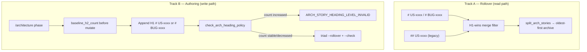
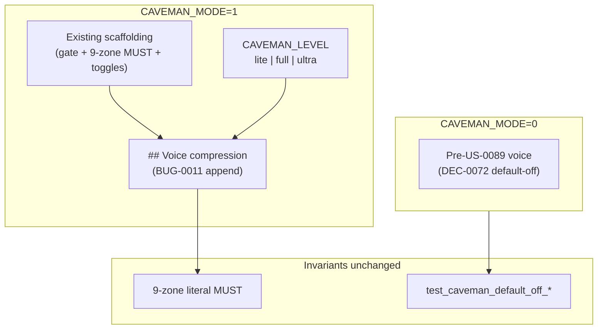
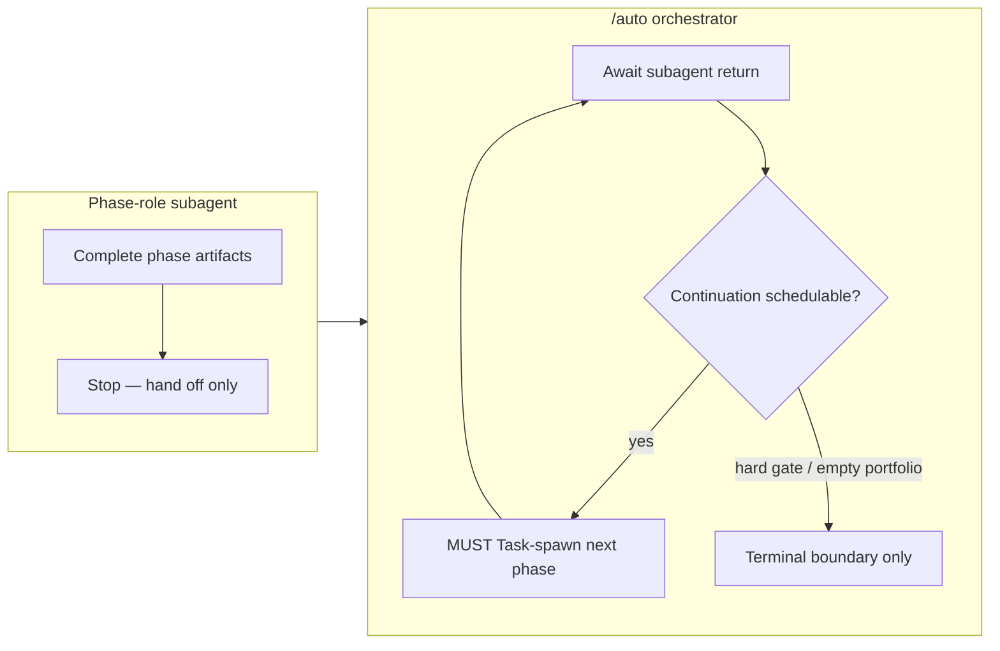

# BUG-0010: Dual-level architecture story headings and diff-gated H1 enforcement

## Overview

**`BUG-0010`** closes a triad archiver defect where `scripts/enforce-triad-hot-surface.py`
only recognizes H1 `# US-xxxx` story boundaries. Repos with H2 `## US-xxxx` sections hit
`STATE_ARCHIVE_BOUNDARY_AMBIGUOUS` when `architecture.md` exceeds `ARCH_HOT_MAX_LINES`
because `split_arch_stories` finds zero archivable chunks.

Binding decision: **`DEC-0076`**. Research anchor: **`R-0076`**. Open
`decisions/DEC-0076.md` for normative dual-level regex, H1-wins precedence, diff-gated
forward enforcement, and harness **§29A** contract.

## Dual-track fix diagram



## Minimal architecture

### A. Dual-level regex (DEC-0076 §1)

Replace monolithic `STORY_HEADING` with:

```text
STORY_HEADING_H1 = ^# (?:US|BUG)-\d{4}\s*[:\u2014\-].+$
STORY_HEADING_H2 = ^## US-\d{4}\s*[:\u2014\-].+$
```

### B. H1-wins merge algorithm (DEC-0076 §2)

1. Collect `(idx, story_id, level)` for all H1/H2 story-heading matches.
2. Drop H2 candidates whose `story_id` has any H1 in file.
3. Sort by `idx`; slice blocks between boundaries (unchanged rollover loop).

Kit-repo regression anchor: **26** H1 + **5** H2 (`US-0067`..`0070`, `US-0083` gate).

### C. Diff-gated forward enforcement (DEC-0076 §3–§4)

In-place extension of `enforce-triad-hot-surface.py`:

- `count_h2_story_headings(text)` — count `STORY_HEADING_H2` matches.
- `check_arch_heading_policy(after, baseline_h2_count)` — fail when count **increases**.
- `/architecture` step 9: capture baseline **before** append; run policy check **after** rollover.

**Reason codes**: `ARCH_STORY_HEADING_LEVEL_INVALID` (new); `STATE_ARCHIVE_BOUNDARY_AMBIGUOUS`
and `ARTIFACT_HOT_SURFACE_OVERSIZE` unchanged.

### D. Command contract (DEC-0076 §3, §6)

`.cursor/commands/architecture.md` (+ `template/`):

- Mandate H1 `# US-xxxx` for story sections; `# BUG-xxxx` for bug sections.
- Reference `ARCH_STORY_HEADING_LEVEL_INVALID` as non-suppressible stop token.
- Document baseline capture + heading policy check in triad gate step 9.

### E. Regression matrix + harness §29A (DEC-0076 §5)

| Surface | Requirement |
|---------|-------------|
| `enforce-triad-hot-surface.py --self-test` | Extend with `##`-only, mixed, idempotent, enforcement-delta, inner-`##` classes |
| `tests/auto_command_contract_test.py` | Add `test_bug0010_*` prefix subtests |
| `tests/run-tests.ps1` + `.sh` | New section **§29A** (`pytest -k bug0010` or equivalent) |
| `tests/fixtures/triad_arch_headings/` | Optional minimal fixtures (sprint may add) |

Existing triad harness block: **unchanged** (additive §29A only).

### F. Template parity inventory (DEC-0076 §6)

**Positive (active + `template/` byte-identical)**:

1. `scripts/enforce-triad-hot-surface.py`
2. `.cursor/commands/architecture.md` (H1 mandate + policy check text)
3. `docs/engineering/runbook.md` (triad subsection extension)

**Active-only**: `# BUG-0010`, test extensions, §29A harness wiring.

**No new** `check_intake_template_parity.py` scope.

### G. Operator docs (DEC-0076 §7)

Runbook triad subsection: legacy `## US-` rollover note + optional `##`→`#` normalization
guidance (verbatim in DEC-0076 §7).

## Risks (architecture-resolved)

| ID | Mitigation |
|----|------------|
| R1 Double-count H1+H2 | H1-wins filter (§B) |
| R2 Split on inner `##` | `## US-\d{4}` regex only (§A) |
| R3 Block legitimate subheadings | Diff-gated policy (§C) |
| R4 Template script drift | Byte-identical active + `template/` (§F) |
| R5 DEC-0054 §2 drift | Doc-only amendment (DEC-0076 §8) |

## AC traceability

| AC | Architecture anchor |
|----|---------------------|
| AC-1 `## US-` backward-compat rollover | §A, §B, §E |
| AC-2 H1 `# US-` non-regression | §A, §E |
| AC-3 Mixed-file H1-wins precedence | §B, §E |
| AC-4 Diff-gated enforcement | §C |
| AC-5 Command H1 mandate + parity | §D, §F |
| AC-6 Self-test + contract tests + §29A | §E |
| AC-7 `# BUG-` H1 rollover + script parity | §A, §F |
| AC-8 Operator runbook remediation | §G |

## Atomic task seeds (for `/sprint-plan`)

| # | Seed | AC | Surfaces |
|---|------|----|----------|
| 1 | Implement `STORY_HEADING_H1`/`H2` + H1-wins `split_arch_stories` merge | AC-1, AC-2, AC-3, AC-7 | `scripts/enforce-triad-hot-surface.py` + `template/scripts/` |
| 2 | Add `count_h2_story_headings` + `check_arch_heading_policy` + CLI hook | AC-4 | same script (active + `template/`) |
| 3 | Extend `--self-test` with dual-level fixture classes | AC-1, AC-2, AC-3, AC-6 | same script |
| 4 | Update `.cursor/commands/architecture.md` H1 mandate + policy step | AC-4, AC-5 | `.cursor/commands/` + `template/.cursor/commands/` |
| 5 | Contract tests `test_bug0010_*` in `auto_command_contract_test.py` | AC-5, AC-6 | tests active-only |
| 6 | Harness **§29A** in run-tests PS1/SH | AC-6 | tests active-only |
| 7 | Optional `tests/fixtures/triad_arch_headings/` minimal fixtures | AC-1, AC-3 | tests active-only |
| 8 | Runbook triad subsection — legacy `## US-` + remediation blurb | AC-8 | runbook active + `template/` |
| 9 | Architecture linkage assert (this section + DEC-0076 refs) | AC-5 | read-only check |

**Task count**: 9 seeds. `SPRINT_MAX_TASKS=12` — no auto-split expected.

## Related

- **`US-0072`** / **`DEC-0054`** — triad hot-surface compaction
- **`DEC-0043`** — artifact ownership (history-preserving appends)
- **`US-0017`** — template drift guard (script mirror)
- **`US-0061`** — cross-phase ownership
- **`R-0076`** — research anchor

# BUG-0011: Caveman voice-compression rules missing from caveman.mdc

## Overview

**`BUG-0011`** completes **US-0089** response-side Caveman delivery by appending
actionable voice-compression directives to `.cursor/rules/caveman.mdc`. **US-0089** /
**DEC-0072** shipped scaffolding only (gates, 9-zone literal invariant, toggles) —
with **`CAVEMAN_MODE=1`** replies stayed verbose because no rule text instructed
drop-filler, fragment, or level semantics.

Binding decision: **`DEC-0077`** (composes on **`DEC-0072`** — forward-link, no rewrite).
Research anchor: **`R-0077`**. Open `decisions/DEC-0077.md` for normative voice-section
outline, SHA bump policy, contract markers, and runbook extension.

**`# US-0089`** §6 cross-link amended (voice rules delivered here; qualitative brevity
remains operator-verified).

## Voice delivery diagram



## Minimal architecture

### A. Voice section append (DEC-0077 §2)

Append to **`.cursor/rules/caveman.mdc`** + **`template/.cursor/rules/caveman.mdc`**
(byte-identical pair). **Preserve** all pre-voice scaffolding verbatim.

**Locked section heading**:

```text
## Voice compression (when CAVEMAN_MODE=1)
```

**Subsections** (order normative — see **`DEC-0077`** §2 table):

1. `### Precedence` — voice rules override conflicting user-rule prose style when
   `CAVEMAN_MODE=1` (reply voice only).
2. `### Intensity levels` — `lite` / `full` / `ultra` table; kit-native examples.
3. `### Drop rules` — filler/hedging/fragments.
4. `### Auto-Clarity` — security/destructive/ambiguous pause + resume.
5. `### Persistence` — active every response while mode on.
6. `### Ultra and literal regions` — **pointer stub** to existing 9-zone MUST (no duplicate list).

### B. Level semantics (DEC-0077 §3)

| Level | Semantics |
|-------|-----------|
| `lite` | Drop filler; grammatical sentences |
| `full` | Drop articles; fragments OK |
| `ultra` | Abbreviate prose words only; literals byte-exact |

### C. SHA dual-layer + contract markers (DEC-0077 §4–§5)

1. Bump `_CAVEMAN_RULE_BASELINE_SHA256` in `test_caveman_compress_input_rule_byte_identity`
   to post-voice digest (pre-voice: `E10EFC32C628E790E69E2393F381108FE0B1F16E0BCDCFFFC162EFF6F91E47DE`).
2. Add nine `test_caveman_voice_*` subtests (token-presence; see **`DEC-0077`** §5).
3. **Do not modify** `test_caveman_default_off_*` bodies or non-substitution pinned sentence.

### D. Runbook extension (DEC-0077 §7)

Under **`### Caveman mode (US-0089)`** (active + `template/`):

- **`#### Voice compression levels`** — compact 2-row before/after table + pointer to rule file.
- **`### Caveman input compression (US-0090)`** — **untouched**.

### E. Harness §30A (DEC-0077 §6)

| Surface | Requirement |
|---------|-------------|
| `tests/run-tests.ps1` + `.sh` | New **§30A** — `Voice compression rule markers (BUG-0011)` |
| Scope | `pytest -k caveman_voice` (or equivalent prefix filter) |

Existing caveman harness sections: **unchanged**.

### F. Template parity inventory (DEC-0077 §9)

**Positive (byte-identical after voice delivery)**:

1. `.cursor/rules/caveman.mdc` ↔ `template/.cursor/rules/caveman.mdc`
2. `docs/engineering/runbook.md` ↔ `template/docs/engineering/runbook.md` (Caveman subsection only)

**Active-only**: `# BUG-0011`, `test_caveman_voice_*`, §30A, `# US-0089` §6 cross-link.

**No new** `check_intake_template_parity.py` scope.

## Risks (architecture-resolved)

| ID | Mitigation |
|----|------------|
| R1 US-0090 SHA break | Intentional baseline bump (§C) |
| R2 Literal garbling | Unchanged 9-zone MUST + ultra stub (§A.6) |
| R3 User-rule conflict | `### Precedence` (§A.1) |
| R4 Ultra abbreviates reason codes | Forbidden; stub defers to 9-zone (§A.6) |
| R5 Runbook drift | Summary table only; rule normative (§D) |
| R6 Pinned test regression | `test_caveman_default_off_*` bodies frozen (§C.3) |

## AC traceability

| AC | Architecture anchor |
|----|---------------------|
| AC-1 Voice section in `caveman.mdc` | §A, §B + **DEC-0077** §2–§3 |
| AC-2 Template byte parity | §F |
| AC-3 User-rule precedence | §A.1 + **DEC-0077** §2 |
| AC-4 Ultra/literal deferral stub | §A.6 + **DEC-0077** §2 |
| AC-5 `test_caveman_voice_*` + SHA bump | §C + **DEC-0077** §4–§5 |
| AC-6 Runbook voice levels | §D + **DEC-0077** §7 |
| AC-7 Default-off invariants preserved | §C.3 + **DEC-0077** §4 |
| AC-8 Harness §30A + operator UAT | §E + **DEC-0077** §6 |

## Atomic task seeds (for `/sprint-plan`)

| # | Seed | AC | Surfaces |
|---|------|----|----------|
| 1 | Append voice section to `caveman.mdc` per **DEC-0077** §2 outline (active + template byte-identical) | AC-1, AC-2, AC-3, AC-4 | `.cursor/rules/` + `template/.cursor/rules/` |
| 2 | Extend runbook `#### Voice compression levels` (2-row table + rule pointer) | AC-6 | runbook active + `template/` |
| 3 | Add nine `test_caveman_voice_*` subtests in `auto_command_contract_test.py` | AC-5 | tests active-only |
| 4 | Bump `_CAVEMAN_RULE_BASELINE_SHA256` in `test_caveman_compress_input_rule_byte_identity` | AC-5 | tests active-only |
| 5 | Harness **§30A** in `run-tests.ps1` + `.sh` | AC-8 | tests active-only |
| 6 | Regression guard — `test_caveman_default_off_*` bodies unchanged | AC-7 | tests active-only |
| 7 | Sprint UAT operator voice spot-check (`CAVEMAN_MODE=1` visibly shorter prose; literals intact) | AC-8 | UAT docs |
| 8 | Architecture linkage assert (this section + **DEC-0077** + `# US-0089` §6 cross-link) | AC-1 | read-only check |

**Task count**: 8 seeds. `SPRINT_MAX_TASKS=12` — no auto-split expected.

## Related

- **`US-0089`** / **`DEC-0072`** — scaffolding (composes, not rewritten)
- **`US-0090`** / **`DEC-0073`** — input compression (orthogonal)
- **`US-0088`** — non-suppressible gate vocabulary
- **`US-0017`** — template drift guard (`caveman.mdc` parity)
- **`R-0077`** — research anchor

---

# BUG-0012: Native-chain orchestrator compliance regression (post-US-0095)

## Overview

**`BUG-0012`** closes a **contract-vs-runtime gap** after **US-0095** / **DEC-0080** / **S0084** (released **2026-06-07**). Static **`test_us0095_*`** contract tests pass, but operators enabling **`AUTO_FLOW_MODE=full_autonomy`** + **`AUTO_BACKLOG_DRAIN=1`** observe orchestrator stops after every story segment with mandatory re-**`/auto`** prose despite schedulable drain-advance continuation.

**Root cause** (**`R-0083`**): orchestrator **agent compliance gap** — no executable continuation hook; residual **US-0088** Option B / **US-0092** outer-driver re-invoke prose primes turn-boundary stop; drain-advance **step 7** spawn skipped; **`native_chain_active`** reflects gate eligibility only.

Binding decision: **`DEC-0081`** (amends **`DEC-0080`** enforcement layer only). Research anchor: **`R-0083`**. **Not** re-litigation of **US-0095** intent.

## Assumption challenge and alternatives

| Option | Summary | Verdict |
|--------|---------|---------|
| A | **Strengthen orchestrator command-spec compliance** — explicit MUST Task-spawn mandate, demote Option B, negative contract tests, continuation-truth breadcrumbs | **Preferred** — minimal diff; preserves **DEC-0080** contract |
| B | **New stdlib hook/script** enforcing orchestrator loop at runtime | **Rejected** — Cursor has no hook for in-chat agent behavior; same compliance problem |
| C | **Re-open US-0095** as feature story | **Rejected** — feature delivered; this is regression fix |
| D | **Outer driver as IDE primary** (revert **DEC-0080**) | **Rejected** — contradicts operator expectation and **US-0095** closure |

## Orchestrator compliance contract (AC-1, AC-2, AC-3)

### Actor distinction (spawn-only preserved)



**Phase-role commands** correctly say "stop and require next phase in fresh subagent" — orchestrator **must not** treat that as run terminal when next phase or drain target is schedulable (**BUG-0006** unchanged: orchestrator schedules, never executes phase deliverables).

### Orchestrator continuation mandate

After foreground subagent completion, when **any** of (a) next intersected phase exists, (b) drain policy selects another OPEN story/bug, (c) relaxable stop within retry budget — orchestrator **MUST**:

1. **Task-spawn** next phase-role subagent (**US-0069** preflight).
2. **Not** emit mandatory re-**`/auto`**, **`auto_outer_driver.py`**, or **`segment exhausted`** terminal prose.
3. Increment **`outer_cycle_index`**; check **`AUTO_LOOP_MAX_CYCLES`**.

**Required doc literals**: **`orchestrator MUST Task-spawn`**, **`post-subagent continuation`**, **`phase-role stop is not run terminal`**.

### Native-chain precedence over US-0088 Option B (AC-2)

Under **`AUTO_FLOW_MODE=full_autonomy`** + IDE + Task available:

| Surface | Amendment |
|---------|-----------|
| **`auto.md`** § Continuous multi-phase (US-0088 matrix) | Native chain **must** continue in-chat — not "stop segment; operator may advance" |
| **`auto.md`** § Steps item 5 | Option B outer-driver equivalence scoped to **`NATIVE_CHAIN_UNAVAILABLE`** / headless/CI only |
| **`auto-orchestration-reference.md`** full-autonomy matrix | Outer-driver re-invoke row = **fallback** — not IDE-primary |

**Required doc literal**: **`native chain supersedes Option B`**.

### Drain-advance step 7 enforcement (AC-3)

Between **DEC-0080** algorithm steps **6** and **7**:

- **Forbidden**: operator wait, hand-off-to-operator prose, **`stop_reason=completed (segment exhausted)`** when `backlog_drain_stories_remaining_budget > 0` and eligible OPEN item exists.
- **Required**: immediate Task-spawn of first phase of next segment.
- **Attestation**: `drain_advance_action=spawned` in `state.md` boundary on successful advance.

## Continuation-truth breadcrumbs (AC-4)

Amend **DEC-0080** §3 breadcrumb semantics:

| Field | Semantics |
|-------|-----------|
| **`native_chain_active`** | Gate eligibility (**`full_autonomy`** + IDE + Task) — unchanged |
| **`native_chain_continuing`** | Orchestrator scheduled spawn/advance **this** boundary |
| **`drain_advance_action`** | `spawned` \| `skipped` \| `not_applicable` — step 7 outcome |

**Invariant**: `native_chain_continuing=true` ⇒ no mandatory re-**`/auto`** prose; `stop_reason` ≠ `completed (segment exhausted)` when continuation pending.

## Forbidden-prose negative enforcement (AC-5, AC-6)

**Negative grep scope**: **`auto.md`** + **`auto-orchestration-reference.md`** normative blocks under **`full_autonomy`** / native-chain sections.

| Forbidden pattern | Notes |
|-------------------|-------|
| Mandatory `re-run /auto` between drain segments | Includes operator-facing end-of-run templates |
| `segment exhausted` as terminal when continuation pending | Invalid under **`full_autonomy`** |
| Mandatory `run the outer driver` in IDE-primary path | Outer driver = **optional** / **fallback** only |
| Unqualified `python scripts/auto_outer_driver.py` | Must have **optional** / **fallback** qualifier |

**Preserved**: seven **`test_us0095_*`** subtests remain green — additive **`test_bug0012_*`** layer only.

## Contract tests (AC-5)

**Run**: `pytest -k bug0012 tests/auto_command_contract_test.py`

| Test | AC | Key assertions |
|------|-----|----------------|
| `test_bug0012_forbidden_drain_stop_prose_negative_grep` | AC-5, AC-6 | Negative grep forbidden patterns in native-chain + full_autonomy blocks |
| `test_bug0012_orchestrator_post_subagent_spawn_mandate` | AC-1 | **`orchestrator MUST Task-spawn`** after subagent return when schedulable |
| `test_bug0012_drain_advance_step7_no_stop_between_6_and_7` | AC-3 | Step 6→7 immediate spawn — no operator stop between |
| `test_bug0012_native_chain_precedence_over_option_b` | AC-2 | Native chain primary supersedes US-0088 Option B under **`full_autonomy`** |

## `resume_brief` + reference alignment (AC-7)

**DEC-0069** pairing contract: orchestrator **MUST Task-spawn** next phase — **`/auto`** is orchestrator context label, not operator re-invocation instruction.

**Touch surfaces**: `handoffs/resume_brief.md` template pairing lines; reference drain-advance + continuation sections.

## Operator E2E recipe (AC-8)

Runbook § **BUG-0012 regression verify**:

1. Scratchpad: **`AUTO_FLOW_MODE=full_autonomy`**, **`AUTO_BACKLOG_DRAIN=1`**, **`AUTO_BACKLOG_MAX_STORIES≥2`**, **`AUTO_QUIET=1`**.
2. Backlog: **≥2 OPEN stories**.
3. Single **`/auto`** in Cursor IDE Agent panel.
4. Complete **story A** through **`refresh-context`**.
5. **Pass**: orchestrator drain-advances to **story B** first phase **without** operator re-**`/auto`** and **without** forbidden terminal prose.
6. Evidence: `state.md` shows `drain_advance_action=spawned`, `native_chain_continuing=true`; `resume_brief` top pointer advances `story_id`.

## Template parity (AC-8)

**Touch inventory** (6 surfaces): `auto.md` (+ template), reference excerpts (+ template), `resume_brief` pairing contract, contract tests, architecture `# BUG-0012`, runbook E2E subsection (+ template).

**Parity scope**: `--scope=bug-0012`.

## Non-goals

- Weakening **BUG-0006** spawn-only or **DEC-0078** hard gates.
- Removing outer driver (optional fallback preserved).
- Changing **US-0096** delivery modes.
- Modifying **DEC-0038** strict-proof tuple schema (additive breadcrumb fields only).

## Risks

| Risk | Mitigation |
|------|------------|
| **R1** Doc fix passes tests; runtime still stops | Operator E2E recipe + `native_chain_continuing` attestation |
| **R2** Over-broad edits relax hard gates | Explicit **DEC-0078** unchanged assertion in contract tests |
| **R3** Phase-role vs orchestrator conflation | Actor distinction diagram + mandate literals |
| **R4** **AUTO_QUIET=1** messaging ambiguity | Scheduling independent of quiet; forbidden wait prose |
| **R5** Cursor spawn depth | **`NATIVE_CHAIN_UNAVAILABLE`** unchanged |

## AC traceability

| AC | Architecture anchor |
|----|---------------------|
| AC-1 Orchestrator MUST Task-spawn mandate | § Orchestrator compliance contract |
| AC-2 Native chain precedence over Option B | § Native-chain precedence |
| AC-3 Drain-advance step 7 no-stop | § Drain-advance step 7 enforcement |
| AC-4 Continuation-truth breadcrumbs | § Continuation-truth breadcrumbs |
| AC-5 Four `test_bug0012_*` contract tests | § Contract tests |
| AC-6 Forbidden-prose negative grep | § Forbidden-prose negative enforcement |
| AC-7 `resume_brief` spawn wording | § `resume_brief` + reference alignment |
| AC-8 Runbook multi-segment E2E + parity | § Operator E2E recipe; § Template parity |

## Atomic task seeds (for `/sprint-plan`)

| # | Seed | AC | Surfaces |
|---|------|----|----------|
| 1 | Add orchestrator-only **MUST Task-spawn** continuation block to `auto.md` — actor distinction, post-subagent loop, forbidden turn-boundary stop | AC-1 | `.cursor/commands/auto.md` + template |
| 2 | Scope US-0088 matrix + Steps Option B to **`NATIVE_CHAIN_UNAVAILABLE`** / headless only; add **`native chain supersedes Option B`** literal | AC-2 | `auto.md`, reference active + template |
| 3 | Harden drain-advance algorithm — no operator stop between steps 6–7; `drain_advance_action` attestation docs | AC-3, AC-4 | reference, `auto.md`, `state.md` breadcrumb comments |
| 4 | Add `native_chain_continuing` + `drain_advance_action` to state boundary field docs and resume_brief pairing spawn wording | AC-4, AC-7 | reference, `resume_brief` template, `auto.md` |
| 5 | Implement four **`test_bug0012_*`** contract subtests + `pytest -k bug0012` green | AC-5 | `tests/auto_command_contract_test.py` |
| 6 | Negative grep forbidden drain-stop prose across full_autonomy normative blocks | AC-6 | contract tests (subtest 1), `auto.md`, reference |
| 7 | Runbook § **BUG-0012 regression verify** — multi-segment operator E2E recipe | AC-8 | `runbook.md` + template |
| 8 | Template parity `--scope=bug-0012`; preserve all **`test_us0095_*`** green; architecture + DEC linkage assert | AC-8 | template mirrors, parity script, read-only assert |

**Task count**: 8 seeds. `SPRINT_MAX_TASKS=12` — no auto-split expected.

## Decision linkage

- Decision: **`DEC-0081`**
- Amends: **`DEC-0080`**
- Research: **`R-0083`**
- Composed: **`DEC-0078`**, **`BUG-0006`**, **`DEC-0069`**, **`DEC-0038`**, **`US-0095`**
- Related: **`US-0088`**, **`US-0092`**, **`US-0044`**, **`R-0081`**

# BUG-0015 — OpenCode `/auto` plugin dispatch attach (compose US-0124/US-0125)

## Overview

**`BUG-0015`** closes the **interactive `/auto` → plugin spawn linkage gap** on the OpenCode host. US-0124 shipped `spawnPhase` + write-guard + stop-matrix subprocess; US-0125 shipped dispatch-only `.opencode/commands/auto.md`. Runtime defect: `setup()` returns the API and registers only `ctx.tool.hook("execute.before")` — **no host-invoked entry** starts the spawn loop when the operator runs `/auto`, so the thin command stops at `STOP`.

**Research anchor**: **`R-0114`** (DQ1–DQ7 LOCKED). **Companion DEC**: **none** — Q7 / DQ7 additive; cite **R-0114** + compose **DEC-0124** / **DEC-0125** without amending Accepted bodies. **Out of scope**: BUG-0016 permissions; US-0131/US-0132; DEC-0122 matrix; Cursor Task port; TS stop-matrix rewrite; live OpenCode CI probe.

**Fresh context marker**: `tl-BUG0015-architecture-20260906T142000Z-fresh`
**Orchestrator run id**: `auto-20260906-bug0015`
**Timestamp**: 2026-09-06T14:20:00Z (UTC)
**Verdict**: PASS
**Next**: `/sprint-plan`

## Approach locked (A* — from R-0114 DQ1–DQ7)

**Approach A\*** (locked): In `setup(ctx)`, register v2 **`ctx.command.transform`** → **`editor.add({ name: "auto", execute })`** as the **primary** host-invoked entry. `execute` calls shared internal **`runAutoLifecycle`**, which owns the in-flight mutex, first-phase selection (kit selectors), `spawnPhase` + `dispatchStopMatrix` loop, and IsolationEvidence durable write. Defense: optional `ctx.event.subscribe` / `command.executed` for `name === "auto"` — secondary only, mutex-guarded. Missing attach surface → fail-closed **`OPENCODE_PLUGIN_DISPATCH_ATTACH_UNSUPPORTED`**. Missing `session.create` → existing **`OPENCODE_PLUGIN_SPAWN_UNSUPPORTED`**. Concurrent/re-entrant `/auto` → **`OPENCODE_AUTO_ALREADY_RUNNING`**. Thin `auto.md` stays STOP-only (DEC-0125 DQ5). Additive `test_bug0015_*` (7 markers); do not amend `test_us0124_*` / `test_us0125_*`.

| Option | Summary | Verdict |
|--------|---------|---------|
| **A\*** | **`command.transform` + `editor.add({ name: "auto", execute })` → `runAutoLifecycle` → `spawnPhase` loop; fail-closed attach/mutex codes; additive tests; cite R-0114** | **Preferred** — minimal compose gap fix; preserves DEC-0124/0125 |
| A2 (rejected) | Agent-prompt-only dispatch ("plugin owns spawn" prose as sole entry) | **Rejected** — success test (a) / BUG-0006; model can ignore prompt |
| A3 (rejected) | Rely on exported `spawnPhase` from `setup()` return alone | **Rejected** — current defect; host never invokes export |
| A4 (rejected) | Primary = `command.executed` event only | **Rejected** — R2 race after STOP; transform `execute` owns start |
| A5 (rejected) | Amend DEC-0124/DEC-0125 bodies | **Rejected** — DQ7 additive; Accepted DECs compose-only |
| A6 (rejected) | OpenCode-only first-phase resolver in TS | **Rejected** — DQ3; compose argv / resume_brief / scratchpad / US-0087 |

## Deferred closures (R-0114 + research critic CF1–CF7) — LOCKED here

| ID | Deferred item | Architecture lock |
|----|---------------|-------------------|
| CF1 / DQ1 | markdown `auto.md` vs `editor.add({ name: "auto" })` precedence | **Transform owns execute.** Thin `auto.md` remains STOP-only discoverability + `agent: auto` binding; it must **not** dual-fire spawn. If host also emits `command.executed`, secondary handler is mutex-gated (second entry → `OPENCODE_AUTO_ALREADY_RUNNING`). No spawn literals in `auto.md`. |
| CF2 / DQ5 | IsolationEvidence durable write helper | **Python subprocess bridge** appends IsolationEvidence tuple into `docs/engineering/state.md` (US-0048 / DEC-0029 SOT). Prefer thin helper or extend existing driver argv — **not** `ctx.storage` as durable SOT. Plugin returns evidence; Python persists. |
| CF3 / DQ3 | resume_brief / first-phase parse helper | **Python subprocess** (kit selectors via existing artifacts / driver) — **no** OpenCode-only TS resolver. Order: argv → resume_brief → scratchpad → US-0087 bug-queue (mutex `AUTO_SCHEDULER_CONFLICT` unchanged). |
| CF4 | Shared lifecycle entry name | **`runAutoLifecycle`** — single internal entry for interactive transform `execute` and headless `invokeHeadless` compose path. |
| CF5 / R3 | In-flight mutex TTL / clear-on-idle | Clear flag on loop exit (success or fail-closed). Safety TTL = **7200s** (2h) or earlier clear when `session.wait` completes / idle. Crash-left flag → TTL expiry allows re-entry. |
| CF6 / R2 | Primary vs secondary attach | **Primary = `command.transform` `execute`.** `command.executed` / subscribe = defense only. |
| CF7 / DQ7 | Companion DEC vs cite R-0114 | **No companion DEC.** Architecture `# BUG-0015` cites **R-0114**; DEC-0124/0125 bodies UNCHANGED. |

## Components

### Dispatch attach (DQ1 — AC-1, AC-2)

```ts
// inside setup(ctx) — additive alongside existing tool.hook write-guard
await ctx.command.transform((editor) => {
  editor.add({
    name: "auto",
    description: "its-magic auto: orchestrator dispatch entry (spawn-only).",
    execute: async ({ sessionID, prompt, delivery }) => {
      return runAutoLifecycle(ctx, { orchestratorSessionId: sessionID, prompt, delivery });
    },
  });
});
```

- If `ctx.command.transform` unavailable **and** no usable event subscribe attach → emit **`OPENCODE_PLUGIN_DISPATCH_ATTACH_UNSUPPORTED`**, stop `/auto`.
- Do **not** treat returning `{ spawnPhase }` from `setup()` as attach.

### Single-owner spawn + shared lifecycle (DQ2, DQ4)

- **Single owner = plugin** (`runAutoLifecycle` → `spawnPhase` → `dispatchStopMatrix`).
- Exported `spawnPhase` remains unit-testable + headless-callable; not host-auto-invoked alone.
- Write-guard `tool.hook("execute.before")` stays composed (DEC-0124 DQ8) — attach is additive.
- In-flight mutex: second interactive/headless overlap → **`OPENCODE_AUTO_ALREADY_RUNNING`** (distinct from `AUTO_SCHEDULER_CONFLICT`).

### First-phase selection (DQ3)

Compose kit selectors via Python bridge — do not invent OpenCode-only resolver (see CF3).

### Isolation evidence (DQ5)

Minimum fields: `parentID`, `sessionID`, `role`, `phase_id`, `timestamp`, `fresh_context_marker` with `sessionID !== parentID`. Null/throw/identical-id → **`OPENCODE_SUBTASK_IGNORED`**. Durable write per CF2.

### Reason codes (additive vocabulary — stub only; US-0126 owns full table)

| Code | When |
|------|------|
| `OPENCODE_PLUGIN_DISPATCH_ATTACH_UNSUPPORTED` | No usable `/auto` attach surface |
| `OPENCODE_AUTO_ALREADY_RUNNING` | Concurrent/re-entrant `/auto` while loop in-flight |
| `OPENCODE_PLUGIN_SPAWN_UNSUPPORTED` | `session.create` missing (unchanged DEC-0124) |
| `OPENCODE_SUBTASK_IGNORED` | null/throw/identical-id (unchanged) |

### Contract tests (DQ6 — additive; 7 markers)

Preferred: `tests/bug0015_contract_test.py` (+ optional mock-ctx extension). Do **not** amend `test_us0124_*` / `test_us0125_*`.

| # | Marker | Asserts |
|---|--------|---------|
| 1 | `test_bug0015_command_transform_registers_auto` | `setup` registers transform / `editor.add({ name: "auto" })` |
| 2 | `test_bug0015_auto_execute_invokes_spawn_phase` | mock execute → `session.create` with parentID/agent |
| 3 | `test_bug0015_missing_attach_fail_closed` | no attach → `OPENCODE_PLUGIN_DISPATCH_ATTACH_UNSUPPORTED` |
| 4 | `test_bug0015_missing_session_create_fail_closed` | attach ok, create missing → `OPENCODE_PLUGIN_SPAWN_UNSUPPORTED` |
| 5 | `test_bug0015_concurrent_reentry_fail_closed` | second `/auto` → `OPENCODE_AUTO_ALREADY_RUNNING` |
| 6 | `test_bug0015_auto_md_dispatch_only_static` | `auto.md` ≤20 lines; no spawn literals |
| 7 | `test_bug0015_compose_us0124_spawn_api_unchanged` | existing `spawnPhase` / reason-code exports present (read-only) |

## Touch surfaces (execute)

| Surface | Change |
|---------|--------|
| `.opencode/plugins/orchestrator.ts` + `template/.opencode/plugins/orchestrator.ts` | Attach + `runAutoLifecycle` + mutex + reason codes + isolation write bridge |
| `.opencode/commands/auto.md` (+ template) | Keep STOP-only; no spawn literals (static assert) |
| `tests/bug0015_contract_test.py` (+ template mirror / mock-ctx additive) | 7 markers |
| `docs/engineering/runbook.md` (+ template) | Optional BUG-0015 h3 stub for new reason codes (US-0126 full table unchanged ownership) |
| Python isolation / resume helper (thin) | Durable IsolationEvidence + first-phase selection bridge |

## Non-goals

- BUG-0016 Layer-1 permission matrix / DEC-0122 amend
- US-0131 / US-0132 config/model parity
- Amending DEC-0124 / DEC-0125 bodies
- Cursor Task-loop port / TS stop-matrix rewrite
- Live OpenCode runtime probe in CI

## Risks

| Risk | Severity | Mitigation |
|------|----------|------------|
| R1 markdown vs transform dual-fire | MEDIUM → LOW | CF1 lock + mutex + marker 5/6 |
| R2 `command.executed` after STOP race | MEDIUM → LOW | CF6 primary = transform execute |
| R3 mutex false-positive after crash | LOW | CF5 clear-on-exit + 7200s TTL |
| R4 reason-code stub drift vs US-0126 | LOW | stub + cross-link only |
| R5 BUG-0016 still blocks validators post-fix | LOW | expected; out of scope |

## AC coverage mapping (bug acceptance + R-0114)

| AC / expected slice | Architecture anchor | Seeds |
|---------------------|---------------------|-------|
| AC-1 `/auto` starts plugin spawn loop via host attach | § Dispatch attach; approach A* | T-001, T-002 |
| AC-2 Missing attach fail-closed `OPENCODE_PLUGIN_DISPATCH_ATTACH_UNSUPPORTED` | § Reason codes; marker 3 | T-001, T-005 |
| AC-3 Missing `session.create` → `OPENCODE_PLUGIN_SPAWN_UNSUPPORTED` (compose) | § Single-owner; marker 4 | T-002, T-005 |
| AC-4 IsolationEvidence + `OPENCODE_SUBTASK_IGNORED` + state.md SOT | § Isolation evidence; CF2 | T-003, T-005 |
| AC-5 Concurrent `/auto` → `OPENCODE_AUTO_ALREADY_RUNNING` | § Mutex CF5; marker 5 | T-002, T-005 |
| AC-6 `auto.md` remains dispatch-only (≤20 lines, no spawn) | § Non-goals / marker 6 | T-004, T-005 |
| AC-7 Compose US-0124 spawn API unchanged | § Approach A*; marker 7 | T-anch, T-005 |
| AC-8 Seven additive `test_bug0015_*` green (mock-ctx; no live probe) | § Contract tests | T-005 |

Acceptance checkbox: `docs/product/acceptance.md` BUG-0015 row remains unchecked until closure (US-0045).

## Atomic task seeds (for `/sprint-plan`)

| # | Seed | AC | Surfaces |
|---|------|----|----------|
| T-anch | Verify `# BUG-0015` H1 + approach A* + R-0114 DQ1–DQ7 + no DEC-0124/0125 body amend + CF1–CF7 closed | AC-7 | architecture.md (read-only), R-0114 |
| T-001 | Register `command.transform` / `editor.add({ name: "auto", execute })`; missing attach → `OPENCODE_PLUGIN_DISPATCH_ATTACH_UNSUPPORTED`; secondary event optional + mutex | AC-1, AC-2 | `orchestrator.ts` active + template |
| T-002 | Implement `runAutoLifecycle` + in-flight mutex (TTL 7200s / clear-on-exit) + call `spawnPhase` / `dispatchStopMatrix` loop; wire headless compose path | AC-1, AC-3, AC-5 | `orchestrator.ts` active + template |
| T-003 | IsolationEvidence durable write via Python bridge to state.md; first-phase selection via Python (argv → resume_brief → scratchpad → US-0087) | AC-4 | plugin + thin Python helper / driver argv |
| T-004 | Keep `auto.md` STOP-only (active + template); no spawn literals | AC-6 | `.opencode/commands/auto.md` + template |
| T-005 | Add 7 `test_bug0015_*` markers + mock-ctx harness extension; do not amend us0124/us0125 tests | AC-2..AC-8 | `tests/bug0015_contract_test.py` (+ template) |
| T-006 | Runbook h3 stub for two new reason codes; cross-link US-0126; optional parity scope `bug-0015` | AC-2, AC-5 | runbook.md + template |

**Task count**: 7 seeds (T-anch + T-001..T-006). `SPRINT_MAX_TASKS=12` — no auto-split. Suggest `/quick` only if execute reduces to attach-only one-liner (not expected).

## Decision linkage

- Decision: **none** (companion DEC not required — cite **R-0114**)
- Compose (do not amend): **DEC-0124**, **DEC-0125**, **DEC-0069**, **DEC-0051** / **US-0069**, **DEC-0078** / **US-0092**, **US-0048** / **BUG-0006**
- Research: **R-0114** (composes **R-0109**)
- Related: **US-0124**, **US-0125**, **BUG-0016** (out of scope), **US-0126** (full reason-code table)

# BUG-0016 — OpenCode Layer-1 permissions vs kit duties (amend DEC-0122 §2)

## Overview

**`BUG-0016`** closes the **Layer-1 permission matrix vs kit phase-duty gap** on the OpenCode host. US-0122 / DEC-0122 §2 shipped a host-enforced matrix that matches agent frontmatter literally, but blocks required lifecycle validators and owned writes: `po`/`tech-lead`/`curator` `bash: deny`; PO missing intake_evidence / resume_brief / state.md edit allows; literal `sprints/Sxxxx/` globs that never match real sprint ids; release missing duty paths (`release-findings`, `verify-work-to-release`, state/resume_brief/runbook).

**Research anchor**: **`R-0115`** (DQ1–DQ8 LOCKED). **Companion DEC**: **none** — amend **`DEC-0122` §2 in place** as sole matrix SOT (R-0115 DQ6; reject thin DEC-0130 as second matrix). **Out of scope**: reopening US-0122 as a feature story; US-0131/US-0132; amending DEC-0124/0125 unless execute proves Layer-1∩write-guard double-deny; live OpenCode CI probe; bash:`allow`; Cursor Task port.

**Fresh context marker**: `tl-BUG0016-architecture-20260906T184500Z-fresh`
**Orchestrator run id**: `auto-20260906-bug0016`
**Timestamp**: 2026-09-06T18:45:00Z (UTC)
**baseline_h2_count (pre-mutate)**: `0`
**Verdict**: PASS
**Next**: `/sprint-plan`

## Approach locked (A* — from R-0115 DQ1–DQ8)

**Approach A\*** (locked): **Amend DEC-0122 §2** matrix + ship matching **active + template** `.opencode/agents/*.md` frontmatter (byte-identical parity). Bash: `po`/`tech-lead`/`curator` → `"ask"` (reject `"allow"`; object-form bash YAGNI). PO edit adds `handoffs/intake_evidence/**`, `handoffs/resume_brief.md`, `docs/engineering/state.md`. Replace all permission-key `sprints/Sxxxx/…` with `sprints/S*/…`. Release adds `sprints/S*/release-findings.md`, `handoffs/verify-work-to-release.md`, `docs/engineering/state.md`, `handoffs/resume_brief.md`, `docs/engineering/runbook.md` (keep `verify_to_release.md`). Preserve **deny-last** + **success test (c)** (no production/code allow for non-dev). Amend `test_us0122_*` expectations + add **7** additive `test_bug0016_*`. `security`/`auto` unchanged. Layer-1 ∩ plugin write-guard remain conjunctive (DQ8).

| Option | Summary | Verdict |
|--------|---------|---------|
| **A\*** | **Amend DEC-0122 §2 sole SOT + agent frontmatter parity; bash ask; real path globs; 7 static markers; success test (c) preserved** | **Preferred** — minimal duty unblock; R-0115 DQ1–DQ8 |
| A2 (rejected) | `bash: allow` for po/tl/curator | **Rejected** — removes operator prompt; D1/DQ1 |
| A3 (rejected) | Thin companion DEC-0130 as second matrix (or audit DEC that duplicates table) | **Rejected** — R-0115 DQ6 / critic subtractor YAGNI; amend-in-place only |
| A4 (rejected) | `sprints/S[0-9]*/…` or leave `Sxxxx` in permission keys | **Rejected** — OpenCode has no char classes; `Sxxxx` never matches |
| A5 (rejected) | Amend DEC-0124/DEC-0125 bodies preemptively | **Rejected** — DQ8; only if execute proves double-deny |
| A6 (rejected) | New permission middleware / runtime harness in CI | **Rejected** — static harness only; no live probe |

## Critic NB closures (research `b0016rs-*` architecture carry-forwards) — LOCKED here

| ID | Carry-forward | Architecture lock |
|----|---------------|-------------------|
| CF1 / R1 | OpenCode docs catch-all-first vs kit deny-last | **Preserve deny-last.** Document divergence in DEC-0122 §2 + this section; do not flip global order. |
| CF2 / DQ5 | release `runbook.md` allow vs US-0126 ownership | **ALLOW confirmed** — `.cursor/commands/release.md` lists `docs/engineering/runbook.md` as writable derived/ops surface. US-0126 still owns full runbook prose; Layer-1 allow does not transfer ownership. |
| CF3 / DQ8 | Layer-1 ∩ write-guard double-deny | Seed **T-007** execute verify; no DEC-0124/0125 amend unless proven. |
| CF4 / DQ6 | Optional thin DEC-0130 | **None** — amend DEC-0122 §2 only. |
| CF5 | active↔template parity | Gate in T-006 (`test_bug0016_active_template_agent_parity` / opencode-adapter scope). |

## Components

### Amended Layer-1 matrix (normative table = DEC-0122 §2)

Execute ships frontmatter to match the amended DEC table. Delta vs pre-BUG-0016:

| Agent | bash | edit adds / changes |
|-------|------|---------------------|
| po | deny→**ask** | +`handoffs/intake_evidence/**`, +`handoffs/resume_brief.md`, +`docs/engineering/state.md` |
| tech-lead | deny→**ask** | `sprints/Sxxxx/…`→`sprints/S*/…` |
| curator | deny→**ask** | (edit set unchanged) |
| dev | ask (unchanged) | `Sxxxx`→`S*` |
| qa | ask (unchanged) | `Sxxxx`→`S*` |
| release | ask (unchanged) | +`sprints/S*/release-findings.md`, +`verify-work-to-release.md`, +`state.md`, +`resume_brief.md`, +`runbook.md` |
| security | ask + edit deny | unchanged |
| auto | deny + task allowlist | unchanged |

### Contract tests (DQ7 — 7 markers)

Preferred: `tests/bug0016_contract_test.py` (+ template / parity). **Amend** `tests/us0122_contract_test.py` expectations to the new matrix (SOT alignment). Do **not** invent a live OpenCode probe.

| # | Marker | Asserts |
|---|--------|---------|
| 1 | `test_bug0016_po_tl_curator_bash_ask` | po/tech-lead/curator `bash == ask` (not deny/allow) |
| 2 | `test_bug0016_po_intake_resume_state_allows` | PO edit allows intake_evidence/**, resume_brief.md, state.md; `**` deny last; no scripts/** allow |
| 3 | `test_bug0016_sprint_globs_are_s_star_not_sxxxx` | tech-lead/dev/qa/release sprint keys use `sprints/S*/`; `Sxxxx` absent from permission keys |
| 4 | `test_bug0016_release_duty_paths` | release allows release-findings, verify-work-to-release, state.md, resume_brief.md, runbook.md |
| 5 | `test_bug0016_success_test_c_non_dev_no_production_allow` | non-dev: no production/code allow; object-form edit keeps `**` deny last |
| 6 | `test_bug0016_security_auto_unchanged` | security edit deny + bash ask; auto edit/bash deny + 7-role task allow + `*` deny last |
| 7 | `test_bug0016_active_template_agent_parity` | eight agents byte-identical active↔template (or parity scope) |

### Compose / defense-in-depth (DQ8)

- Layer-1 (host frontmatter) ∧ Layer-2 (plugin `tool.hook("execute.before")` write-guard per DEC-0124) — both must allow.
- BUG-0015 DONE = compose note only (spawn path may work); this bug remains permissions-only.

## Touch surfaces (execute)

| Surface | Change |
|---------|--------|
| `decisions/DEC-0122.md` §2 | **Amended in THIS architecture phase** (sole SOT) — execute must not regress |
| `.opencode/agents/{po,tech-lead,dev,qa,release,curator}.md` + `template/.opencode/agents/` peers | Frontmatter parity to amended matrix (`security`/`auto` unchanged) |
| `tests/us0122_contract_test.py` | Expectation realign to amended §2 |
| `tests/bug0016_contract_test.py` (+ template mirror if required) | 7 markers |
| Plugin write-guard (read-only verify) | Confirm no re-deny of duty globs; amend DEC-0124/0125 only if proven |

## Non-goals

- Companion DEC-0130 / second matrix SOT
- Reopening US-0122 as a feature story / DONE acceptance rewrite
- US-0131 / US-0132 config/model parity
- `bash: allow` for any role
- Live OpenCode runtime probe in CI
- Preemptive DEC-0124/0125 body amend

## Risks

| Risk | Severity | Mitigation |
|------|----------|------------|
| R1 deny-last vs OpenCode docs order | MEDIUM → LOW | CF1: preserve deny-last; document divergence |
| R2 `sprints/S*` breadth | LOW | Kit naming; marker 3 |
| R3 Plugin write-guard double-deny | LOW | CF3 / T-007 |
| R4 Companion DEC second SOT | LOW | CF4: no DEC-0130 |
| R5 us0122_* expectation churn | LOW | Intentional SOT realign + additive bug0016_* |

## AC coverage mapping (bug acceptance + R-0115)

| Expected slice | Architecture anchor | Seeds |
|----------------|---------------------|-------|
| bash ask for po/tl/curator | Approach A*; matrix delta | T-001, T-002, T-006(m1) |
| PO intake_evidence + resume_brief + state.md | DQ2; marker 2 | T-001, T-006 |
| Sprint globs `S*` not `Sxxxx` | DQ3; marker 3 | T-002, T-003, T-006 |
| Release duty paths complete | DQ5 / CF2; marker 4 | T-004, T-006 |
| Success test (c) preserved | Ordering + marker 5 | T-anch, T-005, T-006 |
| security/auto unchanged | marker 6 | T-anch, T-006 |
| active↔template parity | CF5; marker 7 | T-001..T-004, T-006 |
| DEC-0122 §2 sole SOT amend | Approach A*; CF4 | T-anch, T-005 |
| Layer-1 ∩ write-guard | DQ8 / CF3 | T-007 |

Acceptance checkbox: `docs/product/acceptance.md` BUG-0016 row remains unchecked until closure (US-0045).

## Atomic task seeds (for `/sprint-plan`)

| # | Seed | Surfaces |
|---|------|----------|
| T-anch | Verify `# BUG-0016` H1 + DEC-0122 §2 amended (sole SOT) + approach A* + R-0115 DQ1–DQ8 + CF1–CF5 closed + no DEC-0130 + success test (c) prose intact | architecture.md, `decisions/DEC-0122.md` (read-only verify) |
| T-001 | Amend `po.md` active+template: `bash: ask`; add intake_evidence/**, resume_brief.md, state.md; `**` deny last | `.opencode/agents/po.md` + template |
| T-002 | Amend `tech-lead.md` + `curator.md`: `bash: ask`; tech-lead `Sxxxx`→`S*` for sprint.md/tasks.md | active + template |
| T-003 | Amend `dev.md` + `qa.md`: sprint keys `Sxxxx`→`S*` | active + template |
| T-004 | Amend `release.md`: +release-findings, +verify-work-to-release, +state.md, +resume_brief.md, +runbook.md; keep verify_to_release | active + template |
| T-005 | Amend `tests/us0122_contract_test.py` expectations to amended §2 matrix | us0122_contract_test.py (+ template if paired) |
| T-006 | Add 7 `test_bug0016_*` markers + active↔template parity gate | `tests/bug0016_contract_test.py` (+ template) |
| T-007 | DQ8: verify plugin write-guard does not re-deny duty globs for owning roles; document only; amend DEC-0124/0125 **only if** contradiction proven | orchestrator write-guard (read/verify) |

**Task count**: 8 seeds (T-anch + T-001..T-007). `SPRINT_MAX_TASKS=12` — no auto-split. Not `/quick` (multi-file matrix + dual test surfaces).

## Decision linkage

- Decision: **DEC-0122** (Accepted — **§2 amended in THIS phase** by BUG-0016; sole matrix SOT)
- Companion DEC: **none** (DEC-0130 rejected)
- Compose (do not amend unless T-007 proves): **DEC-0124**, **DEC-0125**, **DEC-0069**, **US-0078** / **US-0079**, **US-0126** (runbook prose ownership)
- Research: **R-0115** (composes **R-0109**)
- Related: **US-0122**, **BUG-0015** (DONE compose-note only), **US-0131** / **US-0132** (out of scope)

## Isolation evidence (US-0048 / DEC-0029)

- `phase_id=architecture`, `role=tech-lead`, `bug_id=BUG-0016`, `sprint_id=none`, `orchestrator_run_id=auto-20260906-bug0016`
- `delivery_mode=ultra_lean`, `macro_phase=plan`
- `fresh_context_marker=tl-BUG0016-architecture-20260906T184500Z-fresh`, `timestamp=2026-09-06T18:45:00Z`
- Narrow-read: R-0115; BUG-0016 backlog/acceptance; DEC-0122 §2; `# BUG-0015` template; critic `b0016rs-*`; architecture heading policy
- No agent frontmatter mutation in this phase (execute owns); no DONE flip; acceptance unchecked

## Strict runtime proof

- `runtime_proof_id=rp-auto-20260906-bug0016-architecture-techlead-20260906T184500Z-BUG-0016`
- Canonical payload: `{"delivery_mode":"ultra_lean","macro_phase":"plan","model_id":"composer-2.5","orchestrator_run_id":"auto-20260906-bug0016","phase_id":"architecture","proof_issued_at":"2026-09-06T18:45:00Z","proof_ttl_seconds":3600,"role":"tech-lead","runtime_proof_id":"rp-auto-20260906-bug0016-architecture-techlead-20260906T184500Z-BUG-0016","sprint_id":"none","story_id":"BUG-0016"}`
- `proof_hash=7AC851CDF1953594365AFF11B015BFD850E737F75A327FA2A02B1CCB544D5A31`
- `proof_ttl=2026-09-06T19:45:00Z`

# BUG-0017 — OpenCode pack CRLF / LF normalization (Linux slash commands)

## Overview

**`BUG-0017`** restores Linux OpenCode recognition of its-magic slash commands (`/auto`, `/intake`, peers) by ensuring kit OpenCode pack text ships **LF-only**. Root cause: CRLF in `.opencode/commands/*.md` YAML frontmatter breaks OpenCode `parseOption` (empty → silent skip). Same failure class as **BUG-0008** (manifest CRLF), different surface (OpenCode pack markdown/TS/JSON).

**Research anchor**: **`R-0118`** (DQ1–DQ6 LOCKED). **Companion DEC**: **none** — compose **BUG-0008** / **US-0084** / **DEC-0120**; cite **R-0118**. **Out of scope**: OpenCode host parser CR-strip; repo-wide `*.md eol=lf`; installer EOL rewrite; BUG-0015/BUG-0016 reopen; command semantics.

**Fresh context marker**: `tl-BUG0017-architecture-20260911T191500Z-fresh`
**Orchestrator run id**: `auto-20260911-bug0017`
**Timestamp**: 2026-09-11T19:20:00Z (UTC)
**Verdict**: PASS
**Next**: `/sprint-plan`

## Approach locked (A* — from R-0118 A1 / DQ1–DQ6)

**Approach A\*** (locked): Scoped `.gitattributes` LF for `.opencode/**` + `template/.opencode/**` `*.{md,ts,json}` + one-time `git add --renormalize` on those trees + extend `scripts/guard_installer_publish.py` to fail-closed on `\r` in OpenCode pack inventory + six additive `test_bug0017_*` + runbook consumer upgrade recipe (DQ6). Reuse `npm run guard:installer` / `prepublishOnly`. No install-time EOL rewrite. No new DEC.

| Option | Summary | Verdict |
|--------|---------|---------|
| **A\*** | DQ1 attrs + D4 renormalize + extend guard + 6 tests + DQ6 runbook; compose BUG-0008/US-0084/DEC-0120 | **Preferred** — minimal ship-fix fix; matches R-0118 A1 |
| A2 (rejected) | Install-time EOL rewrite on OpenCode copy paths | **Rejected** — masks attr/guard failures; triples installer surface (DQ3) |
| A3 (rejected) | Repo-wide `*.md text eol=lf` | **Rejected** — D3/D8; surprises unrelated docs |
| A4 (rejected) | OpenCode host parser CR-strip | **Rejected** — kit cannot patch host (D8) |
| A5 (rejected) | New sibling `guard_opencode_eol.py` | **Rejected** — duplicates CI wiring (DQ2) |

## Critic NB closures (research sovereign-critic — LOCKED here)

| ID | Carry-forward | Architecture lock |
|----|---------------|-------------------|
| NB1 | Choco GitHub-zip lacks npm `prepublishOnly` | **Release/CI must run `guard:installer` (extended) before any tag** chocolatey downloads. No choco-specific EOL post-process (DQ4). Seed **T-007**. |
| NB2 | Dirty-tree renormalize | Execute **T-002**: scoped `git add --renormalize -- .opencode template/.opencode` only; if dirty unrelated files block commit, isolate/stash or commit attribute+normalize slice alone. Do not renormalize whole repo. |
| NB3 | DQ6 consumer upgrade recipe | Runbook documents `its-magic --mode upgrade --host opencode\|both` after kit fix; kit-only does **not** heal already-copied CRLF trees (DQ6). Seed **T-006**. |

## Components

### `.gitattributes` (DQ1 — D3)

Append (compose existing `*.sh` / `*.manifest`; **never** add repo-wide `*.md`):

```
.opencode/**/*.md text eol=lf
.opencode/**/*.ts text eol=lf
.opencode/**/*.json text eol=lf
template/.opencode/**/*.md text eol=lf
template/.opencode/**/*.ts text eol=lf
template/.opencode/**/*.json text eol=lf
```

### One-time renormalize (D4 / NB2)

After attributes land: `git add --renormalize -- .opencode template/.opencode` so index stores LF. Dirty-tree policy per NB2 table above.

### Publish guard extension (DQ2 / DQ5)

Extend `scripts/guard_installer_publish.py` (+ `template/scripts/` mirror) to reject `\r` in:

- `.opencode/commands/**/*.md`, `.opencode/agents/**/*.md`, `.opencode/plugins/**/*.{md,ts}`, `.opencode/README.md`
- `template/.opencode/` same + `template/.opencode/model-catalog.local.example.json`

Keep US-0084 / BUG-0008 checks unchanged. Hook: existing `npm run guard:installer` / `prepublishOnly`. Message names relative path + BUG-0017.

### Installer / packaging (DQ3 / DQ4)

- **No** install-time CR-strip (`shutil.copy2` stays byte-preserving).
- **Diagnostic install `\r` warning**: default **no** (R-0118 deferred; keep installers thin).
- npm: template inventory is hard gate via `prepublishOnly`.
- chocolatey: inherits git LF from tagged zip — **T-007** ensures guard ran before tag.

### Consumer upgrade (DQ6 / NB3)

Document in runbook: upgrade its-magic → `its-magic --mode upgrade --host opencode` or `--host both` (DEC-0120). Conflicted locals: resolve then re-upgrade; `dos2unix` last resort only.

### Contract tests (D7 — six markers)

Preferred: `tests/bug0017_opencode_eol_test.py` (or `tests/installer_opencode_eol_bug0017_test.py`). Do **not** weaken BUG-0008 / US-0084 tests.

| # | Marker | Asserts |
|---|--------|---------|
| 1 | `test_bug0017_gitattributes_scoped_opencode_eol_lf` | DQ1 rows present; no repo-wide `*.md text eol=lf` |
| 2 | `test_bug0017_no_cr_in_active_opencode_pack_text` | no `\r` in active inventory |
| 3 | `test_bug0017_no_cr_in_template_opencode_pack_text` | no `\r` in template inventory (+ example JSON) |
| 4 | `test_bug0017_guard_installer_publish_rejects_opencode_cr` | planted CR → guard exit ≠ 0 |
| 5 | `test_bug0017_guard_still_enforces_installer_sh_and_manifests` | US-0084 / BUG-0008 regression |
| 6 | `test_bug0017_active_template_opencode_tracked_text_parity` | tracked in-scope pairs parity after LF |

## Touch surfaces (execute)

| Surface | Change |
|---------|--------|
| `.gitattributes` | DQ1 six rows |
| `.opencode/**` + `template/.opencode/**` in-scope text | One-time LF normalize |
| `scripts/guard_installer_publish.py` + template mirror | OpenCode `\r` inventory scan |
| `tests/bug0017_*` (+ template if paired) | 6 markers |
| `docs/engineering/runbook.md` (+ template) | DQ6 upgrade recipe + release/tag guard note |
| CI / release checklist | Ensure `guard:installer` before GitHub tag (choco path) |

## Non-goals

- OpenCode host parser patch / CR-strip
- Repo-wide `*.md eol=lf`
- Installer EOL rewrite-on-copy
- New sibling EOL guard script
- Scanning operator-local `model-catalog.local.json`
- Reopening BUG-0015 / BUG-0016
- Changing slash-command semantics

## Risks

| Risk | Severity | Mitigation |
|------|----------|------------|
| R1 Windows editors reintroduce CRLF | MEDIUM | Attributes + guard (A*) |
| R2 npm ships template only — active drift | MEDIUM | D6 parity tests (marker 6) |
| R3 Consumers skip upgrade | MEDIUM | DQ6 runbook recipe (T-006) |
| R4 Choco tag without guard | MEDIUM | T-007 release/CI before-tag gate (NB1) |
| R5 Dirty-tree renormalize churn | LOW–MEDIUM | Scoped renormalize only (NB2 / T-002) |
| R6 Over-scope node_modules / locals | LOW | Inventory excludes; gitignored locals unscanned |

## AC coverage mapping (bug acceptance + R-0118)

| Expected slice | Architecture anchor | Seeds |
|----------------|---------------------|-------|
| Linux OpenCode recognizes `/auto`/`/intake`/peers | Approach A*; D1/D9 | T-001..T-003, T-005 |
| Shipped pack has no CRLF | Guard + normalize + tests | T-002, T-003, T-005 |
| Scoped attrs (not repo-wide `*.md`) | DQ1; marker 1 | T-001, T-005 |
| Publish/CI fail-closed on `\r` | DQ2/DQ5; markers 4–5 | T-003, T-005, T-007 |
| Active↔template parity | D6; marker 6 | T-004, T-005 |
| Consumer upgrade path | DQ6; NB3 | T-006 |
| Compose BUG-0008/US-0084 unchanged | Decision linkage; marker 5 | T-anch, T-005 |

Acceptance checkbox: `docs/product/acceptance.md` BUG-0017 row remains unchecked until closure (US-0045).

## Atomic task seeds (for `/sprint-plan`)

| # | Seed | Surfaces |
|---|------|----------|
| T-anch | Verify `# BUG-0017` H1 + approach A* + R-0118 DQ1–DQ6 + NB1–NB3 closed + no companion DEC | architecture.md, R-0118 (read-only) |
| T-001 | Add DQ1 `.gitattributes` rows for `.opencode/**` + `template/.opencode/**` `*.{md,ts,json}`; reject repo-wide `*.md` | `.gitattributes` |
| T-002 | One-time LF renormalize scoped trees; dirty-tree = scoped `git add --renormalize` only (NB2) | `.opencode/**`, `template/.opencode/**` |
| T-003 | Extend `guard_installer_publish.py` OpenCode inventory (DQ2/DQ5); keep BUG-0008/US-0084 checks | `scripts/guard_installer_publish.py` |
| T-004 | Template mirror of guard + active↔template OpenCode tracked-text parity gate | `template/scripts/guard_installer_publish.py` + parity |
| T-005 | Add 6 `test_bug0017_*` markers; do not weaken BUG-0008/US-0084 | `tests/bug0017_*.py` (+ template if paired) |
| T-006 | Runbook DQ6 upgrade recipe (`upgrade --host opencode\|both`) + cross-link BUG-0017 | `docs/engineering/runbook.md` + template |
| T-007 | Release/CI: `guard:installer` required before GitHub tag (choco zip path; NB1) | release notes / CI / runbook checklist |

**Task count**: 8 seeds (T-anch + T-001..T-007). `SPRINT_MAX_TASKS=12` — no auto-split. Not `/quick` (attrs + normalize + guard + tests + docs + release gate).

## Decision linkage

- Decision: **none** (companion DEC not required — cite **R-0118**)
- Compose (do not amend): **BUG-0008**, **US-0084**, **DEC-0120**, **DEC-0039** (local never-overwrite), **DEC-0132** (example JSON vs operator local)
- Research: **R-0118** (composes **R-0069** class; do not wipe)
- Related: **US-0121**, **US-0125**, **BUG-0015** / **BUG-0016** (DONE — out of scope)

## Isolation evidence (US-0048 / DEC-0029)

- `phase_id=architecture`, `role=tech-lead`, `bug_id=BUG-0017`, `sprint_id=none`, `orchestrator_run_id=auto-20260911-bug0017`
- `delivery_mode=ultra_lean`, `macro_phase=plan`, `model_id=composer-2.5` (CROSS_MODEL_REVIEW=1)
- `fresh_context_marker=tl-BUG0017-architecture-20260911T191500Z-fresh`, `timestamp=2026-09-11T19:20:00Z`
- Narrow-read: R-0118; BUG-0017 backlog research_notes; acceptance row; `.gitattributes`; `guard_installer_publish.py`; critic NBs; architecture heading policy
- No attribute/guard/normalize mutation in this phase (execute owns); no DONE flip; acceptance unchecked; no companion DEC authored

## Strict runtime proof

- `runtime_proof_id=rp-auto-20260911-bug0017-architecture-techlead-20260911T192000Z-BUG-0017`
- Canonical payload: `{"delivery_mode":"ultra_lean","macro_phase":"plan","model_id":"composer-2.5","orchestrator_run_id":"auto-20260911-bug0017","phase_id":"architecture","proof_issued_at":"2026-09-11T19:20:00Z","proof_ttl_seconds":3600,"role":"tech-lead","runtime_proof_id":"rp-auto-20260911-bug0017-architecture-techlead-20260911T192000Z-BUG-0017","sprint_id":"none","story_id":"BUG-0017"}`
- `proof_hash=541A4773D0E994EE9FC1A0DD09E70DBE1D0B262170FB6D63540407CEBBD76B68`
- `proof_ttl=2026-09-11T20:20:00Z`
- Consumed research proof: `rp-auto-20260911-bug0017-research-techlead-20260911T191200Z-BUG-0017` / `DF94BA041DDCB51ADD0675C7B41DEAD6F14CADB1D1095489E3B5F0E8342B777A` — RUNTIME_PROOF_VALID

# BUG-0018 — OpenCode markdown `/auto` wins over plugin execute

## Overview

**`BUG-0018`** closes the **same-name markdown vs plugin-execute collision** on OpenCode: `.opencode/commands/auto.md` (LF STOP-only) still owns `/auto` while plugin `editor.add({ name: "auto", execute })` → `runAutoLifecycle` is registered but never invoked. Live host submits the markdown STOP body with **no `OPENCODE_*`**. Distinct from **BUG-0015 DONE** (missing attach) and **BUG-0017 DONE** (CRLF so commands were not offered).

**This section supersedes `# BUG-0015` CF1** (“Transform owns execute; thin `auto.md` is discoverability-only”). CF1 is **live-falsified**. Do **not** rewrite the historical CF1 cell, **DEC-0124**, or **DEC-0125** bodies (D8). Do **not** reopen BUG-0015 ACs.

**Research anchor**: **`R-0120`** (DQ1–DQ8 LOCKED; compose **R-0119** / **R-0114**). **Companion DEC**: **none**. **Out of scope**: Symptom B Cursor Task-unavailable; BUG-0015/0016/0017 reopen; Axis B/C/D; general “delete files not in template” sweeper; live OpenCode CI probe; Cursor `.cursor/commands/auto.md`; `.opencode/agents/auto.md`.

**Fresh context marker**: `tl-BUG0018-architecture-20260912T100000Z-fresh`
**Orchestrator run id**: `auto-20260912-bug0018`
**Timestamp**: 2026-09-12T10:00:00Z (UTC)
**Verdict**: PASS
**Next**: `/sprint-plan`

## Approach locked (A* — from R-0120 Axis A / DQ1–DQ8)

**Approach A\*** (locked): **Plugin-only `/auto`**. Remove colliding `.opencode/commands/auto.md` (active **and** template). Keep plugin `command.transform` → `editor.add({ name: "auto", description, execute })` → `runAutoLifecycle` as the **sole** `/auto` owner (listing via plugin `description`, matching current markdown description string). Upgrade `--host opencode|both` **must prune** leftover consumer `auto.md` (copy-only upgrade is not enough). Additive `OPENCODE_AUTO_MARKDOWN_COLLISION` if leftover file remains. Six `test_bug0018_*`. Compose-only if-present relax of two named existence asserts; inventory counts that assumed 15 markdown commands including `auto.md` drop to 14. No companion DEC.

| Option | Summary | Verdict |
|--------|---------|---------|
| **A\*** | Remove colliding `auto.md` (kit + consumer prune); plugin `editor.add` remains sole `/auto`; `OPENCODE_AUTO_MARKDOWN_COLLISION`; 6 tests; cite R-0120 | **Preferred** — simplest fix matching host markdown-wins + add-only CommandDraft |
| A2 / Axis B (rejected) | Rename markdown to a non-colliding slash name | **Rejected** — extra slash; still must prune leftover `auto.md`; YAGNI vs A |
| A3 / Axis C (rejected) | Later `editor.add` / `command.reload()` | **Rejected** — add-only; live host already adds and markdown still wins |
| A4 / Axis D (rejected) | Documented host override | **Rejected** — none for markdown vs plugin command execute |
| A5 (rejected) | Empty/no-STOP `auto.md` body | **Rejected** — markdown still owns `/auto`; silent-or-empty is not a fix (D4 / DQ2) |
| A6 (rejected) | Primary = `command.executed` | **Rejected** — shipped secondary subscribe did not start lifecycle (DQ3) |
| A7 (rejected) | Companion DEC / rewrite DEC-0124/0125 | **Rejected** — DQ7 additive `# BUG-0018`; D8 bodies UNCHANGED |

## `# BUG-0015` CF1 supersede (LOCKED)

| Prior lock | New lock (this section) |
|------------|-------------------------|
| CF1: “Transform owns execute. Thin `auto.md` remains STOP-only discoverability.” | **SUPERSEDED.** When `.opencode/commands/auto.md` exists, **markdown owns `/auto`**. Plugin `execute` does **not** override. After collision removal, plugin `editor.add({ name: "auto", execute })` is the sole `/auto` registration. |
| CF6: primary = transform `execute`; `command.executed` = defense | **Unchanged compose.** Secondary subscribe stays mutex-gated **after** markdown collision is gone. Do not depend on it to unstick `/auto`. |

Historical `# BUG-0015` CF1 cell remains as shipped evidence. Readers must follow **this** section for `/auto` ownership.

## Critic NB closures (research sovereign-critic — LOCKED here)

| ID | Carry-forward | Architecture lock |
|----|---------------|-------------------|
| NB1 | R1 markdown-only listing; R2 leftover `auto.md` after naïve upgrade | Plugin `add` + D9 description; **DQ8 prune** (T-003) + marker 4. Residual listing risk MEDIUM — fail-closed attach-missing; no live probe. |
| NB2 | Exact reason-code token + runtime vs installer detect | Token **`OPENCODE_AUTO_MARKDOWN_COLLISION`** (no bikeshed). **Installer prune is primary.** Plugin `REASON_CODES` stub + `runAutoLifecycle` leftover-file fail-closed (defense when execute is reached). Slash leftover cannot be intercepted — prune or operator delete. |
| NB3 | Do not spawn sprint-plan from architecture; no companion DEC; no DONE; no Symptom B | Held. Axes B/C/D rejected. Status OPEN. |

## Components

### Remove colliding `auto.md` (DQ1, DQ5, D9, D10)

Delete:

- `.opencode/commands/auto.md`
- `template/.opencode/commands/auto.md`

Keep all other `.opencode/commands/*.md` (`intake.md`, peers, `/quick`, `/ask`). Keep `.opencode/agents/auto.md` (independent agent surface). Keep `.cursor/commands/auto.md` (Cursor host — out of scope).

Plugin listing: `editor.add` `name: "auto"` + `description: "its-magic auto: orchestrator dispatch entry (spawn-only)."` (match current markdown description). Residual risk: a host that lists **only** markdown files would hide `/auto` — mitigate with plugin `add` + attach-missing `OPENCODE_PLUGIN_DISPATCH_ATTACH_UNSUPPORTED`; no live CI probe.

### Plugin attach unchanged (compose BUG-0015)

Keep `ctx.command.transform` → `editor.add({ name: "auto", execute })` → `runAutoLifecycle`. Do not treat `setup()` return `{ spawnPhase }` as attach. Secondary `command.executed` subscribe remains defense-only (mutex-gated).

At start of `runAutoLifecycle`, if leftover `.opencode/commands/auto.md` exists (best-effort `cwd` / `ctx.directory`): return fail-closed **`OPENCODE_AUTO_MARKDOWN_COLLISION`** (does not unstick slash markdown-wins; covers headless/secondary when execute is reached). Plugin must **not** delete the file (installer owns prune).

### Reason codes (DQ6)

| Code | When |
|------|------|
| `OPENCODE_PLUGIN_DISPATCH_ATTACH_UNSUPPORTED` | Missing `command.transform` / `editor.add` (unchanged BUG-0015) |
| `OPENCODE_PLUGIN_SPAWN_UNSUPPORTED` / `OPENCODE_SUBTASK_IGNORED` / `OPENCODE_AUTO_ALREADY_RUNNING` | Unchanged compose |
| **`OPENCODE_AUTO_MARKDOWN_COLLISION`** | Leftover `.opencode/commands/auto.md` so markdown would own `/auto` — **must not** silent STOP. Installer prints this if prune unlink fails. Plugin vocabulary + lifecycle leftover check. US-0126 owns full table; this bug ships **stub only**. |

### Installer prune (DQ8)

`installer.py` upgrade iterates template file list: add missing + update differing framework bytes; **does not delete** target files the template no longer ships. Removing kit `auto.md` without prune **leaves consumer collision**.

**Ship**: targeted prune of consumer `.opencode/commands/auto.md` when the kit template no longer ships that path, invoked from upgrade `--host opencode|both` (and the same path in `installer.sh` / `installer.ps1`). **Always delete this one relative path** (retired colliding framework file — not operator data; not a DEC-0132 preserve path). Do **not** invent a general “delete all files not in template” sweeper. Do **not** prune `.opencode/agents/auto.md` or `.cursor/commands/auto.md`.

If unlink fails: print **`[OPENCODE_AUTO_MARKDOWN_COLLISION]`**, continue other upgrade work, runbook tells operator to delete the file then re-upgrade.

### Contract tests (DQ7 — six markers + compose-only)

Preferred: `tests/bug0018_opencode_auto_ownership_test.py`. **No live OpenCode probe.**

| # | Marker | Asserts |
|---|--------|---------|
| 1 | `test_bug0018_no_colliding_opencode_auto_md` | active + template `.opencode/commands/auto.md` **absent** |
| 2 | `test_bug0018_plugin_editor_add_auto_execute` | `command.transform` + `editor.add({ name: "auto" })` + `execute` / `runAutoLifecycle` (active + template) |
| 3 | `test_bug0018_active_template_opencode_auto_ownership_parity` | absence of `auto.md` + plugin attach byte-parity |
| 4 | `test_bug0018_upgrade_prunes_consumer_auto_md` | upgrade `--host opencode` (or targeted helper) removes leftover consumer `auto.md` |
| 5 | `test_bug0018_compose_bug0015_attach_api_unchanged` | `runAutoLifecycle` / attach reason codes still present (read-only compose) |
| 6 | `test_bug0018_markdown_collision_reason_code_stub` | `OPENCODE_AUTO_MARKDOWN_COLLISION` in plugin vocabulary / runbook stub |

**Compose-only (required once `auto.md` is gone; do not reopen US-0125/BUG-0015 ACs; DEC-0124/0125 bodies UNCHANGED):**

- `test_bug0015_auto_md_dispatch_only_static`: **if** `auto.md` exists → ≤20 / STOP / no spawn; **absence is OK**
- `test_us0125_auto_command_dispatch_only`: same if-present; no hard `auto.md missing` fail
- Drop `.opencode/commands/auto.md` pair from `BUG0015_PAIRS` (plugin pair stays)
- US-0125 `EXPECTED_COMMANDS`: drop `"auto"` → **14** markdown commands (12 lifecycle + `quick` + `ask`). Marker 7 remaining-after-delete `quick.md`: **13**. Remove dead `if name == "auto"` frontmatter branch.
- `test_bug0017_guard_installer_publish_rejects_opencode_cr` plant path: swap to another remaining command file (e.g. `intake.md`) — plant-path only; CR-reject AC unchanged
- Do **not** otherwise amend remaining `test_us0124_*` / `test_bug0015_*` / `test_us0125_*` / `test_bug0017_*`

### Consumer upgrade (DQ8 / NB1)

Runbook recipe: (1) upgrade its-magic to the BUG-0018 release; (2) `its-magic --mode upgrade --host opencode|both` (**must prune** `auto.md`); (3) if unlink blocked, operator deletes `.opencode/commands/auto.md` then re-upgrade.

## Touch surfaces (execute)

| Surface | Change |
|---------|--------|
| `.opencode/commands/auto.md` + `template/.opencode/commands/auto.md` | **Delete** |
| `.opencode/plugins/orchestrator.ts` + template | Keep attach; add `OPENCODE_AUTO_MARKDOWN_COLLISION`; leftover-file fail-closed in `runAutoLifecycle` |
| `installer.py` + `installer.sh` + `installer.ps1` | Targeted prune on upgrade `--host opencode\|both` |
| `scripts/check_intake_template_parity.py` `BUG0015_PAIRS` | Drop `auto.md` pair |
| `tests/us0125_contract_test.py` inventory | Drop `"auto"`; counts 15→14 / remaining 14→13; if-present dispatch-only |
| `tests/bug0015_contract_test.py` marker 6 | If-present |
| `tests/bug0017_opencode_eol_test.py` marker 4 | Plant path → `intake.md` (or peer) |
| `tests/bug0018_*` | 6 markers |
| `docs/engineering/runbook.md` (+ template) | Prune recipe + reason-code stub |

## Non-goals

- Rewrite DEC-0124 / DEC-0125 bodies
- Companion DEC
- Reopen BUG-0015 / BUG-0016 / BUG-0017
- Symptom B / `NATIVE_CHAIN_UNAVAILABLE` / Cursor Task port
- General template-absent file sweeper
- Empty/no-STOP leftover `auto.md`
- Live OpenCode CI probe
- Touch `.cursor/commands/auto.md` or `.opencode/agents/auto.md`
- Plugin deleting files

## Risks

| Risk | Severity | Mitigation |
|------|----------|------------|
| R1 Host lists only markdown files → `/auto` hidden | MEDIUM | Plugin `add` + D9; attach-missing fail-closed; no live probe |
| R2 Consumer leftover `auto.md` after kit-only fix | MEDIUM | DQ8 prune + marker 4 + runbook |
| R3 us0125/bug0015/bug0017 tests fail on absence | LOW | Compose-only if-present + inventory/plant-path (T-004/T-005) |
| R4 Symptom B mistaken for this bug | LOW | Out of scope (D8) |
| R5 Reason-code stub drift vs US-0126 | LOW | Stub + cross-link only |
| R6 Prune unlink fails (permissions) | LOW | Print `OPENCODE_AUTO_MARKDOWN_COLLISION`; operator delete |

## AC coverage mapping (bug acceptance + R-0120)

| Expected slice | Architecture anchor | Seeds |
|----------------|---------------------|-------|
| `/auto` invokes plugin execute → `runAutoLifecycle` (or documented `OPENCODE_*`) | A*; DQ1/DQ5 | T-001, T-002, T-005 |
| Markdown not sole runtime owner when plugin execute registered | Remove `auto.md`; CF1 supersede | T-001, T-005 (m1) |
| Slash listing preserved | Plugin `name`+`description` | T-002, T-005 (m2) |
| Consumer upgrade does not leave colliding `auto.md` | DQ8 prune | T-003, T-005 (m4), T-006 |
| No silent STOP | `OPENCODE_AUTO_MARKDOWN_COLLISION` | T-002, T-003, T-005 (m6), T-006 |
| Active↔template parity | D10 | T-001, T-002, T-005 (m3), T-007 |
| Compose BUG-0015 attach unchanged | Marker 5 | T-002, T-005 (m5) |

Acceptance checkbox: `docs/product/acceptance.md` BUG-0018 row remains unchecked until closure (US-0045).

## Atomic task seeds (for `/sprint-plan`)

| # | Seed | Surfaces |
|---|------|----------|
| T-anch | Verify `# BUG-0018` H1 + approach A* + R-0120 DQ1–DQ8 + CF1 superseded + no companion DEC | architecture.md, R-0120 (read-only) |
| T-001 | Delete colliding `.opencode/commands/auto.md` (active + template); keep other commands, agent `auto.md`, Cursor `auto.md` | `.opencode/commands/auto.md`, `template/.opencode/commands/auto.md` |
| T-002 | Keep plugin `editor.add({ name: "auto", execute })` → `runAutoLifecycle`; add `OPENCODE_AUTO_MARKDOWN_COLLISION`; leftover-file fail-closed | `orchestrator.ts` (active + template) |
| T-003 | Targeted prune of consumer `.opencode/commands/auto.md` on `upgrade --host opencode\|both`; print collision code if unlink fails | `installer.py`, `installer.sh`, `installer.ps1` |
| T-004 | Compose inventory/parity/plant-path: drop `auto` from US-0125 expected set; drop `BUG0015_PAIRS` auto.md pair; bug0017 plant → `intake.md`; if-present named tests | us0125 / bug0015 / bug0017 tests + parity script |
| T-005 | Add 6 `test_bug0018_*` markers; no live OpenCode probe | `tests/bug0018_*.py` |
| T-006 | Runbook: upgrade prune recipe + `OPENCODE_AUTO_MARKDOWN_COLLISION` stub (US-0126 cross-link) | `docs/engineering/runbook.md` + template |
| T-007 | Active↔template parity for plugin / runbook stub / installer prune helper paths touched | parity + template mirrors |

**Task count**: 8 seeds (T-anch + T-001..T-007). `SPRINT_MAX_TASKS=12` — no auto-split. Not `/quick` (delete + plugin + three installers + compose tests + runbook).

## Decision linkage

- Decision: **none** (companion DEC not required — cite **R-0120**)
- Compose (do not amend bodies): **DEC-0124**, **DEC-0125**, **DEC-0120**, **DEC-0132** (preserve paths — `auto.md` is not one)
- Research: **R-0120** (composes **R-0119** / **R-0114**; do not wipe)
- Related: **US-0124**, **US-0125**, **US-0069**, **US-0126** (stub only); **BUG-0015** / **BUG-0016** / **BUG-0017** DONE — out of scope

## Isolation evidence (US-0048 / DEC-0029)

- `phase_id=architecture`, `role=tech-lead`, `bug_id=BUG-0018`, `sprint_id=none`, `orchestrator_run_id=auto-20260912-bug0018`
- `delivery_mode=ultra_lean`, `macro_phase=plan`, `model_id=cursor-grok-4.6` (CROSS_MODEL_REVIEW=1)
- `fresh_context_marker=tl-BUG0018-architecture-20260912T100000Z-fresh`, `timestamp=2026-09-12T10:00:00Z`
- Narrow-read: R-0120; `# BUG-0015` CF1; BUG-0018 backlog; acceptance row; resume_brief; auto.md + plugin attach; installer upgrade copy-only; critic NBs
- No execute-surface mutation in this phase; no DONE flip; acceptance unchecked; no companion DEC; no DEC-0124/0125 body rewrite; CF1 historical cell not rewritten

## Strict runtime proof

- `runtime_proof_id=rp-auto-20260912-bug0018-architecture-techlead-20260912T100000Z-BUG-0018`
- Canonical payload: `{"delivery_mode":"ultra_lean","macro_phase":"plan","model_id":"cursor-grok-4.6","orchestrator_run_id":"auto-20260912-bug0018","phase_id":"architecture","proof_issued_at":"2026-09-12T10:00:00Z","proof_ttl_seconds":3600,"role":"tech-lead","runtime_proof_id":"rp-auto-20260912-bug0018-architecture-techlead-20260912T100000Z-BUG-0018","sprint_id":"none","story_id":"BUG-0018"}`
- `proof_hash=076F4C6E4744AB44B4751AF821572EB7082C8103EBD0091C9BC6EAB88351AA0B`
- `proof_ttl=2026-09-12T11:00:00Z`
- Consumed research proof: `rp-auto-20260912-bug0018-research-techlead-20260912T095000Z-BUG-0018` / `6E62DB20F5F4B898E086B6DD8385E3874A5A6DC43C896314F81F6C8D65E3AA0A` — RUNTIME_PROOF_VALID

# BUG-0019 — OpenCode slash palette has no `/auto` after plugin-only ownership

## Overview

**`BUG-0019`** closes the **listing residual** left after BUG-0018 A*: colliding `.opencode/commands/auto.md` is gone and plugin `editor.add({ name: "auto", execute })` → `runAutoLifecycle` is still registered, but the OpenCode TUI slash palette does **not** list `/auto` (operator screenshot 2026-09-12; peers with markdown files still listed). Distinct from **BUG-0015 DONE** (missing attach), **BUG-0017 DONE** (CRLF hid all commands), and **BUG-0018 DONE** (markdown-wins STOP — collision/STOP fix remains correct; do **not** reopen).

**This section supersedes `R-0120` DQ5** (“plugin `name`+`description` lists `/auto`”) **and `# BUG-0018` NB1** (markdown-only listing residual). Those listing claims are **live-falsified**. Do **not** rewrite the historical `# BUG-0018` body, **R-0120** body, **DEC-0124**, or **DEC-0125** (D8). Do **not** reopen BUG-0018 ACs.

**Research anchor**: **`R-0124`** (DQ1–DQ8 LOCKED; compose **R-0123** / **R-0120**; do not wipe). **Companion DEC**: **none** (do **not** allocate `DEC-0135`). **Out of scope**: Cursor `/auto`; US-0135+; reopen 0015/16/17/18; Axis A/B/C/D; restore STOP-only `auto.md`; JSON `commands.auto` template; live OpenCode CI probe (default out of CI, same as 0018); convert flat `orchestrator.ts` into a package.

**EARLY_RESEARCH confirm** (architecture 2026-09-12; no new `R-xxxx`): public OpenCode v2 CLI plugin docs still match R-0124 E* — project `.opencode/plugins/<name>/index.ts` + `tui.ts` auto-discovery; `cli.json` **not** required for discovered project plugins; TUI `context.keymap.layer` + `slash: { name }` + `run()`; `context.client` reaches the connected server. Internal `tui-plugins.md` (`tui.json`, no directory auto-discovery) is a MEDIUM residual (R2) — do **not** ship `tui.json` unless execute proves discovery fails; then fail-closed listing token, not a silent miss.

**Fresh context marker**: `tl-BUG0019-architecture-20260912T181000Z-fresh`
**Orchestrator run id**: `auto-20260912-bug0019`
**Timestamp**: 2026-09-12T18:15:00Z (UTC)
**Verdict**: PASS
**Next**: `/sprint-plan`

## Approach locked (E1 / E* — from R-0124 Axis E* / DQ1–DQ8)

**Approach E1** (locked; named **E\***): **TUI keymap slash listing + retained plugin execute**. Listing = project-local TUI/CLI plugin keymap layer `slash.name` / `slashName` = `"auto"` whose `run()` is a function (not a Command.Info prompt template). Execute owner remains server plugin `command.transform` → `editor.add({ name: "auto", execute })` → `runAutoLifecycle` (BUG-0018 A* retained). Additive sibling package `.opencode/plugins/its-magic-auto/{index.ts,tui.ts}` (keep flat `orchestrator.ts`). Fail-closed **`OPENCODE_AUTO_SLASH_LISTING_UNSUPPORTED`** if keymap/slash API missing. Seven `test_bug0019_*`. Upgrade `--host opencode|both` **copies** new TUI listing files and still **prunes** leftover `auto.md`. No companion DEC.

| Option | Summary | Verdict |
|--------|---------|---------|
| **E1 / E\*** | TUI keymap `slash`/`slashName` `"auto"` lists `/auto`; `run()` → client invoke → `runAutoLifecycle`; keep `editor.add`; additive sibling `its-magic-auto/`; token `OPENCODE_AUTO_SLASH_LISTING_UNSUPPORTED`; 7 tests; cite R-0124 | **Preferred** — documented list-without-template; two registries; does not recreate 0018 |
| E2 / Axis A (rejected) | JSON `commands.auto` + `template` | **Rejected** — `template` required; same registry as markdown; JSON-win = 0018 class |
| E3 / Axis B (rejected) | Restore markdown listing (`auto.md` empty/STOP/no-STOP) | **Rejected** — body always owns execute (D4). **Do not restore STOP-only `auto.md`.** |
| E4 / Axis C (rejected) | `editor.add` / `command.list()` → TUI slash row | **Rejected** — `list()` / `GET /api/command` is Command.Info; live-falsified |
| E5 / Axis D (rejected) | Markdown/JSON listing-only file | **Rejected** — no listing-without-template field in that registry |
| E6 (rejected) | Convert `orchestrator.ts` into `.opencode/plugins/orchestrator/{index.ts,tui.ts}` | **Rejected** — YAGNI vs additive sibling (R2); keep working BUG-0015 attach path |
| E7 (rejected) | Companion DEC-0135 / rewrite DEC-0124/0125 / rewrite `# BUG-0018` | **Rejected** — DQ6 additive `# BUG-0019`; D8 bodies UNCHANGED |

### Deferred locks (R-0124 → this section)

| Deferred item | Architecture lock |
|---------------|-------------------|
| Plugin directory layout | **Additive sibling** `.opencode/plugins/its-magic-auto/index.ts` + `tui.ts` (active + template). **Keep** flat `.opencode/plugins/orchestrator.ts`. Do **not** convert orchestrator into a package. `index.ts` is a thin server entry so discovery loads the package — **must not** `editor.add({ name: "auto" })` (execute stays on orchestrator). |
| `cli.json` required? | **No.** Public CLI docs: discovered project plugins do not need `cli.json`. Do **not** ship kit `cli.json` / `tui.json` unless execute proves auto-discovery fails (then listing token, not silent miss). |
| TUI `run()` → server | **Client invoke, not Command.Info.** `run()` uses `context.client` / `api.client` to reach `runAutoLifecycle` on `orchestrator.ts`. Prefer (1) documented invoke of plugin `CommandDefinition.execute` if it is **not** SessionPrompt/Command.Info template expansion; else (2) additive plugin RPC on `orchestrator.ts` wrapping `runAutoLifecycle`. **Forbidden**: `SessionPrompt.command()`, JSON/md `template`, STOP body. If client/RPC unreachable → `OPENCODE_AUTO_TUI_DISPATCH_UNSUPPORTED`. If keymap/slash API missing at TUI load → `OPENCODE_AUTO_SLASH_LISTING_UNSUPPORTED`. |
| Reason-code token | Keep **`OPENCODE_AUTO_SLASH_LISTING_UNSUPPORTED`** (no bikeshed). Dispatch sibling **`OPENCODE_AUTO_TUI_DISPATCH_UNSUPPORTED`** (R1). Do **not** reuse `OPENCODE_AUTO_MARKDOWN_COLLISION` for listing-miss. |
| Parity / installer-owned-paths | Active ↔ template byte-parity for `its-magic-auto/` + orchestrator retain + runbook stub. Add named installer-owned-paths rows for the new template plugin files if the specific-file list is required; `.opencode/plugins` directory include already covers recursive copy. |

## CF supersede — R-0120 DQ5 and BUG-0018 NB1 (LOCKED)

| Prior lock | New lock (this section) |
|------------|-------------------------|
| R-0120 DQ5: plugin `name`+`description` lists `/auto` | **SUPERSEDED.** Plugin `editor.add` is **not** a TUI slash list source. TUI markdown/JSON rows are Command.Info (`template` required). Listing for `/auto` is TUI keymap `slash`/`slashName` `"auto"`. |
| `# BUG-0018` NB1: residual host that lists only markdown would hide `/auto` (MEDIUM; no live probe) | **SUPERSEDED as the live defect.** Operator screenshot is the live probe. Fix is Axis E* listing surface, **not** restoring `auto.md`. Historical `# BUG-0018` NB1 cell remains as shipped evidence. |
| BUG-0018 A*: plugin-only execute; `auto.md` absent; prune leftover; `OPENCODE_AUTO_MARKDOWN_COLLISION` | **Unchanged compose.** Execute owner + prune + collision token stay. This bug adds listing coexistence, not a collision reopen. |

Historical `# BUG-0018` body remains as shipped evidence. Readers must follow **this** section for `/auto` **listing**. Execute ownership remains `# BUG-0018` A* + this section’s retain lock.

## Critic NB closures (research sovereign-critic — LOCKED here)

| ID | Carry-forward | Architecture lock |
|----|---------------|-------------------|
| NB1 | TUI `run()` → server invoke + `tui.ts` layout (R-0124 R1/R2) | Sibling `its-magic-auto/{index.ts,tui.ts}`; `run()` → `context.client` / RPC → `runAutoLifecycle`; keep flat `orchestrator.ts`; no `cli.json` |
| NB2 | E1 ratification + exact client invoke + 7 tests + listing token | E1 locked; tokens `OPENCODE_AUTO_SLASH_LISTING_UNSUPPORTED` + dispatch sibling; 7 `test_bug0019_*` |
| NB3 | No `/architecture` spawn from critic; no companion DEC; no DONE; no 0018 reopen; no `auto.md` restore; axes A/B/C rejected | Held. E2–E7 rejected. Status OPEN. This phase does **not** spawn `/sprint-plan`. |

## Components

### TUI listing surface (DQ1, DQ4, DQ8, D1, D10)

Ship additive package (active **and** template):

- `.opencode/plugins/its-magic-auto/index.ts` — thin `Plugin.define` server entry for discovery. **No** second `editor.add({ name: "auto" })`.
- `.opencode/plugins/its-magic-auto/tui.ts` — import `@opencode-ai/plugin/tui` (or `@opencode/plugin/tui` as the host resolves). Register keymap layer with `slash: { name: "auto" }` **or** `slashName: "auto"` (whichever the loaded TUI API exposes). `namespace`/`palette` as required so the command appears in the slash palette the operator uses. Description should match current plugin `editor.add` description: `its-magic auto: orchestrator dispatch entry (spawn-only).`

If **neither** `context.keymap.layer` nor `api.keymap.registerLayer` (or equivalent slash-capable keymap API) exists at TUI load: operator-visible **`OPENCODE_AUTO_SLASH_LISTING_UNSUPPORTED`** (toast and/or printed token). Must **not** silent missing-command.

Keep all `.opencode/commands/*.md` peers. Keep `.opencode/agents/auto.md`. Keep `.cursor/commands/auto.md`. **Do not** restore `.opencode/commands/auto.md`.

### Plugin execute retained (compose BUG-0018 A* / BUG-0015)

Keep `.opencode/plugins/orchestrator.ts` `ctx.command.transform` → `editor.add({ name: "auto", execute })` → `runAutoLifecycle`. Leftover-`auto.md` fail-closed `OPENCODE_AUTO_MARKDOWN_COLLISION` unchanged. Secondary `command.executed` stays defense-only.

Do **not** add OpenCode JSON/JSONC `commands.auto` / `command.auto` with `template`.

### TUI `run()` → server `runAutoLifecycle` (R1)

`tui.ts` `run()` lives in the CLI process. `runAutoLifecycle` lives in the server plugin.

**Locked invoke order:**

1. Obtain `context.client` or `api.client` (`OpencodeClient`).
2. Invoke server `runAutoLifecycle` **without** Command.Info template expansion. Prefer a documented plugin-command execute path if it targets `CommandDefinition.execute`; otherwise additive plugin RPC on `orchestrator.ts` (thin wrapper around existing `runAutoLifecycle`).
3. Surface lifecycle result / `OPENCODE_*` to the operator (toast or equivalent). Do not swallow.

If client or RPC/execute path is missing: operator-visible **`OPENCODE_AUTO_TUI_DISPATCH_UNSUPPORTED`**. Do **not** paper over with markdown/JSON template.

### Reason codes (DQ5)

| Code | When |
|------|------|
| `OPENCODE_PLUGIN_DISPATCH_ATTACH_UNSUPPORTED` | Missing `command.transform` / `editor.add` (unchanged BUG-0015) |
| `OPENCODE_AUTO_MARKDOWN_COLLISION` | Leftover `.opencode/commands/auto.md` (unchanged BUG-0018). **Not** for listing-miss. |
| **`OPENCODE_AUTO_SLASH_LISTING_UNSUPPORTED`** | Plugin execute is registered **but** TUI keymap/slash listing cannot be registered (missing keymap API / slash field). **Must not** silent missing `/auto`. |
| **`OPENCODE_AUTO_TUI_DISPATCH_UNSUPPORTED`** | `/auto` is listed (or would be) but `run()` cannot reach `runAutoLifecycle`. |
| Other `OPENCODE_*` / mutex codes | Unchanged compose |

US-0126 owns the full table; this bug ships **stub only** (plugin `REASON_CODES` + runbook).

### Contract tests (DQ6 — seven markers)

Preferred: `tests/bug0019_opencode_auto_slash_listing_test.py`. **No live OpenCode TUI probe** (default out of CI, same as 0018). Do **not** weaken `test_bug0018_*` (`auto.md` remains absent).

| # | Marker | Asserts |
|---|--------|---------|
| 1 | `test_bug0019_no_restored_opencode_auto_md` | active + template `.opencode/commands/auto.md` **absent** (compose 0018; Cursor `.cursor/commands/auto.md` + `.opencode/agents/auto.md` remain) |
| 2 | `test_bug0019_plugin_editor_add_auto_execute_retained` | `command.transform` + `editor.add({ name: "auto" })` + `execute` / `runAutoLifecycle` (active + template) |
| 3 | `test_bug0019_no_json_commands_auto_template` | no OpenCode JSON/JSONC `commands.auto` / `command.auto` with `template` |
| 4 | `test_bug0019_tui_slash_auto_listing_surface` | TUI keymap `slash` / `slashName` `"auto"` in discovered TUI entry `its-magic-auto/tui.ts` (active + template) |
| 5 | `test_bug0019_tui_run_dispatches_lifecycle_not_template` | TUI `run` wires to `runAutoLifecycle` / client invoke of plugin execute; **not** a Command.Info prompt template / STOP body |
| 6 | `test_bug0019_active_template_listing_parity` | listing surface + no-`auto.md` + no JSON template byte-parity (D10) |
| 7 | `test_bug0019_upgrade_copies_listing_surface` | upgrade `--host opencode\|both` **copies** new TUI listing files onto already-pruned consumer trees; still **prunes** leftover `auto.md`; no general sweeper |

### Consumer upgrade (DQ7)

BUG-0018 already pruned consumer `auto.md`. Those trees **lack** a listing surface. Upgrade is **copy-only for files the template still ships** plus the targeted `auto.md` prune.

**Ship** `template/.opencode/plugins/its-magic-auto/{index.ts,tui.ts}`. `its-magic --mode upgrade --host opencode|both` **adds missing framework files** → already-pruned consumers receive the listing surface without restoring `auto.md`. Still run `prune_retired_opencode_auto_md`.

**Installer-owned-paths**: add named rows for the new template plugin files if the specific-file list is the copy SOT; keep `.opencode/plugins` directory include. Extend `check_intake_template_parity.py` with an additive pair for `its-magic-auto/` (do not drop `BUG0015_PAIRS` orchestrator pair).

Runbook recipe: (1) upgrade to the BUG-0019 release; (2) `its-magic --mode upgrade --host opencode|both` (copy listing files + prune leftover `auto.md`); (3) restart OpenCode (not `--pure`); (4) slash palette lists `/auto` and invocation starts lifecycle or `OPENCODE_*`.

## Touch surfaces (execute)

| Surface | Change |
|---------|--------|
| `.opencode/plugins/its-magic-auto/index.ts` + `tui.ts` + template twins | **Add** listing package |
| `.opencode/plugins/orchestrator.ts` + template | Keep attach; add listing/dispatch `REASON_CODES`; optional RPC wrapper for TUI `run()` |
| `.opencode/commands/auto.md` + template | **Stay absent** |
| OpenCode JSON `commands.auto` | **Do not add** |
| `installer.py` + `installer.sh` + `installer.ps1` | Copy new plugin files; **keep** targeted `auto.md` prune |
| `docs/engineering/context/installer-owned-paths.manifest` | Named rows for new plugin files if required |
| `scripts/check_intake_template_parity.py` | Additive `its-magic-auto/` pair |
| `tests/bug0019_*` | 7 markers |
| `tests/bug0018_*` | Unchanged compose (auto.md absent) |
| `docs/engineering/runbook.md` (+ template) | Upgrade copy+prune recipe + listing/dispatch reason-code stubs |

## Non-goals

- Allocate `DEC-0135` / rewrite DEC-0124 / DEC-0125 bodies
- Rewrite historical `# BUG-0018` body / R-0120 body
- Reopen BUG-0015 / BUG-0016 / BUG-0017 / BUG-0018
- Restore STOP-only / empty `auto.md`
- JSON `commands.auto` template
- Convert flat `orchestrator.ts` to package layout
- Ship kit `cli.json` / `tui.json` by default
- Live OpenCode CI probe
- Touch `.cursor/commands/auto.md` or `.opencode/agents/auto.md`
- Drain US-0135+ / mutate US-0133..US-0148
- Cursor `/auto` port

## Risks

| Risk | Severity | Mitigation |
|------|----------|------------|
| R1 TUI `run()` cannot reach server `runAutoLifecycle` | MEDIUM | Locked client/RPC invoke; `OPENCODE_AUTO_TUI_DISPATCH_UNSUPPORTED`; never markdown/JSON template |
| R2 Host TUI discovery wants package layout / `tui.json` | MEDIUM | Additive sibling `index.ts`+`tui.ts` (public CLI docs); no `cli.json`; listing token if keymap never registers; do not convert orchestrator.ts |
| R3 Keymap `slash.name=auto` collides with future Command.Info `/auto` | LOW | Keep `auto.md` absent; forbid JSON `commands.auto`; 0018 prune remains |
| R4 Already-pruned consumers miss new TUI files | LOW | DQ7 copy-on-upgrade + marker 7 |
| R5 Cursor `/auto` mistaken for this bug | LOW | Out of scope (D8); do not prune `.cursor/commands/auto.md` |
| R6 Reason-code stub drift vs US-0126 | LOW | Stub + cross-link only |

## AC coverage mapping (bug acceptance + R-0124)

| Expected slice | Architecture anchor | Seeds |
|----------------|---------------------|-------|
| Operator can select `/auto` in OpenCode list | E1 TUI keymap slash | T-001, T-005 (m4) |
| Invocation starts `runAutoLifecycle` or documented `OPENCODE_*` | `run()` client invoke; tokens | T-003, T-004, T-005 (m5) |
| Must not restore STOP-only `auto.md` | D4 / E3 rejected | T-002, T-005 (m1) |
| Must not JSON-template `/auto` | E2 rejected | T-002, T-005 (m3) |
| Plugin `editor.add` execute retained | Compose 0018 A* | T-002, T-005 (m2) |
| Fail-closed listing token (not silent miss) | `OPENCODE_AUTO_SLASH_LISTING_UNSUPPORTED` | T-001, T-004, T-005 (m4) |
| Consumer upgrade copies listing + still prunes `auto.md` | DQ7 | T-006, T-005 (m7) |
| Active↔template parity | D10 | T-007, T-005 (m6) |
| Peers remain listed | Do not delete other `.md` commands | T-anch, T-002 |

Acceptance checkbox: `docs/product/acceptance.md` BUG-0019 row remains unchecked until closure (US-0045).

## Atomic task seeds (for `/sprint-plan`)

| # | Seed | Surfaces |
|---|------|----------|
| T-anch | Verify `# BUG-0019` H1 + approach E1/E* + R-0124 DQ1–DQ8 + DQ5/NB1 superseded + no companion DEC | architecture.md, R-0124 (read-only) |
| T-001 | Add sibling `.opencode/plugins/its-magic-auto/{index.ts,tui.ts}` (active+template); keymap `slash`/`slashName` `"auto"`; fail-closed listing token if keymap API missing | `its-magic-auto/` active + template |
| T-002 | Retain `orchestrator.ts` `editor.add({ name: "auto", execute })` → `runAutoLifecycle`; do **not** restore `auto.md`; do **not** add JSON `commands.auto` template | `orchestrator.ts`; confirm `auto.md` absent |
| T-003 | Wire TUI `run()` → `context.client` / plugin RPC → `runAutoLifecycle` (not Command.Info template); dispatch fail-closed `OPENCODE_AUTO_TUI_DISPATCH_UNSUPPORTED` | `tui.ts` + orchestrator RPC/wrapper |
| T-004 | Add `OPENCODE_AUTO_SLASH_LISTING_UNSUPPORTED` (+ dispatch sibling) to plugin `REASON_CODES` + runbook stub (US-0126 cross-link) | `orchestrator.ts` vocab + runbook |
| T-005 | Add 7 `test_bug0019_*` markers; no live OpenCode probe; do not weaken `test_bug0018_*` | `tests/bug0019_*.py` |
| T-006 | Upgrade `--host opencode\|both` **copies** new TUI files and still **prunes** leftover `auto.md`; installer-owned-paths named rows if required | installer.py/sh/ps1 + manifest |
| T-007 | Runbook upgrade recipe + active↔template parity for listing package / runbook stub / installer paths / parity-script pair | runbook + template + `check_intake_template_parity.py` |

**Task count**: 8 seeds (T-anch + T-001..T-007). `SPRINT_MAX_TASKS=12` — no auto-split. Not `/quick` (new TUI package + invoke wiring + installers + 7 tests + runbook).

## Decision linkage

- Decision: **none** (companion DEC not required — cite **R-0124**; do **not** allocate **DEC-0135**)
- Compose (do not amend bodies): **DEC-0124**, **DEC-0125**, **DEC-0120**, **DEC-0132** (preserve paths — new plugin files are framework, not operator locals)
- Research: **R-0124** (composes **R-0123** / **R-0120**; do not wipe)
- Related: **US-0124**, **US-0125**, **US-0069**, **US-0126** (stub only); **BUG-0018** / **BUG-0015** / **BUG-0017** / **BUG-0016** DONE — out of scope

## Isolation evidence (US-0048 / DEC-0029)

- `phase_id=architecture`, `role=tech-lead`, `bug_id=BUG-0019`, `sprint_id=none`, `orchestrator_run_id=auto-20260912-bug0019`
- `delivery_mode=ultra_lean`, `macro_phase=plan`, `model_id=cursor-grok-4.6` (CROSS_MODEL_REVIEW=1)
- `fresh_context_marker=tl-BUG0019-architecture-20260912T181000Z-fresh`, `timestamp=2026-09-12T18:15:00Z`
- Narrow-read: R-0124; `# BUG-0018` NB1; BUG-0019 backlog; acceptance row; resume_brief; absent auto.md + plugin attach; installer copy+prune; critic NBs
- No execute-surface mutation in this phase; no DONE flip; acceptance unchecked; no companion DEC; no DEC-0124/0125 body rewrite; `# BUG-0018` historical body not rewritten; no `/sprint-plan` spawn

## Strict runtime proof

- `runtime_proof_id=rp-auto-20260912-bug0019-architecture-techlead-20260912T181500Z-BUG-0019`
- Canonical payload: `{"delivery_mode":"ultra_lean","macro_phase":"plan","model_id":"cursor-grok-4.6","orchestrator_run_id":"auto-20260912-bug0019","phase_id":"architecture","proof_issued_at":"2026-09-12T18:15:00Z","proof_ttl_seconds":3600,"role":"tech-lead","runtime_proof_id":"rp-auto-20260912-bug0019-architecture-techlead-20260912T181500Z-BUG-0019","sprint_id":"none","story_id":"BUG-0019"}`
- `proof_hash=467370D2B9622A20D2659B59116522D4E7D8F42B65253A936F40A0A72C729970`
- `proof_ttl=2026-09-12T19:15:00Z`
- Consumed research proof: `rp-auto-20260912-bug0019-research-techlead-20260912T175800Z-BUG-0019` / `D67B1BF49AF607EC472297AD62B949798D51ED92B5CE85B0068CAABB009F3854` — RUNTIME_PROOF_VALID MATCH before TTL `2026-09-12T18:58:00Z`

# BUG-0020 — OpenCode still has no invokable auto mode after BUG-0019 TUI keymap

## Overview

**`BUG-0020`** closes the **operator-picker listing residual** left after BUG-0019 E*: sibling `.opencode/plugins/its-magic-auto/{index.ts,tui.ts}` TUI keymap `slash`/`slashName` `"auto"` is present, `orchestrator.ts` `editor.add({ name: "auto", execute })` → `runAutoLifecycle` is still registered, colliding `auto.md` is absent — but the **desktop/GUI Command.Info composer** that lists `/ask` still has **no `/auto`**. Distinct from **BUG-0015 DONE** (attach present), **BUG-0017 DONE** (peers exist), **BUG-0018 DONE** (markdown-wins STOP — do **not** restore `auto.md`), and **BUG-0019 DONE** (E* closed on static `test_bug0019_*`; listing surface live-falsified as CLI TUI keymap ≠ desktop Command.Info). Do **not** reopen S0139 ACs.

**This section supersedes `R-0124` E\* / `# BUG-0019` “TUI keymap lists `/auto` in the operator picker”.** That picker claim is **live-falsified**. Do **not** rewrite the historical `# BUG-0019` body, `# BUG-0018` body, **R-0124**, **DEC-0124**, or **DEC-0125** (D8). E* remains the CLI TUI keymap surface; it is **not** the desktop Command.Info listing fix.

**Research anchor**: **`R-0126`** (DQ1–DQ8 LOCKED; compose **R-0125** / **R-0124**; do not wipe). **Companion DEC**: **none**. **Out of scope**: Cursor `/auto`; US-0135+; reopen 0015/16/17/18/19 ACs; JSON `commands.auto`+`template`; STOP-only `auto.md`; host parser patch; live OpenCode desktop CI probe (default out of CI, same as 0018/0019).

**EARLY_RESEARCH confirm** (architecture 2026-09-12; **no new `R-xxxx` / no R-0127**): live OpenCode `packages/opencode/specs/tui-plugins.md` still matches R-0126 DQ8 — TUI plugin config lives in `tui.json`; **no directory auto-discovery**; `plugin` entries are string specs or `[spec, options]`; relative paths resolve from the config file. Public CLI directory-discovery remains the looser path. Desktop `prompt-input.tsx` custom `/` rows remain Command.Info only. No new DQ.

**Fresh context marker**: `tl-BUG0020-architecture-20260912T232500Z-fresh`
**Orchestrator run id**: `auto-20260913-bug0020`
**Timestamp**: 2026-09-12T23:25:00Z (UTC)
**Verdict**: PASS
**Next**: `/sprint-plan`

## Approach locked (E2 — from R-0126 Axis E2 / DQ1–DQ8)

**Approach E2** (locked): **Honest host-cannot-do-both on desktop Command.Info** — the host cannot list execute-only `/auto` without stealing execute (0018-class). **Must still deliver auto mode**:

1. Keep `orchestrator.ts` `editor.add` → `runAutoLifecycle` (BUG-0018 A* retained).
2. **C-limb working start**: CLI TUI `/auto` via shipping `.opencode/tui.json` (and template twin) listing `its-magic-auto` so the existing keymap actually loads. Keep `.opencode/plugins/its-magic-auto/tui.ts` keymap; do **not** restore `auto.md`.
3. **Desktop-visible** fail-closed **`OPENCODE_AUTO_DESKTOP_COMMAND_INFO_LISTING_UNSUPPORTED`** when the operator Command.Info picker cannot list execute-only `/auto` while execute is registered — **not** silent miss. Do **not** reuse `OPENCODE_AUTO_SLASH_LISTING_UNSUPPORTED` (TUI keymap API missing) or `OPENCODE_AUTO_MARKDOWN_COLLISION`.
4. Runbook: how to start auto on OpenCode CLI TUI vs what desktop shows (token + CLI recipe).
5. Eight `test_bug0020_*` **contract** tests tied to picker/`tui.json`/token/no-`auto.md` — **not** file-existence-only of slash strings that closed 0019 falsely. Keep `test_bug0018_*`. Do not weaken `test_bug0019_*` except compose-only.
6. Upgrade `--host opencode|both` copy-on-add `tui.json` + token wiring; still prune leftover `auto.md`.

| Option | Summary | Verdict |
|--------|---------|---------|
| **E2** | Reject E* as listing fix for Command.Info picker; keep `editor.add`; C-limb CLI TUI `/auto` via `tui.json`; desktop-visible listing token; 8 tests; cite R-0126 | **Preferred** — only path that delivers auto mode without 0018-class steal |
| E2-A / Axis A (rejected) | Ship `tui.json` **as the desktop composer listing fix** | **Rejected** — `tui.json` is CLI-TUI-only; desktop slash is Command.Info |
| E2-B / Axis B (rejected) | Documented desktop API that lists execute-only `/auto` without `template` | **Rejected** — Command.Info `template` required; no kit listing API |
| E2-C / Axis C sole (rejected) | Desktop-visible non-slash button/slot that calls `runAutoLifecycle` | **Rejected as sole winner** — no desktop plugin UI API. **Retained as C-limb** = documented CLI TUI `/auto` |
| E2-D / Axis D (rejected) | JSON/markdown Command.Info `template` named `auto` | **Rejected** — 0018-class; do **not** restore STOP-only `auto.md` |
| E2-F (rejected) | Companion DEC / rewrite DEC-0124/0125 / rewrite `# BUG-0019` | **Rejected** — DQ6 additive `# BUG-0020`; D8 bodies UNCHANGED |
| E2-G (rejected) | Token-only / runbook-only with no working start | **Rejected** — D1/D9 require delivering auto mode; C-limb is required |

### Deferred locks (R-0126 → this section)

| Deferred item | Architecture lock |
|---------------|-------------------|
| Exact token string | Keep **`OPENCODE_AUTO_DESKTOP_COMMAND_INFO_LISTING_UNSUPPORTED`** (no bikeshed). Do **not** reuse `OPENCODE_AUTO_SLASH_LISTING_UNSUPPORTED` or `OPENCODE_AUTO_MARKDOWN_COLLISION`. |
| `tui.json` plugin spec | **Ship** `.opencode/tui.json` + `template/.opencode/tui.json` (JSONC). Shape: `"$schema": "https://opencode.ai/tui.json"` + `"plugin": ["./plugins/its-magic-auto/tui.ts"]` (path relative to the config file → `.opencode/plugins/its-magic-auto/tui.ts`). Comment: CLI-TUI-only; does **not** feed desktop Command.Info. **Do not** list the package directory (would resolve `index.ts` server module). **Do not** ship theme/keybinds/attention (operator TUI prefs). **Do not** ship `.opencode/cli.json`. **Do not** ship plugin-local `its-magic-auto/tui.json` (BUG-0019 `FORBIDDEN_TUI_JSON` stays). |
| Desktop-visible emission | Server `orchestrator.ts` after `editor.add`: if Command.Info `list()` has no `name === "auto"` while execute is registered, call `emitDesktopCommandInfoListingUnsupported(ctx)`. Channels, first success: (1) desktop/session notification API if present (`session.alert` / `app.notify` / GUI toast that is **not** TUI `tui.toast`); (2) session-visible system/error notice in the current desktop session; (3) plugin `setup` session-error return so the GUI surfaces the token. **Must not** be CLI TUI toast-only. **Must not** add a Command.Info `auto` template row. **Must not** block `editor.add` or TUI keymap (non-blocking for execute + C-limb). |
| Future desktop execute-only listing API | **Out of this bug.** If OpenCode later adds one, a new bug/story may replace the C-limb. Do not invent an API here. |

## CF supersede — R-0124 E* operator-picker listing claim (LOCKED)

| Prior lock | New lock (this section) |
|------------|-------------------------|
| R-0124 E\* / `# BUG-0019`: TUI keymap `slash`/`slashName` `"auto"` lists `/auto` **in the operator picker** | **SUPERSEDED as the operator-picker listing fix.** Desktop Command.Info picker (`sync.data.command` / `GET /api/command`) does **not** consume TUI keymap, `tui.json`, or `editor.add`. E* remains valid **CLI TUI keymap**. `# BUG-0020` is the listing contract for the picker that shows `/ask`. |
| `# BUG-0019` “do not ship kit `tui.json`” | **SUPERSEDED for the CLI working-start limb only.** Ship project `.opencode/tui.json` listing the TUI module so keymap actually loads (internal spec DQ8). Historical `# BUG-0019` body remains as shipped evidence. |
| BUG-0018 A*: plugin-only execute; `auto.md` absent; prune leftover; `OPENCODE_AUTO_MARKDOWN_COLLISION` | **Unchanged compose.** Execute owner + prune + collision token stay. |
| BUG-0019 tokens `OPENCODE_AUTO_SLASH_LISTING_UNSUPPORTED` / `OPENCODE_AUTO_TUI_DISPATCH_UNSUPPORTED` | **Unchanged compose** for CLI TUI keymap-missing / dispatch-fail. **Not** the desktop Command.Info silent-miss token. |

Historical `# BUG-0019` / `# BUG-0018` bodies remain as shipped evidence. Readers must follow **this** section for the **operator Command.Info picker**. Execute ownership remains `# BUG-0018` A*. CLI TUI keymap remains `# BUG-0019` E* plus this section’s `tui.json` load.

## Critic NB closures (research sovereign-critic — LOCKED here)

| ID | Carry-forward | Architecture lock |
|----|---------------|-------------------|
| NB1 | Desktop fail-closed emission + exact `tui.json` shape (R-0126 R1/R2; `bug0020res-challenger-001`) | Token string + JSONC spec + emission helper locked above. C-limb is the D1 documented equivalent. |
| NB2 | Architecture owns `# BUG-0020` + 8 tests + token wiring (`bug0020res-architect-002`) | This section; 8 `test_bug0020_*`; no companion DEC |
| NB3 | No `/sprint-plan` spawn from architecture; no companion DEC; no DONE; no 0019 reopen; no `auto.md` restore (`bug0020res-subtractor-003`) | Held. E2-A..E2-G rejected. Status OPEN. This phase does **not** spawn `/sprint-plan`. |

## Components

### CLI TUI working-start load path (DQ2, DQ4, DQ8, D1, D10)

Ship (active **and** template):

```jsonc
{
  "$schema": "https://opencode.ai/tui.json",
  // BUG-0020 / R-0126: CLI TUI plugin load only. Does NOT list /auto in desktop Command.Info.
  "plugin": ["./plugins/its-magic-auto/tui.ts"]
}
```

Keep existing `its-magic-auto/tui.ts` keymap (`slash`/`slashName` `"auto"`; `run()` → `runAutoLifecycle`). Keep thin `index.ts` (no second `editor.add`). **Do not** convert `orchestrator.ts` into a package.

Keep all `.opencode/commands/*.md` peers. Keep `.opencode/agents/auto.md`. Keep `.cursor/commands/auto.md`. **Do not** restore `.opencode/commands/auto.md`. **Do not** add JSON `commands.auto` / `command.auto` with `template`.

### Plugin execute retained (compose BUG-0018 A* / BUG-0015)

Keep `.opencode/plugins/orchestrator.ts` `ctx.command.transform` → `editor.add({ name: "auto", execute })` → `runAutoLifecycle`. Leftover-`auto.md` fail-closed `OPENCODE_AUTO_MARKDOWN_COLLISION` unchanged. Secondary `command.executed` stays defense-only.

### Desktop-visible listing fail-closed (DQ5)

Silent missing `/auto` in the operator Command.Info picker is the defect. CLI TUI toast-only does **not** reach that UI.

**Locked helper** `emitDesktopCommandInfoListingUnsupported(ctx)` in `orchestrator.ts` (active + template), invoked after `editor.add` when Command.Info has no `auto` row:

1. Desktop/session notification API if the host exposes one that is **not** TUI `tui.toast`.
2. Session-visible system/error notice in the current desktop session.
3. Plugin `setup` session-error return so the GUI surfaces **`OPENCODE_AUTO_DESKTOP_COMMAND_INFO_LISTING_UNSUPPORTED`**.

Forbidden: Command.Info `/auto` template; TUI toast as the only emission; blocking `editor.add` or TUI keymap.

### Reason codes (DQ5)

| Code | When |
|------|------|
| `OPENCODE_PLUGIN_DISPATCH_ATTACH_UNSUPPORTED` | Missing `command.transform` / `editor.add` (unchanged BUG-0015) |
| `OPENCODE_AUTO_MARKDOWN_COLLISION` | Leftover `.opencode/commands/auto.md` (unchanged BUG-0018). **Not** for listing-miss. |
| `OPENCODE_AUTO_SLASH_LISTING_UNSUPPORTED` | CLI TUI keymap/slash API missing (unchanged BUG-0019). **Not** the desktop Command.Info silent-miss token. |
| `OPENCODE_AUTO_TUI_DISPATCH_UNSUPPORTED` | Listed CLI TUI `/auto` `run()` cannot reach `runAutoLifecycle` (unchanged BUG-0019) |
| **`OPENCODE_AUTO_DESKTOP_COMMAND_INFO_LISTING_UNSUPPORTED`** | Plugin execute is registered **but** the operator Command.Info picker cannot list/invoke execute-only `/auto`. **Must not** silent missing-command on desktop. |

US-0126 owns the full table; this bug ships **stub only** (plugin `REASON_CODES` + runbook).

### Contract tests (DQ6 — eight markers)

Preferred: `tests/bug0020_opencode_desktop_command_info_listing_test.py`. **No live OpenCode desktop probe** (default out of CI, same as 0018/0019). Do **not** weaken `test_bug0018_*`. Do **not** weaken `test_bug0019_*` except compose-only comments that E* is not the desktop picker fix and that project `.opencode/tui.json` is now the CLI load path (plugin-local `its-magic-auto/tui.json` remains forbidden).

| # | Marker | Asserts |
|---|--------|---------|
| 1 | `test_bug0020_desktop_command_info_picker_contract` | Encode the operator-picker merge: desktop custom slash = `sync.data.command` (`source` command\|mcp\|skill) + builtins; **not** TUI keymap, **not** `editor.add`, **not** `tui.json` plugin list. Fixture/quoted contract from `prompt-input.tsx` + Command.Service phases. **Fail if** kit docs/comments claim `tui.json` or keymap feeds that picker. |
| 2 | `test_bug0020_no_command_info_auto_template` | no OpenCode `auto.md` and no JSON/JSONC `commands.auto` / `command.auto` with `template` (compose 0018/0019; picker must not steal execute) |
| 3 | `test_bug0020_plugin_editor_add_auto_execute_retained` | `command.transform` + `editor.add({ name: "auto" })` + `execute` / `runAutoLifecycle` still present (active + template) |
| 4 | `test_bug0020_desktop_listing_fail_closed_token` | additive desktop Command.Info listing token present; **not** reused as markdown-collision or TUI-keymap-missing; emission helper is not “files exist” / not TUI-toast-only |
| 5 | `test_bug0020_cli_tui_working_start_load_path` | `tui.json` lists `./plugins/its-magic-auto/tui.ts` **and** comments/runbook/tests assert CLI-TUI-only (Command.Service does not read `tui.json`). Not “file exists” alone. |
| 6 | `test_bug0020_tui_run_still_dispatches_lifecycle` | compose 0019: TUI `run` → `runAutoLifecycle` / RPC; **not** SessionPrompt / Command.Info template |
| 7 | `test_bug0020_active_template_parity` | chosen surface (`tui.json`, token wiring, no-`auto.md`, no JSON template) byte-parity (D10) |
| 8 | `test_bug0020_upgrade_copies_surface_still_prunes_auto_md` | upgrade `--host opencode\|both` copies/merges `tui.json` + token wiring onto already-E* trees; still **prunes** leftover `auto.md`; no general sweeper; existing operator `tui.json` theme/keybinds preserved on merge |

### Consumer upgrade (DQ7)

Already-E* trees have `its-magic-auto/{index.ts,tui.ts}` and still **lack** `tui.json` / desktop fail-closed.

**Ship** `template/.opencode/tui.json`. Named installer-owned-paths row: `.opencode/tui.json` / `template/.opencode/tui.json` (directory include `.opencode/plugins` does **not** cover project `tui.json`).

`its-magic --mode upgrade --host opencode|both`:

- If consumer `.opencode/tui.json` is **absent** → **copy** the template.
- If it **exists** → **JSONC merge** of `"plugin"` entry `./plugins/its-magic-auto/tui.ts` into the existing array; **do not** wholesale overwrite theme/keybinds/attention.
- Still run `prune_retired_opencode_auto_md`. Do **not** restore `auto.md`. Do **not** prune `.cursor/commands/auto.md` or `.opencode/agents/auto.md`.

Extend `check_intake_template_parity.py` with additive `BUG0020_PAIRS` for `tui.json` (keep `BUG0019_PAIRS`).

Runbook recipe: (1) upgrade to the BUG-0020 release; (2) `its-magic --mode upgrade --host opencode|both`; (3) restart OpenCode (not `--pure`); (4) **desktop Command.Info still will not list execute-only `/auto`** — operator sees documented `OPENCODE_AUTO_DESKTOP_COMMAND_INFO_LISTING_UNSUPPORTED` (not silent) **and** starts auto from **CLI TUI** `/auto` (`opencode`, not `--pure`).

## Touch surfaces (execute)

| Surface | Change |
|---------|--------|
| `.opencode/tui.json` + `template/.opencode/tui.json` | **Add** CLI TUI plugin list |
| `.opencode/plugins/orchestrator.ts` + template | Keep attach; add desktop listing token + `emitDesktopCommandInfoListingUnsupported` |
| `.opencode/plugins/its-magic-auto/tui.ts` | **Keep** keymap (no restore `auto.md`) |
| `.opencode/commands/auto.md` + template | **Stay absent** |
| OpenCode JSON `commands.auto` | **Do not add** |
| `.opencode/cli.json` | **Do not add** |
| `installer.py` + `installer.sh` + `installer.ps1` | Copy-if-absent / JSONC merge `tui.json`; **keep** targeted `auto.md` prune |
| `docs/engineering/context/installer-owned-paths.manifest` | Named rows for `.opencode/tui.json` |
| `scripts/check_intake_template_parity.py` | Additive `BUG0020_PAIRS` |
| `tests/bug0020_*` | 8 markers |
| `tests/bug0018_*` | Unchanged compose (`auto.md` absent) |
| `tests/bug0019_*` | Compose-only comments; markers unchanged |
| `docs/engineering/runbook.md` (+ template) | CLI TUI vs desktop recipe + listing token stub |

## Non-goals

- Allocate a companion DEC / rewrite DEC-0124 / DEC-0125 bodies
- Rewrite historical `# BUG-0019` / `# BUG-0018` / R-0124 bodies
- Reopen BUG-0015 / BUG-0016 / BUG-0017 / BUG-0018 / BUG-0019
- Restore STOP-only / empty `auto.md`
- JSON `commands.auto` template
- Ship kit `cli.json` or plugin-local `its-magic-auto/tui.json`
- Invent a desktop execute-only Command.Info listing API
- Live OpenCode desktop CI probe
- Touch `.cursor/commands/auto.md` or `.opencode/agents/auto.md`
- Drain US-0135+ / mutate US-0133..US-0148
- Cursor `/auto` changes
- Overwrite operator `tui.json` theme/keybinds on upgrade

## Risks

| Risk | Severity | Mitigation |
|------|----------|------------|
| R1 Operator stays on desktop and never opens CLI TUI | HIGH | D1 documented equivalent; runbook explicit CLI recipe; do not fake Command.Info `/auto`; desktop-visible token (not silent) |
| R2 Desktop-visible fail-closed has no documented toast API from a server plugin | MEDIUM | Locked emission order (session notice / setup session-error); TUI toast-only forbidden; marker 4 |
| R3 Internal `tui.json` vs public directory-discovery disagreement | MEDIUM | Ship `tui.json` for CLI TUI load; marker 5 forbids claiming it feeds desktop |
| R4 Upgrade overwrites operator `tui.json` theme/keybinds | MEDIUM | Copy-if-absent + JSONC merge of plugin spec only; marker 8 |
| R5 Someone restores `auto.md` / JSON template to fill the picker | LOW | D4/D6 + marker 2 + keep `test_bug0018_*` |
| R6 Cursor `/auto` mistaken for this bug | LOW | Out of scope (D8); do not prune `.cursor/commands/auto.md` |
| R7 Reason-code stub drift vs US-0126 | LOW | Stub + cross-link only |

## AC coverage mapping (bug acceptance + R-0126)

| Expected slice | Architecture anchor | Seeds |
|----------------|---------------------|-------|
| Operator can start auto on OpenCode (documented equivalent) | E2 C-limb CLI TUI `/auto` after `tui.json` load | T-001, T-005 (m5, m6) |
| Invocation starts `runAutoLifecycle` or documented `OPENCODE_*` | Retain `editor.add`; TUI `run()`; tokens | T-002, T-003, T-005 (m3, m6) |
| Desktop picker is not a silent miss | `OPENCODE_AUTO_DESKTOP_COMMAND_INFO_LISTING_UNSUPPORTED` | T-003, T-004, T-005 (m1, m4), T-007 |
| Must not restore STOP-only `auto.md` | D4 / E2-D rejected | T-002, T-005 (m2) |
| Must not JSON-template `/auto` | E2-D rejected | T-002, T-005 (m2) |
| Plugin `editor.add` execute retained | Compose 0018 A* | T-002, T-005 (m3) |
| Consumer upgrade copies/merges `tui.json` + still prunes `auto.md` | DQ7 | T-006, T-005 (m8) |
| Active↔template parity | D10 | T-007, T-005 (m7) |
| Peers remain listed | Do not delete other `.md` commands | T-anch, T-002 |
| Tests are picker/token contracts, not slash-string existence | DQ6 eight markers | T-005 |

Acceptance checkbox: `docs/product/acceptance.md` BUG-0020 row remains unchecked until closure (US-0045).

## Atomic task seeds (for `/sprint-plan`)

| # | Seed | Surfaces |
|---|------|----------|
| T-anch | Verify `# BUG-0020` H1 + approach E2 + R-0126 DQ1–DQ8 + E* picker claim superseded + no companion DEC | architecture.md, R-0126 (read-only) |
| T-001 | Add `.opencode/tui.json` (active+template) listing `./plugins/its-magic-auto/tui.ts`; CLI-TUI-only comment; keep existing `tui.ts` keymap; do not restore `auto.md` | `.opencode/tui.json` + template twin |
| T-002 | Retain `orchestrator.ts` `editor.add({ name: "auto", execute })` → `runAutoLifecycle`; do **not** restore `auto.md`; do **not** add JSON `commands.auto` template; do **not** ship `cli.json` | `orchestrator.ts`; confirm `auto.md` absent |
| T-003 | Wire `emitDesktopCommandInfoListingUnsupported` + `OPENCODE_AUTO_DESKTOP_COMMAND_INFO_LISTING_UNSUPPORTED` (not TUI-toast-only; not Command.Info `auto` template) | `orchestrator.ts` (active + template) |
| T-004 | Add token to plugin `REASON_CODES` + runbook stub (US-0126 cross-link); document desktop vs CLI TUI | `orchestrator.ts` vocab + runbook |
| T-005 | Add 8 `test_bug0020_*` markers; no live OpenCode probe; do not weaken `test_bug0018_*`; compose-only `test_bug0019_*` comments | `tests/bug0020_*.py` |
| T-006 | Upgrade `--host opencode\|both` copy-if-absent / JSONC-merge `tui.json` + token wiring; still **prunes** leftover `auto.md`; installer-owned-paths named rows | installer.py/sh/ps1 + manifest |
| T-007 | Runbook CLI TUI `/auto` vs desktop token+CLI recipe + active↔template parity for `tui.json` / token / runbook / `BUG0020_PAIRS` | runbook + template + `check_intake_template_parity.py` |

**Task count**: 8 seeds (T-anch + T-001..T-007). `SPRINT_MAX_TASKS=12` — no auto-split. Not `/quick` (`tui.json` + desktop emission + three installers + 8 tests + runbook). 1:1 later for `/sprint-plan`.

## Decision linkage

- Decision: **none** (companion DEC not required — cite **R-0126**)
- Compose (do not amend bodies): **DEC-0124**, **DEC-0125**, **DEC-0120**, **DEC-0132** (preserve paths — `tui.json` is framework, merge-safe vs operator theme)
- Research: **R-0126** (composes **R-0125** / **R-0124**; do not wipe; **no R-0127**)
- Related: **US-0124**, **US-0125**, **US-0069**, **US-0126** (stub only); **BUG-0019** / **BUG-0018** / **BUG-0015** / **BUG-0017** / **BUG-0016** DONE — out of scope

## Isolation evidence (US-0048 / DEC-0029)

- `phase_id=architecture`, `role=tech-lead`, `bug_id=BUG-0020`, `sprint_id=none`, `orchestrator_run_id=auto-20260913-bug0020`
- `delivery_mode=ultra_lean`, `macro_phase=plan`, `model_id=cursor-grok-4.6` (CROSS_MODEL_REVIEW=1)
- `fresh_context_marker=tl-BUG0020-architecture-20260912T232500Z-fresh`, `timestamp=2026-09-12T23:25:00Z`
- Narrow-read: phase-context.md; R-0126; `# BUG-0019` (not rewritten); `# BUG-0018` (not rewritten); BUG-0020 backlog; critic NBs `bug0020res-*`
- No execute-surface mutation in this phase; no DONE flip; acceptance unchecked; no companion DEC; no DEC-0124/0125 body rewrite; `# BUG-0019` / `# BUG-0018` historical bodies not rewritten; no `/sprint-plan` spawn; no R-0127

## Strict runtime proof

- `runtime_proof_id=rp-auto-20260913-bug0020-architecture-techlead-20260912T232500Z-BUG-0020`
- Hash via `scripts.token_cost_lib.compute_strict_proof_hash` (compact sorted-key JSON).
- Canonical hashed payload: `{"orchestrator_run_id":"auto-20260913-bug0020","phase_id":"architecture","proof_issued_at":"2026-09-12T23:25:00Z","proof_ttl_seconds":3600,"role":"tech-lead","runtime_proof_id":"rp-auto-20260913-bug0020-architecture-techlead-20260912T232500Z-BUG-0020"}`
- Isolation extras (not hashed): `delivery_mode=ultra_lean`, `macro_phase=plan`, `model_id=cursor-grok-4.6`, `sprint_id=none`, `story_id=BUG-0020`
- `proof_hash=92D10D4743D65A2F7AF276A45749FB57DFA15593254213488026D10171C2EC87`
- `proof_ttl=2026-09-13T00:25:00Z`
- Consumed research proof: `rp-auto-20260913-bug0020-research-techlead-20260912T225800Z-BUG-0020` / `CD22980C635030A79DAC0705CFA0DEF87C64CF10A3279DEC46E97BCBE7C74CC8` — RUNTIME_PROOF_VALID MATCH before TTL `2026-09-12T23:58:00Z` (independent Python recompute byte-identical at 2026-09-12T23:25:00Z)

# BUG-0009: Downstream-safe template CI vs kit-internal active CI
Archived body in pack_ref: docs/engineering/architecture-archive/architecture-pack-20260913-j.md

# US-0091 — README ↔ backlog feature coverage backfill + blocking drift gate
Archived body in pack_ref: docs/engineering/architecture-archive/architecture-pack-20260913-i.md

# US-0093 — Cursor browser-integrated UAT self-test
Archived body in pack_ref: docs/engineering/architecture-archive/architecture-pack-20260913-i.md

# US-0109 — Self-Healing Deploy Loop (post-deploy smoke probe + bounded retry + DEPLOY_DEFERRED)
Archived body in pack_ref: docs/engineering/architecture-archive/architecture-pack-20260824.md

# US-0090: Caveman input compression

**`US-0090`** adds an optional **input-side** Caveman file-scope compression layer,
orthogonal to the response-side voice owned by `# US-0089` (DEC-0072 §1 three-axis
non-substitution). Binding: **`DEC-0073`**; research **`R-0073`**. Composes on `# US-0089`,
**`US-0053`**, **`US-0085`** (See `# US-0085` for context fresh-context markers), and
**`US-0078`** / **`DEC-0060`** (compressed input must not bypass the intake evidence gate).
2 net-new keys: `CAVEMAN_COMPRESS_INPUT` / `CAVEMAN_FILE_SCOPE` + `CAVEMAN_COMPRESS_SCOPE_EMPTY`.

- Decision: **`DEC-0073`** — Amends: **`DEC-0072`** — Research: **`R-0073`** — Composed: `# US-0089`, **`US-0053`**, **`US-0085`**, **`US-0078`**, **`DEC-0060`**

# BUG-0021 — OpenCode CLI TUI still has no invokable `/auto` after BUG-0020 tui.json

## Overview

**`BUG-0021`** closes the **CLI TUI listing residual** left after BUG-0020 E2 C-limb: project `.opencode/tui.json` lists `./plugins/its-magic-auto/tui.ts`, sibling keymap strings `slash`/`slashName` `"auto"` exist, `orchestrator.ts` `editor.add({ name: "auto", execute })` → `runAutoLifecycle` is still registered, colliding `auto.md` is absent — but the operator **OpenCode CLI TUI** (`opencode`, not `--pure`) still has **no invokable `/auto`**. Typing `/auto ` (trailing space, not highlighted) sends chat; the model roleplays “Auto mode enabled. Describe the task you want handled.” That is **LLM prompt handling**, not lifecycle, and not OpenCode permission `--auto`.

Distinct from **BUG-0015 DONE** (attach present), **BUG-0017 DONE** (peers exist), **BUG-0018 DONE** (markdown-wins STOP — do **not** restore `auto.md`), **BUG-0019 DONE** (E* closed on static `test_bug0019_*`), and **BUG-0020 DONE** (C-limb closed on static `test_bug0020_*`; desktop Command.Info honest token remains). Do **not** reopen S0140 / BUG-0020 ACs.

**This section supersedes `R-0126` / `# BUG-0020` C-limb “CLI TUI `/auto` via shipping `tui.json` works”.** That listing claim is **live-falsified**. Do **not** rewrite the historical `# BUG-0020` body, `# BUG-0019` body, `# BUG-0018` body, **R-0126**, **R-0125**, **R-0124**, **DEC-0124**, or **DEC-0125**. C-limb remains the **load path** (`tui.json` listing). It is **not** proof that the TUI loader activated `/auto`.

**Research anchor**: **`R-0134`** (DQ1–DQ8 LOCKED; compose **R-0131** / **R-0126** / **R-0125** / **R-0124**; do not wipe). **Companion DEC**: **none** (same class as BUG-0019 / BUG-0020). **EARLY_RESEARCH**: consumed R-0134 live fetch; **no new `R-xxxx`**. **Out of scope**: Cursor `/auto`; `--pure`; BUG-0022; US-0139+ drain; US-0133..US-0148 mutation; reopen 0015/16/17/18/19/0020 ACs; JSON `commands.auto`+`template`; STOP-only `auto.md`; live OpenCode CLI TUI probe in default CI.

**Fresh context marker**: `tl-BUG0021-architecture-20260913T121000Z-fresh`
**Orchestrator run id**: `auto-20260913-bug0021`
**Timestamp**: 2026-09-13T12:10:00Z (UTC)
**Verdict**: PASS (`decision_gate=false`)
**Next**: `/sprint-plan`

## Approach locked (Axis A — from R-0134 DQ1–DQ8)

**Approach Axis A** (locked): reshape the already-listed TUI module so the CLI TUI loader can activate it, then register a real keymap slash command whose `run()` starts lifecycle.

1. Keep `.opencode/tui.json` (and template twin) listing `"./plugins/its-magic-auto/tui.ts"`. Listing is the **load path**, not the listing proof.
2. Reshape `.opencode/plugins/its-magic-auto/tui.ts` (and template twin) to live default export `{ id, tui }` with `tui: async (api, options, meta) => { ... }`. File-plugin `id` stays **`"its-magic.auto.tui"`**. **Not** `Plugin.define({ setup })` as the TUI default (that shape is skipped by `readV1Plugin(..., "tui")`).
3. Inside `tui()`, call `api.keymap.registerLayer` with command field **`name`** (not only `id`), `slashName: "auto"`, `namespace: "palette"`, and bindings **`{ key, cmd, desc }`**. Locked chord: **`ctrl+shift+a`** (`cmd: "its-magic.auto"`). Keep extra `slash: { name: "auto" }` so `test_bug0019_*` string contracts stay green.
4. `run()` dispatches via **`api.client.rpc(ITS_MAGIC_AUTO_RPC)`** → `runAutoLifecycle`. Keep HTTP RPC as fallback. Keep `dispatchRunAutoLifecycle`. **Not** SessionPrompt. **Not** Command.Info `template`. **Not** LLM chat.
5. Keep `.opencode/plugins/orchestrator.ts` `editor.add({ name: "auto", execute })` → `runAutoLifecycle` as execute owner. Keep RPC register. Thin `index.ts` stays server `Plugin.define` (do **not** add `tui` there — a module cannot export both `server` and `tui`).
6. Fail-closed: reuse `OPENCODE_AUTO_SLASH_LISTING_UNSUPPORTED` / `OPENCODE_AUTO_TUI_DISPATCH_UNSUPPORTED`; additive **`OPENCODE_AUTO_CLI_TUI_PLUGIN_LOAD_UNSUPPORTED`** for listed-but-skipped; **do not** reuse the desktop Command.Info token or markdown-collision.
7. Eight additive `test_bug0021_*` contract tests that are **not** `tui.json`-path-only. Keep `test_bug0020_*` / `test_bug0019_*` / `test_bug0018_*` compose.
8. Upgrade `--host opencode|both` **overwrites** reshaped `tui.ts` on already-C-limb trees; still **prunes** leftover `auto.md`. `tui.json` path can stay.

| Option | Summary | Verdict |
|--------|---------|---------|
| **Axis A** | `{ id, tui }` + `registerLayer` (`name` / `slashName: "auto"` / `namespace: "palette"` / `{ key: "ctrl+shift+a", cmd }`); keep `tui.json`; `run()` → `api.client.rpc` → `runAutoLifecycle`; keep `editor.add` | **Preferred** — simplest design that meets D1/D9 |
| Axis B (rejected) | `Plugin.define` / `keymap.layer` / `cli.json` / directory discovery | **Rejected** — already shipped; `tui.json` loader does not consume it |
| Axis C sole (rejected) | Host-true real command not chat as a separate stack | **Delivered by A** — not a second implementation |
| Axis D (rejected) | File-existence-only (`tui.json` lists `tui.ts`) | **Rejected** — live-falsified C-limb |
| Axis E (rejected) | Restore STOP-only `auto.md` / JSON `commands.auto`+`template` | **Rejected** — BUG-0018 class |
| Axis F (rejected) | Companion DEC / rewrite `# BUG-0020` | **Rejected** — DQ6 additive H1; historical bodies UNCHANGED |
| Axis G (rejected) | Token-only / runbook-only with no working `/auto` | **Rejected** — D1/D9 require listed command + lifecycle (or honest `OPENCODE_*`) |

### Deferred locks (R-0134 → this section)

| Deferred item | Architecture lock |
|---------------|-------------------|
| Default-export `id` | Keep **`"its-magic.auto.tui"`** (non-empty file-plugin id). |
| TypeScript types | Local `TuiPlugin` alias is enough. Optional type-only import from `@opencode-ai/plugin/tui` / `@opencode/plugin/tui`. **Do not** hard-require `Plugin.define` at runtime for the TUI default. Keep the `@opencode/plugin/tui` **string** in a comment so `test_bug0019_*` stays green. |
| Command `name` | **`"its-magic.auto"`** (matches RPC id / binding `cmd`). `slashName: "auto"`. Extra `slash: { name: "auto" }` retained for 0019. |
| Binding key | **`ctrl+shift+a`** locked. Avoid `ctrl+p`, `ctrl+x`, `ctrl+shift+p`, `ctrl+shift+m`. Slash listing does **not** depend on the chord. |
| Additive token string | Keep **`OPENCODE_AUTO_CLI_TUI_PLUGIN_LOAD_UNSUPPORTED`** (no bikeshed). |
| Load-skip visibility when `tui()` never runs | Kit TUI module **cannot toast if it never loads**. Always: token in orchestrator `REASON_CODES` + `tui.ts`/`tui.json` comments + runbook. Best-effort: if the host exposes TUI load skip for the listed spec, `emitCliTuiPluginLoadUnsupported(ctx)` via session-visible notice (**not** TUI-toast-only). After Axis A, this token is the **residual host-cannot-load** case (`#36505` class), not the expected happy path. **Do not** restore `auto.md` because of that residual. |

## CF supersede — R-0126 / `# BUG-0020` C-limb CLI TUI listing claim (LOCKED)

| Prior lock | New lock (this section) |
|------------|-------------------------|
| R-0126 E2 C-limb / `# BUG-0020`: CLI TUI `/auto` via shipping `tui.json` | **SUPERSEDED as the CLI TUI listing fix.** `tui.json` is the load **path**. Loader still requires default export `{ id, tui }` with `typeof tui === "function"`. Kit `Plugin.define({ setup })` is skipped → silent miss. `# BUG-0021` is the listing contract for operator CLI TUI `/auto`. |
| `# BUG-0020` desktop Command.Info honest token | **Unchanged compose.** Desktop picker remains Command.Info-only. This bug is CLI TUI keymap. |
| BUG-0018 A*: plugin-only execute; `auto.md` absent; prune leftover; `OPENCODE_AUTO_MARKDOWN_COLLISION` | **Unchanged compose.** Execute owner + prune + collision token stay. |
| BUG-0019 tokens `OPENCODE_AUTO_SLASH_LISTING_UNSUPPORTED` / `OPENCODE_AUTO_TUI_DISPATCH_UNSUPPORTED` | **Unchanged compose** for keymap-API-missing after `tui()` **ran** / dispatch-fail. **Not** the listed-but-skipped load token. |

Historical `# BUG-0020` / `# BUG-0019` / `# BUG-0018` bodies remain as shipped evidence. Readers must follow **this** section for **CLI TUI `/auto`**. Execute ownership remains `# BUG-0018` A*. Desktop listing remains `# BUG-0020`. CLI TUI keymap remains `# BUG-0019` E* plus this section’s `{ id, tui }` activation.

## Design challenge (assumptions / simpler / risks)

- **Alternative to reshape?** Leave `Plugin.define` and hope directory discovery lists `/auto`. Already failed (BUG-0019 + BUG-0020). **One viable loader shape** for `tui.json` file plugins: `{ id, tui }`.
- **Alternative to keymap slash?** Restore `auto.md` or JSON `template`. Smaller on paper; recreates BUG-0018 steal. **Rejected.**
- **Can this be simpler?** Dual-export `{ setup, tui }` / two defaults cannot satisfy `readV1Plugin`. Axis A (one default export in the already-listed file) is the simplest path that meets D1/D9.
- **Governance fork?** Live docs specify the TUI module shape. Implementing it is not a DEC-class fork. **`decision_gate=false`**. No companion DEC.
- **Binding bikeshed?** Research left the exact chord to architecture. Locked **`ctrl+shift+a`**. Collision is residual (operator `keybinds`); slash listing still works without the chord.
- **Honest residual:** operator OpenCode binary predating v2 external TUI plugin activation ([anomalyco/opencode#36505](https://github.com/anomalyco/opencode/issues/36505)). Cite as residual **not** a reason to restore `auto.md`. Fail-closed `OPENCODE_AUTO_CLI_TUI_PLUGIN_LOAD_UNSUPPORTED` + runbook.

## Critic NB closures (research sovereign-critic — LOCKED here)

| ID | Carry-forward | Architecture lock |
|----|---------------|-------------------|
| NB1 | Proof fail-closed; LOAD/LISTING/DISPATCH; silent skip when `tui()` never runs; `#36505` residual (`bug0021rsc-challenger-001`) | Token string + emission order + runbook residual locked above. Axis A still required. |
| NB2 | TUI keymap vs Command.Info; rpc dispatch; architecture owns `# BUG-0021` + 8 tests; no companion DEC (`bug0021rsc-architect-002`) | This section; 8 `test_bug0021_*`; no companion DEC |
| NB3 | No DONE; no STOP-only restore; no BUG-0020 reopen; no BUG-0022 mutate; no `/sprint-plan` spawn (`bug0021rsc-subtractor-003`) | Held. Status OPEN. This phase does **not** spawn `/sprint-plan`. |

## Components

### CLI TUI module shape (DQ1, DQ2, DQ8)

Ship (active **and** template) `.opencode/plugins/its-magic-auto/tui.ts`:

```ts
export default {
  id: "its-magic.auto.tui",
  tui: async (api, options, meta) => {
    // registerLayer + fail-closed LISTING if keymap API missing
  },
};
```

Locked `registerLayer` command:

- `name: "its-magic.auto"`
- `title: "/auto"`
- `category: "its-magic"`
- `namespace: "palette"`
- `slashName: "auto"`
- `slash: { name: "auto" }` (0019 compose; host may ignore)
- `run` → `dispatchRunAutoLifecycle` via `api.client.rpc(ITS_MAGIC_AUTO_RPC)`

Locked binding: `{ key: "ctrl+shift+a", cmd: "its-magic.auto", desc: AUTO_DESCRIPTION }`.

Primary API: `api.keymap.registerLayer`. Optional fallback: `api.keymap.layer` **inside** `tui()` (defense; 0019 accepts either). Default export **must not** be `Plugin.define({ setup })`.

Keep `.opencode/tui.json`:

```jsonc
{
  "$schema": "https://opencode.ai/tui.json",
  // BUG-0020 load path + BUG-0021: listing is not proof of /auto.
  // Loader requires default export { id, tui }. Cite R-0134 / # BUG-0021.
  "plugin": ["./plugins/its-magic-auto/tui.ts"]
}
```

Keep all `.opencode/commands/*.md` peers. Keep `.opencode/agents/auto.md`. Keep `.cursor/commands/auto.md`. **Do not** restore `.opencode/commands/auto.md`. **Do not** add JSON `commands.auto` / `command.auto` with `template`. **Do not** ship kit `cli.json`. **Do not** ship plugin-local `its-magic-auto/tui.json`.

### Plugin execute retained (compose BUG-0018 A* / BUG-0015)

Keep `.opencode/plugins/orchestrator.ts` `ctx.command.transform` → `editor.add({ name: "auto", execute })` → `runAutoLifecycle`. Keep `ctx.rpc.register(ITS_MAGIC_AUTO_RPC, { runAutoLifecycle })`. Leftover-`auto.md` fail-closed `OPENCODE_AUTO_MARKDOWN_COLLISION` unchanged. Secondary `command.executed` stays defense-only. Server `its-magic-auto/index.ts` stays thin `Plugin.define` (no second `editor.add`; no `tui` export).

### Fail-closed tokens (DQ5)

Silent missing `/auto` with `tui.json` present is the defect.

| Code | When |
|------|------|
| `OPENCODE_PLUGIN_DISPATCH_ATTACH_UNSUPPORTED` | Missing `command.transform` / `editor.add` (unchanged BUG-0015) |
| `OPENCODE_AUTO_MARKDOWN_COLLISION` | Leftover `.opencode/commands/auto.md` (unchanged BUG-0018). **Not** for listing-miss. |
| `OPENCODE_AUTO_SLASH_LISTING_UNSUPPORTED` | `tui()` **ran** but `api.keymap.registerLayer` (and documented keymap API) is missing. Toast from `tui()`. **Not** listed-but-skipped. |
| `OPENCODE_AUTO_TUI_DISPATCH_UNSUPPORTED` | Listed `/auto` `run()` cannot reach `runAutoLifecycle` / RPC (unchanged BUG-0019) |
| `OPENCODE_AUTO_DESKTOP_COMMAND_INFO_LISTING_UNSUPPORTED` | Desktop Command.Info silent-miss (compose BUG-0020). **Do not reuse** for CLI TUI. |
| **`OPENCODE_AUTO_CLI_TUI_PLUGIN_LOAD_UNSUPPORTED`** | `tui.json` **lists** the TUI module **but** the host skipped it (`readV1Plugin` / no `tui()` / init fail / `#36505`-class no external load). **Must not** silent-miss in kit docs. |

US-0126 owns the full table; this bug ships **stub only** (plugin `REASON_CODES` + runbook).

**Emission when `tui()` never runs:** comments + runbook always; orchestrator `emitCliTuiPluginLoadUnsupported(ctx)` only if the host exposes load failure for the listed spec; session-visible notice, **not** TUI toast as the only path; **must not** block `editor.add`.

### Contract tests (DQ6 — eight markers)

Preferred: `tests/bug0021_opencode_cli_tui_plugin_load_test.py`. **No live OpenCode CLI TUI probe** in default CI (same class as 0018/0019/0020). Optional live probe may exist **outside** default CI. Do **not** weaken `test_bug0018_*`. Do **not** weaken `test_bug0020_*` except compose-only comments that C-limb file-presence is not the CLI listing proof. Do **not** weaken `test_bug0019_*` except compose-only: keep `slashName: "auto"` / `slash: { name: "auto" }` / `registerLayer` or `keymap.layer`; `Plugin.define` remains on **index.ts**, not as the TUI default.

| # | Marker | Asserts |
|---|--------|---------|
| 1 | `test_bug0021_tui_default_export_id_tui_shape` | Default export is `{ id, tui }` with a `tui` function; **not** `Plugin.define({ setup })` as the TUI default. Quote/lock `readV1Plugin` contract (`must default export an object with tui()`). Active + template. |
| 2 | `test_bug0021_registerLayer_name_slashName_palette_key` | `registerLayer` command uses **`name`** (not only `id`), `slashName: "auto"`, `namespace: "palette"`, bindings `{ key, cmd }` with non-empty `key` **`ctrl+shift+a`**. Not keyless `bindings: ["its-magic.auto"]` as the only binding form. |
| 3 | `test_bug0021_run_rpc_to_runAutoLifecycle` | `tui` `run()` dispatches via `api.client.rpc` / `ITS_MAGIC_AUTO_RPC` → `runAutoLifecycle`; not SessionPrompt; not Command.Info `template`; not LLM chat. |
| 4 | `test_bug0021_no_auto_md_no_json_template` | Compose 0018/0019: no OpenCode `auto.md`; no JSON/JSONC `commands.auto`+`template`. |
| 5 | `test_bug0021_fail_closed_load_token` | Additive CLI-TUI load-skip token present and **not** aliased onto desktop / markdown-collision / keymap-API-missing tokens; runbook documents silent-skip when `tui()` never runs. |
| 6 | `test_bug0021_slash_list_is_keymap_not_command_info` | Contract: CLI TUI slash = keymap `slashName`; `GET /api/command` is Command.Info peers; `tui.json` does **not** feed Command.Info (compose 0020 picker contract; this marker is CLI-TUI listing, not desktop). |
| 7 | `test_bug0021_active_template_parity` | `tui.ts` / `tui.json` / token wiring / no-`auto.md` byte-parity (D10). |
| 8 | `test_bug0021_upgrade_copies_tui_shape_still_prunes_auto_md` | Upgrade `--host opencode\|both` **overwrites** reshaped TUI module onto already-C-limb (`Plugin.define`) trees; still **prunes** leftover `auto.md`; no general sweeper. Reuse `copy_opencode_auto_listing_surface` (already `copy2` overwrite). |

### Consumer upgrade (DQ7)

Already-C-limb trees have `.opencode/tui.json` listing `tui.ts` and a **wrong-shaped** `tui.ts`.

`its-magic --mode upgrade --host opencode|both`:

- **Overwrite** framework-owned `.opencode/plugins/its-magic-auto/tui.ts` (and keep template twin) via existing `copy_opencode_auto_listing_surface` (`shutil.copy2` even when dest exists). This is **not** copy-if-absent.
- `tui.json`: keep BUG-0020 copy-if-absent / JSONC merge of the plugin spec; **do not** wholesale overwrite operator theme/keybinds/attention. Optional comment cite for BUG-0021 (load path ≠ listing proof).
- Still run `prune_retired_opencode_auto_md`. Do **not** restore `auto.md`. Do **not** prune `.cursor/commands/auto.md` or `.opencode/agents/auto.md`.

Named installer-owned-paths already include `template/.opencode/plugins/its-magic-auto/tui.ts` and `.opencode/tui.json`. Extend `check_intake_template_parity.py` with additive `BUG0021_PAIRS` for the reshaped `tui.ts` (keep `BUG0020_PAIRS` / `BUG0019_PAIRS`).

Runbook recipe: (1) upgrade to the BUG-0021 release; (2) `its-magic --mode upgrade --host opencode|both`; (3) restart OpenCode CLI TUI (`opencode`, **not** `--pure`); (4) `/auto` is highlighted/listed and starts `runAutoLifecycle` — or documented `OPENCODE_*` (not LLM Auto mode). If still missing after that on a given binary: residual `#36505` → `OPENCODE_AUTO_CLI_TUI_PLUGIN_LOAD_UNSUPPORTED`; **do not** restore `auto.md`. `--pure` out of scope (host skips external TUI plugins).

## Touch surfaces (execute)

| Surface | Change |
|---------|--------|
| `.opencode/plugins/its-magic-auto/tui.ts` + template | **Reshape** default export `{ id, tui }`; `registerLayer` `name`/`slashName`/`palette`/`ctrl+shift+a`; `run()` → `api.client.rpc` |
| `.opencode/tui.json` + template | **Keep** listing; comment that listing ≠ proof |
| `.opencode/plugins/orchestrator.ts` + template | Keep `editor.add` + RPC; add LOAD token + optional `emitCliTuiPluginLoadUnsupported` |
| `.opencode/plugins/its-magic-auto/index.ts` | **Keep** server `Plugin.define`; no `tui` export |
| `.opencode/commands/auto.md` + template | **Stay absent** |
| OpenCode JSON `commands.auto` | **Do not add** |
| `.opencode/cli.json` | **Do not add** |
| `installer.py` + `installer.sh` + `installer.ps1` | Confirm overwrite of `tui.ts` on upgrade; **keep** targeted `auto.md` prune |
| `docs/engineering/context/installer-owned-paths.manifest` | Named `tui.ts` / `tui.json` rows already present — amend comments only if needed |
| `scripts/check_intake_template_parity.py` | Additive `BUG0021_PAIRS` |
| `tests/bug0021_*` | 8 markers |
| `tests/bug0020_*` | Compose-only comments; markers unchanged |
| `tests/bug0019_*` / `tests/bug0018_*` | Unchanged compose (`auto.md` absent; slashName retained) |
| `docs/engineering/runbook.md` (+ template) | CLI TUI recipe + LOAD token stub + `#36505` residual + `--pure` out |

## Non-goals

- Allocate a companion DEC / rewrite DEC-0124 / DEC-0125 / `# BUG-0020` bodies
- Reopen BUG-0015 / BUG-0016 / BUG-0017 / BUG-0018 / BUG-0019 / BUG-0020 ACs / S0140
- Restore STOP-only / empty `auto.md`
- JSON `commands.auto` template
- Ship kit `cli.json` or plugin-local `its-magic-auto/tui.json`
- Mutate BUG-0022 / US-0139+ / US-0133..US-0148
- Cursor `/auto` changes
- Claim `/auto` under `--pure`
- Live OpenCode CLI TUI probe in default CI
- Touch `.cursor/commands/auto.md` or `.opencode/agents/auto.md`
- Overwrite operator `tui.json` theme/keybinds on upgrade
- Treat `#36505` as a reason to restore markdown `/auto`

## Risks

| Risk | Severity | Mitigation |
|------|----------|------------|
| R1 Operator OpenCode binary predates v2 external TUI plugin activation (`#36505`) | MEDIUM | Axis A still required; residual → `OPENCODE_AUTO_CLI_TUI_PLUGIN_LOAD_UNSUPPORTED` + runbook; do **not** restore `auto.md` |
| R2 Binding `ctrl+shift+a` collides with builtin / operator `keybinds` | LOW | Slash listing does not depend on the chord; tests lock the string; operator can rebind |
| R3 `test_bug0019_*` string contracts break if extras are dropped | LOW | Keep `slash: { name: "auto" }` + `slashName` + `registerLayer` or `keymap.layer`; keep `@opencode/plugin/tui` comment; `dispatchRunAutoLifecycle` retained |
| R4 `api.client.rpc` vs `context.client.rpc` mismatch | LOW | DQ4 locks `api.client` for `{ id, tui }`; keep HTTP RPC fallback; DISPATCH token if both fail |
| R5 Operators treat desktop Command.Info `/auto` as in-scope | LOW | D8 / `# BUG-0020` compose; this bug is CLI TUI only |
| R6 Someone restores `auto.md` / JSON template to fill the slash list | LOW | D4 + marker 4 + keep `test_bug0018_*` |
| R7 Upgrade leaves C-limb `Plugin.define` `tui.ts` in place (copy-if-absent) | MEDIUM | Marker 8 asserts **overwrite**; reuse `copy_opencode_auto_listing_surface` `copy2` |
| R8 Reason-code stub drift vs US-0126 | LOW | Stub + cross-link only |

## AC coverage mapping (bug acceptance + R-0134)

| Expected slice | Architecture anchor | Seeds |
|----------------|---------------------|-------|
| Operator can invoke listed CLI TUI `/auto` | Axis A `{ id, tui }` + `slashName: "auto"` | T-001, T-002, T-005 (m1, m2, m6) |
| Invocation starts `runAutoLifecycle` or documented `OPENCODE_*` | `run()` → RPC; keep `editor.add`; tokens | T-003, T-004, T-005 (m3, m5) |
| Must not restore STOP-only `auto.md` | D4 / Axis E rejected | T-anch, T-005 (m4) |
| Must not JSON-template `/auto` | Axis E rejected | T-005 (m4) |
| Plugin `editor.add` execute retained | Compose 0018 A* | T-003 |
| Consumer upgrade overwrites `tui.ts` + still prunes `auto.md` | DQ7 | T-006, T-005 (m8) |
| Active↔template parity | D10 | T-007, T-005 (m7) |
| Peers remain listed | Do not delete other `.md` commands | T-anch |
| Tests are loader/keymap/rpc contracts, not `tui.json`-path-only | DQ6 eight markers | T-005 |
| `#36505` residual is documented, not a markdown restore | R1 | T-004, T-007 |

Acceptance checkbox: `docs/product/acceptance.md` BUG-0021 row remains unchecked until closure (US-0045). Status stays **OPEN**.

## Atomic task seeds (for `/sprint-plan`)

| # | Seed | Surfaces |
|---|------|----------|
| T-anch | Verify `# BUG-0021` H1 + Axis A + R-0134 DQ1–DQ8 + C-limb listing claim superseded + no companion DEC + do not rewrite `# BUG-0020` | architecture.md, R-0134 (read-only) |
| T-001 | Reshape `its-magic-auto/tui.ts` default export `{ id: "its-magic.auto.tui", tui }` (active+template); not `Plugin.define` as TUI default | `.opencode/plugins/its-magic-auto/tui.ts` + template twin |
| T-002 | `registerLayer` `name: "its-magic.auto"` + `slashName: "auto"` + `namespace: "palette"` + binding `{ key: "ctrl+shift+a", cmd: "its-magic.auto" }`; keep `slash: { name: "auto" }` | `tui.ts` (active + template) |
| T-003 | `run()` → `api.client.rpc(ITS_MAGIC_AUTO_RPC)` → `runAutoLifecycle`; keep `editor.add`; not SessionPrompt / Command.Info template / LLM chat | `tui.ts` + `orchestrator.ts` (keep attach) |
| T-004 | Wire `OPENCODE_AUTO_CLI_TUI_PLUGIN_LOAD_UNSUPPORTED` (reuse LISTING/DISPATCH; do not reuse desktop); runbook residual `#36505` when `tui()` never runs | `orchestrator.ts` vocab + runbook |
| T-005 | Add 8 `test_bug0021_*` markers; no live OpenCode probe in default CI; do not weaken `test_bug0018_*`/`test_bug0019_*`/`test_bug0020_*` except compose-only C-limb comments | `tests/bug0021_*.py` |
| T-006 | Upgrade `--host opencode\|both` **overwrites** reshaped `tui.ts` on C-limb trees; still **prunes** leftover `auto.md`; no general sweeper | installer.py/sh/ps1 |
| T-007 | Runbook CLI TUI `/auto` recipe + `--pure` out of scope + active↔template parity for reshaped `tui.ts` / token / `BUG0021_PAIRS` | runbook + template + `check_intake_template_parity.py` |

**Task count**: 8 seeds (T-anch + T-001..T-007). `SPRINT_MAX_TASKS=12` — no auto-split. Not `/quick` (TUI reshape + tokens + three installers + 8 tests + runbook). 1:1 later for `/sprint-plan`.

## Decision linkage

- Decision: **none** (companion DEC not required — cite **R-0134**)
- Compose (do not amend bodies): **DEC-0124**, **DEC-0125**, **DEC-0120**, **DEC-0132** (preserve paths — `tui.ts` is framework-owned overwrite; `tui.json` merge-safe vs operator theme)
- Research: **R-0134** (composes **R-0131** / **R-0126** / **R-0125** / **R-0124**; do not wipe; **no new R-id**)
- Related: **US-0124**, **US-0125**, **US-0069**, **US-0126** (stub only); **BUG-0020** / **BUG-0019** / **BUG-0018** / **BUG-0015** / **BUG-0017** / **BUG-0016** DONE — out of scope; **BUG-0022** OPEN — not mutated

## Isolation evidence (US-0048 / DEC-0029)

- `phase_id=architecture`, `role=tech-lead`, `bug_id=BUG-0021`, `sprint_id=none`, `orchestrator_run_id=auto-20260913-bug0021`
- `delivery_mode=ultra_lean`, `macro_phase=plan`, `model_id=cursor-grok-4.6-high` (CROSS_MODEL_REVIEW=1)
- `model_resolve_fallback=MODEL_RESOLVE_FALLBACK`, `requested_slug=gpt-5.6-sol-high`
- `fresh_context_marker=tl-BUG0021-architecture-20260913T121000Z-fresh`, `timestamp=2026-09-13T12:10:00Z`
- Narrow-read: phase-context.md; R-0134; `# BUG-0020` (not rewritten); BUG-0021 backlog; kit `tui.ts`/`tui.json`/`orchestrator.ts`; critic NBs `bug0021rsc-*`
- No execute-surface mutation in this phase; no DONE flip; acceptance unchecked; no companion DEC; `# BUG-0020` historical body not rewritten; no `/sprint-plan` spawn; no new R-id; no BUG-0022 mutation

## Strict runtime proof

- `runtime_proof_id=rp-auto-20260913-bug0021-architecture-techlead-20260913T121000Z-BUG-0021`
- Hash via `scripts.token_cost_lib.compute_strict_proof_hash` (positional; compact sorted-key JSON).
- Canonical hashed payload: `{"orchestrator_run_id":"auto-20260913-bug0021","phase_id":"architecture","proof_issued_at":"2026-09-13T12:10:00Z","proof_ttl_seconds":3600,"role":"tech-lead","runtime_proof_id":"rp-auto-20260913-bug0021-architecture-techlead-20260913T121000Z-BUG-0021"}`
- Isolation extras (not hashed): `delivery_mode=ultra_lean`, `macro_phase=plan`, `model_id=cursor-grok-4.6-high`, `model_resolve_fallback=MODEL_RESOLVE_FALLBACK`, `requested_slug=gpt-5.6-sol-high`, `sprint_id=none`, `story_id=BUG-0021`
- `proof_hash=7621D2D4FCE1EEB34FF8E41F8B26F6069E5D348833F8EEBEF8CD5210DE53A60B`
- `proof_ttl=2026-09-13T13:10:00Z`
- Consumed research proof: `rp-auto-20260913-bug0021-research-techlead-20260913T120000Z-BUG-0021` / `C72C0CBA2BCD33EF7926A7EEA08E2CC4D11154009C27F4ED95CAA482D7146440` — RUNTIME_PROOF_VALID MATCH before TTL `2026-09-13T13:00:00Z` (independent Python recompute byte-identical at 2026-09-13T12:10:00Z)
- Consumed critic proof: `rp-auto-20260913-bug0021-sovereign-critic-techlead-20260913T120500Z-BUG-0021` / `A255EEB384939436B4017DECD57DFAAD66F2EA66ED02312A0E2FFC6493045F45` — RUNTIME_PROOF_VALID MATCH before TTL `2026-09-13T13:05:00Z`

# US-0140 — Canonical lifecycle and gate orchestrator

## Overview

**US-0140** adds one owned workflow engine so operators can run intake through refresh with fresh specialist sessions and authoritative validators without Cursor or OpenCode as the only host. New package `@its-magic/runtime-core` never imports Pi. Nested `workflow/` (CommandRouter + WorkflowEngine + typed phase graph + nested GateEngine), `runs/` (`node:sqlite` operational store), `recovery/`, and `stop-matrix/` (consume kit reason codes — do not fork). Host Cursor/OpenCode orchestrators remain **scheduling-only** (BUG-0006 / DEC-0051). `/auto` and `/quick` are **US-0143 OUT** (fail-closed `WORKFLOW_ROUTE_DEFERRED` stub). Role-runtime / PolicyEngine / config / context-engine / KernelBridge stay **unamended**. DEC-0038 `compute_strict_proof_hash` tuple stays **UNAMENDED**. Execute owns package files.

**Research anchor**: **R-0135** (DQ1–DQ10 LOCKED). **Companion DEC**: **DEC-0140** (Accepted — THIS phase). **EARLY_RESEARCH**: consumed from R-0135 (Temporal durable-execution replay trap — analog, not adopted; LangGraph checkpoint analog for phase-boundary resume only; Node `node:sqlite` `DatabaseSync` analog winner vs better-sqlite3 native compile; GitHub required-status-checks analog for ordered fail-closed gates) — **no new R-id**. Do not wipe R-0120..R-0135.

**Fresh context marker**: `tl-US0140-architecture-20260913T205500Z-fresh`
**Orchestrator run id**: `auto-20260913-us0140`
**Timestamp**: 2026-09-13T20:55:00Z (UTC)
**Verdict**: PASS
**Next**: sovereign-critic (architecture), then `/sprint-plan` **S0147** (orchestrator hint S0146 ineligible — BUG-0021 occupies `sprints/S0146/`; orchestrator-owned). ultra_lean: plan-verify is **not** in `resolved_phase_plan`. Do **not** spawn sprint-plan or critic from this subagent (BUG-0006).

**baseline_h2_count (pre-mutate)**: `0`

## Approach locked (A1 — from R-0135)

| Option | Summary | Verdict |
|--------|---------|---------|
| **A1** | `@its-magic/runtime-core` nested workflow/runs/recovery/stop-matrix; nested GateEngine; typed TS graph; CommandRouter 7-step; KernelBridge consume; `/auto`/`/quick` `WORKFLOW_ROUTE_DEFERRED`; `node:sqlite` ops DB; checkpoint + fresh-role crash resume; 12 `test_us0140_*` | **Preferred / LOCKED** — AC-1..AC-8 |
| A2 | Sibling `standalone/packages/workflow` | **Rejected** — DQ1 / §30 |
| A3 | Fold into `role-runtime` | **Rejected** — US-0136 A2 |
| A4 | Temporal durable-execution engine | **Rejected** — LLM replay trap; D7 |
| A5 | LangGraph as the workflow engine | **Rejected** — not spawn-only |
| A6 | Copy Python validators into TypeScript | **Rejected** — R6 / DEC-0134 |
| A7 | SQLite as canonical lifecycle/DONE | **Rejected** — D6 / §27.1 |
| A8 | Implement `/auto`/`/quick` drain this story | **Rejected** — US-0143 / D2 |
| A9 | Merge release + closure | **Rejected** — D5 / §25.4 |
| A10 | Rewrite PolicyEngine / config / KernelBridge / `noTools` / context-engine | **Rejected** — D9 compose |
| A11 | Require better-sqlite3 native addon | **Rejected** for v1 |
| A12 | bun:sqlite or sql.js production SOT | **Rejected** — bun-only / WASM |
| A13 | Resume old Pi session on crash | **Rejected** — D7 / R3 |

**Can this be simpler?** Folding workflow into SessionSupervisor or a sibling `packages/workflow` looks smaller and fails §30 / US-0136 isolation. Temporal looks like a complete orchestrator and fails the LLM replay trap plus spawn-only. A1 is the simplest design that meets AC-1..AC-8.

### Locked surfaces (DEC-0140)

1. **Package**: `@its-magic/runtime-core` (`standalone/packages/runtime-core`). `private: true`, `version: 0.0.0`, `type: module`, `engines.node >=22.19.0`, export `./src/index.ts`. **No Pi dependency.** Type-only / public-API imports from `@its-magic/role-runtime`, `@its-magic/policy-engine`, `@its-magic/config`, `@its-magic/context-engine`, `@its-magic/kernel-bridge` allowed. Those packages **do not** import workflow internals. Extend US-0133..0139 Pi-import grep to this package. No Biome override. Kit `files` omit `standalone/`. **Execute owns package creation.** Nested: `src/workflow/`, `src/workflow/gates/`, `src/runs/`, `src/recovery/`, `src/stop-matrix/` (kit reason-code mirror — consume, do not fork).
2. **CommandRouter 7-step** (AC-1/AC-2): target/config → preconditions → role/model/tool/context → **fresh-session spawn** → KernelBridge validators → evidence → next-state intent. **No 200-line prompt is the engine.** Host Cursor/OpenCode orchestrators **scheduling-only**. Do not restore STOP-only `auto.md`.
3. **Programmatic commands (AC-1)**: `intake`, `discovery`, `research`, `architecture`, `sprint-plan`, `plan-verify`, `execute`, `qa`, `verify-work`, `release`, `closure`, `refresh-context`, `ask`, `memory-audit`, `map-codebase`, `security-review`. **`/auto` and `/quick`**: accept names then fail-closed **`WORKFLOW_ROUTE_DEFERRED`** (US-0143 OUT — do not implement drain/compressed routes; do not omit the names).
4. **Typed phase graph**: named nodes/edges + precondition table. Canonical: intake → discovery → research → architecture → sprint-plan → plan-verify → execute ↔ qa (bounded) → verify-work → release → closure → refresh-context. **`ultra_lean`**: consume US-0138 `DELIVERY_MODE`; skip `plan-verify` via explicit skip edge + skip evidence (do not delete the node). Manifest extract is §14.5 v1.x, not this story.
5. **Next-state intent v1**: `{ schema_version: 1, next_phase, next_role, stop_reason?: completed|decision_gate|missing_input|pause_request|loop_max|error|blocked, skip_reason?, gate_code? }`. Phase→role consume DEC-0051.
6. **KernelBridge consume-not-copy**: `runValidator` only. Do not copy validators. Do not amend `ALLOWED_VALIDATOR_NAMES`. Unknown name → `KERNEL_VALIDATOR_MISSING`. Closure uses existing `validate_closure_verification` + `status-reconcile`. UAT uses existing `uat-planner`.
7. **Bounded execute↔QA** (AC-3): WorkflowEngine owns the loop. Cap source consume-only — **no new RuntimeConfig domain**. `AUTO_IMPLEMENTATION_LOOP` lookup: `resolved.autonomy.flags` then `shared` then `compat` (default `"0"`). Cycle cap: `resolved.retryTest.AUTO_LOOP_MAX_CYCLES`. Exhaust → native **`WORKFLOW_LOOP_CAP`**; compose `FIX_FAILED` (implementation-loop source) and/or `BLOCK_RETRY_CAP_EXHAUSTED` (cycle-cap source); `stop_reason=loop_max`. Critics/security-review spawn supplementary fresh sessions via SessionSupervisor; they **do not** replace the producer. Critic content US-0144 OUT — hook slot only when `resolved.sovereign.CROSS_MODEL_REVIEW="1"`.
8. **Nested GateEngine** (AC-4): `src/workflow/gates/` methods. Ordered fail-closed: (1) check-in tests → (2) independent QA evidence → (3) UAT evidence → (4) documentation/release artifacts → (5) fail-closed reason. Codes: `RELEASE_TESTS_FAILED`, `RELEASE_QA_MISSING`, `RELEASE_UAT_FAILED`, `RELEASE_ARTIFACTS_MISSING`, `RELEASE_PREMATURE`. Publish/deploy targets US-0145 OUT.
9. **Release ≠ closure** (AC-5): Release cannot mark DONE (US-0045). Release-evidence v1: `{ release_run_id, tests_pass, qa_pass, uat_pass, artifact_refs[] }`. Closure requires valid envelope then KernelBridge `validate_closure_verification` + `status-reconcile`. Isolation/proof rows for closure are written by closure. Premature closure → `CLOSURE_RELEASE_EVIDENCE_MISSING`.
10. **SQLite operational only** (AC-6): `node:sqlite` `DatabaseSync` in `src/runs/` via thin `RunsStore`. Path gitignored `.its-magic/runtime/ops.sqlite`; execute adds `**/.its-magic/runtime/`. Tables v1: `runs`, `sessions`, `audit`, `process_handles`, `index_meta`. CI uses `:memory:`. If SQLite claims complete and repo disagrees → `RECOVERY_FALSE_COMPLETION`. Repo artifacts remain canonical. `process_handles` reserved (US-0141 OUT).
11. **Crash resume** (AC-7, compose US-0136): (1) READ resume_brief + state.md + active work (repo canonical) → (2) READ last SQLite run → (3) reject false completion → (4) `SessionSupervisor.discardOrphans()` → (5) reconstruct next phase from typed graph + DEC-0069 pairing → (6) spawn **fresh correct-role** session. Never restore parent transcripts. Stale brief → `RESUME_BRIEF_STALE`. Reject Temporal LLM replay.
12. **Spawn injection**: consume RoleCatalog + SessionSupervisor + policy allowlist/`policy_hash` + config flags + context pack/`context_pack_hash` + KernelBridge. Empty loader + `noTools: "builtin"` held.
13. **OUT**: US-0143 drain/compressed `/auto`/`/quick`; credentials/`.env`; US-0141 OS sandbox; US-0142 browser; US-0144 critic content; US-0145 deploy targets; US-0146 CLI/TUI; rewrite of US-0136..0139 packages; Temporal/LangGraph as engine.
14. **Tests**: 12 `test_us0140_*`; Win+Linux; fake-model CI; in-memory SQLite. Count stays 12.

### Critic NB closures (research us0140res-* — informational)

| NB | Closure |
|----|---------|
| NB1 fail-closed edges named; US-0143 drain OUT; credentials/.env OUT; R-0135 exists | LOCKED §3, §6–§11, §13; T-003, T-005, T-006, T-008, T-009 |
| NB2 `runtime-core` compose US-0136..0139 + KernelBridge consume-only; `/architecture` owns `# US-0140` + DEC-0140; US-0143/0144/0145/0146 OUT | LOCKED this H1 + DEC-0140; T-001, T-004 |
| NB3 no runtime-core code; no DONE; 11 tasks ≤ 12; no `/architecture` spawn from critic | Held — T-anch; Status OPEN; execute owns package; do not spawn `/sprint-plan` from this subagent |

## Components

### `runtime-core` package (AC-1..AC-8)

- Nested CommandRouter + WorkflowEngine + typed graph + GateEngine + RunsStore + recovery + stop-matrix mirror
- Grep denies `@earendil-works/pi-` inside the package

### CommandRouter + phase graph (AC-1, AC-2)

- Seven-step command path; `/auto`/`/quick` stub; ultra_lean skip-plan-verify evidence; next-state intent v1

### SessionSupervisor compose (AC-2, AC-3, AC-7)

- Inject spawn/end/discardOrphans; critics supplement not substitute; crash resume fresh correct-role

### Nested GateEngine + closure (AC-4, AC-5)

- Ordered `RELEASE_*` chain; release-evidence envelope; closure exclusive DONE

### RunsStore (AC-6)

- `node:sqlite` operational metadata only; gitignored path; never DONE authority

### Contract tests (AC-1..AC-8)

- Twelve markers (DEC-0140 §12). Kernel tests: `standalone/tests/contract`. Matrix Windows + Linux.

## Companion DEC = DEC-0140 (Required → Accepted)

Authored Accepted in THIS phase at `decisions/DEC-0140.md`. Locks A1, package nest, CommandRouter, graph, caps, GateEngine, closure, SQLite, crash resume, markers, seeds.

## Risks finalized (R1–R6 from R-0135)

- **R1 (MEDIUM)** `node:sqlite` Stability 1.1 API churn on Node 22 → thin `RunsStore`; tests use `:memory:`; optional better-sqlite3 later
- **R2 (MEDIUM)** Dual-SOT vs kit `/auto` Python if CommandRouter silently diverges → consume KernelBridge validators; `/auto` stubbed until US-0143; stop-matrix nested mirror not a second writer
- **R3 (LOW)** Operators treat SQLite run PASS as story DONE → DQ6/DQ7 tests; `RECOVERY_FALSE_COMPLETION`
- **R4 (MEDIUM)** Crash resume reuses a live Pi session → mandatory `discardOrphans` + fresh spawn test 9
- **R5 (LOW)** GateEngine grows into US-0145 deploy adapters → D4/D9; no `packages/release-runtime` this story
- **R6 (LOW)** `AUTO_IMPLEMENTATION_LOOP` key path bikeshed → this H1 pins flags→shared→compat lookup; consume-only; no new domain

## Compose, do not amend (verified)

| Story / DEC | Surface | Verification |
|-------------|---------|--------------|
| US-0139 / DEC-0139 / R-0132 | `code_context` pack + `context_pack_hash` | ✓ consume-only; ranking unamended |
| US-0138 / DEC-0138 / R-0130 | `DELIVERY_MODE` + `retryTest.AUTO_LOOP_MAX_CYCLES` + autonomy flags | ✓ consume-only; loaders unamended; no new domain |
| US-0137 / DEC-0137 / R-0129 | PolicyEngine / ToolBroker / `policy_hash` | ✓ consume allowlist + hash; tables unamended |
| US-0136 / DEC-0136 / R-0128 | SessionSupervisor `spawn`/`end`/`discardOrphans` / RoleCatalog | ✓ inject; internals unamended |
| US-0135 / DEC-0135 / R-0127 | auth-models / credentials | ✓ OUT; never read `.env` |
| US-0134 / DEC-0134 / R-0122 | KernelBridge `runValidator` | ✓ consume; allowlist unamended |
| US-0133 / DEC-0133 / R-0121 | AgentKernel, isolation loader, `noTools`, fake-model CI | ✓ unamended |
| US-0069 / DEC-0051 / BUG-0006 | phase→role + spawn-only | ✓ host scheduling-only |
| US-0045 | backlog Status authority | ✓ closure exclusive DONE |
| US-0039 | release gate chain | ✓ nested GateEngine consume semantics |
| US-0056 / DEC-0038 | `compute_strict_proof_hash` tuple | ✓ UNAMENDED |
| DEC-0069 | resume_brief + state pairing | ✓ crash resume step 1 + 5 |
| Kit npm `its-magic` / DEC-0120 | `files` whitelist | ✓ omit `standalone/` |
| US-0141..US-0148 | later capabilities | ✓ OUT OF SCOPE (US-0143 `/auto`/`/quick` drain) |
| BUG-0020 / R-0126 | OpenCode `/auto` | ✓ DONE; not reopened |
| BUG-0021 / R-0134 | OpenCode CLI TUI `/auto` | ✓ OPEN; not mutated (`sprints/S0146/` occupied) |
| BUG-0022 / R-0133 | (open bug) | ✓ OPEN; not mutated |
| R-0120..R-0135 | prior research | ✓ not wiped |

## Sprint seeds (11 tasks within SPRINT_MAX_TASKS=12 — for `/sprint-plan` expected S0147)

- **T-anch** (`# US-0140` H1 + DEC-0140 Accepted — RESOLVED in THIS phase; NO-OP / verification)
- **T-001** (AC-1 — `packages/runtime-core` + nested dirs + Pi-import grep)
- **T-002** (AC-2 — typed phase graph + next-state intent + ultra_lean plan-verify skip)
- **T-003** (AC-1/AC-2 — CommandRouter 7-step + `/auto`/`/quick` `WORKFLOW_ROUTE_DEFERRED`)
- **T-004** (AC-2 — SessionSupervisor spawn injection: catalog/policy/config/context/KernelBridge)
- **T-005** (AC-3 — bounded execute↔QA + critic/security hook slot)
- **T-006** (AC-4 — nested GateEngine order + `RELEASE_*` codes)
- **T-007** (AC-5 — closure exclusive DONE + release-evidence envelope)
- **T-008** (AC-6 — `node:sqlite` RunsStore + gitignored `.its-magic/runtime/`)
- **T-009** (AC-7 — crash reconcile + `discardOrphans` + fresh role)
- **T-010** (AC-1..AC-8 — 12 `test_us0140_*` Win/Linux fake-model)

AC surjection: AC-1→T-001,T-003 (T-010 m1); AC-2→T-002,T-003,T-004 (T-010 m2,m3); AC-3→T-005 (T-010 m4,m5); AC-4→T-006 (T-010 m6); AC-5→T-007 (T-010 m7); AC-6→T-008 (T-010 m8); AC-7→T-009 (T-010 m9); AC-8→T-010 m10–m12. Order: T-anch → T-001 → T-002 → T-003 → T-004 → T-005 → T-006 → T-007 → T-008 → T-009 → T-010. No split (11 ≤ 12). Not `/quick`. Orchestrator hint **S0146 ineligible** (BUG-0021). Expected **S0147**. Do **not** write `sprints/S0146/` or `sprints/S0147/` this phase.

## Isolation evidence (US-0048 / DEC-0029)

- `phase_id=architecture`, `role=tech-lead`, `story_id=US-0140`, `sprint_id=none` (pending — sprint-plan owns next unused id), `orchestrator_run_id=auto-20260913-us0140`
- `delivery_mode=ultra_lean`, `macro_phase=plan` (architecture — second canonical phase of `plan` macro)
- `model_id=cursor-grok-4.6-high` (CROSS_MODEL_REVIEW=1 — required on isolation)
- `fresh_context_marker=tl-US0140-architecture-20260913T205500Z-fresh`, `timestamp=2026-09-13T20:55:00Z` (UTC)
- `evidence_ref=docs/engineering/research.md ## R-0135; docs/product/backlog.md ## US-0140; docs/engineering/architecture.md (this # US-0140); decisions/DEC-0140.md; handoffs/resume_brief.md`
- Fresh tech-lead subagent per BUG-0006 / US-0048; no prior chat history. Narrow-read only. No `.env` reads. Status remains OPEN. US-0133/US-0134/US-0135/US-0136/US-0137/US-0138/US-0139 DONE compose-only not reopened. BUG-0020 DONE not reopened. BUG-0021/BUG-0022 OPEN not mutated. No US-0141+ authoring. No `/sprint-plan` spawn from this subagent. No `standalone/packages/runtime-core` this phase.
- Prior phase strict proof consumed: `rp-auto-20260913-us0140-research-techlead-20260913T203500Z-US-0140` / `4DA550E5B9F269C5AA621F5A682121A082B155FABDF4C54786BD5538604CEEE2` — RUNTIME_PROOF_VALID (independent `compute_strict_proof_hash` MATCH; consume-before-TTL `2026-09-13T20:55:00Z` < `2026-09-13T21:35:00Z`; immutable R-0135). Critic findings us0140res-* informational only (`rp-auto-20260913-us0140-sovereign-critic-techlead-20260913T204500Z-US-0140` / `FA4C3DD7DB5AC7F225D0EA4E18BAE85671C5D47AE79FE0C9476FFB21028D726A`; anti_slop=10; 0 blocking; degraded_mode=false; MATCH before TTL `2026-09-13T21:45:00Z`).

## Strict runtime proof (mirror)

- `runtime_proof_id=rp-auto-20260913-us0140-architecture-techlead-20260913T205500Z-US-0140`
- Canonical hashed payload (DEC-0038, `compute_strict_proof_hash` positional): `{"orchestrator_run_id":"auto-20260913-us0140","phase_id":"architecture","proof_issued_at":"2026-09-13T20:55:00Z","proof_ttl_seconds":3600,"role":"tech-lead","runtime_proof_id":"rp-auto-20260913-us0140-architecture-techlead-20260913T205500Z-US-0140"}`
- Isolation extras (not hashed): `delivery_mode=ultra_lean`, `macro_phase=plan`, `model_id=cursor-grok-4.6-high`, `sprint_id=none`, `story_id=US-0140`
- `proof_hash=006C9A41ABF30BCA3A313E8E3B0367CF7E17BA97759F3060BED8B60918DE50CC`
- `proof_ttl=2026-09-13T21:55:00Z`
- `hash_recompute_confirmation=true` (compute_strict_proof_hash → 006C9A41ABF30BCA3A313E8E3B0367CF7E17BA97759F3060BED8B60918DE50CC; **64 hex** verified)
- Consumed research proof: `rp-auto-20260913-us0140-research-techlead-20260913T203500Z-US-0140` / `4DA550E5B9F269C5AA621F5A682121A082B155FABDF4C54786BD5538604CEEE2` — RUNTIME_PROOF_VALID MATCH before TTL `2026-09-13T21:35:00Z`
- Consumed critic proof: `rp-auto-20260913-us0140-sovereign-critic-techlead-20260913T204500Z-US-0140` / `FA4C3DD7DB5AC7F225D0EA4E18BAE85671C5D47AE79FE0C9476FFB21028D726A` — RUNTIME_PROOF_VALID MATCH before TTL `2026-09-13T21:45:00Z`

# BUG-0023 — OpenCode CLI TUI listed `/auto` toasts OPENCODE_AUTO_TUI_DISPATCH_UNSUPPORTED (dispatch live-falsified)

## Overview

**`BUG-0023`** closes the **CLI TUI dispatch residual** left after BUG-0021 Axis A listing: operator OpenCode CLI TUI (`opencode`, not `--pure`) **sees and invokes listed `/auto`**, then toasts title `its-magic /auto` / body **`OPENCODE_AUTO_TUI_DISPATCH_UNSUPPORTED`**. Lifecycle does **not** start (`runAutoLifecycle` not reached). Kit `dispatchRunAutoLifecycle` else-path: no usable `client.rpc(plain JSON).runAutoLifecycle` and invented HTTP `POST /rpc/its-magic.auto/runAutoLifecycle` `{ input }` failed or `client` missing. Orchestrator still `editor.add({ name: "auto", execute })` and optional non-awaited `ctx.rpc.register(plain JSON)` that swallows errors.

Distinct from **BUG-0021 DONE** (listing limb still true — do **not** reopen ACs / S0146), **BUG-0020 DONE** (desktop Command.Info), **BUG-0019 DONE** (tokens defined; live dispatch fail-closed is a **new** falsification), **BUG-0018 DONE** (do **not** restore STOP-only `auto.md`), **BUG-0022 OPEN** (Cursor inherit — do **not** merge / drain).

**This section supersedes `# BUG-0021` / R-0134 DQ4 “listed `/auto` `run()` → `api.client.rpc(plain JSON)` starts lifecycle”.** Listing remains `# BUG-0021`. Dispatch is **this** section. Do **not** rewrite historical `# BUG-0021` / `# BUG-0019` / `# BUG-0018` bodies.

**Research anchor**: **`R-0137`** (DQ1–DQ8 LOCKED; compose **R-0136** / **R-0134** / **R-0124**; do not wipe; do not reuse **R-0135** US-0140 or **R-0138** US-0141). **Companion DEC**: **none** (same class as BUG-0019 / BUG-0020 / BUG-0021). **EARLY_RESEARCH**: confirmatory live-fetch 2026-09-14 `https://opencode.ai/v2/docs/build/plugins/rpc/` + Context7 `/anomalyco/opencode` — **consumed R-0137; no new `R-xxxx`**. **Out of scope**: Cursor `/auto`; `--pure`; BUG-0022; US-0140+ / US-0141 mutate; reopen 0015–0021 ACs; JSON `commands.auto`+`template`; STOP-only `auto.md`; live OpenCode CLI TUI probe in default CI.

**Fresh context marker**: `tl-BUG0023-architecture-20260914T000500Z-fresh`
**Orchestrator run id**: `auto-20260913-bug0023`
**Timestamp**: 2026-09-14T00:05:00Z (UTC)
**Verdict**: PASS (`decision_gate=false`)
**Next**: `/sprint-plan`
**baseline_h2_count (pre-mutate)**: `0`

## Approach locked (Axis A — from R-0137 DQ1–DQ8)

**Approach Axis A** (locked): share one branded `Rpc.define` contract (`its-magic.auto` / `runAutoLifecycle`); TUI `api.client.rpc(Defined)` with `OpenCode.make().rpc(Defined)` fallback; server **`await ctx.rpc.register(Defined, { runAutoLifecycle })`**. Keep `{ id, tui }` listing. Keep `editor.add`. Reject markdown/JSON template.

1. Shared `.opencode/plugins/its-magic-auto/rpc.ts` (and template twin) exports `ITS_MAGIC_AUTO_RPC = Rpc.define({ id: "its-magic.auto", methods: { runAutoLifecycle: { input, output } } })` using **JSON Schema** (docs allow; no Zod).
2. Import specifier **LOCKED**: `@opencode/plugin/rpc` (live v2 RPC 2026-09-14). HTTP client **LOCKED**: `@opencode/client` `OpenCode.make({ baseUrl })`.
3. Orchestrator **static**-imports `rpc.ts` and **`await ctx.rpc.register(ITS_MAGIC_AUTO_RPC, { runAutoLifecycle: runAutoLifecycleRpc })`** when `ctx.rpc.register` exists. Missing `ctx.rpc` remains attach-optional (BUG-0019). Keep `editor.add`.
4. TUI **dynamic**-imports `rpc.ts` **inside** `dispatchRunAutoLifecycle` (not top-level on the `{ id, tui }` module) so unresolved rpc cannot skip listing. Call `client.rpc(Defined).runAutoLifecycle(payload)` with payload `{ sessionID?, prompt?, delivery? }` — **not** `{ input: payload }`.
5. If `typeof api.client.rpc !== "function"`: `OpenCode.make({ baseUrl }).rpc(Defined)` where `baseUrl = client.baseUrl ?? client.config?.baseUrl ?? client.defaults?.baseUrl`. Missing both `.rpc` and `baseUrl` → DISPATCH toast. **Do not** silent-default `http://localhost:4096`.
6. Invented `POST /rpc/its-magic.auto/runAutoLifecycle` `{ input }` is **not** the happy path and **not** the documented fallback — remove from dispatch (leave unreachable/deleted).
7. DISPATCH toast **only** when client/RPC truly cannot dispatch. Do not reuse listing/load/desktop/markdown-collision tokens. Do not treat DISPATCH as success.
8. Eight additive `test_bug0023_*` (mock invoke, not listing-only / not token-exists-only). Keep `test_bug0021_*` / `test_bug0020_*` / `test_bug0019_*` / `test_bug0018_*` compose.
9. Upgrade `--host opencode|both` **overwrites** dispatch-path (`rpc.ts` + `tui.ts` + orchestrator register) on already-Axis-A trees; still **prunes** leftover `auto.md`.

| Option | Summary | Verdict |
|--------|---------|---------|
| **Axis A** | `Rpc.define` + `api.client.rpc(Defined)` / `OpenCode.make().rpc(Defined)` + `await ctx.rpc.register`; keep `{ id, tui }` + `editor.add` | **Preferred** — simplest design that meets D1/D9 |
| Axis B (rejected) | Other TUI→server invoke (`ctx.invoke`, Plugin.define TUI, keymap.dispatch as server) | **Rejected** — no documented custom path besides `client.rpc`; Plugin.define TUI re-breaks listing |
| Axis C sole (rejected) | Keep `editor.add` as a separate stack | **Delivered by A** — TUI `run()` dispatches; execute owner stays `editor.add` |
| Axis D (rejected) | Restore markdown / JSON `commands.auto`+`template` | **Rejected** — BUG-0018 class (D4) |
| Axis E (rejected) | Companion DEC / rewrite `# BUG-0021` | **Rejected** — DQ7 additive H1; historical bodies UNCHANGED |
| Axis F (rejected) | Keep plain JSON + invented POST; treat DISPATCH toast as working fail-closed | **Rejected** — live-falsified; operator wants lifecycle |

### Deferred locks (R-0137 DQ1 → this section)

| Deferred item | Architecture lock |
|---------------|-------------------|
| Import specifier | **`@opencode/plugin/rpc`**. Optional comment string `@opencode-ai/plugin/rpc` for alias-probe only — **do not** dual-import as the happy path. Unresolved specifier → DISPATCH, **not** `auto.md`. |
| TUI vs server import | Server/orchestrator: **static** import. TUI file-plugin: **dynamic** import inside `dispatchRunAutoLifecycle` so `{ id, tui }` listing cannot fail on unresolved rpc. |
| `baseUrl` when `.rpc` missing | `client.baseUrl ?? client.config?.baseUrl ?? client.defaults?.baseUrl`. No silent `localhost:4096`. |
| Schema | Keep **JSON Schema** in `input`/`output` (no Zod). |
| Shared module | `.opencode/plugins/its-magic-auto/rpc.ts` (+ template). Do not duplicate branded define objects. |
| Invented POST | **Not a dispatch path.** Delete or leave unreachable. |
| HTTP client module | `@opencode/client` `OpenCode.make` — dynamic in TUI, same as docs “Call / HTTP”. |

## CF supersede — `# BUG-0021` / R-0134 DQ4 dispatch claim (LOCKED)

| Prior lock | New lock (this section) |
|------------|-------------------------|
| R-0134 DQ4 / `# BUG-0021`: `run()` → `api.client.rpc(plain ITS_MAGIC_AUTO_RPC)` starts lifecycle | **SUPERSEDED as the CLI TUI dispatch fix.** Listing via `{ id, tui }` + `slashName: "auto"` remains `# BUG-0021`. Dispatch requires branded `Rpc.define` + await register + `client.rpc(Defined)` (or `OpenCode.make().rpc`). |
| `# BUG-0021` marker 3 `"api.client.rpc" in src` | **Compose-only.** Keep the string (R3). It is **not** BUG-0023 dispatch proof. |
| BUG-0019 DISPATCH token | **Unchanged compose** as honest fail-closed when client/RPC truly absent. **Not** the happy path. |
| BUG-0018 A*: plugin-only execute; `auto.md` absent | **Unchanged compose.** |

Historical `# BUG-0021` / `# BUG-0019` / `# BUG-0018` bodies remain as shipped evidence. Readers must follow **this** section for **CLI TUI `/auto` dispatch**.

## Design challenge (assumptions / simpler / risks)

- **Alternative to `Rpc.define`?** Keep plain JSON. Live operator DISPATCH toast + v2 docs require branded define. **Rejected.**
- **Alternative HTTP?** Invented per-method POST `{ input }`. Docs show `OpenCode.make().rpc(Defined).method(payload)`. **Rejected as happy path.**
- **Alternative listing reshape?** Switch TUI back to `Plugin.define` so `context.client.rpc` matches the RPC TUI example. Re-breaks BUG-0021 listing (`readV1Plugin` skips it). **Rejected.**
- **Can this be simpler?** Restoring `auto.md` looks smaller and recreates BUG-0018. Dual-export `{ setup, tui }` cannot satisfy `readV1Plugin`. Axis A (same `{ id, tui }` file; branded RPC + await register) is the simplest design that meets D1/D9.
- **Governance fork?** Live docs specify the RPC contract. Implementing it is not a DEC-class fork. **`decision_gate=false`**. No companion DEC.

## Critic NB closures (research sovereign-critic — LOCKED here)

| ID | Carry-forward | Architecture lock |
|----|---------------|-------------------|
| NB1 | Proof fail-closed; H1–H4 kit gap; DISPATCH is defect not success (`bug0023rsc-challenger-001`) | Axis A still required; DISPATCH only when client/RPC truly absent |
| NB2 | Shared `Rpc.define` + await register + `client.rpc`; architecture owns `# BUG-0023` + `test_bug0023_*` mock invoke; no companion DEC (`bug0023rsc-architect-002`) | This section; 8 markers; no companion DEC |
| NB3 | No dispatch-path code yet; no DONE; no `auto.md`; no `/sprint-plan` spawn (`bug0023rsc-subtractor-003`) | Held. Status OPEN. This phase does **not** spawn `/sprint-plan`. |

## Components

### Shared RPC contract (DQ2)

Ship (active **and** template) `.opencode/plugins/its-magic-auto/rpc.ts`:

```ts
import { Rpc } from "@opencode/plugin/rpc";

export const ITS_MAGIC_AUTO_RPC = Rpc.define({
  id: "its-magic.auto",
  methods: {
    runAutoLifecycle: { input: { /* JSON Schema as today */ }, output: { /* as today */ } },
  },
});
```

Keep method schemas byte-compatible with today’s plain JSON (sessionID/prompt/delivery in; ok/reasonCode/sessionID/phase_id/cycles out). File-plugin `id` for TUI module stays **`"its-magic.auto.tui"`** (BUG-0021). RPC id stays **`"its-magic.auto"`**.

### TUI dispatch (DQ1, DQ4)

Keep default export `{ id, tui }` + `registerLayer` `slashName: "auto"` / `ctrl+shift+a` (BUG-0021 compose — **do not reshape listing**).

`dispatchRunAutoLifecycle` order:

1. Dynamic-import `ITS_MAGIC_AUTO_RPC`.
2. `api.client.rpc(Defined).runAutoLifecycle(payload)` if `.rpc` is a function.
3. Else `OpenCode.make({ baseUrl }).rpc(Defined).runAutoLifecycle(payload)` when `baseUrl` resolvable.
4. Else toast `OPENCODE_AUTO_TUI_DISPATCH_UNSUPPORTED`.

Never SessionPrompt. Never Command.Info `template`. Never LLM chat. Never invented POST `{ input }`.

### Plugin execute retained (DQ3, DQ6 / compose BUG-0018 A*)

Keep `.opencode/plugins/orchestrator.ts` `editor.add({ name: "auto", execute })` → `runAutoLifecycle`. Replace optional swallowed register with:

`await ctx.rpc.register(ITS_MAGIC_AUTO_RPC, { runAutoLifecycle: runAutoLifecycleRpc })` when register exists.

Server `its-magic-auto/index.ts` stays thin `Plugin.define` (no `tui` export). Leftover-`auto.md` fail-closed `OPENCODE_AUTO_MARKDOWN_COLLISION` unchanged.

### Fail-closed tokens (compose DQ / D6)

| Code | When |
|------|------|
| `OPENCODE_AUTO_TUI_DISPATCH_UNSUPPORTED` | Listed `/auto` `run()` cannot reach `runAutoLifecycle` because client/RPC truly absent (both `.rpc` and `OpenCode.make` fallback failed). **Defect if this is the happy path.** |
| `OPENCODE_AUTO_SLASH_LISTING_UNSUPPORTED` | Unchanged BUG-0021 — `tui()` ran but keymap API missing |
| `OPENCODE_AUTO_CLI_TUI_PLUGIN_LOAD_UNSUPPORTED` | Unchanged BUG-0021 — listed-but-skipped load |
| `OPENCODE_AUTO_MARKDOWN_COLLISION` | Unchanged BUG-0018. **Not** for dispatch-miss. |
| `OPENCODE_AUTO_DESKTOP_COMMAND_INFO_LISTING_UNSUPPORTED` | Unchanged BUG-0020. **Do not reuse** for CLI TUI dispatch. |

No new token. Do not restore `auto.md` because DISPATCH fired.

### Contract tests (DQ7 — eight markers)

Preferred: `tests/bug0023_opencode_cli_tui_dispatch_rpc_test.py` plus a small node harness/fixture that **invokes** `dispatchRunAutoLifecycle` / `run()` against a fake client. **No live OpenCode CLI TUI probe** in default CI (`UAT_PROBE_FORBIDDEN`). Optional live probe may exist **outside** default CI. Do **not** weaken `test_bug0021_*` except compose-only comments that `"api.client.rpc" in src` is **not** dispatch proof. Keep `test_bug0020_*` / `test_bug0019_*` / `test_bug0018_*`.

| # | Marker | Asserts |
|---|--------|---------|
| 1 | `test_bug0023_rpc_define_shared_contract` | `ITS_MAGIC_AUTO_RPC` is `Rpc.define` (or documented equivalent) with `id: "its-magic.auto"` + `runAutoLifecycle` in **both** TUI dispatch path and orchestrator; **not** plain-JSON-only. |
| 2 | `test_bug0023_dispatch_mock_invokes_runAutoLifecycle` | Host-true **mock**: `dispatchRunAutoLifecycle` / `run()` with a client whose `.rpc(Defined).runAutoLifecycle` **is actually invoked** (not string-in-source only). Payload is the schema object, not `{ input }`. |
| 3 | `test_bug0023_http_fallback_is_client_rpc_not_invented_post` | Primary/fallback documented path is `client.rpc(Defined)` / `OpenCode.make(…).rpc`; invented `POST /rpc/…` + `{ input }` is not the happy path. |
| 4 | `test_bug0023_orchestrator_await_register_defined_rpc` | `await ctx.rpc.register(Defined, { runAutoLifecycle })` when register exists; keep `editor.add`. |
| 5 | `test_bug0023_keep_editor_add_no_auto_md` | Compose C/D: `editor.add` present; no OpenCode `auto.md`; no JSON `commands.auto`+`template`. |
| 6 | `test_bug0023_dispatch_token_only_when_rpc_absent` | DISPATCH toast **only** when client/RPC truly absent; not reused as listing/load/desktop/markdown-collision. |
| 7 | `test_bug0023_active_template_parity` | TUI dispatch-path + RPC define + no-`auto.md` byte-parity (D10). |
| 8 | `test_bug0023_upgrade_copies_dispatch_still_prunes_auto_md` | Upgrade `--host opencode\|both` copies the dispatch-path change onto already-Axis-A trees; still **prunes** leftover `auto.md`. |

Keep `test_bug0021_run_rpc_to_runAutoLifecycle` green (`"api.client.rpc"` string still present).

### Consumer upgrade (DQ8)

Already-Axis-A trees have `{ id, tui }` + `slashName: "auto"` + plain-JSON `dispatchRunAutoLifecycle`.

`its-magic --mode upgrade --host opencode|both`:

- **Overwrite** framework-owned `tui.ts`, new `rpc.ts`, and orchestrator register path via existing copy helpers (`copy2` even when dest exists).
- `tui.json`: keep BUG-0020 copy-if-absent / JSONC merge; **do not** wholesale overwrite operator theme/keybinds.
- Still run `prune_retired_opencode_auto_md`. Do **not** restore `auto.md`. Do **not** prune `.cursor/commands/auto.md` or `.opencode/agents/auto.md`.

Extend `check_intake_template_parity.py` with additive `BUG0023_PAIRS` for `rpc.ts` + dispatch-path `tui.ts` / orchestrator (keep `BUG0021_PAIRS` / `BUG0020_PAIRS` / `BUG0019_PAIRS`). Named installer-owned-paths: add `template/.opencode/plugins/its-magic-auto/rpc.ts`.

Runbook recipe: (1) upgrade to the BUG-0023 release; (2) `its-magic --mode upgrade --host opencode|both`; (3) restart OpenCode CLI TUI (`opencode`, **not** `--pure`); (4) listed `/auto` **starts** `runAutoLifecycle` — or honest DISPATCH only if client/RPC truly absent (not LLM Auto mode). `--pure` out of scope.

## Touch surfaces (execute)

| Surface | Change |
|---------|--------|
| `.opencode/plugins/its-magic-auto/rpc.ts` + template | **New** shared `Rpc.define` contract |
| `.opencode/plugins/its-magic-auto/tui.ts` + template | Dynamic-import Defined; `client.rpc(Defined)` + `OpenCode.make` fallback; remove invented POST happy path; **keep** `{ id, tui }` listing |
| `.opencode/plugins/orchestrator.ts` + template | `await ctx.rpc.register(Defined, { runAutoLifecycle })`; keep `editor.add`; drop plain-JSON register |
| `.opencode/plugins/its-magic-auto/index.ts` | **Keep** server `Plugin.define`; no `tui` export |
| `.opencode/commands/auto.md` + template | **Stay absent** |
| OpenCode JSON `commands.auto` | **Do not add** |
| `installer.py` + `installer.sh` + `installer.ps1` | Overwrite `rpc.ts`/`tui.ts`/orchestrator dispatch path; **keep** targeted `auto.md` prune |
| `docs/engineering/context/installer-owned-paths.manifest` | Add named `rpc.ts` row |
| `scripts/check_intake_template_parity.py` | Additive `BUG0023_PAIRS` |
| `tests/bug0023_*` | 8 markers (mock invoke) |
| `tests/bug0021_*` | Compose-only comments; markers unchanged |
| `tests/bug0020_*` / `tests/bug0019_*` / `tests/bug0018_*` | Unchanged compose |
| `docs/engineering/runbook.md` (+ template) | CLI TUI **dispatch** recipe + DISPATCH-is-defect + `--pure` out |

## Non-goals

- Allocate a companion DEC / rewrite `# BUG-0021` / `# BUG-0019` / `# BUG-0018`
- Reopen BUG-0015 / BUG-0016 / BUG-0017 / BUG-0018 / BUG-0019 / BUG-0020 / BUG-0021 ACs / S0146
- Restore STOP-only / empty `auto.md`
- JSON `commands.auto` template
- Mutate BUG-0022 / US-0140+ / US-0141
- Cursor `/auto` changes
- Claim `/auto` under `--pure`
- Live OpenCode CLI TUI probe in default CI
- Touch `.cursor/commands/auto.md` or `.opencode/agents/auto.md`
- Treat DISPATCH toast as success
- Top-level `import "@opencode/plugin/rpc"` from the TUI default-export module (listing regression risk)

## Risks

| Risk | Severity | Mitigation |
|------|----------|------------|
| R1 `{ id, tui }` `api.client` has no `.rpc` mixin | MEDIUM | DQ1 `OpenCode.make` fallback from connected `baseUrl`; DISPATCH only if both fail |
| R2 `@opencode/plugin/rpc` unresolved in file plugins | MEDIUM | Dynamic import at dispatch time; specifier pinned; DISPATCH if define cannot load — **not** `auto.md` |
| R3 `test_bug0021_*` `"api.client.rpc"` string contract breaks | LOW | Keep `api.client.rpc(Defined)` call site |
| R4 Operators treat DISPATCH toast as working fail-closed | LOW | D1/D9; runbook; mock-invoke tests |
| R5 US-0141 `/research` expected R-0137 | LOW | Heading is BUG-0023; US-0141 continues at **R-0138** |
| R6 Silent `localhost:4096` hits a different server | LOW | No silent default; require resolvable `baseUrl` |
| R7 Top-level rpc import skips `tui()` load | MEDIUM | Dynamic import inside dispatch only |
| R8 Upgrade leaves plain-JSON `tui.ts` (copy-if-absent) | MEDIUM | Marker 8 asserts **overwrite** |

## AC coverage mapping (bug acceptance + R-0137)

| Expected slice | Architecture anchor | Seeds |
|----------------|---------------------|-------|
| Listed CLI TUI `/auto` starts `runAutoLifecycle` | Axis A `client.rpc(Defined)` + await register | T-001, T-002, T-003, T-005 (m1, m2, m4) |
| Fail-closed `OPENCODE_*` only when host truly cannot dispatch | DISPATCH only if `.rpc` and `OpenCode.make` fail | T-004, T-005 (m6) |
| Must not restore STOP-only `auto.md` | D4 / Axis D rejected | T-anch, T-005 (m5) |
| Must not JSON-template `/auto` | Axis D rejected | T-005 (m5) |
| Plugin `editor.add` execute retained | Compose 0018 A* / Axis C | T-002, T-003 |
| Tests mock-invoke, not listing/token-only | DQ7 eight markers | T-005 |
| Consumer upgrade overwrites dispatch path + still prunes `auto.md` | DQ8 | T-006, T-005 (m8) |
| Active↔template parity | D10 | T-007, T-005 (m7) |
| Invented POST not happy path | DQ4 | T-003, T-005 (m3) |

Acceptance checkbox: `docs/product/acceptance.md` BUG-0023 row remains unchecked until closure (US-0045). Status stays **OPEN**.

## Atomic task seeds (for `/sprint-plan`)

| # | Seed | Surfaces |
|---|------|----------|
| T-anch | Verify `# BUG-0023` H1 + Axis A + R-0137 DQ1–DQ8 + `# BUG-0021` dispatch claim superseded + no companion DEC + do not rewrite `# BUG-0021` / `# BUG-0019` | architecture.md, R-0137 (read-only) |
| T-001 | Shared `Rpc.define` contract `rpc.ts` (active+template) `id: "its-magic.auto"` + `runAutoLifecycle`; JSON Schema; specifier `@opencode/plugin/rpc` | `.opencode/plugins/its-magic-auto/rpc.ts` + template twin |
| T-002 | `await ctx.rpc.register(Defined, { runAutoLifecycle })` when register exists; keep `editor.add`; drop plain-JSON / non-awaited swallow | `orchestrator.ts` (active + template) |
| T-003 | `dispatchRunAutoLifecycle` → dynamic-import Defined → `client.rpc(Defined).runAutoLifecycle(payload)` + `OpenCode.make` fallback; remove invented POST happy path; keep `{ id, tui }` listing | `tui.ts` (active + template) |
| T-004 | DISPATCH honest only when client/RPC truly absent; do not reuse listing/load/desktop/markdown tokens | `tui.ts` + runbook |
| T-005 | Add 8 `test_bug0023_*` markers (mock invoke, not string-in-source only); no live OpenCode probe in default CI; do not weaken 0021/0020/0019/0018 except compose-only | `tests/bug0023_*.py` |
| T-006 | Upgrade `--host opencode\|both` **overwrites** dispatch path (`rpc.ts`/`tui.ts`/orchestrator) on Axis-A trees; still **prunes** leftover `auto.md` | installer.py/sh/ps1 + owned-paths |
| T-007 | Runbook CLI TUI dispatch recipe + `--pure` out + active↔template parity + `BUG0023_PAIRS` | runbook + template + `check_intake_template_parity.py` |

**Task count**: 8 seeds (T-anch + T-001..T-007). `SPRINT_MAX_TASKS=12` — no auto-split. Not `/quick` (RPC contract + await register + dispatch rewrite + three installers + 8 tests + runbook). 1:1 later for `/sprint-plan`. Eight `test_bug0023_*` named above.

## Decision linkage

- Decision: **none** (companion DEC not required — cite **R-0137**)
- Compose (do not amend bodies): **DEC-0124**, **DEC-0125**, **DEC-0120**, **DEC-0132** (preserve paths — `tui.ts`/`rpc.ts` framework-owned overwrite; `tui.json` merge-safe vs operator theme)
- Research: **R-0137** (composes **R-0136** / **R-0134** / **R-0124**; do not wipe; **no new R-id**). US-0141 continues **R-0138**.
- Related: **US-0124**, **US-0125**, **US-0069**, **US-0126** (stub only); **BUG-0021** / **BUG-0020** / **BUG-0019** / **BUG-0018** / **BUG-0015** DONE — out of scope; **BUG-0022 OPEN** — not mutated; **US-0140+** — not mutated

## Isolation evidence (US-0048 / DEC-0029)

- `phase_id=architecture`, `role=tech-lead`, `bug_id=BUG-0023`, `sprint_id=none`, `orchestrator_run_id=auto-20260913-bug0023`
- `delivery_mode=ultra_lean`, `macro_phase=plan`, `model_id=cursor-grok-4.6-high` (CROSS_MODEL_REVIEW=1)
- `model_resolve_fallback=MODEL_RESOLVE_FALLBACK`, `requested_slug=gpt-5.6-sol-high`
- `fresh_context_marker=tl-BUG0023-architecture-20260914T000500Z-fresh`, `timestamp=2026-09-14T00:05:00Z`
- Narrow-read: phase-context.md; R-0137; `# BUG-0021` (not rewritten); BUG-0023 backlog; kit `tui.ts`/`orchestrator.ts`; live v2 RPC; critic NBs `bug0023rsc-*`
- No execute-surface mutation in this phase; no DONE flip; acceptance unchecked; no companion DEC; `# BUG-0021` / `# BUG-0019` historical bodies not rewritten; no `/sprint-plan` spawn; no new R-id; no BUG-0022 / US-0140+ mutation

## Strict runtime proof

- `runtime_proof_id=rp-auto-20260913-bug0023-architecture-techlead-20260914T000500Z-BUG-0023`
- Hash via `scripts.token_cost_lib.compute_strict_proof_hash` (positional; compact sorted-key JSON).
- Canonical hashed payload: `{"orchestrator_run_id":"auto-20260913-bug0023","phase_id":"architecture","proof_issued_at":"2026-09-14T00:05:00Z","proof_ttl_seconds":3600,"role":"tech-lead","runtime_proof_id":"rp-auto-20260913-bug0023-architecture-techlead-20260914T000500Z-BUG-0023"}`
- Isolation extras (not hashed): `delivery_mode=ultra_lean`, `macro_phase=plan`, `model_id=cursor-grok-4.6-high`, `model_resolve_fallback=MODEL_RESOLVE_FALLBACK`, `requested_slug=gpt-5.6-sol-high`, `sprint_id=none`, `story_id=BUG-0023`
- `proof_hash=A565DE258312BA535F8CF4E9B00E8A17913E8F44960AC83097EC3C093997EF95`
- `proof_ttl=2026-09-14T01:05:00Z`
- `hash_recompute_confirmation=true` (compute_strict_proof_hash → A565DE258312BA535F8CF4E9B00E8A17913E8F44960AC83097EC3C093997EF95; **64 hex** verified)
- Consumed research proof: `rp-auto-20260913-bug0023-research-techlead-20260913T235500Z-BUG-0023` / `A058F36ECE6A6FD173B1004D50597D3A075A0BD0312D720EB9CBE63F3B20AD7B` — RUNTIME_PROOF_VALID MATCH before TTL `2026-09-14T00:55:00Z` (independent Python recompute byte-identical at 2026-09-14T00:05:00Z)
- Consumed critic proof: `rp-auto-20260913-bug0023-sovereign-critic-techlead-20260914T000000Z-BUG-0023` / `37ADCFFEA3E4DB3347279BDE421DF6F60C7B16E96191C5BB6C94E547D7539EB9` — RUNTIME_PROOF_VALID MATCH before TTL `2026-09-14T01:00:00Z`; anti_slop=10; 0 blocking; degraded_mode=false

# US-0141 — Application runtime and pluggable execution backends

## Overview

**US-0141** adds one owned application runtime so operators can discover, start, observe, repair, and clean up real applications across local and Docker (core v1) plus typed WSL/SSH/remote-Docker adapters. New package `@its-magic/app-runtime` never imports Pi. Compose US-0140 `RunsStore.process_handles` **additively** (ProcessManager writes; workflow `reserveProcessHandle` remains a claim token). Do **not** nest AppRuntime inside CommandRouter/GateEngine. AppRuntime **owns** restart; Docker HEALTHCHECK is **status-only**. Browser UAT is **US-0142 OUT**. `/auto`/`/quick` drain is **US-0143 OUT**. OS micro-VM is future (`BACKEND_UNSUPPORTED`). Role-runtime / PolicyEngine / config / KernelBridge / isolation loader stay **unamended**. DEC-0038 `compute_strict_proof_hash` tuple stays **UNAMENDED**. Execute owns package files.

**Research anchor**: **R-0138** (DQ1–DQ10 LOCKED). **Companion DEC**: **DEC-0141** (Accepted — THIS phase). **EARLY_RESEARCH**: consumed from R-0138 (HEALTHCHECK status-only analog; dockerode later-swap only; WSL/`ssh`/`DOCKER_HOST`; Chump backend trait analog — reject unknown→local; `child_process.spawn` AbortSignal) — **no new R-id**. Do not wipe R-0120..R-0138. **R-0137 remains BUG-0023.**

**Fresh context marker**: `tl-US0141-architecture-20260914T003000Z-fresh`
**Orchestrator run id**: `auto-20260913-us0141`
**Timestamp**: 2026-09-14T00:30:00Z (UTC)
**Verdict**: PASS
**Next**: sovereign-critic (architecture), then `/sprint-plan` **S0149** (orchestrator hint S0148 ineligible — BUG-0023 occupies `sprints/S0148/`; S0146=BUG-0021; S0147=US-0140; orchestrator-owned). ultra_lean: plan-verify is **not** in `resolved_phase_plan`. Do **not** spawn sprint-plan or critic from this subagent (BUG-0006).

**baseline_h2_count (pre-mutate)**: `0`

## Approach locked (A1 — from R-0138)

| Option | Summary | Verdict |
|--------|---------|---------|
| **A1** | Sibling `@its-magic/app-runtime` (no Pi) composing `runtime-core` RunsStore; AppRuntime + ProcessManager + CLI-first Docker + WSL/SSH adapters; AppRuntime-owned restart; 12 `test_us0141_*` | **Preferred / LOCKED** — AC-1..AC-8 |
| A2 | Nested `runtime-core/src/runtime/` | **Rejected** — DQ1 / §30 sibling |
| A3 | Two packages `execution-runtime` + `dev-environment` | **Rejected** — YAGNI v1 |
| A4 | dockerode **is** AppRuntime | **Rejected** — adapter, not facade |
| A5 | Kit Python only as the runtime | **Rejected** — standalone TS owns execution |
| A6 | PM2 / forever / systemd as ProcessManager | **Rejected** — extra dep |
| A7 | Docker HEALTHCHECK / `--restart` as remediation owner | **Rejected** — status-only / exit-only |
| A8 | Implement browser UAT here | **Rejected** — US-0142 |
| A9 | Micro-VM / Firecracker v1 | **Rejected** — D9 future |
| A10 | Rewrite workflow / GateEngine / PolicyEngine / config / KernelBridge / `noTools` | **Rejected** — D2/D9 compose |
| A11 | Require live Docker/WSL/SSH in CI | **Rejected** — fake backends |
| A12 | Fold into `tool-broker` | **Rejected** — Layer A ≠ Layer B |
| A13 | Unknown backend → silent local | **Rejected** — AC-8 fail-closed |
| A14 | Second SQLite or better-sqlite3 for processes | **Rejected** — compose DEC-0140 `node:sqlite` |

**Can this be simpler?** Nested runtime-core looks smaller and couples process lifecycle to the workflow engine. Two §30 packages double npm/test surface. dockerode adds a socket client we can avoid by spawning `docker`. A1 is the simplest design that meets AC-1..AC-8.

### Locked surfaces (DEC-0141)

1. **Package**: `@its-magic/app-runtime` (`standalone/packages/app-runtime`). npm name **LOCKED** `app-runtime` (not `execution-runtime`). `private: true`, `version: 0.0.0`, `type: module`, `engines.node >=22.19.0`, export `./src/index.ts`. **No Pi dependency.** Type-only / public-API imports from `@its-magic/runtime-core`, `@its-magic/role-runtime`, `@its-magic/policy-engine`, `@its-magic/config` allowed. Those packages **do not** import app-runtime internals. Extend US-0133..0140 Pi-import grep to this package. No Biome override. Kit `files` omit `standalone/`. Do not add standalone to kit workspaces. **Execute owns package creation.**
2. **Compose, do not reimplement**: depend on `RunsStore` public API. Do **not** put AppRuntime inside `runtime-core/workflow/` or GateEngine. Do **not** rewrite CommandRouter, WorkflowEngine, GateEngine, or crash-resume DONE authority.
3. **`process_handles` additive** (AC-2): keep `id`, `run_id`, `reserved`. Add **LOCKED** columns: `phase_id`, `backend`, `identity_kind` (`process`\|`container`\|`service`), `identity`, `command`, `cwd`, `ports_json`, `url`, `readiness`, `started_at`, `crash_count`, `restart_count`, `log_ring_ref`. ProcessManager writes via `upsertProcessHandle` / `listProcessHandlesForRun`. Log files under `.its-magic/runtime/logs/` + in-memory ring **256** lines; SQLite stores refs.
4. **ExecutionBackend** (AC-3): `name()` / `execute()` / `health_check()`. Core v1: `local` + `docker` (`docker-local`) via `child_process.spawn` + CLI-first `docker`/`docker compose`. Thin `DockerClient` (dockerode later-swap, not required). Typed adapters: `wsl` (`wsl.exe -d <distro> [--cd <linuxCwd>] -- <cmd>` + `wslpath`) and `ssh`/`remote-docker` (`ssh -o BatchMode=yes -o ConnectTimeout=5` and/or `docker --context` / `DOCKER_HOST=ssh://`; key auth; password SSH unsupported). Micro-VM stub → `BACKEND_UNSUPPORTED`. `health_check` before execute. Missing binary/daemon/distro/SSH → fail-closed, not local fallback.
5. **Reason codes LOCKED**: `APP_RUNTIME_PROFILE_UNKNOWN`, `APP_RUNTIME_START_FAILED`, `APP_RUNTIME_HEALTH_FAILED`, `APP_RUNTIME_RESTART_CAP_EXHAUSTED`, `APP_RUNTIME_UNSUPPORTED_STACK`, `APP_RUNTIME_CLEANUP_FAILED`; `BACKEND_UNKNOWN`, `BACKEND_UNAVAILABLE`, `BACKEND_DOCKER_UNAVAILABLE`, `BACKEND_WSL_UNAVAILABLE`, `BACKEND_SSH_UNAVAILABLE`, `BACKEND_UNSUPPORTED`, `BACKEND_CONNECTIVITY_FAILED`, `BACKEND_TIMEOUT`; `PROCESS_CRASHED`, `PROCESS_ORPHAN_REAPED`. Do not overload `REMOTE_*` / `RELEASE_*` / `WORKFLOW_*` / `DEV_ENV_*` as the primary family.
6. **Stack profiles** (AC-4): port `detect_stack_profile` into TS (do not spawn Python). Order: `package.json`→`node`; `pyproject.toml`/`setup.py`→`python`; `go.mod`→`go`; `*.csproj`→`dotnet`; `pom.xml`→`java`. Unknown → `APP_RUNTIME_UNSUPPORTED_STACK` unless `DEV_SERVER_COMMAND` / `start_command` override.
7. **Bounded self-debug** (AC-5): capture → classify (`start_failed`\|`health_failed`\|`crash`\|`timeout`\|`connectivity`\|`unsupported_stack`\|`unsupported_backend`) → optional fresh DEV (`SessionSupervisor.spawn`) → rebuild/restart → cap. Cap **`APP_RUNTIME_RESTART_MAX` default 3** from resolved config/scratchpad if present. **No new RuntimeConfig domain.** Orthogonal to `AUTO_IMPLEMENTATION_LOOP`. HEALTHCHECK is status-only; AppRuntime owns restart.
8. **Evidence** (AC-6): `{ command, backend, exit_code, duration_ms, stdout_ref, stderr_ref, reason_code? }`. Summarize large logs (head/tail + error lines, **8 KiB** model budget).
9. **Connect + cleanup** (AC-7): expose `url`/`ports`/`health`/`health_path` using US-0098 names (`connect_endpoint`, `health_path`, `service_id`, `container_id`, `env_refs` names-only). US-0142 consumes; **no Playwright/CDP**. Never read `.env`. Redact Authorization/Cookie. `ProcessManager.stop` after success/failure/cancellation/runtime restart. AppRuntime reaps process/container orphans (`PROCESS_ORPHAN_REAPED`); workflow `discardOrphans` remains sessions-only. Health: TCP listen and/or HTTP GET `health_path`; process-alive is insufficient.
10. **Layer B profiles**: `trusted_local`→`local`, `isolated_dev`→`docker`. `untrusted_repo` sandbox → `BACKEND_UNSUPPORTED`. Optional ToolBroker `itsm_app_*` unstub is a **seed**.
11. **OUT**: US-0142 browser; US-0143 drain; micro-VM; restore `.opencode/commands/auto.md`; kit `cli.json`; plugin-local `its-magic-auto/tui.json`; npm-publish; git push; rewrite of US-0136..0140 packages.
12. **Tests**: 12 `test_us0141_*`; Win+Linux; fake-model CI; in-memory SQLite; fake backends. Count stays 12.

### Critic NB closures (research us0141res-* — informational)

| NB | Closure |
|----|---------|
| NB1 proof MATCH; R-0138 not R-0137; Status OPEN; R-0137 BUG-0023 not wiped (`us0141res-challenger-001`) | LOCKED this H1 + DEC-0141; Status OPEN; ACs unchecked |
| NB2 `/architecture` owns `# US-0141` + DEC-0141 Accepted; A1 compose `process_handles`; US-0142 browser OUT; US-0143 drain OUT (`us0141res-architect-002`) | LOCKED this H1 + DEC-0141; T-001..T-008 |
| NB3 no app-runtime code; no DONE; 11 tasks ≤ 12; no `/architecture` spawn from critic (`us0141res-subtractor-003`) | Held — T-anch; Status OPEN; execute owns package; do not spawn `/sprint-plan` from this subagent |

## Components

### `app-runtime` package (AC-1..AC-8)

- Facade `AppRuntime` + `ProcessManager` + `ExecutionBackend` adapters + stack profiles + bounded self-debug
- Grep denies `@earendil-works/pi-` inside the package

### ProcessManager + RunsStore compose (AC-2)

- Additive `process_handles`; claim token vs filled row; log ring refs

### ExecutionBackend (AC-3)

- local + docker CLI-first core; WSL + SSH/remote-Docker typed adapters; fail-closed `BACKEND_*`

### Stack profiles (AC-4)

- Node/Python/Go/Java/.NET; unknown fail/fallback

### Bounded remediation (AC-5)

- AppRuntime-owned restart; `APP_RUNTIME_RESTART_MAX` default 3; HEALTHCHECK status-only

### Evidence + Connect (AC-6, AC-7)

- Structured test/build JSON + 8 KiB summarize; Connect handoff names; no browser; orphan reap

### Contract tests (AC-1..AC-8)

- Twelve markers (DEC-0141 §12). Kernel tests: `standalone/tests/contract`. Matrix Windows + Linux.

## Companion DEC = DEC-0141 (Required → Accepted)

Authored Accepted in THIS phase at `decisions/DEC-0141.md`. Locks A1, package, schema, backends, reason codes, cap, markers, seeds.

## Risks finalized (R1–R6 from R-0138)

- **R1 (MEDIUM)** Live Docker/WSL/SSH absent on CI hosts → DQ8 fake backends; unavailable codes asserted, not skipped
- **R2 (MEDIUM)** Operators treat US-0098 JSON or HEALTHCHECK as the owner → D3/DQ5; runtime owns execution; tests 3/6
- **R3 (LOW)** Log files leak secrets → names-only env; redact compose US-0135/0137; never read `.env`
- **R4 (MEDIUM)** Orphan processes after runtime crash → DQ7 reap + test 9; compose `discardOrphans` for sessions only
- **R5 (LOW)** npm name bikeshed `app-runtime` vs `execution-runtime` → this H1 pins `app-runtime`
- **R6 (LOW)** ToolBroker `itsm_app_*` scope creep → optional seed; PolicyEngine tables unamended

## Compose, do not amend (verified)

| Story / DEC | Surface | Verification |
|-------------|---------|--------------|
| US-0140 / DEC-0140 / R-0135 | `RunsStore.process_handles` + workflow/GateEngine | ✓ additive schema; workflow not rewritten |
| US-0138 / DEC-0138 / R-0130 | resolved config/scratchpad | ✓ consume `APP_RUNTIME_RESTART_MAX`; no new domain |
| US-0137 / DEC-0137 / R-0129 | PolicyEngine Layer A | ✓ consume path/shell; Layer B profiles only |
| US-0136 / DEC-0136 / R-0128 | SessionSupervisor `spawn` | ✓ fresh DEV slot; internals unamended |
| US-0135 / DEC-0135 / R-0127 | `redact.ts` / credentials | ✓ never read `.env`; redact logs |
| US-0098 / R-0085 | Connect field names | ✓ input; AppRuntime owns execution |
| US-0086 / R-0068 / DEC-0070 | `remote.json` / `REMOTE_*` | ✓ input routing, not AppRuntime codes |
| US-0065 | `detect_stack_profile` | ✓ port semantics; Python lib unamended |
| US-0085 | `.env` deny | ✓ never read |
| US-0056 / DEC-0038 | `compute_strict_proof_hash` tuple | ✓ UNAMENDED |
| Kit npm `its-magic` / DEC-0120 | `files` whitelist | ✓ omit `standalone/` |
| US-0142..US-0148 | later capabilities | ✓ OUT OF SCOPE (US-0142 browser; US-0143 drain) |
| BUG-0021 / R-0134 | OpenCode CLI TUI `/auto` listing | ✓ DONE; not mutated (`sprints/S0146/`) |
| BUG-0022 / R-0133 | (open bug) | ✓ OPEN; not mutated |
| BUG-0023 / R-0137 | OpenCode CLI TUI dispatch | ✓ OPEN; not mutated (`sprints/S0148/` occupied) |
| R-0120..R-0138 | prior research | ✓ not wiped (R-0136/R-0137 intact) |

## Sprint seeds (11 tasks within SPRINT_MAX_TASKS=12 — for `/sprint-plan` expected S0149)

- **T-anch** (`# US-0141` H1 + DEC-0141 Accepted — RESOLVED in THIS phase; NO-OP / verification)
- **T-001** (AC-1 — `packages/app-runtime` + Pi-import grep + runtime-core compose)
- **T-002** (AC-2 — `process_handles` additive schema + ProcessManager)
- **T-003** (AC-3 — `ExecutionBackend` local+docker CLI-first + `health_check`)
- **T-004** (AC-3 — WSL + SSH/remote-docker adapters + connectivity diagnostics)
- **T-005** (AC-4 — stack profiles Node/Python/Go/Java/.NET + unknown fail/fallback)
- **T-006** (AC-5 — bounded self-debug + `APP_RUNTIME_RESTART_MAX` + fresh DEV slot)
- **T-007** (AC-6 — test/build evidence + log summarize)
- **T-008** (AC-7 — Connect handoff no browser + cleanup/orphan reap)
- **T-009** (AC-8 — chaos fixtures fake backends)
- **T-010** (AC-1..AC-8 — 12 `test_us0141_*` Win/Linux fake-model)

AC surjection: AC-1→T-001 (T-010 m1); AC-2→T-002 (T-010 m2); AC-3→T-003,T-004 (T-010 m3,m4); AC-4→T-005 (T-010 m5); AC-5→T-006 (T-010 m6); AC-6→T-007 (T-010 m7); AC-7→T-008 (T-010 m8,m9); AC-8→T-009,T-010 m10–m12. Order: T-anch → T-001 → T-002 → T-003 → T-004 → T-005 → T-006 → T-007 → T-008 → T-009 → T-010. No split (11 ≤ 12). Not `/quick`. Orchestrator hint **S0148 ineligible** (BUG-0023). S0146=BUG-0021, S0147=US-0140. Expected **S0149**. Do **not** write `sprints/S0148/` or `sprints/S0149/` this phase.

## Isolation evidence (US-0048 / DEC-0029)

- `phase_id=architecture`, `role=tech-lead`, `story_id=US-0141`, `sprint_id=none` (pending — sprint-plan owns next unused id), `orchestrator_run_id=auto-20260913-us0141`
- `delivery_mode=ultra_lean`, `macro_phase=plan` (architecture — second canonical phase of `plan` macro)
- `model_id=cursor-grok-4.6-high` (CROSS_MODEL_REVIEW=1 — required on isolation)
- `fresh_context_marker=tl-US0141-architecture-20260914T003000Z-fresh`, `timestamp=2026-09-14T00:30:00Z` (UTC)
- `evidence_ref=docs/engineering/research.md ## R-0138; docs/product/backlog.md ## US-0141; docs/engineering/architecture.md (this # US-0141); decisions/DEC-0141.md; handoffs/resume_brief.md`
- Fresh tech-lead subagent per BUG-0006 / US-0048; no prior chat history. Narrow-read only. No `.env` reads. Status remains OPEN. US-0133..US-0140 DONE compose-only not reopened. BUG-0021 DONE not mutated. BUG-0022/BUG-0023 OPEN not mutated. No US-0142+ authoring. No `/sprint-plan` spawn from this subagent. No `standalone/packages/app-runtime` this phase.
- Prior phase strict proof consumed: `rp-auto-20260913-us0141-research-techlead-20260914T001000Z-US-0141` / `A69F1FF95B60E566C03355AD24DDB7144B005BD78CD3701C1C8D2EBF2DAFAC45` — RUNTIME_PROOF_VALID (independent `compute_strict_proof_hash` MATCH; consume-before-TTL `2026-09-14T00:30:00Z` < `2026-09-14T01:10:00Z`; immutable R-0138). Critic findings us0141res-* informational only (`rp-auto-20260913-us0141-sovereign-critic-techlead-20260914T002000Z-US-0141` / `727DABC442D42CD32D3B216AF014C3797BE09F552688BECA429C2A215E6EF53E`; anti_slop=10; 0 blocking; degraded_mode=false; MATCH before TTL `2026-09-14T01:20:00Z`).
- Sovereign memory: `SOVEREIGN_MEMORY=1`; `build_injection_digest_block` returned `(no sovereign memory entries)` (read-only). No `mistakes.jsonl` write.

## Strict runtime proof (mirror)

- `runtime_proof_id=rp-auto-20260913-us0141-architecture-techlead-20260914T003000Z-US-0141`
- Canonical hashed payload (DEC-0038, `compute_strict_proof_hash` positional): `{"orchestrator_run_id":"auto-20260913-us0141","phase_id":"architecture","proof_issued_at":"2026-09-14T00:30:00Z","proof_ttl_seconds":3600,"role":"tech-lead","runtime_proof_id":"rp-auto-20260913-us0141-architecture-techlead-20260914T003000Z-US-0141"}`
- Isolation extras (not hashed): `delivery_mode=ultra_lean`, `macro_phase=plan`, `model_id=cursor-grok-4.6-high`, `sprint_id=none`, `story_id=US-0141`
- `proof_hash=4B5EBD9D8FF00C4C7CC5CF114B946AFBA684E11998C4C553C59AE5080326A3BF`
- `proof_ttl=2026-09-14T01:30:00Z`
- `hash_recompute_confirmation=true` (compute_strict_proof_hash → 4B5EBD9D8FF00C4C7CC5CF114B946AFBA684E11998C4C553C59AE5080326A3BF; **64 hex** verified)
- Consumed research proof: `rp-auto-20260913-us0141-research-techlead-20260914T001000Z-US-0141` / `A69F1FF95B60E566C03355AD24DDB7144B005BD78CD3701C1C8D2EBF2DAFAC45` — RUNTIME_PROOF_VALID MATCH before TTL `2026-09-14T01:10:00Z`
- Consumed critic proof: `rp-auto-20260913-us0141-sovereign-critic-techlead-20260914T002000Z-US-0141` / `727DABC442D42CD32D3B216AF014C3797BE09F552688BECA429C2A215E6EF53E` — RUNTIME_PROOF_VALID MATCH before TTL `2026-09-14T01:20:00Z`

# US-0142 — Owned browser UAT and evidence runtime

## Overview

**US-0142** adds one owned browser UAT and evidence runtime so QA can execute UI acceptance in isolated Playwright contexts and operator-authorized CDP sessions connected to US-0141 AppRuntime. New package `@its-magic/browser-uat` never imports Pi. Compose US-0141 `ConnectHandoff` / `connectHandoff` **only** (navigate `connect_endpoint`/`url`; probe `health_path`; record `app_runtime_ref`). Do **not** reimplement AppRuntime / ProcessManager / ExecutionBackend. Do **not** nest BrowserUAT inside CommandRouter/GateEngine. Playwright **owns** isolated launch; CDP **disconnects** (does not kill) the operator browser. Default Chrome User Data is **forbidden**. Pixel visual baseline is **OUT**. `/auto`/`/quick` drain is **US-0143 OUT**. Role-runtime / PolicyEngine path-shell tables / config / KernelBridge / isolation loader stay **unamended** except promoting `itsm_browser` from `STUB_TOOLS`. DEC-0038 `compute_strict_proof_hash` tuple stays **UNAMENDED**. Execute owns package files.

**Research anchor**: **R-0139** (DQ1–DQ10 LOCKED). **Companion DEC**: **DEC-0142** (Accepted — THIS phase). **EARLY_RESEARCH**: consumed from R-0139 (Playwright isolation vs CDP attach; Chrome 136+ default-profile CDP block; trace/HAR secret leakage; playwright vs playwright-core; fake driver analog) — **no new R-id**. Do not wipe R-0120..R-0139. **R-0138 remains US-0141. R-0136/R-0137 remain BUG-0023.**

**Fresh context marker**: `tl-US0142-architecture-20260914T035000Z-fresh`
**Orchestrator run id**: `auto-20260913-us0142`
**Timestamp**: 2026-09-14T03:50:00Z (UTC)
**Verdict**: PASS
**Next**: sovereign-critic (architecture), then `/sprint-plan` **S0150** (S0149=US-0141; S0148=BUG-0023; S0147=US-0140; S0146=BUG-0021; live-inventory S0150 unused; orchestrator-owned). ultra_lean: plan-verify is **not** in `resolved_phase_plan`. Do **not** spawn sprint-plan or critic from this subagent (BUG-0006).

**baseline_h2_count (pre-mutate)**: `0`

## Approach locked (A1 — from R-0139)

| Option | Summary | Verdict |
|--------|---------|---------|
| **A1** | Sibling `@its-magic/browser-uat` (no Pi) composing US-0141 `ConnectHandoff`; Playwright isolated core + typed CDP adapter; fail-closed `BROWSER_*` / `UAT_*`; 12 `test_us0142_*` | **Preferred / LOCKED** — AC-1..AC-8 |
| A2 | Nested under `app-runtime` | **Rejected** — DQ1 / §30 sibling |
| A3 | Fold into `tool-broker` | **Rejected** — Layer A ≠ Layer B |
| A4 | Cursor MCP remains v1 authority | **Rejected** — D3 REPLACE backend |
| A5 | Puppeteer as driver | **Rejected** — extra stack |
| A6 | Selenium / WebDriver | **Rejected** — heavier |
| A7 | `launchPersistentContext` on default Chrome User Data | **Rejected** — Chrome 136+ |
| A8 | Pixel visual baseline / `toHaveScreenshot` v1 | **Rejected** — D9 / §20.7 |
| A9 | Implement US-0143 `/auto` drain | **Rejected** — D9 |
| A10 | Rewrite GateEngine / workflow | **Rejected** — D1/DQ9 compose |
| A11 | Require live Chrome in CI | **Rejected** — fake driver |
| A12 | Replace kit `UAT_BROWSER_PROBE_MODE` default `cursor` | **Rejected** — KEEP; add `owned` |
| A13 | Silent / fake browser PASS | **Rejected** — US-0128 |
| A14 | Kit Python Playwright as standalone runtime | **Rejected** — standalone TS owns execution |
| A15 | `browser.close()` after CDP as default teardown | **Rejected** — kills operator session |

**Can this be simpler?** Nesting in app-runtime looks smaller and couples UAT to process lifecycle. Tool-broker fold mixes policy with Playwright. Cursor-MCP-only fails isolated CI and “without Cursor plugins.” A1 is the simplest design that meets AC-1..AC-8.

### Locked surfaces (DEC-0142)

1. **Package**: `@its-magic/browser-uat` (`standalone/packages/browser-uat`). npm name **LOCKED** `browser-uat`. `private: true`, `version: 0.0.0`, `type: module`, `engines.node >=22.19.0`, export `./src/index.ts`. **No Pi dependency.** Type-only / public-API imports from `@its-magic/app-runtime` (`ConnectHandoff`), `@its-magic/policy-engine`, `@its-magic/tool-broker`, `@its-magic/config` allowed. Those packages **do not** import browser-uat internals. Extend US-0133..0141 Pi-import grep to this package. No Biome override. Kit `files` omit `standalone/`. Do not add standalone to kit workspaces. **Execute owns package creation.**
2. **Compose, do not reimplement AppRuntime**: call `AppRuntime.connectHandoff(id)` (or injected port). Consume **LOCKED** Connect fields: `connect_endpoint`, `health_path`, `service_id`, `container_id`, `env_refs` (names-only), `url`, `ports`, `health`. Do **not** import ProcessManager/ExecutionBackend internals. Do **not** put BrowserUAT inside `app-runtime` or GateEngine. Do **not** rewrite CommandRouter, WorkflowEngine, GateEngine, or crash-resume DONE authority.
3. **Two-mode matrix** (AC-1): **isolated** = `chromium.launch({ headless })` + `browser.newContext()` (close OK). **authorized CDP** = dedicated `--user-data-dir` + `--remote-debugging-port` + `connectOverCDP` + **`disconnect()`** (browser stays alive). Default Chrome User Data → `BROWSER_CDP_DEFAULT_PROFILE_FORBIDDEN`. Missing approval/port/profile → `BROWSER_CDP_UNAUTHORIZED` (no silent isolated fallback). Optional `launchPersistentContext(dedicatedDir)` is helper-only, never default User Data.
4. **Typed tool** (AC-2): single `itsm_browser` `action` enum **LOCKED**: `open`, `navigate`, `snapshot`, `click`, `type`, `select`, `wait`, `screenshot`, `console`, `network`, `download`, `upload`, `accessibility`. Promote off PolicyEngine `STUB_TOOLS`. ToolBroker handler delegates to `BrowserUAT` (no Playwright import in broker). QA primary allowlist; CDP needs operator approval. Snapshot = a11y/DOM summary, **not** pixel.
5. **UAT planner** (AC-3): reuse `classify_step`. Additive **`UAT_BROWSER_PROBE_MODE=owned`**. Kit default **`cursor` held**. Kit-slice `UAT_PROBE_FORBIDDEN` **unweakened**. This story lifts `browser_smoke` for **its** fixtures only.
6. **Evidence** (AC-4/AC-7): compatible `uat.json` + `browser_evidence_refs`. Additive **LOCKED**: `snapshot_summary`, `trace_ref`, `duration_ms`, `browser_backend` (`isolated`\|`cdp`), `app_runtime_ref`. Redact Authorization/Cookie/Set-Cookie/tokens/form secrets via US-0135 before persist. HAR `content: "omit"`. Traces gitignored under `.its-magic/runtime/browser-evidence/`. Evidence-gap → `UAT_BROWSER_PROBE_FAILED` / `BROWSER_EVIDENCE_GAP`.
7. **Credentials** (AC-6): dedicated CDP profile, then opaque injected test account (names-only), then explicit operator ASK. **Never read `.env`**. Repo-file passwords → `UAT_PROBE_FORBIDDEN` / `BROWSER_CREDENTIAL_FORBIDDEN`. No live storageState in git.
8. **Reason codes LOCKED**: `BROWSER_UNAVAILABLE`, `BROWSER_CDP_UNAUTHORIZED`, `BROWSER_CDP_DEFAULT_PROFILE_FORBIDDEN`, `BROWSER_CRASHED`, `BROWSER_WAIT_TIMEOUT`, `BROWSER_ASSERTION_FAILED`, `BROWSER_CONSOLE_ERROR`, `BROWSER_NETWORK_FAILED`, `BROWSER_EVIDENCE_GAP`, `BROWSER_CREDENTIAL_FORBIDDEN`, `BROWSER_RETRY_CAP_EXHAUSTED`. Keep `UAT_PROBE_PASS`, `UAT_PROBE_FAILED`, `UAT_PROBE_TIMEOUT`, `UAT_PROBE_UNRESOLVED`, `UAT_PROBE_FORBIDDEN`, `UAT_BROWSER_UNAVAILABLE`, `UAT_BROWSER_PROBE_FAILED`, `UAT_BROWSER_PROBE_TIMEOUT`. Do not overload `APP_RUNTIME_*` / `BACKEND_*` / `REMOTE_*` / `WORKFLOW_*`.
9. **Retry** (AC-5): **`BROWSER_RETRY_MAX` default 2** from resolved config/scratchpad if present. Orthogonal to `APP_RUNTIME_RESTART_MAX`. Missing CDP auth is not retried into isolated. No fake browser PASS.
10. **OUT**: US-0143 drain; pixel visual baseline; micro-VM; restore `.opencode/commands/auto.md`; kit `cli.json`; plugin-local `its-magic-auto/tui.json`; npm-publish; git push; rewrite of US-0136..0141 packages.
11. **Tests**: 12 `test_us0142_*`; Win+Linux; fake-model CI; fake driver; in-process HTTP fixture. Count stays 12.

### Critic NB closures (research us0142rsc-* — informational)

| NB | Closure |
|----|---------|
| NB1 proof MATCH; Status OPEN; ACs unchecked; Chrome 136+ default profile forbidden; traces/HAR redact; CDP disconnect not close; `BROWSER_RETRY_MAX` orthogonal (`us0142rsc-challenger-001`) | LOCKED this H1 + DEC-0142; Status OPEN; ACs unchecked |
| NB2 sibling browser-uat composes `connectHandoff`; architecture owns DEC-0142 + `# US-0142`; ToolBroker→BrowserUAT; US-0143 drain OUT; pixel baseline OUT (`us0142rsc-architect-002`) | LOCKED this H1 + DEC-0142; T-001..T-009 |
| NB3 no browser-uat code; no DONE; 11 tasks ≤ 12; no `/architecture` spawn from critic (`us0142rsc-subtractor-003`) | Held — T-anch; Status OPEN; execute owns package; do not spawn `/sprint-plan` from this subagent |

## Components

### `browser-uat` package (AC-1..AC-8)

- Facade `BrowserUAT` + isolated Playwright driver + typed CDP adapter + evidence writer + UAT executor plug-in
- Grep denies `@earendil-works/pi-` inside the package

### AppRuntime Connect compose (AC-1, AC-4)

- Consume `connectHandoff`; do not start/stop processes here

### Isolated Playwright + CDP adapter (AC-1)

- `launch`+`newContext` default; `connectOverCDP`+`disconnect` authorized; dedicated profile only

### Typed `itsm_browser` (AC-2)

- Action enum; promote from STUB; QA primary; snapshot ≠ pixel

### UAT planner plug-in (AC-3)

- Reuse `classify_step`; additive `owned`; kit `cursor` + `UAT_PROBE_FORBIDDEN` held

### Evidence + redaction + credentials (AC-4, AC-6, AC-7)

- Compatible `uat.json`; redact before persist; never read `.env`

### Fail-closed retry (AC-5)

- Locked `BROWSER_*` / `UAT_*`; `BROWSER_RETRY_MAX` default 2

### Contract tests (AC-1..AC-8)

- Twelve markers (DEC-0142 §9). Kernel tests: `standalone/tests/contract`. Matrix Windows + Linux.

## Companion DEC = DEC-0142 (Required → Accepted)

Authored Accepted in THIS phase at `decisions/DEC-0142.md`. Locks A1, package, modes, tool enum, UAT mode, evidence, credentials, reason codes, cap, markers, seeds.

## Risks finalized (R1–R7 from R-0139)

- **R1 (HIGH)** Playwright traces/HAR leak cookies and Authorization → DQ5 omit+redact; gitignore traces; AC-7 tests
- **R2 (HIGH)** Operators CDP-attach the daily Chrome profile (Chrome 136+ ignores debug port) → dedicated `--user-data-dir`; `BROWSER_CDP_DEFAULT_PROFILE_FORBIDDEN`
- **R3 (MEDIUM)** Live Chromium absent on CI → DQ8 fake driver; `BROWSER_UNAVAILABLE` asserted, not skipped
- **R4 (MEDIUM)** `browser.close()` after CDP kills a logged-in session → DQ2 `disconnect()`
- **R5 (MEDIUM)** Weakening kit `UAT_PROBE_FORBIDDEN` to make US-0142 green → DQ4/DQ9; test 6
- **R6 (LOW)** Credential injection visible to the model → DQ6 names-only; PolicyEngine secret deny; never read `.env`
- **R7 (LOW)** npm name bikeshed vs §30 → this H1 pins `browser-uat`

## Compose, do not amend (verified)

| Story / DEC | Surface | Verification |
|-------------|---------|--------------|
| US-0141 / DEC-0141 / R-0138 | `ConnectHandoff` / `connectHandoff` | ✓ consume; AppRuntime not rewritten |
| US-0093 / R-0079 | `classify_step` / `uat.json` / `browser_evidence_refs` | ✓ KEEP contract; REPLACE backend; add `owned` |
| US-0065 | probe catalog kinds | ✓ unchanged |
| US-0128 / R-0111 | no fake browser PASS | ✓ kit waives stay `UAT_PROBE_FORBIDDEN` |
| US-0135 / DEC-0135 | `redact.ts` | ✓ headers/cookies/tokens before persist |
| US-0137 / DEC-0137 / R-0129 | PolicyEngine `itsm_browser` STUB | ✓ promote only; tables unamended |
| US-0140 / DEC-0140 / R-0135 | GateEngine / workflow | ✓ consume-not-rewrite |
| US-0085 | `.env` deny | ✓ never read |
| US-0056 / DEC-0038 | `compute_strict_proof_hash` tuple | ✓ UNAMENDED |
| Kit npm `its-magic` / DEC-0120 | `files` whitelist | ✓ omit `standalone/` |
| US-0143..US-0148 | later capabilities | ✓ OUT OF SCOPE (US-0143 drain) |
| BUG-0021 / R-0134 | OpenCode CLI TUI `/auto` listing | ✓ DONE; not mutated (`sprints/S0146/`) |
| BUG-0022 / R-0133 | (open bug) | ✓ OPEN; not mutated |
| BUG-0023 / R-0137 | OpenCode CLI TUI dispatch | ✓ DONE; not mutated (`sprints/S0148/`) |
| R-0120..R-0139 | prior research | ✓ not wiped (R-0138/R-0136/R-0137 intact) |

## Sprint seeds (11 tasks within SPRINT_MAX_TASKS=12 — for `/sprint-plan` expected S0150)

- **T-anch** (`# US-0142` H1 + DEC-0142 Accepted — RESOLVED in THIS phase; NO-OP / verification)
- **T-001** (AC-1 — `packages/browser-uat` + Pi-import grep + consume `connectHandoff`)
- **T-002** (AC-1 — isolated Playwright `launch`+`newContext`)
- **T-003** (AC-1 — CDP adapter `connectOverCDP`+`disconnect`+dedicated profile)
- **T-004** (AC-2 — promote `itsm_browser` typed actions)
- **T-005** (AC-3 — UAT planner plug-in + additive `owned` + kit `UAT_PROBE_FORBIDDEN` held)
- **T-006** (AC-4/AC-7 — evidence schema + redaction + gitignored traces)
- **T-007** (AC-6 — credential deny + opaque injection / operator approval)
- **T-008** (AC-5 — fail-closed `BROWSER_*`/`UAT_*` + `BROWSER_RETRY_MAX`)
- **T-009** (AC-8 — E2E happy+failure fixtures; no visual baseline)
- **T-010** (AC-1..AC-8 — 12 `test_us0142_*` Win/Linux fake-driver)

AC surjection: AC-1→T-001,T-002,T-003 (T-010 m1–m3); AC-2→T-004 (T-010 m4); AC-3→T-005 (T-010 m5,m6); AC-4→T-006 (T-010 m7); AC-5→T-008 (T-010 m3,m10); AC-6→T-007 (T-010 m9); AC-7→T-006 (T-010 m8); AC-8→T-009 (T-010 m11,m12). Order: T-anch → T-001 → T-002 → T-003 → T-004 → T-005 → T-006 → T-007 → T-008 → T-009 → T-010. No split (11 ≤ 12). Not `/quick`. Live-inventory S0146=BUG-0021, S0147=US-0140, S0148=BUG-0023, S0149=US-0141. Expected **S0150**. Do **not** write `sprints/S0150/` this phase.

## Isolation evidence (US-0048 / DEC-0029)

- `phase_id=architecture`, `role=tech-lead`, `story_id=US-0142`, `sprint_id=none` (pending — sprint-plan owns next unused id), `orchestrator_run_id=auto-20260913-us0142`
- `delivery_mode=ultra_lean`, `macro_phase=plan` (architecture — second canonical phase of `plan` macro)
- `model_id=cursor-grok-4.6-high` (CROSS_MODEL_REVIEW=1 — required on isolation)
- `fresh_context_marker=tl-US0142-architecture-20260914T035000Z-fresh`, `timestamp=2026-09-14T03:50:00Z` (UTC)
- `evidence_ref=docs/engineering/research.md ## R-0139; docs/product/backlog.md ## US-0142; docs/engineering/architecture.md (this # US-0142); decisions/DEC-0142.md; handoffs/resume_brief.md`
- Fresh tech-lead subagent per BUG-0006 / US-0048; no prior chat history. Narrow-read only. No `.env` reads. Status remains OPEN. US-0133..US-0141 DONE compose-only not reopened. BUG-0021 DONE not mutated. BUG-0022 OPEN not mutated. BUG-0023 DONE not mutated. No US-0143+ authoring. No `/sprint-plan` spawn from this subagent. No `standalone/packages/browser-uat` this phase.
- Prior phase strict proof consumed: `rp-auto-20260913-us0142-research-techlead-20260914T033000Z-US-0142` / `3C8C3226AB88276C2595CCE79742589FF464C3ED8444D6425CC99183D390655A` — RUNTIME_PROOF_VALID (independent `compute_strict_proof_hash` MATCH; consume-before-TTL `2026-09-14T03:50:00Z` < `2026-09-14T04:30:00Z`; immutable R-0139). Critic findings us0142rsc-* informational only (`rp-auto-20260913-us0142-sovereign-critic-techlead-20260914T034000Z-US-0142` / `18F5B1E72CDA4EFAB0F9A8F4588A151E4B84DD7391467BFD4A1D05EF81212621`; anti_slop=10; 0 blocking; degraded_mode=false; MATCH before TTL `2026-09-14T04:40:00Z`).
- Sovereign memory: `SOVEREIGN_MEMORY=1`; `build_injection_digest_block` returned `(no sovereign memory entries)` (read-only). No `mistakes.jsonl` write.

## Strict runtime proof (mirror)

- `runtime_proof_id=rp-auto-20260913-us0142-architecture-techlead-20260914T035000Z-US-0142`
- Canonical hashed payload (DEC-0038, `compute_strict_proof_hash` positional): `{"orchestrator_run_id":"auto-20260913-us0142","phase_id":"architecture","proof_issued_at":"2026-09-14T03:50:00Z","proof_ttl_seconds":3600,"role":"tech-lead","runtime_proof_id":"rp-auto-20260913-us0142-architecture-techlead-20260914T035000Z-US-0142"}`
- Isolation extras (not hashed): `delivery_mode=ultra_lean`, `macro_phase=plan`, `model_id=cursor-grok-4.6-high`, `sprint_id=none`, `story_id=US-0142`
- `proof_hash=52A720174CB9E0D35507ED9683ED70D22D72A5D9E757A5CF1170B2AC304B3175`
- `proof_ttl=2026-09-14T04:50:00Z`
- `hash_recompute_confirmation=true` (compute_strict_proof_hash → 52A720174CB9E0D35507ED9683ED70D22D72A5D9E757A5CF1170B2AC304B3175; **64 hex** verified)
- Consumed research proof: `rp-auto-20260913-us0142-research-techlead-20260914T033000Z-US-0142` / `3C8C3226AB88276C2595CCE79742589FF464C3ED8444D6425CC99183D390655A` — RUNTIME_PROOF_VALID MATCH before TTL `2026-09-14T04:30:00Z`
- Consumed critic proof: `rp-auto-20260913-us0142-sovereign-critic-techlead-20260914T034000Z-US-0142` / `18F5B1E72CDA4EFAB0F9A8F4588A151E4B84DD7391467BFD4A1D05EF81212621` — RUNTIME_PROOF_VALID MATCH before TTL `2026-09-14T04:40:00Z`

# US-0143 — Delivery routing and full-autonomy scheduler

## Overview

**US-0143** lifts deferred `/auto` and `/quick` so operators can run bounded standard, lean, quick, resume, and backlog-drain workflows in **runtime state**. Implementation lives **inside** existing `@its-magic/runtime-core`. Nested helper `workflow/delivery-router.ts`. CommandRouter returns implemented `RouteScheduled` (not 7-step for the scheduler command itself). WorkflowEngine owns the §14.4 `while run active` drain loop (`runAuto` / `runQuick`). GateEngine `RELEASE_GATE_ORDER` stays **unamended**. Host Cursor/OpenCode remain **scheduling-only**. **No Pi**. **No** sibling auto-scheduler. **No** prompt-only scheduler. **No** `.opencode/commands/auto.md` restore. Kit `files` omit `standalone/`. Five axes stay independent. AC-6 terminals stay non-relaxable even under `AUTONOMY_PRESET=full`. US-0144 critic *content* is OUT (hooks compose only). DEC-0038 `compute_strict_proof_hash` tuple stays **UNAMENDED**. Execute owns code files.

**Research anchor**: **R-0141** (DQ1–DQ10 LOCKED). **Companion DEC**: **DEC-0143** (Accepted — THIS phase). **EARLY_RESEARCH**: consumed from R-0141 (Graph Harness / SGH typed graph; Conductor-style zero-token router; control-plane vs data-plane; Bernstein no-LLM scheduler tests; AAL≠ACL; hard stops as circuit breakers) — **no new R-id**. Do not wipe R-0120..R-0141. **R-0139 remains US-0142. R-0138 remains US-0141. R-0140 remains BUG-0024.**

**Fresh context marker**: `tl-US0143-architecture-20260914T071000Z-fresh`
**Orchestrator run id**: `auto-20260913-us0143`
**Timestamp**: 2026-09-14T07:10:00Z (UTC)
**Verdict**: PASS
**Next**: sovereign-critic (architecture), then `/sprint-plan` **S0151** (S0150=US-0142; S0149=US-0141; S0148=BUG-0023; S0147=US-0140; S0146=BUG-0021; live-inventory S0151 unused; orchestrator-owned). ultra_lean: plan-verify is **not** in `resolved_phase_plan` (SKIPPED). Do **not** spawn sprint-plan or critic from this subagent (BUG-0006).

**baseline_h2_count (pre-mutate)**: `0`

## Approach locked (A1 — from R-0141)

| Option | Summary | Verdict |
|--------|---------|---------|
| **A1** | CommandRouter implements deferred `/auto`/`/quick` inside `@its-magic/runtime-core`; nested DeliveryRouter; WorkflowEngine owns drain; GateEngine unamended; YAML stop-matrix consume; TS L8 adapter; 12 `test_us0143_*` | **Preferred / LOCKED** — AC-1..AC-8 |
| A2 | Sibling `packages/auto-scheduler` | **Rejected** — D1 / §30 |
| A3 | Prompt-only scheduler / restore `auto.md` | **Rejected** — D3 / D9 |
| A4 | Rewrite GateEngine tables | **Rejected** — D1 |
| A5 | Fork stop-matrix YAML writer / prompt-encoded stops | **Rejected** — D5 |
| A6 | LangGraph / Temporal as `/auto` engine | **Rejected** — R-0135 / spawn-only |
| A7 | Fold scheduler into role-runtime | **Rejected** — US-0136 A2 |
| A8 | Amend KernelBridge allowlist for work-kind | **Rejected** — US-0140 compose |
| A9 | Implement US-0144 critic/memory content | **Rejected** — D9 |
| A10 | CLI/TUI ownership (US-0146) | **Rejected** — D9 |
| A11 | Silent mid-story `DELIVERY_MODE` switch | **Rejected** — DEC-0082 |
| A12 | Weaken `security_hard` under `full` preset | **Rejected** — AC-6 / AAL≠ACL |
| A13 | SQLite as stop/DONE SOT | **Rejected** — DEC-0140 |
| A14 | Keep `WORKFLOW_ROUTE_DEFERRED` as happy path | **Rejected** — AC-1 |
| A15 | LLM work-kind / stop-relaxability classifier | **Rejected** — D3 / D5 |

**Can this be simpler?** In-place `route` without DeliveryRouter mixes 7-step with drain. A sibling package fails D1. A prompt scheduler fails reproducibility. A1 is the simplest design that meets AC-1..AC-8.

### Locked surfaces (DEC-0143)

1. **Package**: existing `@its-magic/runtime-core`. Nested `src/workflow/delivery-router.ts`. **No Pi.** Type-only / public-API imports from `@its-magic/role-runtime`, `@its-magic/policy-engine`, `@its-magic/config`, `@its-magic/kernel-bridge` allowed. Those packages **do not** import delivery-router internals. No Biome override. Kit `files` omit `standalone/`. Do not add standalone to kit workspaces. **Execute owns code.**
2. **Lift deferred (AC-1)**: `SCHEDULER_COMMANDS = ["/auto","/quick"]`. `DEFERRED_COMMANDS` becomes empty (or removed). `CommandRouter.route("/auto"|"/quick")` → `RouteScheduled` (`ok: true`, `implemented: true`, `plan`, `axes`). Does **not** run 7-step for the scheduler command. Programmatic 16-command path **unamended**. Keep `WORKFLOW_ROUTE_DEFERRED` in `codes.ts` unused for these two names. Compose-amend `test_us0140_command_coverage` (US-0140 ACs stay DONE).
3. **Independent axes (AC-2)**: `DELIVERY_MODE`, `TOKEN_PROFILE`, CAVEMAN/voice, `AUTONOMY_PRESET`, `WORK_KIND`. Consume-only ConfigView lookups. **No new RuntimeConfig domain.** Compressed modes still require tests + acceptance. Axes must not fold.
4. **L8 adapter (AC-3)**: TS `resolveDeliveryRoute` ports `work_kind_routing_lib.py`. Precedence: `start-from` > explicit `DELIVERY_MODE` > `AUTO_PHASE_*` > work-kind > default standard. Conflict → `WORK_KIND_DELIVERY_MODE_CONFLICT`. Mid-story switch → `DELIVERY_MODE_SWITCH_MID_STORY`. `WORK_KIND_ROUTING=0` early-return `WORK_KIND_ROUTING_OFF`. KernelBridge allowlist **unamended**. Python remains kit SOT. Golden vectors vs Python fixtures.
5. **Compressed graphs (AC-2)**: `standard` = full `CANONICAL_PHASES`. `ultra_lean` = existing skip `plan-verify` held. `mega_quick` and **`/quick`** = **LOCKED** nodes `execute` → `qa` → `verify-work` → `release` → `closure` → `refresh-context`. Must not skip test evidence, UAT/acceptance, or GateEngine. Eligibility remains US-0096. `/quick` forces mega_quick shape (not a prompt).
6. **Drain owner (AC-5)**: `WorkflowEngine.runAuto` / `runQuick` own `while run active`. Caps from resolved config: `AUTO_LOOP_MAX_CYCLES`, `AUTO_BACKLOG_MAX_STORIES`, `AUTO_BACKLOG_ON_BLOCK`, `AUTO_EXECUTE_MAX_ITEMS`, `AUTO_BLOCK_RETRY_MAX`, `AUTO_PAUSE_REQUEST`, `AUTO_QUIET`, approvals. Exhaust → `WORKFLOW_LOOP_CAP` / `BLOCK_RETRY_CAP_EXHAUSTED` / `BUDGET_EXHAUSTED`. Bug-queue axis default-off (`AUTO_BUG_QUEUE=0` this run — do not drain BUG-0024). Operator pause/skip/approval/`AUTONOMY_PRESET=none` non-bypassable.
7. **Preset + stop matrix (AC-4/AC-6)**: `expandAutonomyPreset` before run. Consume `scripts/data/autonomy_stop_matrix.yaml` (file read). Do **not** weaken US-0119 `security_hard`. Additive `security_hard` codes **LOCKED**: `DECISION_UNRESOLVED`, `KERNEL_INCOMPATIBLE`, `QUALITY_EVIDENCE_FAILED`, `BUDGET_EXHAUSTED`, `RESUME_AMBIGUOUS`. AC-6 non-relaxable even under `full`. Models never decide relaxability. GateEngine order unamended.
8. **Ledger + resume (AC-7)**: dual-write `RunsStore.audit` + `handoffs/autonomy_repair_ledger/<orchestrator_run_id>.jsonl`. Repo artifacts remain canonical. SQLite is **not** stop/DONE SOT. Mid-resume: `discardOrphans` + fresh correct-role spawn. Never restore old specialist transcript. Never switch `DELIVERY_MODE` mid-story. Ledger fields: phase selection, retries, skips, stop reason, resume choice, repair kind, cap remaining, axis snapshot.
9. **Critic hooks**: existing `scheduleSupplementaryHooks` when `CROSS_MODEL_REVIEW=1`. US-0144 content OUT.
10. **OUT**: US-0144 content; US-0145 parallel/deploy; US-0146 CLI/TUI; restore `auto.md`; kit `cli.json`; plugin-local `tui.json`; npm-publish; git push; rewrite of US-0136..0142 packages; `.env` reads.
11. **Tests**: 12 `test_us0143_*`; Win+Linux; fake-model CI; in-memory SQLite. Count stays 12.

### Critic NB closures (research us0143rsc-* — informational)

| NB | Closure |
|----|---------|
| NB1 proof MATCH; Status OPEN; ACs unchecked; R-0141 authored; R-0139 US-0142 + R-0140 BUG-0024 held; AC-6 terminals named (`us0143rsc-challenger-001`) | LOCKED this H1 + DEC-0143; Status OPEN; ACs unchecked |
| NB2 A1 CommandRouter in runtime-core; WorkflowEngine drain; GateEngine unamended; architecture owns DEC-0143 + `# US-0143`; US-0144 content OUT (`us0143rsc-architect-002`) | LOCKED this H1 + DEC-0143; T-001..T-009 |
| NB3 no drain implementation; no DONE; 11 tasks ≤ 12; no `/sprint-plan` spawn from architecture (`us0143rsc-subtractor-003`) | Held — T-anch; Status OPEN; execute owns code; do not spawn `/sprint-plan` from this subagent |

## Components

### CommandRouter lift (AC-1)

- `SCHEDULER_COMMANDS`; empty `DEFERRED_COMMANDS`; `RouteScheduled`; 7-step reserved for canonical phases

### DeliveryRouter (AC-2, AC-3)

- Independent axes + L8 `resolveDeliveryRoute` + compressed plans

### ConfigView consume-only lookups (AC-2, AC-4)

- `lookupDeliveryMode` (exists) + `lookupTokenProfile` + `lookupVoice` + `lookupAutonomyPreset` + `lookupWorkKindRouting`; `expandAutonomyPreset` before run

### WorkflowEngine drain (AC-1, AC-5)

- `runAuto` / `runQuick`; reuse `runExecuteQaLoop` and unamended `evaluateRelease`

### Stop matrix consume (AC-4, AC-6)

- YAML file read; additive `security_hard`; `full` cannot relax AC-6

### Audit + repair ledger (AC-7)

- `RunsStore.audit` + JSONL; repo canonical; `discardOrphans` mid-resume

### Critic-hook slot (AC-1)

- `scheduleSupplementaryHooks` only; US-0144 content OUT

### Contract tests (AC-1..AC-8)

- Twelve markers (DEC-0143 §9). Kernel tests: `standalone/tests/contract`. Matrix Windows + Linux.

## Companion DEC = DEC-0143 (Required → Accepted)

Authored Accepted in THIS phase at `decisions/DEC-0143.md`. Locks A1, lift, axes, L8, compressed nodes, drain owner, AC-6 codes, ledger, markers, seeds.

## Risks finalized (R1–R6 from R-0141)

- **R1 (MEDIUM)** `test_us0140_command_coverage` breaks when deferred is lifted → DQ2 compose-amend in T-001; keep US-0140 ACs DONE
- **R2 (MEDIUM)** mega_quick node list bikeshed vs kit `["quick"]` macro → this H1 pins nodes; tests+acceptance+GateEngine non-skippable
- **R3 (LOW)** Dual-write ledger drift vs repo artifacts → DQ8 SQLite non-authority; `RECOVERY_FALSE_COMPLETION`
- **R4 (MEDIUM)** Operators treat `AUTONOMY_PRESET=full` as permission to skip hard stops → DQ7 YAML `security_hard`; test 10
- **R5 (LOW)** L8 TS adapter drifts from Python kit SOT → golden vectors; Python remains kit SOT
- **R6 (LOW)** Drain accidentally picks BUG-0024 → `AUTO_BUG_QUEUE=0`; sibling boundary tests; do not drain bugs this execute

## Compose, do not amend (verified)

| Story / DEC | Surface | Verification |
|-------------|---------|--------------|
| US-0140 / DEC-0140 / R-0135 | CommandRouter 7-step; GateEngine `RELEASE_GATE_ORDER`; `node:sqlite` | ✓ lift deferred only; gates unamended; compose-amend coverage test |
| US-0118 / DEC-0118 / R-0106 | L8 Python kit SOT | ✓ TS adapter + golden vectors; allowlist unamended |
| US-0119 / DEC-0119 / R-0107 | `expandAutonomyPreset`; YAML stop matrix | ✓ consume; do not fork writer; do not weaken `security_hard` |
| US-0095 / DEC-0078 / R-0081 | native chain | ✓ consume |
| US-0096 / DEC-0082 / R-0082 | ultra_lean / mega_quick | ✓ skip-plan-verify held; mega_quick nodes pinned |
| US-0070 / DEC-0052 | phase policy | ✓ consume |
| BUG-0006 / DEC-0051 | spawn-only | ✓ host scheduling-only; no in-process producer |
| US-0087 | bug-queue mutex | ✓ axis present; this run `AUTO_BUG_QUEUE=0` |
| US-0085 | `.env` deny | ✓ never read |
| US-0056 / DEC-0038 | `compute_strict_proof_hash` tuple | ✓ UNAMENDED |
| Kit npm `its-magic` / DEC-0120 | `files` whitelist | ✓ omit `standalone/` |
| US-0141 / US-0142 | DONE app-runtime / browser-uat | ✓ compose only; not reopened |
| US-0144..US-0148 | later capabilities | ✓ OUT OF SCOPE (US-0144 content) |
| BUG-0021 / R-0134 | OpenCode CLI TUI `/auto` listing | ✓ DONE; not mutated (`sprints/S0146/`) |
| BUG-0022 / R-0133 | (open bug) | ✓ OPEN; not mutated |
| BUG-0023 / R-0137 | OpenCode CLI TUI dispatch | ✓ DONE; not mutated (`sprints/S0148/`) |
| BUG-0024 / R-0140 | OpenCode TUI dispatch residual | ✓ OPEN; not mutated / not drained |
| R-0120..R-0141 | prior research | ✓ not wiped (R-0138/R-0139/R-0140 intact) |

## Sprint seeds (11 tasks within SPRINT_MAX_TASKS=12 — for `/sprint-plan` expected S0151)

- **T-anch** (`# US-0143` H1 + DEC-0143 Accepted — RESOLVED in THIS phase; NO-OP / verification)
- **T-001** (AC-1 — lift `DEFERRED_COMMANDS` + `RouteScheduled` + compose-amend `test_us0140_command_coverage`)
- **T-002** (AC-2 — ConfigView independent axis lookups + preset expand-before-run)
- **T-003** (AC-3 — TS L8 adapter + conflict code + golden vectors)
- **T-004** (AC-2 — compressed graphs: ultra_lean held; mega_quick/`/quick` tests+acceptance)
- **T-005** (AC-1/AC-5 — WorkflowEngine `runAuto`/`runQuick` §14.4 loop)
- **T-006** (AC-5 — drain/bulk/retry/skip/quiet/pause/approval caps)
- **T-007** (AC-4/AC-6 — YAML stop-matrix consume + AC-6 additive `security_hard`)
- **T-008** (AC-7 — audit + repair JSONL + mid-resume `discardOrphans`)
- **T-009** (AC-1 — critic-hook slot only; US-0144 content OUT)
- **T-010** (AC-1..AC-8 — 12 `test_us0143_*` Win/Linux fake-model)

AC surjection: AC-1→T-001,T-005,T-009 (T-010 m1–m2); AC-2→T-002,T-004 (T-010 m3–m5); AC-3→T-003 (T-010 m6–m7); AC-4→T-002,T-007 (T-010 m8); AC-5→T-005,T-006 (T-010 m9); AC-6→T-007 (T-010 m10); AC-7→T-008 (T-010 m11); AC-8→T-010 (m12). Order: T-anch → T-001 → T-002 → T-003 → T-004 → T-005 → T-006 → T-007 → T-008 → T-009 → T-010. No split (11 ≤ 12). Not `/quick`. Live-inventory S0146=BUG-0021, S0147=US-0140, S0148=BUG-0023, S0149=US-0141, S0150=US-0142. Expected **S0151**. Do **not** write `sprints/S0151/` this phase.

## Isolation evidence (US-0048 / DEC-0029)

- `phase_id=architecture`, `role=tech-lead`, `story_id=US-0143`, `sprint_id=none` (pending — sprint-plan owns next unused id), `orchestrator_run_id=auto-20260913-us0143`
- `delivery_mode=ultra_lean`, `macro_phase=plan` (architecture — second canonical phase of `plan` macro)
- `model_id=cursor-grok-4.6-high` (CROSS_MODEL_REVIEW=1 — required on isolation)
- `fresh_context_marker=tl-US0143-architecture-20260914T071000Z-fresh`, `timestamp=2026-09-14T07:10:00Z` (UTC)
- `evidence_ref=docs/engineering/research.md ## R-0141; docs/product/backlog.md ## US-0143; docs/engineering/architecture.md (this # US-0143); decisions/DEC-0143.md; handoffs/resume_brief.md`
- Fresh tech-lead subagent per BUG-0006 / US-0048; no prior chat history. Narrow-read only. No `.env` reads. Status remains OPEN. US-0133..US-0142 DONE compose-only not reopened. BUG-0021 DONE not mutated. BUG-0022 OPEN not mutated. BUG-0023 DONE not mutated. BUG-0024 OPEN not mutated/drained. No US-0144+ authoring. No `/sprint-plan` spawn from this subagent. No drain implementation code this phase.
- Prior phase strict proof consumed: `rp-auto-20260913-us0143-research-techlead-20260914T065000Z-US-0143` / `27986466F2DEE28D145CB9892C2A3AFBD4E41B2F9E9F88F133008BEB43F94042` — RUNTIME_PROOF_VALID (independent `compute_strict_proof_hash` MATCH; consume-before-TTL `2026-09-14T07:10:00Z` < `2026-09-14T07:50:00Z`; immutable R-0141). Critic findings us0143rsc-* informational only (`rp-auto-20260913-us0143-sovereign-critic-techlead-20260914T070000Z-US-0143` / `242D01E83A4DFE451C679C02C23593A16DD0F6313282F87A8DA846987E187D31`; anti_slop=10; 0 blocking; degraded_mode=false; MATCH before TTL `2026-09-14T08:00:00Z`).
- Sovereign memory: `SOVEREIGN_MEMORY=1`; `build_injection_digest_block` returned `(no sovereign memory entries)` (read-only). No `mistakes.jsonl` write.

## Strict runtime proof (mirror)

- `runtime_proof_id=rp-auto-20260913-us0143-architecture-techlead-20260914T071000Z-US-0143`
- Canonical hashed payload (DEC-0038, `compute_strict_proof_hash` positional): `{"orchestrator_run_id":"auto-20260913-us0143","phase_id":"architecture","proof_issued_at":"2026-09-14T07:10:00Z","proof_ttl_seconds":3600,"role":"tech-lead","runtime_proof_id":"rp-auto-20260913-us0143-architecture-techlead-20260914T071000Z-US-0143"}`
- Isolation extras (not hashed): `delivery_mode=ultra_lean`, `macro_phase=plan`, `model_id=cursor-grok-4.6-high`, `sprint_id=none`, `story_id=US-0143`
- `proof_hash=6FF1DB37B91284FDE90C5EC7058FF518605D49525BD8FACECB5AC570284F26E5`
- `proof_ttl=2026-09-14T08:10:00Z`
- `hash_recompute_confirmation=true` (compute_strict_proof_hash → 6FF1DB37B91284FDE90C5EC7058FF518605D49525BD8FACECB5AC570284F26E5; independently MATCH; **64 hex** verified)
- Consumed research proof: `rp-auto-20260913-us0143-research-techlead-20260914T065000Z-US-0143` / `27986466F2DEE28D145CB9892C2A3AFBD4E41B2F9E9F88F133008BEB43F94042` — RUNTIME_PROOF_VALID MATCH before TTL `2026-09-14T07:50:00Z`
- Consumed critic proof: `rp-auto-20260913-us0143-sovereign-critic-techlead-20260914T070000Z-US-0143` / `242D01E83A4DFE451C679C02C23593A16DD0F6313282F87A8DA846987E187D31` — RUNTIME_PROOF_VALID MATCH before TTL `2026-09-14T08:00:00Z`

